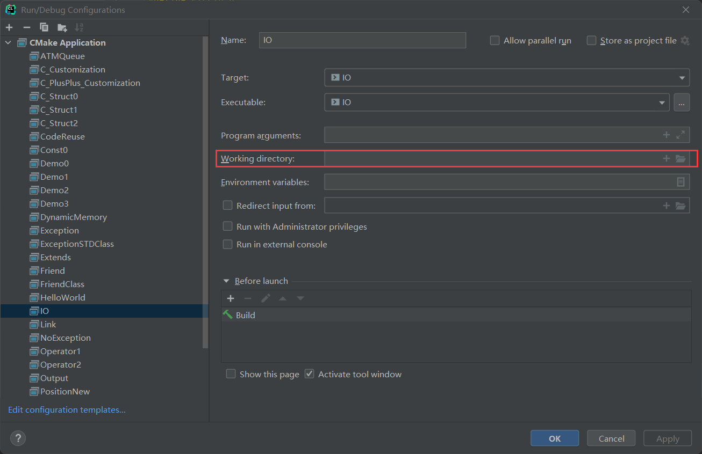

## CLion 中使用相对路径读写文件的问题

在 CLion 中编写代码时发现使用相对路径读写文件有一些问题。

文件的目录结构如下：

```java
src
|--- cmake-build-debug
|--- main.cpp
```

main.cpp 希望使用相对路径在 src 目录下创建一个名为 test.txt 文件，并向其中输入 "Hello World.\n" 字符串，然后再将文件中的内容读取到程序中，并打印到屏幕上。代码如下：

```cpp
// main.cpp
#include <fstream>

int main() {
    using namespace std;

    ofstream fout("./test.txt");
    fout << "Hello World.\n";
    fout.close();

    ifstream fin("./test.txt");
    char ch;
    while (fin.get(ch))
        cout << ch;
    fin.close();

    return 0;
}
```

但运行程序之后发现并没有在 src 目录下创建 test.txt 文件。但程序运行正常，并且屏幕上也能正常打印出 "Hello World." 字符串。
能够成功从文件中读取字符串说明程序创建 test.txt 文件成功了，但是这个文件并没有在 main.cpp 所在目录下创建，应该是创建到了其他目录。在项目中搜索了 test.txt 文件，发现它被创建在 cmak-build-debug 目录下。看来 CLion 软件编译时读写文件的相对路径是基于 cmake-build-debug 文件。

### 解决方案 1: 基于 cmake-build-debug 编写相对路径

既然 CLion 软件编译时读写文件的相对路径是基于 cmake-build-debug 文件，那么我们将输入输出流管理到文件时使用的相对路径也基于 cmake-build-debug 就可以解决了。例如在前面的目录结构下，只需要将`./test.txt`换成`../test.txt`即可。

```cpp
// main.cpp
#include <fstream>

int main() {
    using namespace std;

    ofstream fout("../test.txt");
    fout << "Hello World.\n";
    fout.close();

    ifstream fin("../test.txt");
    char ch;
    while (fin.get(ch))
        cout << ch;
    fin.close();

    return 0;
}
```

### 解决方案 2: 修改 Working derectory 设置

CLion 软件编译时默认将文件放在 cmake-build-debug 下，但可以通过指定工作路径来修改。方法如下：Run -> Edit Configurations -> Working directory，将工作路径指向当前路径，如下图：

