前面已经介绍过C++的大部分知识点了，本章主要介绍C++的标准模版库，这里会用到之前代码重用中讲解到的模版的知识，可以加深对模板的理解。

本章内容：
- 深入讨论 string 类；
- 介绍“智能指针”模板类，它们让管理动态内存更容易；
- 介绍 STL(Standard Template Library，标准模板库)，它是一组用于处理各种容器对象的模板；
- 介绍 STL 中演示的一种编程模式 —— 泛型编程。

## string 类

### Overview

很多应用程序都需要处理字符串。C语言在 string.h(C++中是 cstring 库)中提供了一些列的字符串函数，很多早期的C++实现为处理字符串提供了自己的类。

string 类时由头文件 string 支持的。要使用类，关键在于知道它的公有接口，而 string 类包含大量的方法，其中包括了若干构造函数，用于将字符串赋给变量、合并字符串、比较字符串的成员函数，访问各个元素的重载运算符以及用于在字符串中查找字符和子字符串的工具等。

> 注意：头文件 string.h 和 cstring 是支持对 C-风格字符串进行操作的 C 库字符串函数，但不支持 string 类。

### string 的构造函数

首先，我们来看看 string 类的构造函数。毕竟，对于类而言，最重要的内容之一就是看有哪些方法可用于创建其对象。下面的表格简要的描述了 string 类的 7+2(C++11新增了两个)个构造函数。

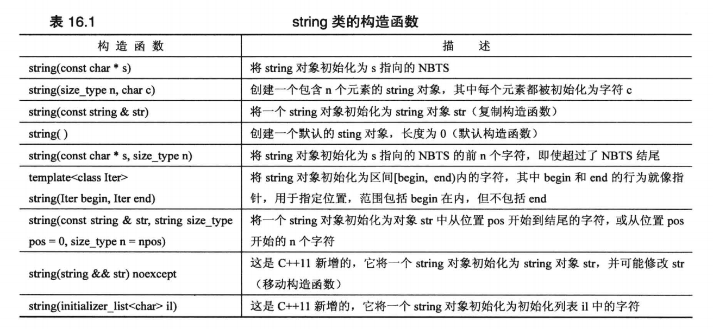

size_type 是一个依赖于实现的整型，它是在头文件 string 中定义的。string 类将 string:npos 定义为字符串的最大长度，通常为 unsigned int 的最大值。另外表格中使用缩写 NBTS(Null-Terminated String)来表示以空字符结束的字符串 —— 传统的C字符串。

#### string 的 7 个构造函数

下面的程序清单使用了上面表格中的 7 个构造函数。在使用 string 构造函数时都进行了简化，即隐藏了这样一个事实：string 类实际上是模板具体话`basic_string<char>`的一个 typedef，同时省略了与内存管理相关的参数。

```cpp
/**
 * 测试 string 类的构造函数，ctor 是构造函数的缩写
 **/
int main() {
    using namespace std;
    string one("Hello World."); // ctor #1, 将 string 初始化为指针 s 指向的 NBTS
    cout << "1: " << one << endl;

    string two(20, 'A'); // ctor #2, 将 string 初始化为包含 n 个字符 c 的字符串
    cout << "2: " << two << endl;

    string three(one); // ctor #3 复制构造函数，将 string 初始化为另一个 string 对象
    cout << "3: " << three << endl;

    one += " Opos!"; // 重载 += 运算符
    cout << one << endl;
    
    two = "Sorry! That was "; // 重载 = 运算符
    cout << two << endl;

    three[0] = 'P'; // 重载 [] 运算符
    cout << three << endl;

    string four; // ctor #4 默认构造函数
    four = two + three; // 重载 +, = 运算符
    cout << "4: " << four << endl;

    char cString[] = "All's well that ends well";
    string five(cString, 20); // ctor #5
    cout << "5: " << five << endl;

    string six_1(cString + 6, cString + 10); // ctor #6
    cout << "6: " << six_1 << ", ";
    string six_2(&five[6], &five[10]);
    cout << six_2 << ".\n";

    string seven(four, 7, 16); // ctor #7
    cout << "7: " << seven << endl;

    return 0;
}
```

```java
// 输出
1: Hello World.
2: AAAAAAAAAAAAAAAAAAAA
3: Hello World.
Hello World. Opos!
Sorry! That was
Pello World.
4: Sorry! That was Pello World.
5: All's well that ends
6: well, well.
7: That was Pello W
```

**程序说明：**

在程序中首先演示了可以将 string 对象初始化为常规的 C-风格字符串，然后使用重载的 << 运算符来打印它的内容：

```cpp
string one("Hello World."); // ctor #1, 将 string 初始化为指针 s 指向的 NBTS
cout << "1: " << one << endl;
```

接下来的构造函数将 string 对象初始化为由 20 个 A 字符组成的字符串：

```cpp
string two(20, 'A'); // ctor #2, 将 string 初始化为包含 n 个字符 c 的字符串
cout << "2: " << two << endl;
```

复制构造函数将 string 对象 three 初始化为 string 对象 one：

```cpp
string three(one); // ctor #3 复制构造函数，将 string 初始化为另一个 string 对象
cout << "3: " << three << endl;
```

使用重载的 += 运算符将字符串 "Oops!" 附加到 string 对象 one 的后面：

```cpp
one += " Opos!"; // 重载 += 运算符
cout << one << endl;
```

这里是将一个 C-风格的字符串附加到 string 对象的后面。但 += 运算符被多次重载，它还可以被用来附加 string 对象和单个字符：

```cpp
one += " Opos!"; // += 运算符附加一个 C-风格字符串
one += two;      // += 运算符附加一个 string 对象
one += '!';      // += 运算符附加一个字符
```

同样，= 运算符也被重载，可以将 string 对象、C-风格字符串或字符赋给 string 对象：

```cpp
two = "Sorry! That was "; // = 运算符将 C-风格字符串赋给 string 对象
two = one;                // = 运算符将 string 对象赋给 string 对象
two = '!';                // = 运算符将 string 对象赋给 string 对象
```

重载 [] 运算符使得可以使用数组表示法来访问 string 对象中的各个字符：

```cpp
three[0] = 'P'; // 重载 [] 运算符
```

默认构造函数创建了一个以后可对其进行赋值的空字符串：

```cpp
string four; // ctor #4 默认构造函数
four = two + three; // 重载 +, = 运算符
cout << "4: " << four << endl;
```

第二行使用重载的 + 运算符创建了一个临时的 string 对象，然后使用重载的 = 运算符将它赋给 string 对象 four。+ 运算符将两个操作数组合成一个 string 对象。同样，它也被多次重载，以便第二个操作数可以是 string 对象、C-风格字符串或字符。
> 但第一个操作数必须是 string 对象：`obj1.operator+(obj2);`。

第五个构造函数将一个 C-风格字符串和一个整数作为参数，其中的整数参数表示需要复制第一个参数的多少个字符：

```cpp
char cString[] = "All's well that ends well";
string five(cString, 20); // ctor #5
cout << "5: " << five << endl;
```

从输出可以看到，这里只使用了前 20 个字符("All's well that ends")来初始化 five 对象。正如前面构造函数表格所示，如果第二个参数表示的字符数超过了 C-风格字符串的长度，仍将复制请求数目的字符。例如，在上面的例子中，如果用 40 代替 20，将导致 15 个无用字符被复制到 five 的结尾处(即构造函数将内存中位于字符串 "All's well that ends well" 后面的内容作为字符)。

第六个构造函数有一个模板参数：

```cpp
template <class Iter> string(Iter begin, Iter end);
```

begin 和 end 将像指针那样，指向内存中的两个位置(通常，begin 和 end 可以是迭代器——广泛用于 STL 中的广义化指针)。构造函数将使用 begin 和 end 指向的位置之间的值(即`[begin, end)`)对 string 对象进行初始化。
> `[begin, end)` 是数学中的概念，表示包括 begin，但不包括 end 在内的区间。即 end 指向被使用的最后一个值后面的位置。

```cpp
char cString[] = "All's well that ends well";
string six_1(cString + 6, cString + 10); // ctor #6
cout << "6: " << six_1 << ", ";
```

由于数组名相当于指针，所以`cString + 6`和`cString + 10`的类型都是`char *`，因此使用模板时，将使用类型`char *`来替换`Iter`。第一个参数指向 cString 数组中的第一个 well 的 w 字符，第二个参数指向第一个 well 后面的空格。因此，six_1 将被初始化为字符串 "well"。

如果要用这个构造函数初始化另一个 string 对象的一部分内容，则可以想下面的语言一样：

```cpp
string six_2(&five[6], &five[10]);
cout << six_2 << ".\n";
```

> 注意，一定要有取地址符 &，因为对象名不同于数组名，它不会被看作是对象的地址，因此 five 不是指针。

第七个构造函数用一个 string 对象的部分内容来初始化 string 对象:

```cpp
string seven(four, 7, 16); // ctor #7
cout << "7: " << seven << endl;
```

上面的函数从 four 对象的第 8 个字符(Index 7)开始，将 16 个字符来初始化 seven 对象。


#### C++11 新增的构造函数

```cpp
string(string && str) noexcept;
string(initializer_list<char> il);
```

构造函数`string(string && str)`类似于复制构造函数，导致新创建的 string 为 str 的副本。但与复制构造函数不同的是，它不保证将 str 视为 const。这种构造函数被称为移动构造函数(move constructor)。在有些情况下，编译器可以使用它而不是构造函数，以此优化性能。

构造函数`string(initializer_list<char) il`让您能够将列表初始化语法用于 string 类。也就是说，它使得下面的声明时合法的：

```cpp
string str1 = {'L', 'i', 's', 't'};
string str2 {'L', 'i', 's', 't'};
```

对于 string 类而言，这可能用处不大，因为使用 C-风格字符串更容易，但确实实现了让列表初始化语法普遍适用的意图。后面会更深入地讨论模板 initializer_list。

### string 类输入

对于 C-风格字符串有三种输入方式：

```cpp
char info[100];
cin >> info; // 读取一个 word，以空白(空格、制表符、换行符)为字符串的结束位置
cin.getline(info, 100); // 读取一行，丢弃每行最后的换行符 \n
cin.get(info, 100); // 读取一行，保留每行最后的换行符 \n，换行符还在输入序列中，需要借助 cin.get() 读取下一个字符来处理
```

对于 string 对象，有两种方式：

```cpp
string str;
cin >> str; // 读取一个 word
getline(cin, str); // 读取一行，丢弃每行最后的换行符 \n
```

两个版本的 getline() 都有一个可选参数，用于指定使用哪个字服来确定输入的边界：

```cpp
cin.getline(info, 100, ':'); // 读到 :, 丢弃 :
getline(cin, str, ':'); // 读到 :, 丢弃 :
```

在功能上，这两个函数的主要区别在于：string 版本的 getline() 将自动调整目标 string 对象的大小，使之刚好能存储输入的字符。自动调整大小的让 string 的 getline() 不需要指定读取多少字符的整数参数。

在设计方面的一个区别是，读取 C-风格字符串的函数是 istream 类的成员函数，而 string 版本的 getline() 并不是 string 的成员函数，而是一个独立的函数。这也是 C-风格字符串输入使用 cin 作为调用对象，而 string 对象的输入 cin 是函数参数的原因。

下面更深入的探讨一下 string 的输入函数。正如前面指出的，该函数自动调整目标 string 的大小，使之与输入匹配。但也存在一些限制：
- 第一个限制因素是 string 对象的最大允许长度有常量 string::npos 指定。它通常是最大的 unsigned int 值。因此对于普通的交互式输入，不会有什么影响；但如果您尝试将整个文件的内容读取到单个 string 对象中，这可能称为限制因素。
- 第二个限制因素是程序可以使用的内存量。

string 版本的 getline() 函数从输入中读取字符，并将其存储到目标 string 中，直到发生下列三种情况：
- 到达文件尾。在这种情况下，输入流的 eofbit 将被设置，这意味着 fail() 和 eof() 都将返回 true。
- 遇到分界字符(默认是`\n`)。在这种情况下，将把分界字符从输入流中删除，但不存储它。注：分界字符可以通过可选参数指定。
- 读取的字符数到达最大允许值(`string::npos`和可供分配的内存字节数中较小的一个)。在这种情况下，将设置输入流的 failbit，这意味着方法 fail() 将返回 true。

输入流对象有一个统计系统，用于跟踪流的错误状态。在这个系统中，检测到文件尾后将设置 eofbit 寄存器，检测到输入错误时将设置 failbit 寄存器，出现无法识别的故障(如硬盘故障)时将设置 badbit 寄存器，一切顺利时设置 goodbit 寄存器。后面会有专门的一章来深入讨论输入输出流的知识。

string 版本的`>>`运算符的行为与此类似，它不断从输入流中读取字符，直到遇到空白字符/分界字符为止，遇到空白字符时会将其留在输入流中，而遇到分界字符会将其丢弃。
> 空白字符是指空格、换行符和制表符。

接下来编写一个从文件中读取字符串的程序，它假设文件中包含用冒号分分隔的字符串，并使用指定分界符的 getline() 方法。然后显示字符串并给它们编号，每个字符串占一行。

```cpp
/**
 * 测试 string 类的输入函数，从文件中读取字符串。
 * 假设文件中包含用冒号字符分隔的字符串。
 **/
int main() {
    using namespace std;
    ifstream fin;
    fin.open("tobuy.txt"); 
    if (fin.is_open() == false) {
        cerr << "Can't open file. Please check path.\n";
        exit(EXIT_FAILURE);
    }

    string str;
    int count = 0;
    getline(fin, str, ':');
    while (fin) { // input is good
        ++count;
        cout << count << ": " << str << endl;
        getline(fin, str, ':');
    }
    cout << "Read file end.\n";
    fin.close();
    return 0;
}
```

文件 tobuy.txt 的内容：

```java
Hello World!:ice cream:Good lucky:
coffer latte:Coca-Cola:

```

通常，对于程序要查找的文本文件，应将其放在可执行程序或项目文件所在的目录中；否则必须提供绝对路径。在 Windows 系统中，C-风格字符串中的`\\`是转义序列，它表示一个斜杠：

```cpp
fin.open("E:\\Note\\the-cpp\\source\\Unit10\\tobuy.txt"); // file path = E:\Note\the-cpp\source\Unit10\tobuy.txt
```

程序的输出：

```java
1: Hello World!
2: ice cream
3: Good lucky
4:
coffer latte
5: Coca-Cola
6:

Read file end.
```

> 注意：将冒号`:`指定位分界字符后，getline() 会将换行符视为常规字符。因此 tobuy.txt 中第一行末尾的换行符就会被认为是 "coffer latte" 字符串的第一个字符。同样，第二行末尾的换行符就成为了第六个输入字符串的唯一内容。

### 使用字符串

现在，您有能力使用不同方式来创建 string 对象、显示 string 对象的内容、将数据读取/附加到 string 对象中、给 string 对象赋值以及将两个 string 对象连结起来。除此之外，我们其实还能比较字符串，确定字符串长度等。

#### 比较字符串

string 类对全部的六个关系运算符(>, >=, <, <=, =,!=,)都进行了重载。对于每个关系运算符，都以三种方式被重载，以便能够将 string 对象与另一个 string 对象、C-风格字符串进行比较，并能够将一个 C-风格字符串与 string 对象进行比较：
> 如果机器排名序列为 ASCII 码，则数字将小于大写字符，而大写字符小于小写字符。

```cpp
string str1("cola");
string str2("cool");
char str3[10] = "coco";
if (str1 < str2) {...} // operator<(const string &, const string &)
if (str1 == str3) {...} // operator==(const string &, const char *)
if (str3 != str2) {...} // operator!=(const char *, const string &)
```

#### 字符串长度

有两个函数可以确定字符串的长度。string 类的 size() 和 length() 成员函数都可以返回字符串中的字符数。为什么要有两个函数完成相同的任务？length() 成员函数来自较早版本的 string 类，而 size() 则是为提供 STL 兼容性而添加的。

#### 在字符串中查找字符串或字符

string 类可以以多种不同的方式在字符串中搜索给定的子字符串或字符。下表简要地描述了 find() 方法的四个版本。如前所述，`string::npos`是字符串可存储的最大字符数，通常是无符号 int 或无符号 long 的最大取值。

|方法原型|描述|
|-|-|
|size_type find(const string & str, size_type pos = 0) const|从字符串的 pos 位置开始查找子字符串 str。如果找到，则返回该子字符串首次出现时其首字符的索引；否则，返回 string::npos。
|size_type find(const char * s, size_type pos = 0) cosnt|从字符串的 pos 位置开始查找字符串 s。如果找到，则返回该子字符串首次出现时其首字符的索引；否则，返回 string::npos。
|size_type find(const char * s, size_type pos = 0, size_type n)|从字符串的 pos 位置开始，查找 s 的前 n 个字符组成的子字符串。如果找到，返回该子字符串首次出现时其首字符的索引；否则，返回 string::npos。
|size_type find(char ch, size_type pos = 0) const|从字符串的 pos 位置开始，查找字符 ch。如果找到，则返回该字符首次出现的位置；否则，返回 string::npos。

string 库还提供了相关的方法：rfind()、find_first_of()、find_last_of()、find_first_not_of() 和 find_last_not_of()，他们的重载函数特征标都与 find() 方法相同。
- rfind() 方法查找子字符串或字符最后一次出现的位置。
- find_first_of() 方法在字符串中查找参数中任何一个字符首次出现的位置。
- find_last_of() 方法在字符串中查找参数中任何一个字符最后一次出现的位置。
- find_first_not_of() 方法在字符串中查找第一个不包含在参数中的字符出现的位置。
- find_last_not_of() 方法在字符串中查找最后一个不包含在参数中的字符出现的位置。

例1，下面的语句返回 r 在"cobra"中的位置(即 Index 3)，因为这是"hark"中各个字符在"cobra"中首次出现的位置：

```cpp
string str1("cobra");
int where = str1.find_first_of("hark");
```

例2，下面的语句返回 a 在"cobra"中的位置(即 Index 4)，因为这是"hark"中各字符在"cobra"中最后一次出现的位置：

```cpp
int where = str1.find_last_of("hark");
```

例3，下面的语句返回 c 在"cobra"中的位置，因为"hark"中没有 c：

```cpp
int where = str1.find_first_not_of("hark");
```

例4，下面的语句将返回 b 在"cobra"中的位置，因为"hark"中没有 b：

```cpp
int where = str1.find_last_not_of("hark");
```

#### 使用字符串的练习

编写一个非图形版本的 Hangman 拼字游戏。

> Hangman 是一个猜单词的双人游戏。Hangman直译为“上吊的人”，是一个猜单词的双人游戏。由一个玩家想出一个单词或短语，另一个玩家猜该单词或短语中的每一个字母 。
> 第一个人抽走单词或短语，只留下相应数量的空白与下划线。出题玩家一般会画一个绞刑架，当猜词的玩家猜出了短语中存在的一个字母时，出题的玩家就将这个字母存在的所有位置都填上。如果玩家猜的字母不在单词或短语中，那么出题的玩家就给绞刑架上小人添上一笔，直到7笔过后，游戏结束。
> Hangman 的规则简单且有趣，要求在七步之内猜出单词，否则小人将会“上吊”

该游戏将一系列的单词存储在一个 string 对象数组中，然后随机选择一个单词，让人猜测单词的字母。如果猜错七次，玩家就输了。
该程序会使用 find() 函数来检查玩家的猜测，使用 += 运算符创建一个 string 对象来记录玩家的错误猜测。为记录玩家猜对的情况，程序创建了一个单词，其长度与被猜的单词相同，但包含的是连字符。玩家猜对字符时，将用该字符替代相应的连字符。

```cpp
/**
 * 判断 Hangman 游戏玩家猜测的字符是否合法
 *  - 如果猜测的不是小写字母，则输入不合法，需要玩家重新猜字母
 *  - 如果猜测的字母是之前已猜测的，则也不合法，需要玩家重新猜字母
 *  @return true - 猜测的字母既合法也未曾被猜过；false - 猜测的字母不合法或被猜过了
 **/
bool isGuessValid(char ch, std::string& goodStr, std::string& badStr) {
    if (ch >= 'a' && ch <= 'z' && std::string::npos == goodStr.find(ch) && std::string::npos == badStr.find(ch))
        return true;
    return false;
}

/**
 * Hangman 游戏。
 * 由玩家来猜单词，每次猜一个字母。
 *  - 如果猜对，那么将单词对应位置显示在终端中。如果单词被全才出来了，游戏成功
 *  - 如果猜错，那么会被记录下来。猜错七次，游戏失败。
 **/
void main() {
    using namespace std;
    const int WORD_NUM = 20; // 程序准备的用于 Hangman 游戏的单词数目
    const string wordList[WORD_NUM] = {
            "identity", "belong", "department", "medical", "conversation",
            "imagine", "describe", "fold", "aloud", "politician",
            "reason", "height", "grammar", "member", "notice",
            "crystal", "destiny", "teacher", "exactly", "dislike"
    }; // 程序准备的用于 Hangman 游戏的单词

    srand(time(0));
    char guess; // 用于保存玩家本回合猜测的字母

    cout << "Will you play Hangman game?<y/n>: ";
    cin >> guess;
    guess = tolower(guess); // ctype.h 中的函数，用于将大写字母调整为小写字母，对于非大写字母不做调整

    while ('y' == guess) {
        string target = wordList[rand() % WORD_NUM]; // 选中本次游戏需要猜的单词
        int wordLength = target.length(); // 计算选中的单词的长度，以便用于生成记录猜对的字母的字符串
        string goodChars(wordLength, '-'); // 记录已猜对的字母
        string badChars; // 记录猜错的字母
        int lives = 7; // 玩家剩余的试错次数

        cout << "Hangman Game. Guess my screct word. It has " << wordLength << " letters, and you guess one letter at a time. You have " << lives << " wrong chances.\n"; // 提醒玩家待猜测的单词的长度，以及目前玩家剩余的机会
        cout << "Now your guess: " << goodChars << endl; // 将目前玩家已完成的进度打印出来

        while (lives && target != goodChars) { // 判断游戏是否结束
            cout << "Please guess a letter: ";
            cin >> guess; // 玩家输入猜测的字母
            guess = tolower(guess);
            // 判断输入是否合法
            if (!isGuessValid(guess, badChars, goodChars)) { // 输入不合法，或已经输入过该字母
                cout << "You already guess this letter or invalid guess. Try again.\n";
                continue;
            }

            int pos = target.find(guess);
            if (string::npos != pos) { // 猜对了 - 即猜测的字符在 target 中
                cout << "Good guess.\n";
                // 需要将正确的字符放置到 goodChars 对应的位置上
                do {
                    goodChars[pos] = guess;
                    pos = target.find(guess, pos + 1);
                } while (string::npos != pos);
            } else { // 猜错了
                cout << "Oh, bad guess!\n";
                --lives; // 试错机会减一
                badChars += guess; // 将猜错的字母更新到 badChars 中
            }

            cout << "Your guess: " << goodChars << ".";
            if (target != goodChars) { // 还没有完全猜对，打印当前进度信息
                if (badChars.length() > 0) // 有猜错的字母，则把猜错的字母都打印出来
                    cout << " Bad guess: [ " << badChars << " ]." ;
                cout << " Now you have " << lives << " chances to fail.";
            }
            cout << endl;
        }

        // 本轮游戏已结束，需要判断游戏的胜负
        if (lives) { // 剩余次数大于0，游戏胜利
            cout << "Congratulations. Game winner. Correct word: " << target << ".\n";
        } else {
            cout << "Unfortunately. Game failed. Correct word: " << target << ".\n";
        }
        cout << "Will you play another? <y/n> :";
        cin >> guess;
        guess = tolower(guess);
    }
    cout << "Bye.\n";
    return 0;
}
```

```cpp
Will you play Hangman game?<y/n>:y
Hangman Game. Guess my screct word. It has 7 letters, and you guess one letter at a ti
me. You have 7 wrong chances.
Now your guess: -------
Please guess a letter:e
Good guess.
Your guess: ------e. Now you have 7 chances to fail.
Please guess a letter:i
Good guess.
Your guess: -i--i-e. Now you have 7 chances to fail.
Please guess a letter:I
You already guess this letter or invalid guess. Try again.
Please guess a letter:E
You already guess this letter or invalid guess. Try again.
Please guess a letter:c
Oh, bad guess!
Your guess: -i--i-e. Bad guess: [ c ]. Now you have 6 chances to fail.
Please guess a letter:k
Good guess.
Your guess: -i--ike. Bad guess: [ c ]. Now you have 6 chances to fail.
Please guess a letter:m
Oh, bad guess!
Your guess: -i--ike. Bad guess: [ cm ]. Now you have 5 chances to fail.
Please guess a letter:n
Oh, bad guess!
Your guess: -i--ike. Bad guess: [ cmn ]. Now you have 4 chances to fail.
Please guess a letter:N
You already guess this letter or invalid guess. Try again.
Please guess a letter:d
Good guess.
Your guess: di--ike. Bad guess: [ cmn ]. Now you have 4 chances to fail.
Please guess a letter:s
Good guess.
Your guess: dis-ike. Bad guess: [ cmn ]. Now you have 4 chances to fail.
Please guess a letter:l
Good guess.
Your guess: dislike.
Congratulations. Game winner. Correct word: dislike.
Will you play another? <y/n> :n
Bye.
```

**程序说明：**

由于 string 类的关系运算符都被重载了，因此可以想对待数值类型变量那样对待字符串：

```cpp
while (lives && target != goodChars)
```

与 C-风格字符串需要使用 strcmp() 相比，字符串的比较操作更简单些。
该程序使用 find() 来检查玩家之前是否猜过某个字符。如果没有，那么它既不位于 badChars 字符串中，也不位于 goodChars 字符串中：

```cpp
if (ch >= 'a' && ch <= 'z' && std::string::npos == goodStr.find(ch) && std::string::npos == badStr.find(ch)) {...}
```

npos 变量是 string 类的静态成员，它的值是 string 对象能存储的最大字符数。由于 string 的 Index 从 0 开始，所以它比最大的 Index 值大 1。通常使用 npos 变量来判断 find 系列函数是否查找到某个字符或字符串。

该程序的核心是从检查玩家猜测的字符是否位于被猜测的单词中开始的：

```cpp
int pos = target.find(guess);
```

如果 pos 是一个有效的值，则可以将该字母放置在答案字符串的相应位置。但需要注意，由于字母可能在被猜测的单词中出现多次，所以程序必须一直检查，直到将 target 单词查询完。该程序使用了 find() 的第二个可选参数，该参数指定从字符串的什么 Index 位置开始搜索。因为字母是在位置 pos 处被找到的，所以下次搜索位置应从`pos+1`开始。

```cpp
 do {
    goodChars[pos] = guess;
    pos = target.find(guess, pos + 1);
} while (string::npos != pos);
```

#### string 的其他功能

**string 库还提供了很多其他的工具，包括完成下述功能的函数**：

| Function | Header File | Description |
|:-:|:-:|-|
|构造函数|basic_string.h|7+2个构造函数。
|关系运算符|basic_string.h|全部六个关系运算符都被以三种方式被重载，以应对 string 对象与 string 对象、C-风格字符串比较，C-风格字符串与 string 对象对比。
|length()/size()|basic_string.h|返回字符串的长度。
|find()|basic_string.h|find 系列共六类函数，返回字符串中指定字符串 or 字符的位置。如果字符串中不包含指定的内容，返回 std::string::npos。
|erase()|basic_string.h|删除字符串的部分或全部内容。
|replace|basic_string.h|用一个字符串的部分或全部内容替换另一个字符的部分或全部内容。
|compare|basic_string.h|将一个字符串的部分或全部内容与另一个字符串的部分或全部内容进行比较。
|copy|basic_string.h|将一个字符串中的内容复制到另一个字符串中。
|substr|basic_string.h|从字符串中提取子字符串。
|insert|basic_string.h|将数据插入到字符串中。
|swap|basic_string|交换两个字符串的内容。

这些函数大部分都被重载，以便能够同时处理 C-风格字符串和 string 对象。

**C++ string 类还有自动调整大小的功能**。例如，将一个字符串附加到另一个字符串的末尾时，string 类的自动调整大小功能确保能将其全部放下。但在实现这个自动调整大小的功能时也有对效率的考虑在内。例如有这样一个程序，它循环地将一个字母附加到字符串的末尾，自动调整大小的功能会如何实现呢？不能仅仅将已有的字符串加大，因为相邻的内存有可能已经被占用了。因此，有时候可能需要分配一个新的内存块，将原有的内容复制到新的内存单元中。如果执行大量这样的操作，那么效率无疑会非常低，因此很多C++的实现都会分配一个比实际字符串大的内存，为字符串提供了增大空间。然而，如果字符串不断增大，超过了内存块的大小，那么程序将分配一个大小为原来两倍的新内存块，以提供足够的增大空间，以此避免频繁地分配新内存块。

方法 capacity() 返回当前分配给字符串的内存块大小，而方法 reserve() 让您能够请求内存块的最小长度。
>  capacity: 容量；reserve: 保留。

下面的程序演示这些方法的使用：

```cpp
/**
 * 演示 string 类的 capacity() 和 reserve() 方法的使用
 *  - capacity() 返回当前分配给字符串的内存块大小；
 *  - reserve() 让您能够请求内存块的最小长度
 **/
int main() {
    using namespace std;
    string empty; // 空字符串
    string small = "small"; // 短的字符串
    string larger = "This is a larger string. This is a larger string."; // 长字符串

    cout << "Size: \n"; // 输出各个字符串的长度
    cout << " empty:  " << empty.size() << endl;
    cout << " small:  " << small.size() << endl;
    cout << " larger: " << larger.size() << endl;

    cout << "Length: \n";
    cout << " empty:  " << empty.length() << endl;
    cout << " small:  " << small.length() << endl;
    cout << " larger: " << larger.length() << endl;

    cout << "Capacity: \n"; // 输出个字符串被分配的内存大小
    cout << " empty:  " << empty.capacity() << endl;
    cout << " small:  " << small.capacity() << endl;
    cout << " larger: " << larger.capacity() << endl;

    empty.reserve(50); // 修改 empty 分配的内存大小
    cout << "Capacity after empty.reserve(50):  " << empty.capacity() << endl;
    return 0;
}
```

```java
// 输出
Size:
 empty:  0
 small:  5
 larger: 49
Length:
 empty:  0
 small:  5
 larger: 49
Capacity:
 empty:  15
 small:  15
 larger: 49
Capacity after empty.reserve(50):  50
```

从输出中 Capacity 里 empty 占据 15 个字符的内存，由此可见在该C++实现中，使用的最小容量为 15 个字符，其他实现可能有不同的选择。

**string 对象转换为 C-风格字符串**：c_str() 方法返回一个指向 C-风格字符串的指针。例如，您可能想打开一个名称存储在 string 对象中的文件，而 open() 方法接受的是一个 C-风格字符串作为参数。因此，需要用 c_str() 方法将 string 转换为指向 C-风格字符串的指针：

```cpp
string filename = "C++ Primer Plus";
ofstream fout;
fout.open(filename.c_str());
```

#### 字符串种类

string 类是模板 basic_string 的一个显式实例化，而 basic_string 还有另外 3 个实例化，每个实例化都有一个 typedef 名称：
> 复习：模板的具体化分为隐式实例化、显式实例化和显式具体化。

```cpp
template<typename _CharT, typename _Traits = char_traits<_CharT>, typename _Alloc = allocator<_CharT> >
class basic_string;

typedef basic_string<char>    string;
typedef basic_string<wchar_t> wstring;
typedef basic_string<char16_t> u16string; // C++11
typedef basic_string<char32_t> u32string; // C++11
```

> Traits: 特征; Allocator: 分配器。

这让您能够使用类型 char、wchar_t、char16_t 和 char32_t 的字符串。您甚至可以开发某种类似字符的类，并对它使用 basic_string 类模板(只要它满足某些要求)。

_CharT 是 basic_string 的字符类型。

_Traits 称为特征类，是描述关于选定字符类型的特定情况，即提供选定字符类型特性相关的方法。traits 展现的是一种思想，即将相同的实现复用(放在 basic_string 模板中)，而不同的操作进一步抽象成接口复用(放在 _Traits 模板中)。例如，如求字符串长度。对于 char/wchar_t/char16_t/char32_t 类型，有预定义的 char_traits 模板具体化，它们是 _Traints 的默认值。

_Alloc 是一个管理内存分配的类，同样的，对于各种字符类型，都有预定义的 allocator 模板具体化，它们都是默认的。它们进行内存管理使用的是 new 和 delete。

```cpp
template<class _CharT>
struct char_traits;

template<> struct char_traits<char>;     // 显示具体化，记录 char 类型与其他类型不一致的相关特性
template<> struct char_traits<wchar_t>;  // 显示具体化，记录 wchar_t 类型与其他类型不一致的相关特性
template<> struct char_traits<char16_t>; // 显示具体化，记录 char16_t 类型与其他类型不一致的相关特性
template<> struct char_traits<char32_t>; // 显示具体化，记录 char32_t 类型与其他类型不一致的相关特性

template<typename>
class allocator;
```

> 更多 string 信息可以查看 String 类文档： [C++ Reference](https://cplusplus.com/reference/string/string/?kw=string)

## 智能指针模板类

### Overview

智能指针是行为类似于指针的类对象，但这种对象还有其他功能。本节将介绍三个可帮助管理动态内存分配的智能指针模板。先来看看需要哪些功能，以及这些功能是如何实现的。

```cpp
void func(std::string & str) {
    std::string * ps = new std::string(str);
    ...
    return;
}
```

您可能也发现了上述代码片段的缺陷，即每当调用 func 函数时都会分配堆中的内存，但从不回收，从而导致内存泄漏。您可能也知道解决之道 —— 只要别忘了在 return 语句的前面加上`delete ps`以释放分配的内存即可。

然而，但凡涉及到“别忘了”的解决方法，很少是最佳的。因为您有时可能会忘了，有时可能您记住了，但可能不经意之间删除或注释掉了这些代码。即使确实没忘记，也有可能有问题。请看下面的变体：

```cpp
void func(std::string & str) {
    std::string * ps = new std::string(str);
    ...
    if (condition()) {
        throw exception();
    }
    delete ps;
    return;
}
```

当出现异常时，delete 将不被执行，因此也将导致内存泄漏。

先来分析下我们需要些什么：当 func() 函数终止(不论是正常终止，还是由于出现了异常而终止)，func()的局部变量都应该从栈内存中删除 —— 因此指针 ps 占据的内存将被释放。如果 ps 指针能有一个析构函数，该析构函数在 ps 过期时释放它指向的内存，那该多好。因此 ps 的问题在于，它只是一个常规的指针，不是带有析构函数的类对象。如果它是对象，则可以在对象过期时，让它的析构函数删除指向的内存。这正是 auto_ptr、unique_ptr 和 shared_ptr 背后的思想。
> 注意：模板 auto_ptr 是 C++98 的解决方案,c++11 已经将其摒弃，并提供了另外两种解决方案。然而，虽然 auto_ptr 被摒弃，但它已使用了多年；同时，如果您的编译器不支持其他两种解决方案，auto_ptr 将是唯一的选择。

### 智能指针的使用方法

auto_ptr、unique_str 和 shared_ptr 这三个智能指针都定义了类似指针的对象，可以将 new 获得的地址赋给这种对象。当智能指针过期时，其析构函数将使用 delete 来释放内存。因此，如果将 new 返回的地址赋给这种对象，就无需记住稍后释放这些内存。因为智能指针过期时，这些内存将自动被释放。

下图说明了 auto_ptr 智能指针和常规指针在行为方面的差异：
> unique_str 和 shared_ptr 的行为与 auto_ptr 相同。

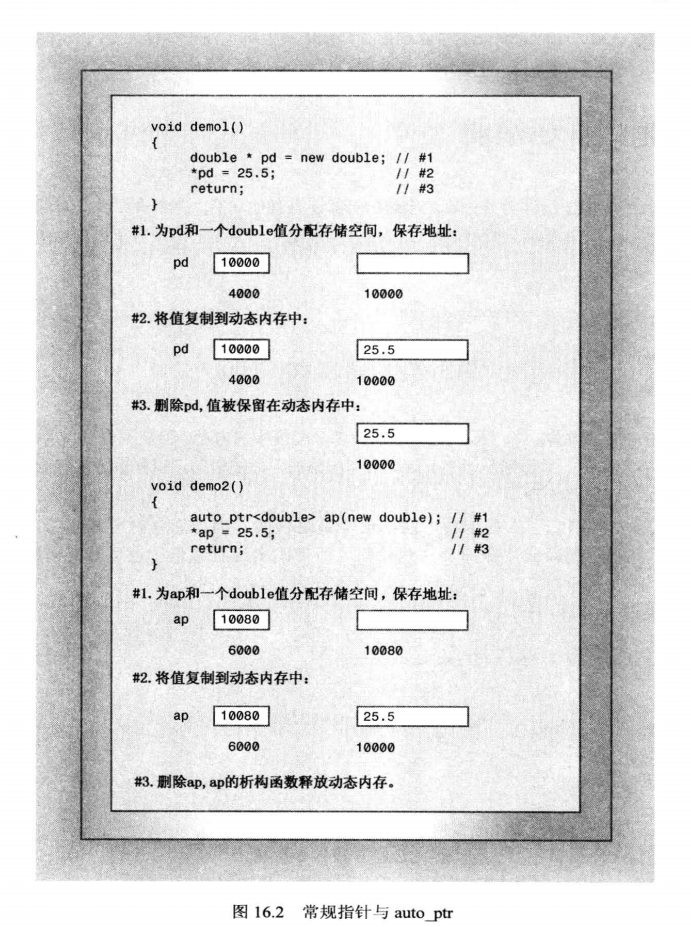

要创建智能指针对象，必须包含头文件 memory，然后使用通常的模板语法来实例化所需类型的指针。

模板 auto_ptr 包含以下构造函数：

```cpp
// auto_ptr 部分类定义
template<typename _Tp> class auto_ptr {
public:
    explicit auto_ptr(_Tp * __p = 0) throw();
}

// 使用 auto_ptr
auto_ptr<double> pd(new double);

std::string * ps1 = new std::string();
auto_ptr<std::string> ps2(ps1);
```

前面说过，throw() 表示该构造函数不会引发异常。
> throw() 与 auto_ptr 一样，都在 C++11 中被摒弃，throw() 在 C++11 中被 noexcept 替代。

`new double`是 new 返回的指针，指向新分配的内存块。它是构造函数`auto_ptr<double>`的参数，即类声明中构造函数原型的形参`__p`。其他两种智能指针使用相同的语法：

```cpp
unique_ptr<double> pdu(new double);
shared_ptr<double> pds(new std::string);
```

因此，修改后的 func 实现应按以下步骤进行：
1. 包含头文件 memory；
2. 将指向 string 的指针替换为指向 string 的智能指针对象；
3. 删除 delete 语句。

```cpp
#include <memory>
void func(std::string & str) {
    std::auto_ptr<std::string> ps(new std::string(str));
    // ...
    if (condition()) {
        throw exception();
    }
    return;
}
```

### 智能指针使用练习

编写一个程序来演示全部三种智能指针的使用。

```cpp
class Report {

private:
    std::string str;
public:
    Report(const std::string s) : str(s) { std::cout << "Report object created!\n"; }

    virtual ~Report() { std::cout << "Report object deleted!\n"; }

    void comment() const { std::cout << str << endl; }
};

/**
 * 演示 auto_ptr、unique_ptr、shared_ptr 这三个智能指针的使用
 **/
int main() {
    {
        std::auto_ptr<Report> ps(new Report("using auto_ptr"));
        ps->comment();
    }
    {
        std::unique_ptr<Report> ps(new Report("using unique_ptr"));
        ps->comment();
    }
    {
        std::shared_ptr<Report> ps(new Report("using shared_ptr"));
        ps->comment();
    }
    return 0;
}
```

```cpp
// 输出:
Report object created!
using auto_ptr
Report object deleted!
Report object created!
using unique_ptr
Report object deleted!
Report object created!
using shared_ptr
Report object deleted!
```

所有智能指针类都有一个 explicit 构造函数，该构造函数将指针作为参数。

```cpp
shared_ptr<double> pd;
double * p = new double;
pd = p; // 不允许，隐式转换
pd = shared_ptr<double>(p); // 允许，显式转换
shared_ptr<double> pshared1 = p; // 不允许，隐式转换
shared_ptr<double> pshared2(p); // 允许，显式转换
```

由于智能指针模板类的定义方法，智能指针对象的很多方面都类似于常规指针。例如，如果 ps 是一个智能指针对象，则可以对它执行解除引用操作(`*ps`)、用它来访问类成员(`ps->n`)、将它赋给指向相同类型的常规指针。

还可以将智能指针对象赋给另一个同类型的智能指针对象，但将引起一个问题，后面会讲到。在此之前，先说说这三种智能指针都应该避免的一点：

```cpp
string str("I am a string");
shared_ptr<string> ps(&str); // 不要这样做
```

当智能指针 ps 过期时，它的析构函数将把 delete 运算符用于非堆内存上，这是错误的。

单从 func 的演示来看，三种智能指针都能满足要求，但情况并非总是像 func 那样简单。

### 智能指针的注意事项

为什么要有三种智能指针？又为何要摒弃 auto_ptr？
> 实际上智能指针有四种，最后一种是 weak_ptr，这里不做讨论，有兴趣的可以自行查找资料。

先来看一段程序：

```cpp
auto_ptr<string> ps(new string("I am a string."));
auto_ptr<string> temp;
temp = ps;
```

上述的赋值语句将完成什么工作？如果 ps 和 temp 都是常规指针，则这两个指针将指向同一个 string 对象。这是不能接受的，因为程序会试图删除同一个对象两次 —— 一次是 ps 过期时，另一次是 temp 过期时。要避免这种问题，方法有多种：
- 重定义赋值运算符，使之执行深复制。这样两个指针将指向不同的对象，其中一个对象是另一个对象的副本。
- 建立所有权的概念，对于特定的对象，只能有一个智能指针可以拥有它，这样只有拥有对象的智能指针的构造函数会删除该对象。然后，让赋值操作转让所有权。这就是用于 auto_ptr 和 unique_ptr 的策略，但 unique_ptr 的策略更严格。
- 创建智能更高的指针，跟踪引用特定对象的智能指针数。这称为引用计数。例如，赋值时，将计数加1，而指针过期时，计数将减1.仅当最后一个指针过期时，才调用 delete。这就是 shared_ptr 采用的策略。

下面是一个不适用 auto_ptr 的示例。

```cpp
int main() {
    std::auto_ptr<std::string> films[5] = {
            std::auto_ptr<std::string>(new std::string("Fowl Balls")),
            std::auto_ptr<std::string>(new std::string("Duck Walks")),
            std::auto_ptr<std::string>(new std::string("Chicken Runs")),
            std::auto_ptr<std::string>(new std::string("Turkey Errors")),
            std::auto_ptr<std::string>(new std::string("Goose Eggs"))
    };
    std::auto_ptr<std::string> pwin;
    pwin = films[2]; // films[2] 丢失所有权

    std::cout << "The nominees for best avian baseball film are\n";
    for (int i = 0; i < 5; ++i) {
        std::cout << *films[i] << std::endl;
    }
    std::cout << "The winner is " << *pwin << "!\n";
    
    return 0;
}
```

这里的问题在于`pwin = films[2];`语句将`films[2]`的所有权转让给 pwin，这导致`films[2]`不再引用该字符串。在 auto_ptr 放弃对象的所有权之后，可能依旧会使用它来访问对象。比如这个程序中，打印`films[2]`指向的字符串时，就会发现这是一个空指针。

如果在程序中使用 shared_ptr 代替 auto_ptr，则程序能正常运行。它们的区别就在于：

```cpp
std::shared<std::string> pwin;
pwin = films[2];
```

这次 pwin 和`films[2]`指向同一个对象，而引用计数从 1 增加到 2。当程序结束时，会先调用后声明的 pwin 的析构函数，该析构函数会将引用计数降低为 1.然后 shared_ptr 数组被依次释放，当调用到`films[2]`的析构函数时，将引用计数降低为 0，并释放之前分配的空间。

因此，shared_ptr 可以使这个程序正常运行，而 auto_ptr 会在运行阶段崩溃。如果使用 unique_ptr，结果如何？答：会与 auto_ptr 一样，因为 unique_ptr 也采用所有权模型。但使用 unique_str 时，程序不会等到运行阶段崩溃，而是在编译阶段会因下述代码报错：

```cpp
pwin = films[2];
```

接下来就进一步探索 auto_ptr 与 unique_ptr 之间的差别。

### unique_ptr 为何优于 auto_ptr

请看下面的 aotu_ptr 语句：

```cpp
auto_ptr<string> p1(new string("auto")); // #1
auto_ptr<string> p2;                     // #2
p2 = p1;                                 // #3
```

在语句#3中，p2 接管了 string 对象的所有权后，p1 的所有权将被剥夺。前面说过，这是件好事，可防止 p1 和 p2 的析构函数试图删除同一个对象；但如果程序随后试图使用 p1，这却是件坏事，因为 p1 不再指向有效的数据。

下面来看看使用 unique_str 的情况：

```cpp
unique_ptr<string> p3(new string("auto")); // #4
unique_ptr<string> p4;                     // #5
p4 = p3;                                   // #6
```

编译器会认为语句#6非法，这样避免了 auto_ptr 的 p3 已经不再指向有效数据的问题。因此，unique_ptr 比 auto_ptr 更安全(编译阶段的错误比潜在的程序崩溃更安全)。

但有时候，将一个智能指针赋给另一个并不会留下危险的悬挂指针。例如：

```cpp
unique_ptr<string> demo(const char* s) {
    unique_ptr<string> temp(new string(s));
    return temp;
}

int main() {
    unique_ptr<string> ps;
    ps = demo("Hello World.");
}
```

demo() 返回一个临时 unique_ptr，然后 ps 接管了原本归 demo 返回的 unique_ptr 所有的对象，而返回的 unique_ptr 被销毁。这没有问题，因为 ps 拥有了 string 对象的所有权。但这里的另一个好处是，demo() 返回的临时 unique_ptr 很快就被销毁，没有机会使用它来访问无效的数据。换句话说，没有理由禁止这种赋值。

总之，程序使用将一个 unique_ptr 赋给另一个时，如果源 unique_ptr 是个临时右值，编译器允许这样做；如果源 unique_ptr 将存在一段时间，编译器将禁止这样做：

```cpp
unique_ptr<string> p1(new string("Hello"));
unique_ptr<string> p2;

p2 = p1; // #1 不允许

unique_ptr<string> p3;
p3 = unique_ptr<string>(new string("World")); // #2 允许
```

语句 #1 将留下悬挂的 unique_ptr(p1)，这可能导致危害，因此不被编译器允许。语句 #2 不会留下悬挂的 unique_ptr，因为它调用 unique_ptr 的构造函数，该构造函数创建的临时对象在将其所有权转让给 p3 之后会被销毁。
正是这种随情况而异的行为表明 unique_ptr 优于允许两种赋值的 auto_ptr。这也是禁止在容器对象中使用 auto_ptr，但允许使用 unique_ptr 的原因。
如果容器算法试图队包含 unique_ptr 的容器执行类似 #1 的操作将导致编译错误；如果算法试图执行类似于语句 #2 的操作，则不会有任何问题。而对于 auto_ptr，类似于语句 #1 的操作可能导致不确定的行为和神秘的崩溃。

当然，有时您可能确实想执行类似于语句 #1 的操作。仅当以非智能的方式使用遗弃的智能指针(如解除引用)，这种赋值才不安全。要安全地重用这种指针，可给它赋新值。C++提供了一个标准库函数`std::move()`，让您能够将一个 unique_ptr 赋给另一个：

```cpp
using namespace std;

unique_ptr<string> ps1, ps2;

ps1 = deme("Unique ptr");
ps2 = move(ps1);   // 允许
ps1 = demo(" more");
cout << *ps2 << *ps1 << endl;
```

您可能会问，unique_ptr 如何判断是安全地赋值还是不安全？答案是它使用 C++11 新增的移动构造函数和右值引用，这将在后续章节中讲解。

相比于 auto_ptr，unique_ptr 还有一个有点：它有一个可用于数组的变体。别忘了，必须将 new 和 delete，new[] 和 delete[] 配对使用。模板 auto_ptr 使用 delete 而不是 delete[]，因此只能与 new 一起使用，而不能与 new[] 一起使用。但 unique_ptr 有使用 new[] 和 delete[] 的版本：

```cpp
std::unique_ptr<double []> pd(new double(5));
```

> Warning: 使用 new 分配内存时，才能使用 auto_ptr 和 shared_ptr，使用 new[] 分配内存时不能使用它们。
> 不使用 new 分配内存时，不能使用 auto_ptr 或 shared_ptr；不使用 new 或 new[] 分配内存时，不能使用 unique_ptr。

### 选择智能指针

应使用哪种智能指针？

如果程序要使用多个指向同一对象的指针，应选择 shared_ptr。这样的情况包括：有一个指针数组，并使用一些辅助指针来标识特定的元素，如最大的元素和最小的元素；两个对象包含都指向第三个对象的指针；STL 容器包含指针。很多 STL 算法都支持复制和赋值操作，这些操作可用于 shared_ptr，但不能用于 unique_ptr(编译器报错) 和 auto_ptr(行为不确定)。
> 如果您的编译器没有提供 shared_ptr，可使用 Boost 库提供的 shared_ptr。

如果程序不需要多个指向同一对象的指针，则可使用 unique_ptr。如果函数使用 new 分配内存，并返回指向该内存的指针，将其返回类型声明为 unique_ptr 是不错的选择。这样，所有权将转让给接受返回值的 unique_ptr，而该智能指针负责调用 delete。可将 unique_ptr 存储到 STL 容器中，只要不调用将一个 unique_ptr 复制或赋值给另一个 unique_ptr 指针的方法或算法。例如，可以在程序中使用类似于下面的代码：

```cpp
unique_ptr<int> make(int n) {
    return unique_ptr<int>(new int(n));
}

void show(unique_ptr<int> & pi) {
    cout << *pi << " ";
}

int main() {
    // ...
    vector<unique_ptr<int>> vp(size);
    for (int i = 0; i < vp.size(); i++) {
        vp[i] = make(rand() % 1000);
    }
    vp.push_back(make(rand() % 1000));
    for_each(vp.begin(), vp.end(), show); // for_each() in header file <algorithm>
    // ...
}
```

其中的 push_back() 调用没有问题，因为它返回一个临时的 unique_ptr，该 unique_ptr 被赋给 vp 中的一个 unique_ptr。
另外，如果是按值而不是按引用给 show() 传递对象，则 for_each 语句将非法，因为这将导致使用一个来自 vp 的非临时 unique_ptr 初始化 pi，这是不被允许的。因为，编译器将发现错误使用 unique_ptr 的企图。

在 unique_ptr 为右值时，可将其赋给 shared_ptr，这与将 unique_ptr 赋给另一个需要满足的条件相同。

```cpp
unique_ptr<int> pi(make(rand()%1000)); // ok
shared_ptr<int> si1(pi); // not allowed, pi is a left value
shared_ptr<int> si2(make(rand()%1000)); // ok
```

这是因为模板 shared_ptr 包含一个显式构造函数 —— 可用于将右值 unique_ptr 转换为 shared_ptr。shared_ptr 将接管原来归 unique_ptr 所有的对象。

在满足 unique_ptr 要求的条件时，也可以使用 auto_ptr，但 unique_ptr 是更好的选择。如果您的编译器不提供 unique_ptr，可考虑使用 BOOST 库提供的 scoped_ptr，它与 unique_ptr 类似。

## 标准模板库

### Overview

STL 提供了一组表示容器、迭代器、函数对象和算法的模板。
**容器**是一个与数组类似的单元，可以存储若干个值。STL 容器是同质的，即存储的值的类型相同。
**算法**是完成特定任务(例如对数组进行排序或在链表中查找特定值)的处方。
**迭代器**能够遍历容器的对象，与能够遍历数组的指针类似，是广义的指针。
**函数对象**是类似于函数的对象，可以是类对象或函数指针(包括函数名，因为函数名也被用作指针)。

程序员使用 STL 能够构造各种容器(包括数组、队列和链表)和执行各种操作(包括搜索、排序和随机排列)。

历史：Alex Stepanov 和 Meng Lee 在 Hewlett-Packard 实验室开发了 STL，并于 1994 年发布其实现。ISO/ANSIC++委员会投票同意将其作为C++标准的组成部分。

STL 不是面向对象的编程，而是一种不同的编程模式 —— 泛型编程。这使得 STL 在功能和方法方面都很有趣。这里会介绍一些有代表性的例子，方便您领会泛型编程方法的精髓。接下来会先演示几个具体的例子，让您能够对容器、迭代器和算法有一些认识，然后再介绍底层设计理念，并简要介绍 STL。

### 模板类 vector

#### vector 基本使用

在 Unit 1 中曾简要地介绍过 vector 类，下面会更详细地介绍它。

首先是 vector 的名称 —— 矢量，它对应计算机的概念中的数组，而不是数学概念上的矢量。计算机矢量存储了一组可随机访问的值，即可以像数组那样使用索引来直接访问矢量的第 10 个元素，而不必先访问前面的第 9 个元素。

> 在数学中，可以用 N 个分量来表示 N 维数学矢量。从这方面来说，数学矢量类似于一个 N 维数组。但数学矢量拥有计算机矢量不具备的其他特性，例如内、外乘积等。

创建 vector 模板对象，可以使用通常的`<type>`表示法来指出要使用的类型。另外，vector 模板使用动态内存分配，因此可以用初始化参数来指出需要多少矢量：

```cpp
std::vector<int> vi(5); // 创建一个包含 5 个 int 元素的 vector 容器

int n;
cin >> n;
vector<double> vd(n); // 创建一个包含 n 个 double 元素的 vector 容器
```

由于 vector 模板类重载了`[]`运算符，因此创建 vector 对象后，可以使用通常的数组表示法来访问各个元素：

```cpp
vi[0] = 9;
for (int i = 0; i < n; ++i) {
    vd[i] = i * 3.2;
}
```

下面的程序是一个要求不高的程序，它使用了 vector 类。该程序创建两个 vector 对象，一个是 int 类型的，另一个是 string 类型的，它们都包含 5 个元素：

```cpp
const int NUM = 5;

/**
 * vector 演示小程序
 **/
int main() {
    std::vector<int> vi(NUM);
    std::vector<std::string> vs(NUM);

    for (int i = 0; i < NUM; ++i) {
        std::cout << "Please input a int and then input a string:\n";
        std::cin >> vi[i];
        std::cin.get();
        std::getline(std::cin, vs[i]);
    }

    std::cout << "Thank you.\n\n";

    for (int i = 0; i < NUM; ++i) {
        std::cout << vi[i] << " " << vs[i] << std::endl;
    }
    return 0;
}
```

该程序使用 vector 模板只是为了方便创建动态内存分配的数组。

#### 分配器

与 string 类类似，各种 STL 容器模板都接受一个可选的模板参数，该参数指定使用哪个分配器对象来管理内存。
> 复习：string 类作为 basic_string 的实例化，它使用了一个 _Traits 特征类和一个 _Alloc 分配器。

例如，vector 模板声明的开头与下面类似：

```cpp
template<typename _Tp, typename _Alloc = std::allocator<_Tp> >
class vector {};
```

如果省略该模板参数的值，则容器模板将默认使用`allocator<_Tp>`类。这个类使用 new 和 delete。

#### 迭代器

什么是迭代器？它是一个广义指针。实际上，它可以是指针，也可以是一个可对其执行类似指针的操作。例如，解除引用和指针递增。通过将指针广义化为迭代器，让 STL 能够为不同的容器类(包括那些简单指针无法处理的类)提供统一的接口。每个容器类都定义了一个合适的迭代器，该迭代器的类型是一个名为 iterator 的 typedef，其作用域为整个类。例如，为 double 类型的 vector 声明一个迭代器，可以这样做：

```cpp
vector<double>::iterator pd; // pd 是迭代器
```

迭代器可以执行这样的操作：

```cpp
vector<doubel>::iterator pd;
vector<double> vd;
pd = vd.begin();
*pd = 2.33;
++pd;
```

正如您所看到的的，迭代器的行为就像指针。顺便说一句，C++11 还有一个自动类型推断。例如，可以这样做：

```cpp
auto pd = vd.begin(); // 等价于 vector<double>::iterator pd = vd.begin()
```

遍历 vector 数组：

```cpp
for (pd = vd.begin(); pd != vd.end(); ++pd) {
    // ...
}

for (std::string st:vs) {
    // ...
}

// 头文件 algorithm 中提供的方法
for_each (vd.begin(), vd.end(), func) {
    // ...
}
```

#### vector 容器提供的方法

除了分配存储空间外，vector 模板还有可以使用那些操作？所有的 STL 容器都提供了一些基本方法：
- size() —— 返回容器中元素的数目
- swap() —— 交换两个容器的内容
- begin() —— 返回一个指向容器中第一个元素的迭代器
- end() —— 返回一个表示超过容器尾的迭代器

所有容器都包含这些方法。当然 vector 模板类也包含一些只有某些 STL 容器才有的方法。例如：
- push_back() —— 将元素添加到矢量末尾。它需要负责内存管理，它会增加矢量的长度，确保能够容纳新成员
- erase() —— 删除矢量中给定区间的元素。它接受两个迭代器参数，这些参数定义了要删除的区间。待删除的区间：第一个迭代器指向区间的起始处，第二个迭代器位于区间终止处的后一个位置(左闭右开)
- insert() —— 其功能与 erase() 相反。它接受三个迭代器参数：第一个参数指定了新元素插入的位置，第二个和第三个迭代器参数定义了被插入的区间，该区间通常是另一个容器对象的一部分

```cpp
vector<double> vd; // 创建了一个空容器
vector<double> vd_new;
double temp = 3.3;

vd.push_back(temp); // 向容器尾部添加一个 double 元素
vd.erase(vd.begin(), vd.begin() + 2); // 删除容器的前两个元素
vd.insert(vd.begin(), vd_new.begin()+1, vd_new.end()); // 将 vd_new 的除首元素之外的所有元素插入到 vd 容器第一个元素前面
```

区间：如果 it1 和 it2 是迭代器，则 STL 文档会使用 \[it1, it2) 来表示从 it1 到 it2(不包含 it2)的区间。因此，区间`[begin(), end()]`将包括集合的所有内容，而区间`[begin(), begin())`为空。

> 注意`[)`表示法并不是C++的组成部分，因此不能在代码中使用，只能出现在文档中。

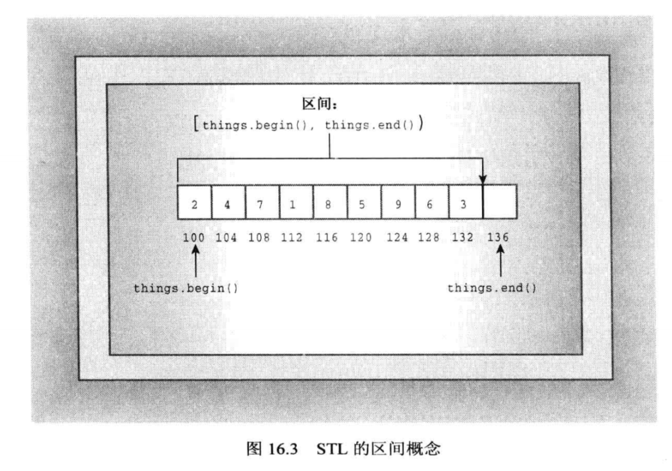

**演示程序**：下面的程序演示了 size()、begin()、end()、push_back()、erase()、insert() 的用法：

```cpp
/**
 * 演示 vector 容器的一些方法： size() begin() end() push_back() erase() insert()
 **/
struct Book {
    std::string bookName; // 书名
    double rating; // 评分
};

/**
 * 根据输入填充 Book 信息
 *  @return True-继续输入信息，False-输入结束
 **/
bool fillBook(Book & rb);

/**
 * 打印传入的 Book 的信息
 **/
void showBook(const Book & rb);

int main() {
    std::vector<Book> books; // 元素类型为 Book 的矢量
    Book tmp; // 用于保存输入信息的 Book 对象
    while (fillBook(tmp)) {
        books.push_back(tmp); // 在 vector 的尾部添加元素
    }
    int num = books.size(); // 获取 vector 容器中元素的数目
    if (num > 0) {
        std::cout << "Thank you. You entered the following:\n" << "BookName\tBook\n";

        for (int i = 0; i < num; ++i) { // 使用索引访问
            showBook(books[i]);
        }

        std::cout << "Using iterator:\n";
        std::vector<Book>::iterator it;
        for (it = books.begin(); it != books.end(); it++) { // 使用迭代器访问
            showBook(*it);
        }

        // 接下来将对 books 进行一系列增删操作，先保存一个现有的 books 的副本，再进行增删操作。
        std::vector<Book> oldList(books); // 使用 vector<Book> 的复制构造函数创建了一个 books 的副本

        if (num > 3) {
            // 删除 books 的 [第二个元素, 第四个元素)
            books.erase(books.begin()+1, books.begin()+3);
            std::cout << "After erase:\n"; // 打印删除元素之后的 books
            for (it = books.begin(); it != books.end(); it++) {
                showBook(*it);
            }

            // 向 books 的第一个元素之前添加 oldList 的 [第二个元素, 第三个元素)，即只插入 oldList 的第二个元素
            books.insert(books.begin(), oldList.begin()+1, oldList.begin()+2);
            std::cout << "After insert:\n";
            for (it = books.begin(); it != books.end(); it++) {
                showBook(*it);
            }
        }

        books.swap(oldList); // 交换 books 与 oldList 中的元素
        std::cout << "Swapping books with oldList:\n";
        for (it = books.begin(); it != books.end(); it++) {
            showBook(*it);
        }
    } else {
        std::cout << "Books is null.\n";
    }
    return 0;
}

bool fillBook(Book & rb) {
    std::cout << "Enter book name(quit to quit): ";
    std::getline(std::cin, rb.bookName);
    if ("quit" == rb.bookName)
        return false;
    std::cout << "Enter book rating: ";
    std::cin >> rb.rating;
    if (!std::cin) // 这里调用的是 cin 的 operator!() 方法，等价于 std::cin.fail()
        return false;
    while (std::cin.get() != '\n') // 去掉多余的换行符
        continue;
    return true;
}

void showBook(const Book & rb) {
    std::cout << rb.bookName << " " << rb.rating << std::endl;
}
```

```java
Enter book name(quit to quit):三体
Enter book rating:9.5
Enter book name(quit to quit):1984
Enter book rating:9.4
Enter book name(quit
to quit):四世同堂
Enter book rating:9.4
Enter book name(quit to quit):我与地坛
Enter book rating:9.3
Enter book name(quit to quit):百年孤独
Enter book rating:9.3
Enter book name(quit to quit):quit
Thank you. You entered the following:
BookName        Book
三体 9.5
1984 9.4
四世同堂 9.4
我与地坛 9.3
百年孤独 9.3
Using iterator:
三体 9.5
1984 9.4
四世同堂 9.4
我与地坛 9.3
百年孤独 9.3
After erase:
三体 9.5
我与地坛 9.3
百年孤独 9.3
After insert:
1984 9.4
三体 9.5
我与地坛 9.3
百年孤独 9.3
Swapping books with oldList:
三体 9.5
1984 9.4
四世同堂 9.4
我与地坛 9.3
百年孤独 9.3
```

在上面程序将`!std::cin`作为 if 语句的条件，这里是用到了 cin 的重载运算符`operator!`，它相当于`cin.fail()`：

```cpp
bool operator!() const { return this->fail(); }
```

#### vector 容器可执行的其他操作

程序员通常还会对数组执行很多操作，如搜索、排序等。vector 模板中包含这些常见操作的方法？答：没有！为什么 vector 模板不定义这些方法呢？因为这些方法并不只适用于 vector，其他容器类也需要这些操作。因此 STL 从更广泛的角度定义了非成员函数来执行这些操作，即不是为某个容器类定义成员函数，而是定义了一个适用于所有容器类的非成员函数。
这种设计理念省去了大量重复工作。例如，假设有8个容器类，每个容器类需要十种操作。如果每个容器类都定义自己的成员函数，则需要定义`8*10=80`个成员函数。但采用 STL 的方式时，只需要定义 10 个非成员函数来执行查找、排序等操作。

另一方面，即使有执行相同任务的非成员函数，STL 有时也会为某些容器定义一个成员函数。这是因为对于有些操作来说，类特定算法的效率比通用算法高。例如，vector 的成员函数 swap() 效率比非成员函数 swap() 高，但非成员函数的 swap() 能让您交换两个类型不同的容器的内容。

下面介绍三个有代表性的 STL 函数: for_each()、random_shuffle() 和 sort()。
- for_each()：它可用于任何容器类，接受三个参数。前两个参数是定义容器需要访问的区间，最后一个参数是指向函数的指针。for_each() 函数将被指向的函数应用于指定容器区间中的各种元素。需要注意的是，要求被指向的函数不能修改容器中元素的值。for_each() 函数可以被 for 循环替代。
- random_shuffle()：它只适用于允许随机访问的容器。它接受两个定义容器区间的迭代器参数，并随机排列该区间中的元素。
- sort()：它也要求容器支持随机访问。它有两个版本，一个版本是接受两个定义区间的参数，对这个区间中的元素按照`operator<()`的结果按照升序排序；另一个版本接受三个参数，前两个参数依旧定义排序的区间，第三个参数接受一个指向函数的指针，sort() 在排序时将使用该函数来替代`opeartor<()`，返回值为 false 表示两个参数顺序不正确。如果容器的元素类型是自定义的类型，那么使用第一个版本之前，需要先为该自定义类型重载小于运算符`opeartor<()`。

> shuffle 洗牌的意思。

```cpp
// 等价于 for 循环
vector<Book>::iterator it;
for (it = books.begin(); it != books.end(); it++)
    showBook(*it);
// for_each 可避免定义显式的迭代器对象
for_each(books.begin(), books.end(), showBook);

// 将 books 容器中的元素随机排列
random_shuffle(books.begin(), books.end());

bool operator<(const Book & r1, const Book & r) {
    if (r1.bookName < r2.bookNmae)
        return true;
    else if (r1.bookName == r2.bookNmae && r1.rating < r2.rating)
        return true;
    else
        return false;
}
sort(books.begin(), books.end()); // 第一个版本 sort

bool compareBook(const Book & r1, const Book & r2) {
    return r1.rating < r2.rating;
}
sort(books.begin(), books.end(), compareBook);
```

```cpp
/**
 * 演示 vector 容器的一些方法： size() begin() end() push_back() erase() insert()
 **/
struct Book {
    std::string bookName; // 书名
    double rating; // 评分
};

/**
 * 重载 < 运算符
 **/
bool operator<(Book & r1, Book & r2);

bool compareBook(Book & r1, Book & r2);

/**
 * 根据输入填充 Book 信息
 *  @return True-继续输入信息，False-输入结束
 **/
bool fillBook(Book & rb);

/**
 * 演示 STL 的 for_each()/random_stuffle()/sort()
 **/
int main() {
    std::vector<Book> books;
    Book temp;

    while(fillBook(temp))
        books.push_back(temp);

    if (books.size()) {
        std::cout << "Thank you. You entered the following:\n" << "BookName\tBook\n";
        std::for_each(books.begin(), books.end(), showBook);

        std::sort(books.begin(), books.end()); // 第一个版本的 sort
        std::cout << "After sorted by operator<:\n";
        std::for_each(books.begin(), books.end(), showBook);

        std::sort(books.begin(), books.end(), compareBook);
        std::cout << "After sorted by compareBook:\n";
        std::for_each(books.begin(), books.end(), showBook);

        std::random_shuffle(books.begin(), books.end());
        std::cout << "After sorted by random_stuffle:\n";
        std::for_each(books.begin(), books.end(), showBook);
    } else {
        std::cout << "No books.\n";
    }
    return 0;
}

bool operator<(Book & r1, Book & r2){
    if (r1.bookName < r2.bookName)
        return true;
    else if (r1.bookName == r2.bookName && r1.rating < r2.rating)
        return true;
    else
        return false;
}

bool compareBook(Book & r1, Book & r2) {
    return r1.rating < r2.rating;
}

bool fillBook(Book & rb) {
    std::cout << "Enter book name(quit to quit): ";
    std::getline(std::cin, rb.bookName);
    if ("quit" == rb.bookName)
        return false;
    std::cout << "Enter book rating: ";
    std::cin >> rb.rating;
    if (!std::cin) // 这里调用的是 cin 的 operator!() 方法，等价于 std::cin.fail()
        return false;
    while (std::cin.get() != '\n') // 去掉多余的换行符
        continue;
    return true;
}

void showBook(const Book & rb) {
    std::cout << rb.bookName << " " << rb.rating << std::endl;
}
```

```java
Enter book name(quit to quit):三体
Enter book rating:9.5
Enter book name(quit to quit):活着
Enter book rating:9.4
Enter book name(quit to quit):四世同堂
Enter book rating:4.4
Enter book name(quit to quit):我与地坛
Enter book rating:7.9
Enter book name(quit to quit):百年孤独
Enter book rating:6.6
Enter book name(quit to quit):小王子
Enter book rating:3.3
Enter book name(quit to quit):quit
Thank you. You entered the following:
BookName        Book
三体 9.5
活着 9.4
四世同堂 4.4
我与地坛 7.9
百年孤独 6.6
小王子 3.3
After sorted by operator<:
百年孤独 6.6
活着 9.4
三体 9.5
四世同堂 4.4
我与地坛 7.9
小王子 3.3
After sorted by compareBook:
小王子 3.3
四世同堂 4.4
百年孤独 6.6
我与地坛 7.9
活着 9.4
三体 9.5
After sorted by random_stuffle:
活着 9.4
四世同堂 4.4
我与地坛 7.9
百年孤独 6.6
小王子 3.3
三体 9.5
```

### 基于范围的 for 循环

```cpp
for (for_iterator : for_range) {}
```

基于范围的 for 循环是为用于 STL 而设计的，也可以用于数组。例如：

```cpp
double d[5] = { 1.1, 20.78, 9.88, 3.4, 44.4};
for (double t : d)
    cout << t << endl;
```

用于遍历 STL 容器时，这种 for 循环中，括号内的代码声明一个类型与容器元素类型相同的变量，然后指出容器的名称。接下来，循环体使用指定的变量依次访问容器的每个元素。例如，对于上面程序中使用 for_each() 的语句可以被替换为基于范围的 for 循环：

```cpp
for_each(books.begin(), books.end(), showBook);
// 等价于
for(Book b : books)
    showBook(b);
// 利用 C++11 的 auto
for(auto b : books)
    showBook(b);
```

与 for_each() 不同的是，基于范围的 for 循环可以修改容器的内容，方法是将调用的函数的参数设置为引用参数：

```cpp
void tempFunc(Book & rb) { rb.rating++; }
for (auto b : books)
    tempFunc(b);
```

## 泛型编程

有了一些 STL 的使用经验后，我们再来看看它的底层理念 —— 泛型编程。

面向对象编程关注的是编程的数据方面，而泛型编程关注的则是算法。它们之间的共同点是抽象和创建可重用代码，但它们的理念大不相同。

泛型编程旨在编写独立于数据类型的代码。在C++中完成通用程序的工具是模板。通过模板可以按泛型定义函数或类，而 STL 通过通用算法更进了一步。模板让一切成为可能，但必须对元素进行仔细设计。为了解模板和设计是如何协同工作的，来看看需要迭代器的原因。

### 为何使用迭代器

理解迭代器是理解 STL 的关键所在。模板使得算法独立于存储的数据类型，而迭代器使算法独立于使用的容器类型。因此，它们都是 STL 通用方法的重要组成部分。

泛型编程旨在使用同一个函数来处理任何容器类型，它要求函数不仅独立于容器中存储的数据类型，而且还要求函数独立于容器本身的数据结构。模板提供了容器中存储的数据类型的通用表示，迭代器则提供了一种遍历容器中的值的通用表示。

例如，我们为数组和链表这两种不同数据结构实现 find 函数。

对于数组：

```cpp
double * findArray (double * ar, int n, const double & val) {
    for (int i = 0; i < n; ++i)
        if (ar[i] == val)
            return &ar[i];
    return nullptr;
}
```

对于链表:

```cpp
struct Node {
    double item;
    Node * pNext;
};

Node * findNode(Node * head, const double & val) {
    for (Node * pt = head; pt->pNext != nullptr; pt = pt->pNext)
        if (val == pt->item)
            return pt;
    return nullptr;
}
```

findArray 和 findNode 方法都是对 double 类型来执行的，您可以通过使用模板来将这两种方法推广到支持运算符`==`的任何数据类型的数组和链表。但 findArray 与数组这种数据结构绑定，而 findNode 与链表这种数据结构绑定。
从实现细节上来看，这两个 find 函数算法是不同的：数组的 find 使用数组索引来遍历元素，而链表的 find 使用`pt = pt->pNext`来访问下一个节点。
但是从广义上说，这两种算法是相同的，它们都是将指定值依次与容器中的每个值进行比较，直到找到匹配的为止。
而迭代器 iterator 就是提供了一个通用的对容器的访问方法。

依旧以 find 函数为例，思考一下，如果要实现 find 函数，迭代器应具备哪些特征？
- 应能够对迭代器执行解除引用操作，以便能够访问它引用的值。
- 应能够将一个迭代器赋值给另一个迭代器。
- 应能够将一个迭代器与另一个进行比较，看它们是否相等。
- 应能够使用迭代器遍历容器中的所有元素。这可以通过为迭代器 p 定义`p++`来实现。

> 迭代器也可以完成其他操作，但对于 find 函数来说有上述功能就足够了。
> 实际上，STL 按照功能的强弱定义了多种级别的迭代器，后面会进行介绍。
> 顺便说一句，常规指针其实就能满足迭代器的要求。

因此，可以这样编写 findArray() 函数：

```cpp
typedef double * iterator;
iterator findArray(iterator ar, int n, const double & val) {
    for (int i = 0; i < n; i++, ar++)
        if (*ar == val)
            return ar;
    return 0;
}
```

进一步修改函数参数，使其接受两个指示区间的指针参数，其中一个指向数组的起始位置，另一个指向数组的“超尾”；同时函数可以通过返回尾指针来指出没有找到要求的值：

```cpp
typedef double * iterator;
iterator findArray(iterator begin, iterator end, const double & val) {
    for (iterator t = begin; t != end; t++)
        if (*t == val)
            return t;
    return end;
}
```

对于链表的 find 函数，可以定义一个迭代器类：

```cpp
struct Node {
    double item;
    Node * pNext;
};

class iterator {
private:
    Node * pt;
public:
    iterator() : pt(nullptr) {}
    iterator(Node * pn) : pt(pn) {}
    double operator*() { return this->pt->item; }
    iterator& operator++() { // ++it
        pt = pt->pNext;
        return *this;
    }
    iterator operator++(int) { // it++
        iterator tmp = *this;
        pt = pt->pNext;
        return tmp;
    }
    // operator==() and opeartor!=()
};

iterator findNode(iterator head, const double & val) {
    for(iterator it = head; it != nullptr; it++)
        if(*it == val)
            return it;
    return nullptr;
}
```

> 为区分++运算符的前缀版本和后缀版本，C++将opeartor++作为前缀版本，将operator++(int)作为后缀版本，其中的参数永远不会被用到，所以不必指定其名称。

此时的 findNode 与 findArray 几乎相同，差别在于如何描述已到达最后一个值。findArray 使用超尾迭代器，而 findNode 使用存储在最后一个节点中的空值。除了这种差别外，这两个函数完全相同。所以，可以将链表的最后一个元素后面再添加一个额外的元素，让链表与数组一样拥有一个超尾元素，并在迭代器到达超尾位置时结束搜索。这样 findArray 与 findNode 成为相同的算法。

STL 遵循上面介绍的方法。首先，为每个容器类(vector、list、deque 等)定义了相应的迭代器类型。对于其中的某个容器类，迭代器可能是指针，而对于另一个类，它可能是对象。不管其实现方式如何，迭代器都将提供所需的操作，如*和++。其次，每个容器类都有一个超尾标记，当迭代器递增到超越容器的最后一个值后，这个值将被赋给迭代器。每个容器类都有 begin() 和 end() 方法，它们分别返回一个指向容器的第一个元素和超尾位置的迭代器。每个容器类都使用++操作，让迭代器能够从指向第一个元素逐步指向超尾位置，从而遍历容器的每一个元素。

对于用户来说，使用容器类，无需知道其迭代器是如何实现的，也无需知道超尾是如何实现的，只需知道它有迭代器，其 begin() 返回指向容器第一个元素的迭代器，end() 返回指向超尾位置的迭代器即可。

总结一下 STL 方法。首先是处理容器的算法，应尽可能使用通用的术语来表达算法，使之独立于数据类型和容器类型。为使通用算法能够适用于具体情况，应定义能够满足算法需求的迭代器，并把要求加到容器设计上。即基于算法的要求，设计基本迭代器的特征和容器特征。

### 迭代器类型

不同的算法对迭代器的要求也不相同。例如，查找算法需要定义++运算符，以便迭代器能够遍历整个容器；它要求能够读取数据，但不要求能够写数据。而排序算法要求能够随机访问，以便能够交换两个不相邻的元素。如果 it 是一个迭代器，则可以通过定义+运算符来实现随机访问，这样就可以使用像`it+10`这样的表达式。另外，排序算法还要求能够读写数据。

STL 定义了五种迭代器，并根据所需的迭代器类型对算法进行了描述。它们分别是：输入迭代器、输出迭代器、正向迭代器、双向迭代器和随机访问迭代器。

#### 输入迭代器

输入是从程序的角度说的，即来自容器的信息被视为输入。就像来自键盘的信息对程序来说是输入一样。因此，输入迭代器被程序用来读取容器中的信息。具体地说，对输入迭代器解除引用将使程序能够读取容器中的值，但不一定能让程序修改值。因此，需要输入迭代器的算法将不能修改容器中的值。

输入迭代器必须能够访问容器中所有的值，这是通过支持++运算符(前缀和后缀)来实现的。如果将输入迭代器设置为指向容器的第一个元素，并不断将其递增，直到到达超尾位置，则它依次指向容器中的每一个元素。顺便说一句，并不能保证输入迭代器第二次遍历容器时，顺序不变。另外，输入迭代器被递增后，也不能保证其先前的值仍然可以被解除引用。基于输入迭代器的任何算法都应该是单通行的，不依赖于前一次遍历时的迭代器值，也不依赖与本次遍历中前面的迭代器值。

> 注意，输入迭代器是单向迭代器，只能递增，不能倒退。

#### 输出迭代器

输出是指用于将信息从程序传输给容器的迭代器，因此程序的输出就是容器的输入。输出迭代器与输入迭代器相似，只是解除引用让程序能够修改容器值，而不能读取。也许您会对此感到奇怪看，能写却不能读。输出流 cout 也是如此，它可以修改发送到显示器的字符流，却不能读取屏幕上的内容。STL 足够通用，其容器可以表示输出设备，因此容器也可能如此。另外，如果算法不用读取容器的内容就可以修改它，则没有理由要求它使用能够读取内容的迭代器。

简而言之，对于单通行、只读算法，可以使用输入迭代器；对于单通行、只写算法，可以使用输出迭代器。

#### 正向迭代器

与输入迭代器和输出迭代器相似，正向迭代器只使用++运算符来遍历容器，所以它每次沿容器向前移动一个元素。然而，与输入和输出迭代器不同的是，它总是按相同的顺序遍历一系列值。另外，将正向迭代器递增后，仍然可以对前面的迭代器值解除引用(如果保存了它)，并可以得到相同的值。这些特征使得多次通行的算法成为可能。

正向迭代器既可以可读可写，也可以之可读。

#### 双向迭代器

双向迭代器既具有正向迭代器的所有特性，同时支持两种递减运算符(前缀和后缀)。例如，reverse 函数将区间内元素顺序颠倒。

#### 随机访问迭代器

有些算法(例如标准排序和二分搜索)要求能够直接跳到容器中的任何一个元素，这叫随机访问，这需要随机访问迭代器。

随机访问迭代器具有双向迭代器的所有特性，同时添加了支持随机访问的操作(如指针增加运算)和用于对元素进行排序的关系运算符。下图列出了除双向迭代器的操作之外，随机访问迭代器还支持的操作：

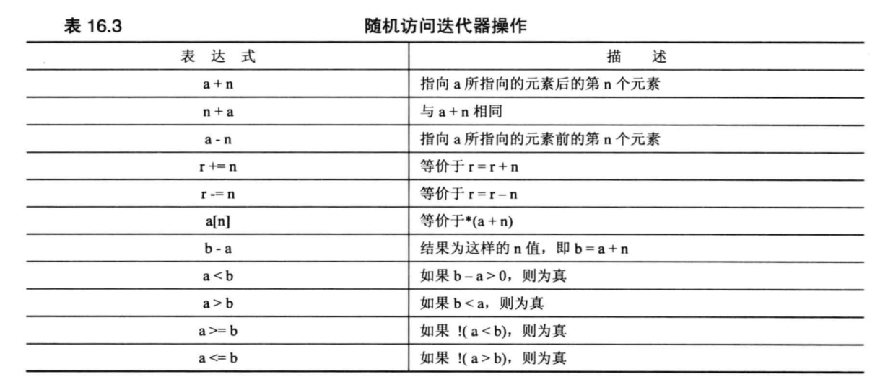

### 迭代器层次结构

您可能已经注意到，迭代器类型形成了一个层次结构：正向迭代器具有输入和输出迭代器的全部功能，同时还有自己的功能；双向迭代器具有正向迭代器的全部功能，同时还有自己的功能；随机访问迭代器具有正向迭代器的全部功能，同时还有自己的功能。

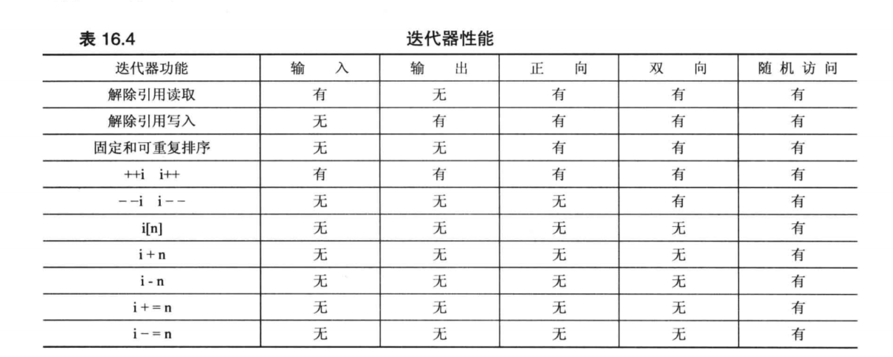

根据特定迭代器类型编写的算法可以使用该迭代器，也可以使用具有所需功能的任何其他迭代器。

为什么需要这么多迭代器？目的是为了在编写算法那时尽可能使用要求最低的迭代器，并让它适用于容器的最大区间。这样，通过使用级别最低的输入迭代器，find() 函数便可以用于任何包含可读取值的容器，而 sort() 函数由于需要随机访问，则只能用于支持这种迭代器的容器。

注意，各种迭代器的类型不是确定的，而是一种概念性描述。如前面指出的，每个容器类都定义了一个类级的 typedef 名称 —— iterator。因此`vector<int>`类的迭代器类型为`vector<int>::iterator`。然而，该类的文档将指出，vector 的迭代器是随机访问迭代器，他允许使用基于任何迭代器类型的算法，因为随机访问迭代器具有所有迭代器的功能。同样，`list<int>`类的迭代器类型为`list<int>::iterator`。list 是 STL 实现的一个双向链表，它的迭代器是双向迭代器，因此不能使用基于随机访问迭代器的算法，但可以使用基于要求较低的迭代器算法。

### 概念、改进和模型

> 介绍一些名词的概念。

STL 有若干个用C++语言无法表达的特性，例如迭代器种类。因此，虽然可以设计具有正向迭代器特征的类，但不能让编译器将算法限制为只使用这个类。原因在于，正向迭代器是一系列要求，而不是类型(class)。容器中的迭代器类可以满足这些要求，而常规指针同样也满足这些要求(随机访问迭代器的操作，常规指针都能满足)。STL 算法可以使用任何满足其要求迭代器实现。STL 文档使用术语**概念**来描述迭代器一系列的要求。因此，存在输入迭代器概念、正向迭代器概念等等。
> 顺便说一句，如果设计的容器类需要迭代器，可以考虑 STL，它包含用于标准种类的迭代器模板。

概念具有类似继承的关系。例如，双向迭代器“继承”了正向迭代器的功能。然而，C++的继承机制不能用于迭代器。例如，可以将正向迭代器实现为一个类，而将双向迭代器实现为一个常规指针。因此，对于C++而言，这种双向迭代器是一种内置类型，而不能从正向迭代器类派生而来。然而，从概念上看，它确实能够继承。有些 STL 文献使用术语**改进**来表示这种概念上的继承。因此，双向迭代器是对正向迭代器概念的一种改进。
概念的具体实现被称为木星。因此，指向 int 的常规指针是一个随机访问迭代器模型，也是一个正向迭代器模型，因为常规指针满足这些迭代器概念的所有要求。

### 常规指针作为迭代器

迭代器是广义指针，而指针能满足所有迭代器概念的要求，因此指针是迭代器。迭代器是 STL 算法的接口，而指针是迭代器，因此 STL 算法可以使用指针来对基于指针的非 STL 容器进行操作。例如，可以将 STL sort 算法用于数组：

```cpp
const int SIZE = 20;
double array[SIZE] = { /*...*/ }；

sort(array, array + SIZE); // 按照升序对它进行排序
```

C++支持将超尾概念用于数组，使得可以将 STL 算法用于常规数组。由于指针是迭代器，而算法基于迭代器，这使得 STL 算法可以用于常规数组。同样，可以将 STL 算法用于自己设计的数组形式，只要提供适当的迭代器(可以是指针，也可以是对象)和超尾指示器即可。

### 预定义迭代器

#### 背景

STL 提供了一些预定义迭代器。这里先介绍背景：有一种算法(名为 copy())可以将数据从一个容器复制到另一个容器中。这种算法是以迭代器方式实现的，所以它可以从一种容器到另一种容器进行复制，甚至可以在数组之间复制，因为可以将指向数组的指针用作迭代器。例如，下面的代码将一个数组中的元素赋值到一个矢量容器中：

```cpp
int array[10] = { 8, 22, 344, 8, 99, 3, 10, 5, 487, 2};
vector<int> vec(10);
copy(array, array+10, vec.begin()); // 将 array 中元素复制到 vec 容器
```

copy() 的前两个迭代器参数表示要复制的范围，最后一个迭代器参数表示要将第一个元素复制到什么位置。前两个参数是输入迭代器，最后一个参数是输出迭代器。copy() 函数将覆盖目标容器中已有的数据，同时目标容器必须足够大，以便能容纳被复制的元素。因此，不能使用 copy() 将数据放到空矢量中。

#### 输出流的迭代器

现在，假设要将信息复制到显示器上。如果有一个表示输出流的迭代器，则可以使用 copy()。STL 为这种迭代器提供了 ostream_iterator 模板。用 STL 的术语说，该模板是输出迭代器概念的一个模型，它也是一个适配器 —— 一个类或函数，可以将一些其他接口转换为 STL 使用的接口。可以通过包含头文件 iterator(以前为 iterator.h) 并作下面的声明来创建这种迭代器：

```cpp
#include <iterator>

ostram_iterator<int, char> out_it(cout, " ");
```

out_it 迭代器现在是一个接口，让您能够使用 cout 来显示信息。第一个模板参数(int)指出了呗发送给输出流的数据类型；第二个模板参数(char)指出了输出流使用的字符类型(另一个可能的值是 wchar_t)。构造函数的第一个参数(cout)指出了要使用的输出流，它还可以是用于文件输出的流；最后一个字符串参数是在发送给输出流的每个数据项后显示的分隔符。

可以这样来使用迭代器：

```cpp
*out_it++ = 15; // 等价于 cout << 15 << " ";
```

对于常规指针，这意味着将 15 赋给指针指向的位置，然后将指针加 1.但对于该 ostream_iterator，这意味着将 15 和由空格组成的字符串发送到 cout 管理的输出流中，并为下一个输出操作做好了准备。可以将 copy() 用于迭代器：

```cpp
copy(array, array+10, out_it);
```

这意味着将 array 数组的整个缺件复制到输出流中，即显示容器的内容。也可以不创建命名的迭代器，而是使用一个匿名迭代器，即可以这样使用适配器：

```cpp
copy(vec.begin(), vec.end(), ostram_iteraotr<int, char>(cout, " "));
```

iterator 头文件还定义了一个 istream_iterator 模板，使 istream 输入可用作迭代器接口。它是一个输入迭代器概念的模型，可以使用两个 istream_iterator 对象来定义 copy() 的输入范围：

```cpp
copy(istream_iterator<int, char>(cin), istream_iterator<int, char>(), vec.begin());
```

与 ostream_iterator 相似，istream_iterator 也使用两个模板参数。第一个参数指出要读取的数据类型，第二个参数指出输入流使用的字符类型。构造函数参数 cin 意味着使用由 cin 管理的输入流，省略构造函数参数表示输入失败。因此上述代码表示从输入流中读取，直到文件结尾、类型不匹配或出现其他输入故障为止。

#### 其他有用的迭代器

除 ostream_iterator 和 istream_iterator 之外，头文件 iterator 还提供了其他一些专用的预定义迭代器类型。它们是：
- reverse_iterator
- back_insert_iterator
- front_insert_iterator
- insert_iterator

**reaverse_iterator**：对 reverse_iterator 执行递增操作将导致它被递减。为什么不直接对常规迭代器进行递减？主要原因是为了简化对已有函数的使用。假设要显示容器 vec 的内容，可以使用刚才介绍的 copy() 和 ostream_iterator 来将内容复制到输出流中。现在假设要反向打印容器的内容。有很多方法都不管用，但与其在这里耽误功夫，不如来看看能够完成这种任务的方法：vector 类有一个名为 rbegin() 的成员函数和一个名为 rend() 的成员函数，前者返回一个指向超尾的反向迭代器，后者返回一个指向第一个元素的反向迭代器。正因为对迭代器执行递增操作将导致它被递减，所以可以使用下面的语句来反向显示内容：

```cpp
copy(vec.rbegin(), vec.rend(), out_it); // 反向显示 vec 内容
```

甚至不必声明反向迭代器，因为 rbegin() 和 rend() 已经完成了这一步。

> rbegin() 与 end() 返回相同的值(超尾)，但它们的类型不同(reverse_iterator 和 iterator)。同样，rend() 和 begin() 也返回相同的值(指向第一个元素的迭代器)，但类型不同。

必须对反向指针做一种特殊补偿。假设 rp 是一个被初始化为 rbegin() 的反转指针，那么`*rp`是什么？因为 rbegin() 返回超尾，因此不能对此地址进行解除引用。同样，如果 rend() 是第一个元素的位置，则 copy() 必须提早一个位置停止，因为区间的结尾处不包括在区间中。

反向指针通过先递减，在解除引用来解决这两个问题。

另外三种迭代器(back_insert_iterator、front_insert_iterator、insert_iterator)也将提高 STL 算法的通用性。

```cpp
copy(array, array+10, vec.begin());
```

上面的代码将使用 array 数组的前十个元素覆盖 vec 原先的内容，且该函数假设 vec 有足够的空间能够容纳这些值，即 copy() 不会自动根据发送值调整目标容器的长度。如果事先不知道 vec 的长度，该怎么办呢？或者想将元素添加到 vec 中，而不是覆盖已有内容，有该怎么办呢？

back_insert_iterator、front_insert_iterator、insert_iterator 这三种插入迭代器通过将复制转换为插入解决了这些问题。插入将添加新的元素，而不会覆盖已有的数据，并使用自动内存分配来确保能够容纳新的信息。back_insert_iterator 将元素插入到容器尾不，而 front_insert_iterator 将元素插入到容器的前端。最后，insert_iterator 将元素插入到 insert_iterator 构造函数的参数指定的位置前面。这三个插入迭代器都是输出容器概念的木星。

这里存在一些限制。back_insert_iterator 只能用于允许在尾部快速插入的容器，vector 类符合这种要求。front_insert_iterator 只能用于允许在起始位置快速插入的容器类型，vector 类不符合这种要求，但 queue 满足。insert_interator 没有这些限制，因此可以用它把信息插入到矢量的前端。然而，front_insert_iterator 对于那些支持它的容器来说，完成任务的速度更快。
> 快速插入指的是一个时间固定的算法，之后会进行介绍。
> 可以用 insert_iterator 将复制数据的算法转换为插入数据的算法。

这些迭代器将容器类型作为模板参数，将实际的容器标识符作为构造函数参数：

```cpp
vector<double> vec;
back_insert_iterator<vector<double>> backIt(vec);
```

必须声明容器类型的原因是，迭代器必须使用合适的容器方法。back_insert_iterator 的构造函数将假设传递给它的类型有一个 push_back() 方法。copy() 是一个独立的函数，没有重新调整容器大小的权限。但前面的声明让 backIt 能够使用方法 vector<double>::push_back()，该方法有这样的权限。

声明 front_insert_iterator 的方式与 back_insert_iterator 相同。而对于 insert_iterator 的声明，还需要一个指示插入位置的构造函数参数：

```cpp
insert_iterator<vector<int>> insertIt(vec, vec.begin());
```

back_insert_iterator、insert_iterator 演示程序

```cpp
int main() {
    using namespace std;
    int i1[4] = {11, 13, 14, 10};
    int i2[2] = {26, 24};
    int i3[4] = {38, 33, 39, 36};
    vector<int> vec(4);

    copy(i1, i1+4, vec.begin());
    for (int x:vec) cout << x << " ";
    cout << endl;

    copy(i2, i2+2, back_insert_iterator<vector<int>> (vec));
    for (int x:vec) cout << x << " ";
    cout << endl;

    copy(i3, i3 + 4, insert_iterator<vector<int>>(vec, vec.begin()));
    for (int x:vec) cout << x << " ";
    cout << endl;

    return 0;
}
```

```java
// 输出
11 13 14 10
11 13 14 10 26 24
38 33 39 36 11 13 14 10 26 24
```

#### 小结

您可能会被这些预定义迭代器搞晕，但请记住，只要多多使用就会熟悉它们。这些预定义迭代器提高了 STL 算法的通用性。因此，copy() 不仅可以将信息从一个容器复制到另一个容器，还可以将信息从容器复制到输出流，从输入流复制到容器中，还可以使用 copy() 将信息插入到另一个容器中。因此使用同一个函数就可以完成很多工作。

### 容器种类

STL 具有容器概念和容器类型。概念是具有名称(如容器、序列容器、关联容器等)的通用类别；容器类型是可用于创建具体容器对象的模板。

以前的C++有 11 个容器类别，它们分别是：deque、list、queue、priority_queue、stack、vector、map、multimap、set、multiset、bitset。
C++11新增了 5 个容器类别，它们分别是：forward_list、unordered_map、unordered_multimap、unordered_set 和 unordered_multiset，并且不将 bitset 视为容器，而是将其视为一种独立的类别。

#### 容器概念

没有与基本容器概念对应的类型，但概念描述了所有容器类都通用的元素。容器概念指定了所有 STL 容器类都必须满足的一系列要求。

容器是存储其他对象的对象。被存储的对象必须是同一种类型的。存储在容器中的数据为容器所有，这意味着当容器过期时，存储在容器中的数据也将过期。
> 如果容器存储的是指针，当容器过期时，容器存储的指针将过期，但指针指向的数据不一定会过期。

不能将任何类型的对象存储在容器中，具体地说，类型必须是可复制构造的和可赋值的。基本类型满足这些要求；只要自定义类型没有将复制构造函数和赋值运算符声明为私有or保护的，则也满足这种要求。C++11改进了这些概念，添加了属于可复制插入和可移动插入。

基本容器不能保证其元素都按特定的顺序存储，也不能保证元素的顺序不变，但对概念改进后，则可以增加这样的保证。所有的容器都提供某些特征和操作。下图对一些通用特征进行总结。其中，X 表示容器类型，如 vector；T 表示存储在容器中的对象类型；a 和 b 表示类型为 X 的值；r 表示类型为 X& 的值；u 表示类型为 X 的标识符。

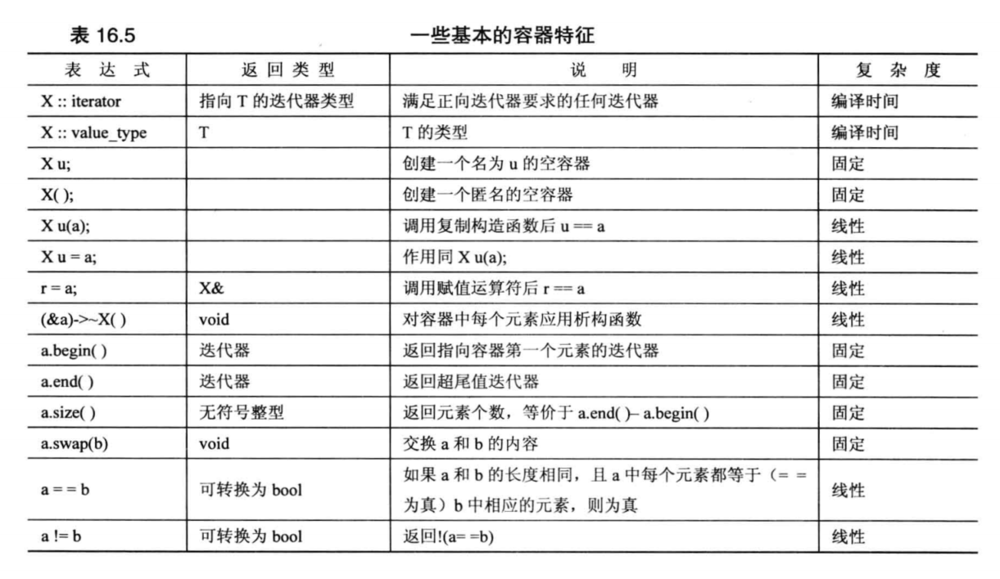

图中的复杂度一列描述了执行操作所需的时间，它列出了三种可能性：
- 编译时间
- 固定时间
- 线性时间

如果复杂度为**编译时间**，则操作将在编译时执行，执行时间为 0。**固定复杂度**意味着操作发生在运行阶段，但不受对象中元素的数目影响。**线性复杂度**意味着时间与元素数目成正比。

复杂度要求是 STL 特征，虽然实现细节可以隐藏，但性能规格应公开，以便程序员能够知道完成后特定操作的计算成本。

#### C++11新增的容器要求

rv 表示类型为 X 的非常量右值，如函数的返回值。

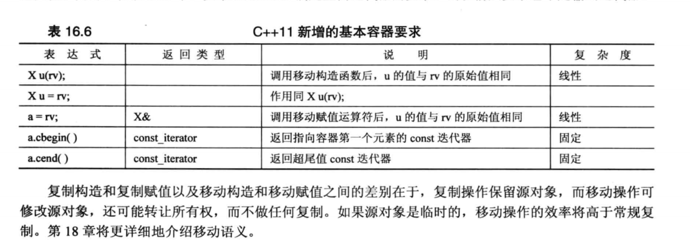

复制构造和复制赋值以及移动构造和移动赋值之间的差别在于，复制操作保留源对象，而移动操作可以修改源对象，还可能转让所有权，不做任何赋值。如果源对象是临时的，移动操作的效率高于常规复制。

#### Type 1. 序列

可以通过添加要求来改进基本的容器概念。序列是一种重要的改进，因为七种 STL 容器类别(deque、list、queue、stack、vector、priority_queue、forward_list)都是序列。序列概念增加了容器的迭代器至少是正向迭代器的要求，这保证了元素将按照特定顺序排列，而不会在两次迭代之间发生变化。
> array 也被归类为序列容器，虽然它并不满足序列的所有要求。

序列还要求其元素按严格的线性顺序排列。数组和链表都是序列，但分支结构(例如树)不是。

因为序列中的元素具有确定的顺序，因此可以执行诸如将值插入到特定位置、删除特定区间等操作。

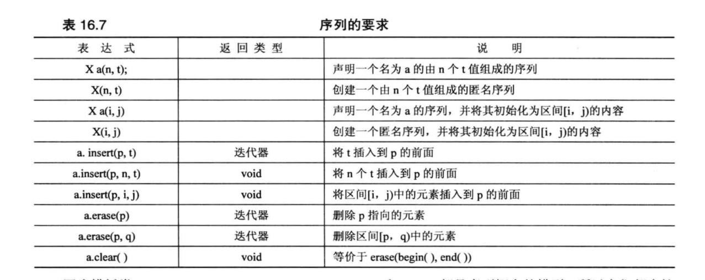
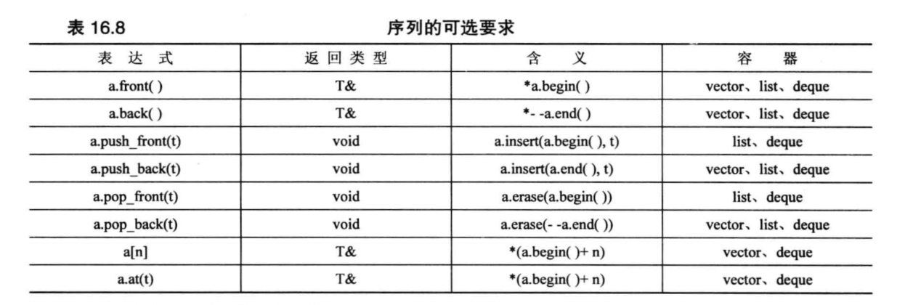

**(1) vector**

前面已经介绍了很多用 vector 模板的例子，该模板在头文件 vector 中声明。
简单地说，vector 是数组的一种类表示，提供了
- 自动内存管理的功能，可以动态地改变 vector 对象的长度，并随着元素的增加/删除而增大/缩小。
- 元素的随机访问。
- 在尾部添加和删除元素的时间是固定的，但在头部和中间插入和删除元素的复杂度为线性时间。

除了序列外，vector 还是可反转容器概念的模型。这增加了两个类方法：rbegin() 和 rend()。

vector 模板类是最简单的序列类型，除非其他类型的特殊优点能够更好地满足程序的要求，否则应默认使用这种类型。

**(2) deque**

deque 模板类在头文件 deque 中声明。它表示双端队列，全称 double-ended queue。
在 STL 中，其实现类似于 vector 容器，提供了
- 元素的随机访问。
- 自动内存管理功能。
- 在头部和尾部插入和删除元素的时间是固定的。<- 这点是与 vector 的主要区别

如果多数操作发生在序列的起点和终点位置，则应考虑 deque 数据结构。

> 为实现 deque 两端执行输入和删除元素操作时间为固定的这一目的，deque 对象的设计比 vector 对象更为复杂。因此，尽管二者都提供对元素的随机访问和在序列中部执行线性时间的插入和删除操作，但 vector 容器执行这些操作时效率更高。

**(3) list**

list 模板类在头文件 list 中声明，表示双向链表。除了第一个和最后一个元素外，每个元素都与前后的元素相链接，这意味着可以双向遍历链表。

list 与 vector 之间关键的区别在于：list 在链表中任一位置进行插入和删除的时间是固定的，但不提供元素的随机访问和数组表示法。因此，vector 强调的是通过随机访问进行快速访问，而 list 强调的是元素的快速插入和删除。

另一个不同是，从容器中插入和删除元素之后，链表迭代器指向的元素将不变。

与 vector 相似，list 也是可反转容器。

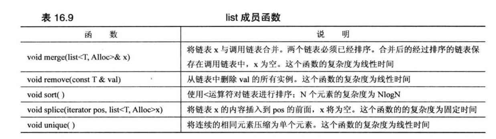


**(4) forward_list(C++)**

C++11新增了容器类 forward_list，它实现了单链表。在这种链表中，每个节点都只链接到下一个节点，而没有链接到前一个节点。因此，forward_list 只需要正向迭代器，而不需要双向迭代器。因此，forward_list 是不可反转的容器。相比 list，forward_list 更简单、更紧凑，但功能也更少。

**(5) queue**

queue 模板类在头文件 queue 中声明，它是一个适配器类。queue 模板让底层类(默认为 deque) 展示典型的队列接口。

queue 模板的限制比 deque 更多。它不允许随机访问队列元素，甚至不允许遍历队列。它把使用限制在定义队列的基本操作上，即可以将元素添加到队尾、从队首删除元素、查看队首和队尾的值、检查元素数目和测试队列是否为空。

> pop() 是删除数据的方法，而不是检索数据的方法。如果要使用队列中的元素，应先使用 front() 来检索这个值，然后使用 pop() 将它从队列中删除。

**(6) priority_queue**

priority_queue 模板类在头文件 queue 中声明，它是另一个适配器类，它支持的操作与 queue 相同。两者的主要区别在于，在 priority_queue 中最大的元素被移到队首。内部区别在于，priority_queue 默认的底层类是 vector。可以通过构造函数修改用于确定哪个元素应该放在队首的比较方式。

**(7) stack**

stack 模板类在头文件 stack 中声明，它也是一个适配器类，它给底层类(默认为 vector)提供了典型的栈接口。

stack 模板的限制比 vector 更多。它不允许随机访问栈元素，甚至不允许遍历栈。它把使用限制在定义栈的基本操作上，即可以将元素压入栈顶、从栈顶弹出元素、查看栈顶元素的值，检查元素数目和测试栈是否为空。

> 与 queue 相似，如果要使用栈中的值，应先使用 top() 来检索这个值，然后使用 pop() 将它从栈中删除。

**(8) array(C++11)**

模板类 array 在头文件 array 中声明，它并非 STL 容器，因为它的长度是固定的。因此，array 没有定义调整容器大小的操作，例如 push_back() 和 insert()。可将很多 STL 算法用于 array 对象，如 copy() 和 for_each()。

#### Type 2. 关联容器

关联容器是对容器概念的另一个改进，关联容器将值和键关联在一起，并使用键来查找值。例如，值可以是表示雇员信息的结构体，而键可以是唯一的员工编号。为获取雇员信息，程序将使用键查找雇员信息。

关联容器的优点在于，它提供了对元素的快速访问。与序列相似，关联容器也允许插入新元素，但不能指定元素的插入位置。原因是关联容器通常有用于确定数据放置位置的算法，以便能够快速检索信息。

关联容器通常是使用某种树实现的。STL 提供了四种关联容器：set、multiset、map、multimap。前两种容器在头文件 set 中声明，后两种在头文件 map 中声明。

set 的键类型和值类型相同，键是唯一的，这意味着集合中不会有多个相同的键。对于 set 来说，值就是键。
multiset 类似 set，只是可能有多个值的键相同。
map 的键类型和值类型不同，键是唯一的，每个键对应一个值。
multimap 与 map 相似，只是一个键可以与多个值关联。

#### Type 3. 无序关联容器(C++11)

无序关联容器是对容器概念的另一种改进。与关联容器一样，无序关联容器也将值和键关联起来，并使用键查找值。但底层的差别在于，关联容器是基于树结构的，而无序关联容器是基于数据结构哈希表的，这旨在提高添加和删除元素的速度以及提高查找算法的效率。有四种无需关联容器，他们是 unordered_set、unordered_multiset、unordered_map、unordered_multimap。

#### 总结

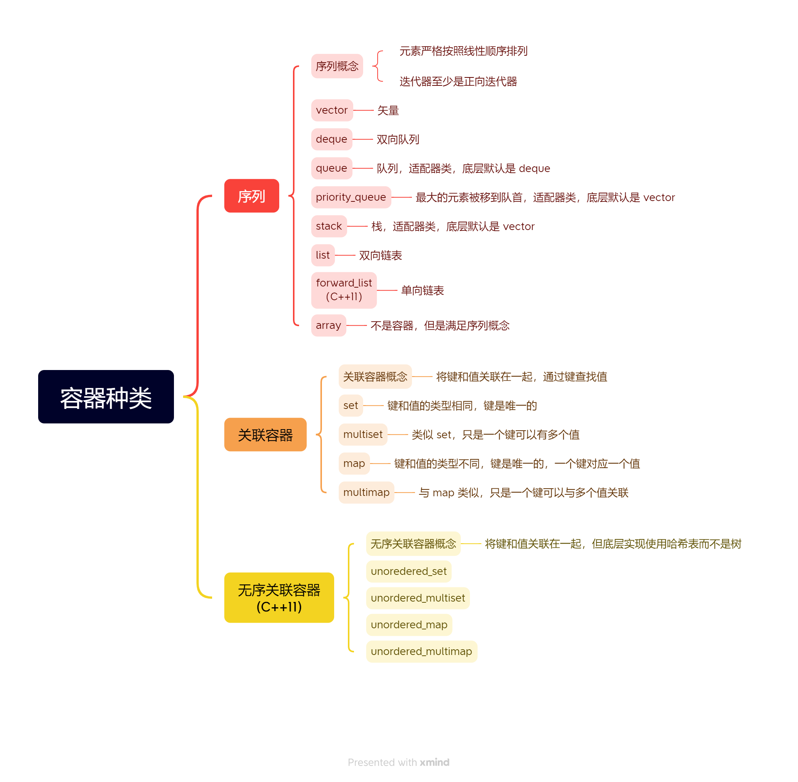

