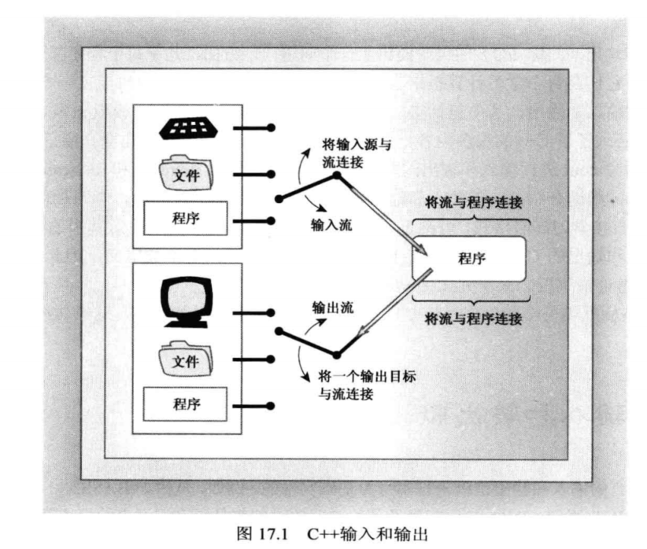
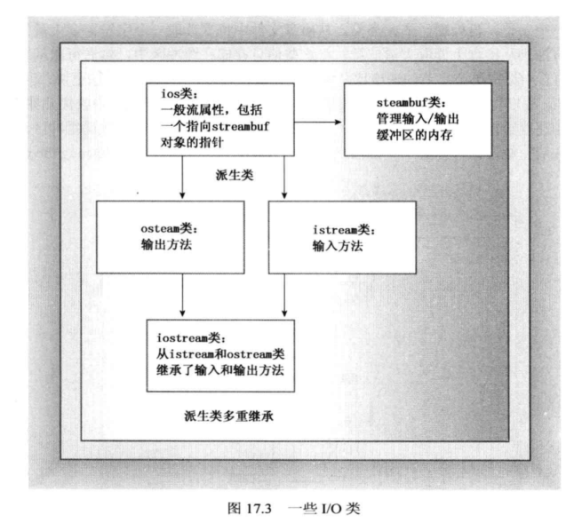
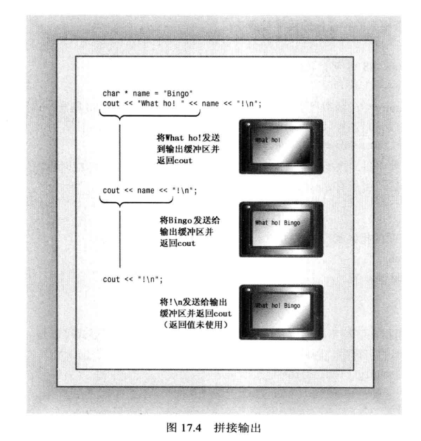
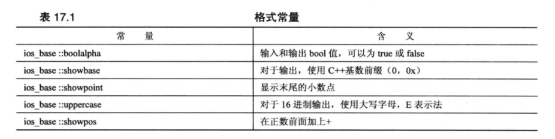
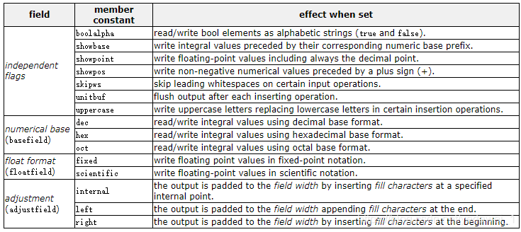
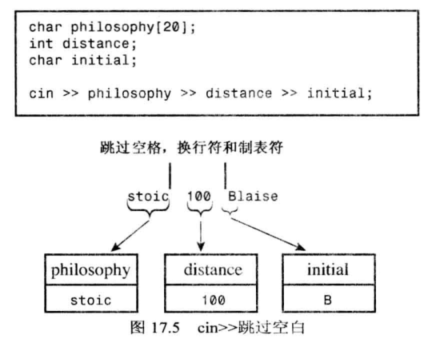
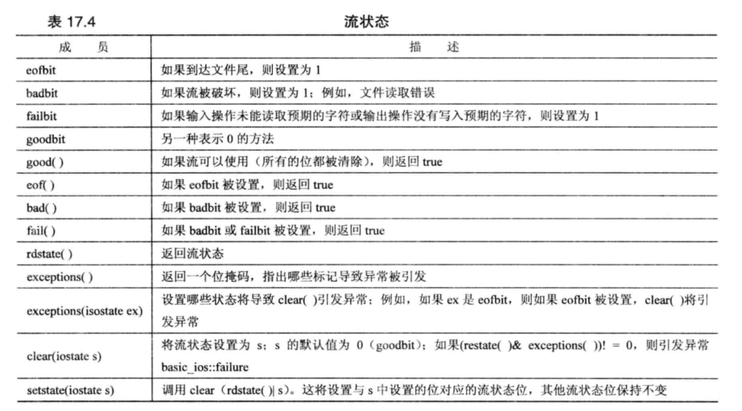
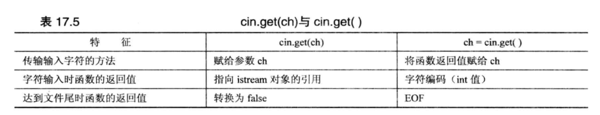
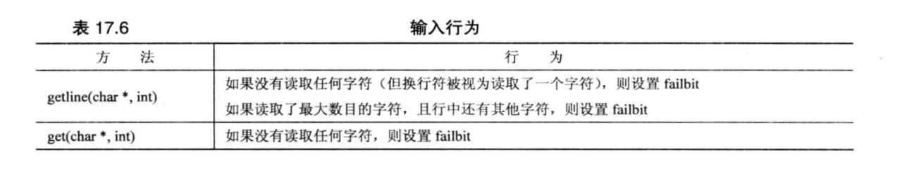
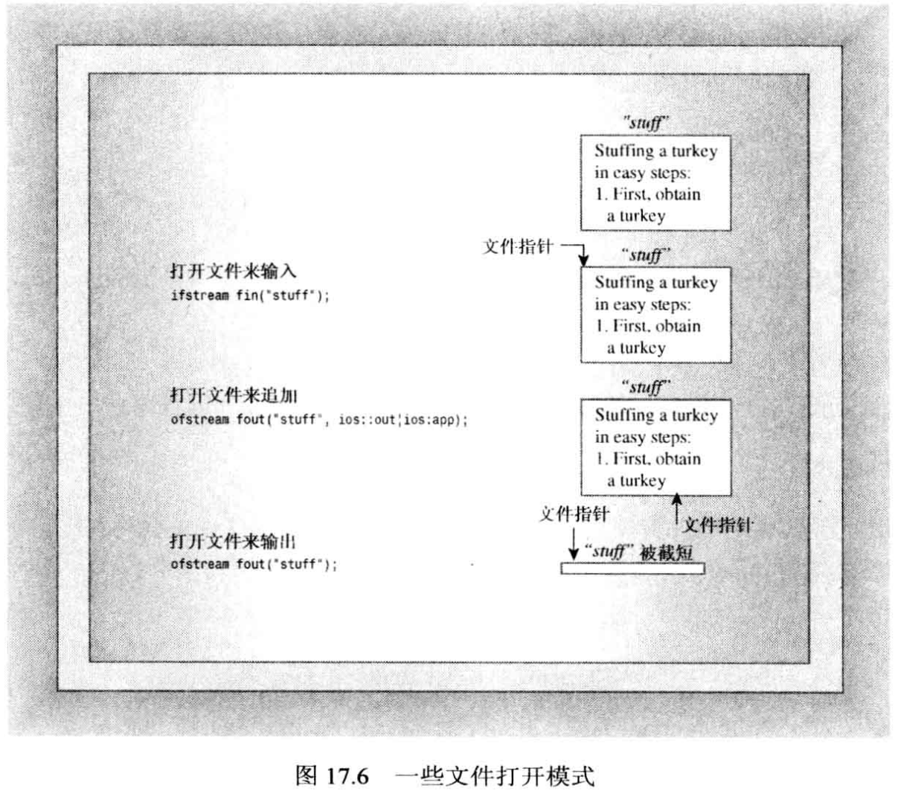

## Overview

C和C++都没有将输入和输出建立在语言中。C语言最初将 I/O 留给了编译器的实现人员。这样做的一个原因是为了让实现人员能够自由设计 I/O 函数，使之能够最适应于目标计算器的硬件要求。实际上，多数实现人员都把 I/O 建立在最初为 Unix 环境开发的库函数基础上。ANSI C 正式承认这个 I/O 软件包时，将其称为标准输入/输出包，并将其作为标准 C 库不可或缺的组成部分。C++也承认这个软件包，因此可以在C++程序中使用 stdio.h(较新的实现使用头文件 cstdio 来支持)。

然而，C++依赖于C++的 I/O 解决方案，而不是 C 语言的 I/O 解决方案。C++ 的 I/O 解决方案是在头文件 iostream 和 fstream 中定义的一组类。ANSI/ISO C++委员会决定将这两个头文件中定义的类作为标准类库。

## 输入输出概念

### 流

C++程序将输入和输出看做字节流：
- 输入时，程序从输入流中抽取字节；
- 输出时，程序将字节插入到输出流中。

对于面向文本的程序，每个字节代表一个字符，更通俗的说，字节可以构成字符或数值数据的二进制表示。输入流中的字节可能来自键盘、存储设备或其他程序；同样，输出流中的字节可以流向屏幕、存储设备或其他程序。**流**充当了程序和流的源头或流的目标之间的桥梁。这使得C++程序可以以相同的方式来对待来自键盘的输入和来自文件的输入。C++程序只是检查字节流，而不关心字节来自或流向哪里。

通过使用流，C++程序处理输入输出的方式独立于其去向。因此管理输入包含两步：将流和输入去向的程序关联起来；将流与文件连接起来。换句话说，输入流需要两个连接，两端各一个。文件端连接提供了流的来源，程序段连接将流的流出部分转存到程序中(文件端连接可以是指文件、设备、键盘等)。
同样，对输出的管理包括将输出流连接到程序以及将输出目标与流关联起来。



### 缓冲区

通常，使用缓冲区可以更高效地处理输入和输出。
缓冲区是用作中介的内存块，它是将信息从设备传输到程序或从程序传输给设备的临时存储工具。
例如，输出时，程序首先填满缓冲区，然后把整块数据传输给硬盘，并清空缓冲区，以备下一批输出使用。这被称为刷新缓冲区。


键盘输入每次提供一个字符，在这种情况下，程序无需缓冲区来帮助匹配不同的数据传输速率。但对键盘输入进行缓冲有另一个好处：可以让用户在将输入传输给程序之前进行修改。C++程序通常在用户按下回车键时刷新缓冲区。对于屏幕输出，C++程序通常在用户发送换行符时刷新缓冲区。

### iostream 文件

管理流和缓冲区的工作有点复杂，但 iostream 文件中包含一些专门设计用来实现、管理流和缓冲区的类。



- streambuf 类为缓冲区提供了内存，并提供了用于填充缓冲区、访问缓冲区内容、刷新缓冲区和管理缓冲区内存的类方法；
- ios_base 类表示流的一般特征，如是否可读取、是二进制流还是文本流等；
- ios 类基于 ios_base，其中包含了一个指向 streambuf 对象的指针成员；
- ostream 类是从 ios 类派生来的，提供了输出方法；
- istream 类是从 ios 类派生来的，提供了输入方法；
- iostream 类是基于 istream 和 ostream 类的，因此继承了输入方法和输出方法。

C++的 iostream 类库管理了很多细节。例如，在程序中包含 iostream 文件将自动创建 8 个流对象(4 个用于窄字符流，4 个用于宽字符流)。
- cin 对象对应于标准输入流。在默认情况下，这个流被关联到标准输入设备(通常是键盘)。
- wcin 对象与 cin 类似，但处理的是 wchar_t 类型。
- cout 对象对应于标准输出流。在默认情况下，这个流被关联到标准输出设备(通常是显示器)。
- wcout 对象与 cout 类似，但处理的是 wchar_t 类型。
- cerr 对象对应于标准错误流，可用于显示错误信息。在默认情况下，这个流被关联到标准输出设备(通常为显示器)。这个流没有被缓冲，这意味着信息将被直接发送给屏幕，而不会等到缓冲区填满或新的换行符。
- wcerr 对象与 cerr 类似，但处理的是 wchar_t 类型。
- clog 对象也对应于标准错误流。在默认情况下，这个流被关联到标准输出设备(通常为显示器)。与 cerr 不同的是，clog 流被缓冲。
- wclog 对象与 clog 类似，但处理的是 wchar_t 类型。
- 对象代表流。当 iostream 文件为程序声明一个 cout 对象时，该对象将包含存储了与输出有关的信息的数据成员，如显示数据时使用的字段宽度、小数位数、显示整数时采用的计数方法以及描述用于处理输出流的缓冲区的 streambuf 对象的地址。`cout << "Hello World!";`通过指向的 streambuf 对象将字符串 "Hello World!" 中的字符放到 cout 管理的缓冲区中。

### 重定向

标准输入和输出流通常连接着键盘和屏幕。但很多操作系统都支持重定向，这个工具能够改变标准输入和标准输出。通过输入重定向`<`和输出重定向`>`可以将输入和输出与文件关联起来。

例如，假设有一个可执行的 Windows 命令提示符C++程序 counter.exe，它的功能是能够计算用户输入的字符数，并报告结果。直接运行程序的结果如下：

```java
C>counter // 运行 counter 程序
Hello
World-z // -z 模拟 EOF
Input contained 10 characters.
C>
```

其中输入来自键盘，输出被显示在屏幕上。通过在运行程序时添加输入重定向(`<`)和输出重定向(`>`)，可以使上述程序计算指定文件中的字符数，并将结果放到另一个指定的文件中：

```java
C>counter <InputFile.txt >OutputFile.txt
C>
```

命令行中的`<InputFile.txt`表示将标准输入与 InputFile.txt 关联起来，使 cin 从该文件中读取输入而不是键盘。换句话说，操作系统改变了输入流的流入端连接。

标准错误流(cerr 和 clog 为代表)用于程序的错误消息。对标准输出流的重定向不会影响 cerr 和 clog，因此，如果使用其中一个对象来打印错误消息，它将被打印到屏幕上来显示错误消息。
> 有些操作系统支持对标准错误流进行重定向。例如 Unix 和 Linux。

## cout

C++将输出看做字节流(根据实现和平台不同，一个字节可能是 8 位/16 位/32 位，但都是字节)，但在程序中，很多数据被组织成比字节更大的单位。例如，int 类型由 16 位或 32 位的二进制值表示。但在将字节流发送给屏幕时，希望每个字节表示一个字符值。也就是说，要在屏幕上显示数字 -2.3，需要将 4 个字符(-、2、.、3)发送给屏幕，而不是这个值的 64 为浮点数表示。因此，ostream 类最重要的任务之一是将数值类型转换成以文本形式表示的字符流。

### operator<<()

C++和 C 一样，`<<`运算符的默认含义是左移运算符，但 ostream 类重载了`<<`运算符，将其重载为输出，使其能够识别C++中所有的基本类型。

如果您是 C 语言程序员，深受`%`类型占位符过多、占位符与值不匹配时将发生问题等痛苦，则使用 cout 非常简单。

#### 输出与指针

除了基本类型，ostream 类还为字符指针和`void*`重载了`operator<<`。
指针的形式可以是 char 数组名、显式的 char 指针或用引号括起的字符串。`operator<<`使用字符串中的终止字符(空字符)来确定何时停止显示字符。
对于`void*`类型，cout 将打印地址的数值表示。

#### 拼接输出

`operator<<`的所有重载版本的返回类型都是`ostream &`：

```cpp
ostream& operator<<(type);
```

这样我们就可以连续使用`<<`运算符。



### ostream 成员函数

除了`operator<<()`函数外，ostream 还提供了 put() 和 write() 方法，前者用于显示字符，后者用于显示字符串。

```cpp
ostream& put(char);
basic_ostream<charT, traits>& write(const char_type* s, streamsize n);
```

write() 的第一个参数提供了要显示的字符串的地址，第二个参数指出要显示多少个字符。使用 cout 调用 write() 的时候，将调用 char 具体化，此时返回类型就是`ostream &`。write() 方法也会返回一个指向调用它的对象的引用。
write() 方法不会在遇到空字符时自动停止打印，它总是打印指定数目的字符，即使这超出了字符串的边界！

### 刷新输出缓冲区

通常，缓冲区为 512 字节或其整数倍。

当标准输出连接的是硬盘上的文件时，缓冲可以节省大量时间。毕竟，不希望程序为发送 512 个字节而存取磁盘 512 次。将 512 个字节收集在缓冲区中，然后一次性将它们写入硬盘的效率要高得多。

然而，对于屏幕输出来说，填充缓冲区的重要性要低得多。如果必须重述消息 "Hello World!" 以便将缓冲区填充满，实在太不方便了。所幸的是，在屏幕输出时，程序不必等缓冲区被填满。例如，将换行符发送到缓冲区后，将刷新(flush)缓冲区。另外，多数C++实现都会在输入即将发生时刷新缓冲区。此外，控制符 flush 和 endl 都可以刷新缓冲区，而 endl 在刷新缓冲区之外，还会插入一个换行符。

```cpp
cout << "Hello Wrold!" << flush;
cout << "Bye Bye!" << endl;
```

事实上，控制符也是函数，例如可以直接调用 flush() 来刷新 cout 缓冲区：

```cpp
flush(cout);
```

### 输出格式化

#### 1. 修改显示的计数系统

ostream 类是从 ios 类派生的，ios 类是从 ios_base 类派生的。ios_base 类存储了描述**格式状态**的信息。例如，一个类成员中某些位决定了使用的计数系统，而另一些位决定了字段宽度。通过使用控制符，可以控制显示整数时使用的计数系统。由于 ios_base 类是 ostream 的间接基类，因此可以将其方法用于 ostream 对象。
> ios_base 包含了非模板特性。ios 包含 char 和 wchar_t 具体化的模板。

要控制整数以十进制、十六进制还是八进制显示，可以使用 dec、hex 和 oct 控制符：

```cpp
hex(cout);   // 函数形式
cout << hex; // 控制符形式
```

完成上述设置后，程序将以十六进制打印整数值，知道将格式状态设置为其他选项为止。
> 控制符位于名称空间 std 中。

```cpp
#include <iostream>
int main() {
    using namespace std;
    int n = 13;

    cout << "n    n*n\n";
    cout << n << "     " << n * n << " (decimal)" << endl;

    cout << hex; // 设置为十六进制显示整数
    cout << n << "     " << n * n << " (hexadecimal)" << endl;

    cout << oct << n << "     " << n * n << " (octal)" << endl; // 设置为八进制显示整数

    dec(cout); // 使用函数形式将其重置为十进制显示整数
    cout << n << "     " << n * n << " (decimal)" << endl;
    
    return 0;
}
```

```java
n    n*n
13     169 (decimal)
d     a9 (hexadecimal)
15     251 (octal)
13     169 (decimal)
```

#### 2. 调整字段宽度

可以注意到上面程序的输出中各列并没有对齐，这是因为数字的字段宽度不相同。可以使用 ios_base 类的 width 成员函数将长度不同的数字放到宽度相同的字段，该方法的原型为：

```cpp
int width();    // 该方法返回当前的字段宽度设置
int width(int i); // 该方法将字段宽度设置为 i，并返回以前的字段宽度
```

需要注意的是，width 方法只影响将显示的下一个项目，然后字段宽度将恢复为默认值。例如：

```cpp
cout << '#';
cout.width(10);
cout << 12 << '#' << 24 << "#\n";
```

```cpp
#        12#24#
```

12 被放到宽度为12个字符的字段的最右边，这被称为右对齐，然后字段宽度恢复为默认值，并将两个 # 字符以及 24 放到宽度与它们长度相等的字段中。

> C++永远不会截短数据，因此如果试图将一个 7 位值放到宽度为 2 的字段中，C++将增宽字段，以容纳改数据。

```cpp
int main() {
    int w = cout.width();
    cout << "Default field width = " << w << endl;
    cout.width(8);
    cout << "N" << ":";
    cout.width(10);
    cout << "N*N" << ":\n";
    for (int i = 1; i <= 100; i *= 10) {
        cout.width(8);
        cout << i << ":";
        cout.width(10);
        cout << i*i << ":\n";
    }
    return 0;
}
```

```java
Default field width = 0
       N:       N*N:
       1:         1:
      10:       100:
     100:     10000:
```

在上面的输出中，值在字段中右对齐。输出中包含空格，也就是说 cout 通过加入空格来填满字段。右对齐时，空格被插入到值的左侧。用来填充的字符叫做填充字符。

#### 3. 填充字符

在默认情况下，cout 使用空格填充字段中未被使用的部分，可以使用 ios_base 基类的 fill() 成员函数来改变填充字符。

```cpp
cout.fill('*');
```

> 与字段宽度不同的是，fill() 修改的填充字符将一直有效，直到再次更改它。

#### 4. 设置浮点数的显示精度

浮点数精度的含义取决于输出模式。在默认模式下，它指的是显示的总位数。在定点模式和科学模式下，精度指的是小数点后面的位数。C++的默认显示 6 位浮点数(但末尾的 0 不显示)。ios_base 类的 precision() 成员函数可以修改该精度。和 width() 不同，与 fill() 类似，新的精度设置将一直有效，直到被重新设置。

```cpp
int main() {
    using std::cout;
    using std::endl;
    float f1 = 20.400;
    float f2 = 1.33 + 7.1 / 3.0;

    cout << "Default f1 = " << f1 << endl;
    cout << "Default f2 = " << f2 << endl;

    cout.precision(2);
    cout << "Changed f1 = " << f1 << endl;
    cout << "Changed f2 = " << f2 << endl;
    
    return 0;
}
```

```cpp
Default f1 = 20.4
Default f2 = 3.69667
Changed f1 = 20
Changed f2 = 3.7
```

#### 5. 打印浮点数末尾的 0 和小数点

对于有些输出，保留末尾的 0 将更为美观，比如价格。ios_base 类提供了一个 setf() 函数，能够控制多种格式化特性。这个类还定义了多个常量，可用于该函数的参数。例如，下面的函数调用将使 cout 显示末尾小数点：

```cpp
cout.setf(ios_base::showpoint);
```

使用默认的浮点格式时，上述语句还将导致末尾的 0 被显示出来。也就是说，如果使用默认精度(6位)时，cout 会将 2.00 显示为 2.00000 而不是 2。

> showpoint 是 ios_base 类声明中定义的类级静态常量。类级意味着如果在成员函数定义的外面使用它，必须在常量名前面加上作用域运算符(`::`)。

```cpp
int main() {
    using std::cout;
    using std::endl;
    float f1 = 20.400;
    float f2 = 1.33 + 7.1 / 3.0;

    cout.setf(std::ios_base::showpoint);
    cout << "Default f1 = " << f1 << endl;
    cout << "Default f2 = " << f2 << endl;

    cout.precision(2);
    cout << "Changed f1 = " << f1 << endl;
    cout << "Changed f2 = " << f2 << endl;
    
    return 0;
}
```

```cpp
Default f1 = 20.4000
Default f2 = 3.69667
Changed f1 = 20.
Changed f2 = 3.7
```

#### 6. setf()

setf() 函数有两个原型。第一个为：

```cpp
fmtflags setf(fmtflags);
fmtflags setf(fmtflags, fmtflags);
```

其中 fmtflags 是 bitmask 类型的 typedef 名，用于存储格式标记。该名称是在 ios_base 类中定义的。

第一个版本的 setf 是用来设置单个位控制的格式信息，参数是一个 fmtflags 值，指出要设置哪一位；返回值是类型为 fmtflags 的数字，指出所有标记以前的设置。如果打算以后恢复原始设置，可以保存这个值。对位进行跟踪好像很乏味，但您不需要做这项工作，因为 ios_base 类提供了代表位值的常量，下图列出了其中的一些定义：



第二个版本的 setf 接受两个参数，并返回以前的设置。它用于设置由多位控制的格式选项。第一个参数和第一个版本一样，是一个包含了所需设置的 fmtflags 值。第二个参数指出要清除第一个参数中的哪些位。这个版本的 setf() 函数要做的工作多些，需要用第一个参数指明要设置哪位，的个参数指出要清除哪些位。同样，ios_base 类定义了一些常量。例如，要修改基数，可以将 ios_base::basefield 作为第二个参数，将 ios_base::hex 作为第一个参数:

```cpp
cout.setf(ios_base::hex, ios_base::basefield);
// 其实等价于下面
cout.setf(ios_base::hex);
```



ios_base 类定义了可按这种方式处理的三组格式标记。每组标记都由一个可用作第二参数的常量和两三个用作第一参数的常量组成。第二参数将清除一批相关的位，而第一参数将其中一位设置为 1。

#### 7. 头文件 iomanip

使用 iostream 工具来设置一些格式值不太方便，例如字段宽度。为简化工作，C++在头文件 iomanip 中提供了其他的一些控制符，它们能够提供前面讨论过的服务，但表示起来更方便。

3 个最常用的控制符分别是 setprecision()、setfill()、setw()，它们分别被用来设置精度、填充字符和字段宽度。与前面讨论的控制符不同，这 3 个控制符带参数。
- setprecision() 接受一个指定精度的整数参数；
- setfill() 接受一个指定填充字符的 char 参数；
- setw() 接受一个指定字段宽度的整数参数。

由于这三个都是控制符，因此他们可以使用 cout 语句连接起来，这样 setw() 控制符在显示多列值时尤为方便。setw() 依旧只影响下一次输出，而 setprecision() 和 setfill() 直到下次修改。

```cpp
cout << setprecision(6) << setw(6) << setfill('*') << a << setw(7) << b;
```

## cin

### opeartor>>()

istream 类重载了`>>`运算符，使之能够识别C++基本数据类型。一个经典的`>>`运算符函数原型如下：

```cpp
istream & operator>>(int &);
```

参数和返回值都使用了引用。引用参数意味着可以修改参数值，引用返回值意味着 isteram 对象可以拼接输入，就想拼接输出那样。

isteram 类还为字符指针类型重载了`>>`运算符。对于这种类型的参数，`>>`运算符将读取输入中的下一个单词，将它放到参数指定的地址，并加上一个空值字符，使之称为一个字符串。

### cin 检查输入

不同版本的`>>`运算符查看输入流的方法是相同的。它们跳过空白(空格、换行和制表符)，直到遇到非空白字符。即使对于单字符模式也是如此，在单字符模式下，`>>`运算符读取该字符，将它放到指定位置。在其他模式下，`>>`运算符将读取一个指定类型的数据。也就是说，它读取从非空白字符开始，到域目标类型不匹配的第一个字符之间的全部内容。



### 流状态

我们来看一下不适当的输入会造成什么后果。cin 或 cout 对象包含一个描述流状态的数据成员，它是从 ios_base 类继承的。流状态被定义为 iostate 类型，它是一种 bitmask 类型，由 3 个 ios_base 元素组成：eofbit、badbit、failbit，其中每个元素都是一位，可以是 1(设置) 或 0(清除)。
- 当 cin 操作到达文件末尾时，它将设置 eofbit；
- 当 cin 操作未能读取到预期的字符时，它将设置 failbit；
- 在一些无法诊断的失败破坏了流时，badbit 元素将被设置。

> I/O 失败，例如试图读取不可访问的文件或试图写入有写保护的磁盘时，也可能设置 failbit。
> C++实现没有必要就哪些情况下设置 failbit，哪些情况下设置 badbit 打成一致。

当全部 3 个状态位都设置为 0 时，说明一切顺利。程序可以检查流状态，并使用这种信息来决定下一步做什么。



**1.设置状态**
在上图中有两种方法 —— clear() 和 setstate()，它们很相似，都重置状态，但采取的方式不同。

clear() 方法将状态设置为它的参数。

```cpp
clear(); // 清除 eofbit、badbit、failbit 这三个庄太伟
clear(eofbit); // 将状态设置为 eofbit，另两个状态位被清除
```

setstate() 方法只影响其参数中已设置的位。

```cpp
setstate(eofbit); // 只设置 eofbit，不影响其他两位
```

为什么需要重新设置流状态？对于程序员来说，最常见的理由是，在输入不匹配或到达文件尾时，需要使用不带参数的 clear() 重新打开输入。setstate() 的主要用途是为输入和输出函数提供一种修改状态的途径。

**2.I/O 和异常**
如果某个输入函数设置了 eofbit，是否会导致异常被引发？在默认情况下，答案是否定的，但可以使用 exceptions() 方法来控制异常如何被处理。

exceptions() 方法返回一个位字段，它包含 3 位，分别位于 eofbit、failbit、badbit。修改流状态后，clear() 方法将当前的流状态与 exceptions() 返回的值进行比较。如果在返回值中某一位被设置，而当前状态中的对应位也被设置，则 clear() 将引发`ios_base::failure`异常。如果两个值都设置了 badbit，将发生这种情况。如果 exceptions() 返回 goodbit，则不会引发任何异常。ios_base::failure 异常类是从 std::exception 类派生而来的，因此包含一个 what() 方法。

exceptions() 的默认设置为 goodbit，也就是说，没有引发异常。

这就是如何在接受输入时使用异常。

### 其他 istream 类成员函数

```cpp
int get();
istream & get(char & ch);
istream & get(char * s, int n, char delim);
istream & getline(char * s, int n, char delim)
```

get() 和 getline() 被称为非格式化输入函数，因为它们只是读取字符输入，而不会跳过空白，也不进行数据转换。

#### 1.单字符输入

```cpp
int get();
istream & get(char & ch);
```

当 get() 不接受参数或者接受一个 char 参数时，get() 方法读取下一个输入字符，即使该字符是空格、制表符或换行符。
- `get(char & ch)` 版本将输入字符赋给其参数；
- `get(void)` 版本将输入字符转换为整型，并将其返回。

这两个`get()`相比于`cin >> ch;`(ch 是 char 类型变量)的好处在于，get() 不会跳过空白字符。

`get(char & ch)` 成员函数返回一个指向调用它的 istream 对象的引用，这意味着可以拼接使用`get(char & ch)`:
> get(void) 则不能拼接，因为它的返回值为整型。

```cpp
char c1, c2, c3;
cin.get(c1).get(c2) >> c3;
```

当`cin.get(char &)`到达文件尾时(无论是真的文件尾，还是通过键盘仿真的文件尾)，它都不会给其参数赋值。这种行为是完全正确的，因为如果程序到达文件尾，就没有值可供赋给参数了。并且该方法还会调用`setstate(failbit)`，这使得返回的 cin 的测试结果为 false。
> 对于 Dos 和 Windows 命令提示符模式下，按下 Ctrl+Z 将仿真文件尾；对于 UNIX，是在行首按下 Ctrl+D 来仿真。

只要存在有效输入，`cin.get(ch)`的返回值都是 cin，其判定结果为 true；而当到达文件尾时，返回值判定为 false。

> 注：cin 的判定值为 true or false 的原理其实是 istream 类中定义了转换函数，转换的类型为 bool：`operator bool() const;`

`get(void)`到达文件尾后，`cin.get(void)`将返回值 EOF —— 在头文件 iostream 中提供的一个符号常量。



**选择哪种单字符输入方式？**

如果可以选择使用`>>`、`get(char &)`、`get(void)`，应该使用哪个呢？
选择标准主要在于是否需要跳过空白字符。如果希望跳过空白字符，则使用`>>`更方便。如果希望程序能检查每个字符，包括空白字符，请使用`get()`。在两个`get()`方法中，`get(char &)`接口更佳。`get(void)`的主要优点是，它与 C 语言中`getchar()`函数极其类似，这意味着可以通过包含 iostream，并用`cin.get()`来替换所有的`getchar()`，用`cout.put(ch)` 来将 C 程序转换为C++程序。

#### 2.字符串输入

```cpp
istream & get(char * s, int n, char delim);
istream & getline(char * s, int n, char delim)
istream & ignore(int n, int delim);
```

`get()` 和 `getline()` 读取字符串时的函数特征标是相同的。第一个参数是用于放置输入字符串的内存单元的地址。第二个参数比要读取的最大字符数大 1(因为要存放结尾的空字符)。第三个参数指定使用的分界符。如果不传入第三个参数，将默认使用换行符作为分界符。**这两个函数都将在读取最大数目的字符或遇到换行符后停止**。

```cpp
char str[50];
cin.get(str, 50, ';');
cin.getline(str, 50, ';');
```

get() 和 getline() 之间的**主要区别**：get() 将换行符留在输入流中，这样接下来的输入操作首先看到的将是换行符；getline() 将换行符从输入流中抽取出来并丢弃。

`ignore()`函数接受两个参数，用于从输入流中跳过/忽略字符。第一个参数是一个数字，指定要读取的最大字符数。第二个参数是字符，用作指示分界符。例如，下面函数读取并丢弃接下来的 20 个字符或到达第一个换行符：

```cpp
cin.ignore(20, '\n');
```

它的原型还为两个参数提供了默认值 1 和 EOF，返回值为`istream &`，因此该函数也能拼接使用：

```cpp
istream & ignore(int n = 1, int delim = EOF);
```



### 其他 istream 方法

istream 类还有一些常用的成员函数，包括 read()、peek()、gcount() 和 putbak()。

**read()** 函数读取指定数目的字节，并将它们存储在指定位置中。与 get() 和 getline() 不同的是，read() 不会在输入后加上空值字符，因此不能将输入转换为字符串。read() 方法不是专为键盘输入设计的，它最常用于和 ostream 类的 write() 成员函数结合使用，来完成文件的输入和输出。该方法返回类型为`istream &`。

```cpp
// 函数原型
istream & read(char * s, int n);

// 演示
char str1[20];
char str2[33];
cin.read(str1, 20).read(str2, 33);
```

**peek()** 函数返回输入中的下一个字符，但不会从输入流中抽取它。也就是说，它能够查看输入流中的下一个字符。

```cpp
// 函数原型
int peek();
```

**gcount()** 函数返回最后一个非格式化抽取方法读取的字符数。这意味着字符是有 get()、getline()、ignore() 或 read() 方法读取的，而不是`>>`运算符抽取的。例如，使用`cin.get(str, 80)`将一行读入到 str 数组中，如果想知道读取了多少字符，可以使用`cin.gcount()`来计算从输入流中读取了多少字符。
> 顺便说一下，对于举得例子来说，其实有个更合适的方法，使用 strlen() 来计算数组中的字符数的效率比 gcount() 要快。

```cpp
// 函数原型
int gcount() const;
```

**putback()** 函数将一个字符插入到输入字符串中，被插入的字符将是下一条输入语句读取的第一个字符。使用 peek() 的效果其实相当于先使用 get() 读取一个字符，然后使用 putback() 将其再放回输入流中。
> putback() 还允许将字符放到不是刚才读取的位置上。

```cpp
// 函数原型
istream & putback(char ch);
```

## 文件输入输出

C++ I/O 类处理文件输入输出的方式与处理标准输入输出方式非常类似。例如要写入文件，需要先创建一个 ofstream 对象，并使用 ostream 方法。然而，与标准输入输出相比，文件的管理更为复杂。例如，我们需要将新打开的文件与流关联起来，考虑以只读模式、只写模式还是读写模式来打开文件。写文件时，可能想创建新文件、取代旧文件或添加到旧文件中，还可能想在文件中来回移动。

### 内存和硬盘

内存和硬盘是我们电脑存储数据的存储设备。内存的速率快，价格贵；而硬盘的速率慢，价格便宜。

随便在 JD 上找了一款内存和一款硬盘商品，它们的价格为：32G 内存 999，而 2TB 硬盘才 1339。
<center>
    
    
</center>

如果只用内存，那么 320G 内存就需要近万元，成本非常高。所以一方面是处于成本考虑，我们的电脑都是大容量硬盘+小容量内存搭配使用的。

另外一点是，内存是易失性存储设备，也就是断电后它的数据会被清空。而硬盘是非易失性存储设备，断电后数据仍然会被保留。比如文件、图片、视频等。

文件操作其实就是让数据在内存和硬盘之间转移：
- 读操作：将数据从硬盘转移到内存，这样方便对数据进行一些处理和运算，因为内存比硬盘快。
- 写操作：将数据从内存移动到银盘，这样方便对数据进行保存，因为硬盘断电后数据可以永久保存。

### 简单的文件输入输出

#### 写文件的步骤

程序写入文件的步骤：
1. 包含头文件 fstream；
2. 创建一个 ofstream 对象来管理输出流；
3. 将 ofstream 对象与特定的文件关联起来；
4. 以使用 cout 的方式来使用 ofstream 对象。

> 对于大部分实现来说，包含 fstream 头文件便自动包含 iostream 文件。

```cpp
#include <fstream>

int main() {
    using namespace std;
    ofstream fout; // 创建 ofstream 对象，该对象被命名为 fout
    fout.open("test.txt"); // 将 fout 与文件关联起来
    fout << "Hello World!\n"; // 将字符串输出到文件中，而不是屏幕上。
}
```

程序写入文件的第三步，需要将 ofstream 对象与特定文件关联起来，这需要向上面的乘以那样使用到 open() 函数，或者可以向下面的代码那样通过 ofstream 的一个构造函数将创建对象与关联文件这两步合并成一条语句：

```cpp
ofstream fout("test.txt"); // 创建对象 fout，以及将 fout 与 test.txt 文件关联起来
```

ofstream 类是 ostream 类的派生类，因此可以使用所有的 ostream 方法，包括`>>`运算符、格式化方法、控制符等等。
ofsteam 类使用缓冲区，因此程序在创建 fout 这样的 ofstream 对象时，将会为其缓冲区分配空间。如果创建两个 ofstream 对象，程序将创建两个缓冲区，每个对象各一个。ofstream 对象从程序哪里逐字节手机输出，当缓冲区填满后，它便将缓冲区中的内容一同传输给目标文件。由于磁盘驱动器被设计成以大块的方式传输数据，而不是逐字节地传输，因此通过缓冲可以大大提高从程序到文件传输数据的速度。

注意，以上面程序所展示的方法打开文件进行输出时，如果没有这样的文件，将创建一个新文件；如果有这样的文件，将打开文件并清空内容，然后才会开始将输出传输到文件。

> 以默认模式打开文件进行输出将自动把文件的长度截短为零，这相当于删除已有的内容。

#### 读文件的步骤

程序读取文件的步骤与写入文件相似：
1. 包含头文件 fstream；
2. 创建一个 ifstream 对象来管理输入流；
3. 将 ifstream 对象与特定的文件关联起来；
4. 以使用 cin 的方式来使用 ifstream 对象。

```cpp
#include <fstream>

int main() {
    using namespace std;
    ifstream fin;
    fin.open("test.txt"); // 可以用一条语句来完成: ifstream fin("test.txt");
    char ch;
    fin >> ch;
    char buf[80];
    fin >> buf;
    fin.getline(buf, 80);
    string line;
    getline(fin, line);
}
```

输入与输出一样，通过缓冲，传输数据的速度比逐字节传输要快得多。当输入和输出流对象过期是，程序到文件的连接将自动关闭。另外，也可以使用 close() 方式来手动显式地关闭。

```cpp
fin.close();
fout.close();
```

使用 close() 关闭连接并不会删除流，而只是断开流到文件的连接。然而，流管理装载仍被保留。例如，fin 对象与它管理的输入缓冲区仍然存在。我们可以将流重新连接到另一个文件。

#### 演示程序

下面的程序要求用户输入文件名，然后创建一个名称为输入名的文件，将一些信息写入到该文件中，然后关闭该文件。关闭文件将刷新缓冲区，从而确保文件被更新。然后，程序重新打开该文件，读取并显示其中内容。注意，该程序将文件名读取到一个 string 对象中，然后使用方法 c_str() 来给 ofstream 和 ifstream 的构造函数提供一个 C-风格字符串参数。

```cpp
#include <fstream>

int main() {
    using namespace std;
    string fileName;
    cout << "Please input file name: ";
    cin >> fileName;

    ofstream fout(fileName.c_str());
    fout << "Hello, World.\n";
    int num;
    cout << "Please input a int number: ";
    cin >> num;
    fout << "User inputs a number: " << num << endl;
    fout.close();

    ifstream fin(fileName.c_str());
    cout << "Here are the contents of " << fileName.c_str() << ":\n";
    string line;
    while (getline(fin, line)) {
        cout << line << endl;
    }
    cout << "Finish.\n";
    fin.close();

    return 0;
}
```

```java
// Output
Please input file name: test.txt
Please input a int number: 2222
Here are the contents of test.txt:
Hello, World.
User inputs a number: 2222
```

查看 main.cpp 所在目录会看到一个名为 test.txt 的文件，使用文本编辑器打开该文件，会发现其内容与程序输出的内容一致。

#### 读写文件

如果即想读文件又想写文件，那么可以使用 fstream 类。fstream 类默认的文件模式是 `ios_base::in | ios_base::out`。

问题：既然 fsteram 类可以读文件，也可以写文件，那么为什么还要 ifsteram 和 ofstream 类呢？不管读文件还是写文件都用 fstream 不就可以了吗？
- 从技术角度讲，是可以的，没有问题。
- C 语言是没有流的概念，文件操作是操作文件指针。C++在 C 语言的基础上进行了封装，将输入和输出都封装成类。这样的意图是让开发更简单，意图更明确。
- 在实际开发中，程序员的普遍做法是：如果只想读文件，那么使用 ifstream；如果只想写文件，那么使用 ofstream；如果即读又写，那么使用 fstream。

> 注：Linux 平台下，文件的读写有严格的权限控制。 

### 检查流状态与 is_open()

C++文件流类从 ios_base 类那里继承了一个流状态成员，该成员存储了指出流状态的信息：一切顺利、到达文件尾部、I/O 操作失败等。如果一切顺利，则流状态为零(没有消息就是好消息)。其他状态都是通过将特定位置设置为 1 来记录的。
文件流类还继承类 ios_base 类中报告流状态的方法。可以通过检查流状态来判断最后一个流操作是否成功。对于文件流，这包括检查试图打开文件时是否成功。例如，试图打开一个不存在的文件进行输入时，将设置 failbit 位。因此可以使用 fail() 方法来进行检查：

```cpp
fin.open("test.txt");

if (fin.fail()) {
    // What to do if the file fails to open
}
```

由于 ifstream 对象与 istream 对象一样，被放在需要 bool 类型的地方时，将被转换为 bool 值，因此也可以这样做：

```cpp
fin.open("test.txt");

if (!fin) {
    // What to do if the file fails to open
}
```

然而，较新的C++实现提供了一种更好的检查文件是否被打开的方法 —— is_open() 方法：

```cpp
fin.open("test.txt");

if (!fin.is_open()) {
    // What to do if the file fails to open
}
```

这种方法的好处在于，它能够检测出其他方法不能检测出的微妙问题。以前检查文件是否成功打开的常见方式如下：
```cpp
if (fin.fail()) {...};
if (!fin.good()) {...};
if (!fin) {...}
```

fin 对象被用于测试条件中时，如果 fin.good() 为 false，则被转换为 false；否则将被转换为 true。因此上面三个方式是等价的。然而，这些测试无法检测到这样一种情形：试图以不合适的文件模式(后续会进行介绍)打开文件时失败。方法 is_open() 能够检测到这种错误以及 good() 能够检测到的错误。不过，老式的C++实现没有 is_open()。

### 打开多个文件

程序可能需要打开多个文件。而打开多个文件的策略取决于它们将被如何使用。如果需要同时打开两个文件，则必须为每个文件创建一个流。可以同时打开的文件数取决于操作系统。如果要依次处理一组文件，可以只打开一个流，并依次将它与各个文件关联。这在节省计算机资源方面，比为每个文件打开一个流的效率高。例如：

```cpp
ifstream fin;
fin.open("test.txt"); // 打开第一个文件
// ...
fin.close(); // 关闭文件输入流 fin 与 test.txt 文件的连接
fin.clear(); // 重置 fin，可能并不被需要

fin.open("text.txt"); // 打开第二个文件
// ..
fin.close(); // // 关闭文件输入流 fin 与 text.txt 文件的连接
```

### 命令行处理技术

命令行处理技术是一种将一系列文件输入给程序的技术，即让程序能够使用循环来处理文件。
文件处理程序通常使用命令行参数来指定文件。命令行参数是用户在输入命令时，在命令行中输入的参数。
例如，要在 Linux 系统中计算文件包含的字数，可以在命令提示符下输入下面的命令：

```shell
wc file1.txt file2.txt file3.txt
```

其中，wc 是程序名，用于计算文件总的字数；file1.txt、file2.txt、file3.txt 是作为命令行参数传递给程序的文件名。

C++有一种让在命令行环境中运行的程序能够访问命令行参数的机制，方法是使用下面的 main() 函数：
```cpp
int main(int argc, char * argv[]) {}
```

argc 表示命令行中的参数个数，其中包含命令本身。argv 是一个指针，它指向一个指向 char 的指针，这可能过于抽象，但可以将 argv 看做一个指针数组，其中的指针指向命令行参数，`argv[0]` 是一个指针，指向存储第一个命令行参数的字符串的第一个字符，以此类推。

因此，对于以下的命令行，argc 为 4，`argv[0]` 指向 "wc"，`argv[1]` 指向 "file1.txt"，依次类推。

```shell
wc file1.txt file2.txt file3.txt
```

可以使用下面的循环将每个命令行参数依次打在屏幕上：

```cpp
for (int i = 0; i < argc; i++) {
    cout << argv[i] << endl;
}
```

> 注：以 i = 1 开头将只打印命令行参数；以 i = 0 开头将同时打印命令名。

当然，命令行参数与命令行操作系统紧密相关。其他程序也可能允许使用命令行参数。
- 很多 Windows IDE(集成开发环境)都有一个提供命令行参数的选项。通常，必须选择一系列菜单，才能打开一个可输入命令行参数的对话框。
- 很多 Windows IDE 都可以生成可执行文件，这些文件能够在 Windows 命令提示符模式下运行。

下面将结合命令行技术和文件流技术，来设计一个计算命令行中列出的文件包含的字符数的程序：

```cpp
int main(int argc, char * argv[]) {
    using namespace std;

    if (argc == 1) { // 没有接受参数，退出程序
        cerr << "No param, exit.\n";
        exit(EXIT_FAILURE);
    }

    cout << "接受的命令行命令为: ";
    for (int i = 0; i < argc; ++i) {
        cout << argv[i] << " ";
    }
    cout << endl << endl;

    ifstream fin;
    long count;
    long total = 0;
    char ch;
    for (int file = 1; file < argc; ++file) {
        fin.open(argv[file]);

        if (!fin.is_open()) { // 该文件打开失败
            cerr << "Open " << argv[file] << " failed.\n";
            fin.clear();
            continue;
        }

        count = 0;
        while (fin.get(ch))
            count++;
        total += count;
        cout << count << " characters in " << argv[file] << ".\n";
        fin.clear();
        fin.close();
    }
    return 0;
}
```

```cpp
接受的命令行命令为: IO.exe FileCount.h fileIO.h main.cpp

1035 characters in FileCount.h.
653 characters in fileIO.h.
234 characters in main.cpp.
```

### 文件模式

文件模式描述的是文件将如何被使用：读、写、追加等。将流与文件关联时，都可以提供指定文件模式的第二个参数：

```cpp
ifstream fin("test.txt", mode1);

ofstream fout;
fout.open("test.txt", mode2);
```

ios_base 类定义了一个 openmode 类型，用于表示模式。与 fmtflags 和 iostate 类型一样，它也是一种 bitmask 类型(以前，其类型为 int)。可以选择 ios_base 类中定义的多个常量来指定模式。

|常量|含义|
|:-:|---|
|ios_base::in|打开文件，以便读取
|ios_base::out|打开文件，以便写入
|ios_base::ate|打开文件，并移动到文件尾
|ios_base::app|追加到文件尾
|ios_base::trunc|如果文件存在，则截短文件
|ios_base::binary|二进制文件

> app 是 append 添加的意思。
> ate 是 at end 找到文件尾的意思。
> ios_base::app 默认是追加写；ios_base::ate 默认是追加读。

将流与文件相关联时(使用文件名初始化文件流对象，或使用 open() 方法关联文件流对象)，都可以提供指定文件模式的第二个参数。

**默认文件模式：**
既然 ifstream 和 ofstream 构造函数以及 open() 方法都接受两个参数，那么为什么前面的例子只使用一个参数就可以调用它们？您可能猜到了，这些类成员函数的原型为第二个参数(文件模式参数)提供了默认值。例如，ifstream 类的构造函数和 open() 方法用 `ios_base::in` 作为模式参数的默认值，而 ofstream 类的构造函数和 open() 方法用 `ios_base::out | ios_base::trunc` 作为默认值。fstream 类不提供默认的模式值，因此在创建这种类的对象时，必须显式地提供模式。
> 位运算符 OR(|) 用于将两个位合并成一个用于设置两个位的值。
> 有的实现中，ofstream 类的默认模式为 `ios_base::out`，因为`ios_base::out`本身就会截短文件，但和`ios_base::in`一起使用时除外；fstream 类的默认模式为 `ios_base::in | ios_base::out`

```cpp
typedef basic_ifstream<char> ifstream; // iosfwd.h
typedef basic_ofstream<char> ofstream; // iosfwd.h

template <typename _CharT, typename _Traits>
class basic_ifstream : public basic_istream<_CharT, _Traits> {
public:
    explicit basic_ifstream(const char * s, ios_base::openmode mode = ios_base::in) : basic_istream<_CharT, _Traits>(), basic_filebuf<_CharT, _Traits>() {...};
    explicit basic_ifstream(const std::string & s, ios_base::openmode mode = ios_base::in) : basic_istream<_CharT, _Traits>(), basic_filebuf<_CharT, _Traits>() {...};
    void open(const char * s, ios_base::openmode mode = ios_base::in) {...};
    void open(const std::string & s, ios_base::openmode mode = ios_base::in) {...};
    // ...
} // fstream.h

template <typename _CharT, typename _Traits>
class basic_ofstream : public basic_ostream<_CharT, _Traints> {
public:
    explicit basic_ofstream(const char * s, ios_base::openmode mode = ios_base::out) : basic_ostream<_CharT, _Traits>(), basic_filebuf<_CharT, _Traits>() {...};
    explicit basic_ofstream(const std::string & s, ios_base::openmode mode = ios_base::out) : basic_ostream<_CharT, _Traits>(), basic_filebuf<_CharT, _Traits>() {...};
    void open(const char * s, ios_base::openmode mode = ios_base::out | ios_base::trunc) {...};
    void open(const std::string & s, ios_base::openmode mode = ios_base::in | ios_base::trunc) {...};
} // fstream.h

template<typename _CharT, typename _Traits>
class basic_fstream : public basic_iostream<_CharT, _Traits> {
    explicit basic_fstream(const char * s, ios_base::openmode mode) : basic_iostream<_CharT, _Traits>(), basic_filebuf<_CharT, _Traits>() {...};
    explicit basic_fstream(const std::string & s, ios_base::openmode mode) : basic_iostream<_CharT, _Traits>(), basic_filebuf<_CharT, _Traits>() {...};
    void open(const char * s, ios_base::openmode mode) {...};
    void open(const std::string & s, ios_base::openmode mode) {...};
} // fstream.h
```

`ios_base::trunc` 意味着打开已有的文件，在接收程序输出时将其截短，也就是说，其以前的内容将被删除。这种行为能够极大地降低耗尽从磁盘空间的危险。但有时可能并不希望打开文件时将其内容删除，C++提供了其他选择。例如，如果希望保留文件内容，并在文件尾追加新信息，可以使用`ios_base::app`模式。



如果不使用默认模式，则最安全的方法是显式地提供所有的模式元素。

标准C++根据 ANSI C 标准 I/O 定义了部分文件 I/O。实现`ifstream fin(filename, c++mode);`语句时，就像它使用了 C 语言的 fopen() 函数一样：`fopen(filename, cmode);`。其中，c++mode 是一个 openmode 值；而 cmode 是相应的 C 模式字符串，如 "r"。下表列出了C++模式和 C 模式的对应关系：

|C++模式|C 模式|含义|
|-|-|-|
|ios_base::in|"r"|打开文件以读取。<br>1.打开文件，只读；<br>2.若文件不存在，则打开失败；<br>3.若成功打开文件，默认从文件开头开始读取；<br>3.不会清空文件原有内容。
|ios_base::out|"w"|打开文件以写入。等价于 ios_base::out\|ios_base::trunc。<br>1.打开文件，只写；<br>2.若文件不存在，则新建文件；<br>3.若成功打开文件，从文件开头写入；<br>4.会清空文件原有内容。
|ios_base::out\|ios_base::trunc|"w"|打开文件以写入。<br>1.打开文件，只写；<br>2.若文件不存在，则新建文件；<br>3.若成功打开文件，从文件开头写入；<br>3.会清空文件原有内容。
|ios_base::out\|ios_base::app|"a"|打开文件以写入，只追加。<br>1.打开文件进行追加写入；<br>2.若文件不存在，则新建文件；<br>3.若成功打开文件，从文件结尾写入。
|ios_base::out\|ios_base::in|"r+"|打开以读写。<br>1.打开文件，可读可写；<br>2.若文件不存在，则打开失败；<br>3.成功打开文件时，位于文件开头；<br>4.不会清空文件原有内容。
|ios_base::out\|ios_base::in\|ios_base::trunc|"w+"|打开以读写。<br>1.打开文件，可读可写；<br>2.若文件不存在，则新建文件；<br>3.成功打开文件，位于文件开头；<br>4.会清空文件原有内容。
|c++mode\|ios_base::binary|"cmodeb"|以指定的 mode 和二进制模式打开文件。
|c++mode\|ios_base::ate|"cmode"|以指定的 mode 打开，并移动至文件尾。C 语言使用函数调用来文件指针移动到文件尾：`fseek(file, 0, SEEK_END);`

> 注意：ios_base::ate 和 ios_base::app 都将文件指针指向打开的文件尾。二者的区别在于，ios_base::app 模式只允许将数据添加到文件尾，而 ios_base::ate 模式只在打开文件时(初始时)将指针指向文件尾，并不要求后续依旧指向文件尾。

#### ios_base::in

打开文件以读取。

特点：
1. 打开文件，只读；
2. 若文件不存在，则打开失败；
3. 若成功打开文件，默认从文件开头开始读取；
4. 不会清空文件原有内容。

```cpp
ifstream fin;
// 以 ios_base::in 模式读取一个不存在的文件 ReadFileNoExist.txt，测试以 in 模式读取一个不存在的文件的行为
fin.open("ReadFileNoExist.txt", ios_base::in);
if (!fin.is_open()) {
    cerr << "Failure to open file.\n";
}
fin.clear();
fin.close();

/**
 * 以 ios_base::in 模式读取一个存在的文件 ReadFile.txt，内容为
 * Hello, World!
 * Hello, Worl
 * Hello, Wor
 * Hello, Wo
 */
fin.open("ReadFile.txt", ios_base::in);
if (!fin.is_open()) {
    cerr << "Failure to open file.\n";
}
string line;
while (getline(fin, line)) {
    cout << line << endl;
}
fin.clear();
fin.close();
```

```cpp
Failure to open file.
Hello, World!
Hello, Worl
Hello, Wor
Hello, Wo
```

ReadFileNoExist.txt 是一个不存在的文件，运行该程序会发现打开 ReadFileNoExist.txt 文件失败。

#### ios_base::out

打开文件以写入。

特点：
1. 打开文件，只写；
2. 若文件不存在，则新建文件；
3. 若成功打开文件，从文件开头写入；
4. 会清空文件原有内容。

> 等价于 ios_base::out\|ios_base::trunc

```cpp
using namespace std;

ofstream fout1;
// 以 ios_base::out 模式向一个不存在的文件 WriteFile.txt 中写入两行内容
fout1.open("WriteFile.txt", ios_base::out);
if (!fout1.is_open()) {
    cerr << "Failure to open file.\n";
} else {
    // 成功打开文件，向其中写入两行内容
    cout << "Open file successfully.\n";
    fout1 << "Hello World.\n" << "Bye Bye!\n";
}
fout1.clear();
fout1.close();

// 再次以 ios_base::out 模式向 WriteFile.txt 中写入另外的内容
ofstream fout2("WriteFile.txt", ios_base::out);
if (!fout2.is_open()) {
    cerr << "Failure to open file.\n";
} else {
    // 成功打开文件，向其中写入两行内容
    cout << "Open file successfully.\n";
    fout2 << "If it is a rose, it will blossom.\n";
}
fout2.clear();
fout2.close();
```

```cpp
// 控制台
Open file successfully.
Open file successfully.
// WriteFile.txt 内容：
If it is a rose, it will blossom.
```

可以看到控制台输出两次 "Open file successfully."，但是 WriteFile.txt 中的内容只有最后输入的 "If it is a rose, it will blossom."，因为第二次向文件输出时将第一次输出的内容清空了。

#### ios_base::app

打开文件以写入。

特点：
1. 打开文件进行追加写入；
2. 若文件不存在，则新建文件；
3. 若成功打开文件，从文件结尾写入。

```cpp
using namespace std;

ofstream fout1("WriteAppFile.txt", ios_base::app);

if (!fout1.is_open()) {
    cerr << "Failure to open file.\n";
} else {
    // 成功打开文件，向其中写入两行内容
    cout << "Open file successfully.\n";
    fout1 << "Hello World.\n" << "Bye Bye!\n";
}
fout1.clear();
fout1.close();

// 再次以 ios_base::out 模式向 WriteFile.txt 中写入另外的内容
ofstream fout2;
fout2.open("WriteAppFile.txt", ios_base::app);

if (!fout2.is_open()) {
    cerr << "Failure to open file.\n";
} else {
    // 成功打开文件，向其中写入两行内容
    cout << "Open file successfully.\n";
    fout2 << "If it is a rose, it will blossom.\n";
}
fout2.clear();
fout2.close();
```

```cpp
// 控制台
Open file successfully.
Open file successfully.
// WriteAppFile.txt 内容：
Hello World.
Bye Bye!
If it is a rose, it will blossom.
```

追加写模式保留了第一次的输出。

#### ios_base::ate

> TODO

#### ios_base::out\|ios_base::in

打开文件以读写。

特点：
1. 打开文件，可读可写；
2. 若文件不存在，则新建文件；
3. 成功打开文件，位于文件开头；
4. 会清空文件原有内容。

#### ios_base::binary

文本文件/文本格式：所有内容(包括数字)都存储为文本(即字符)。例如，将数字 10 存储为文本格式需要 2 个字符，字符 1 和字符 0。

二进制文件/二进制格式：将内容存储为计算机的内部表示。也就是说，计算机存储的不是字符，而是存储这个值的 64 位 double 表示。
- 对于字符来说，二进制表示和文本表示是一样的，都是这个字符的 ASCII 码的二进制表示。
- 但对于数字来说，它们的差别很大。

例如，编译后的程序、图片、音频都是二进制文件。

文本格式便于读取，可以使用编辑器来读取和编辑文本文件。

二进制文件对于数字来说精度更高，因为它是计算机内部表示，因此不换有转换误差或舍入误差。而且二进制格式保存数据的速度更快，因为不需要转换，并且可以大块地存储数据。二进制格式通常占用的空间较小。然而，如果另一个系统使用另一种内部表示，可能无法将数据传输给该系统。

下面来看一个更具体的二进制例子，例子中使用的结构定义和声明如下：

```cpp
// Book 结构的定义和声明
const int LEN = 20;
typedef struct {
    char name[LEN];
    double price;
} Book;

Book b1 = { "C++ Prime Plus", 99.9 };
```

现在假设我们需要将 b1 的内容保存起来，如果是以文本格式保存，可以这样做：

```cpp
// 文本方式写入
std::ofstream fout1;
fout1.open("WriteFile.txt", std::ios_base::out);
//if (!fout1.is_open()) { ... }
fout1 << b1.name << " " << b1.price << std::endl;
```

可以看到，我们必须使用成员运算符显式地提供每个结构成员，还必须将相邻的数据使用分隔符(这里是空格)将相邻的数据分隔开，以便区分。如果这个结构有 30 个成员，那么这项工作将非常枯燥乏味。

但用二进制格式存储相同信息简单很多，可以这样做：

```cpp
// 二进制方式写入
std::ofstream fout2("WriteFileBinary.txt", std::ios_base::out | std::ios_base::binary);
fout2.write((char *)&b1, sizeof b1);
```

上述代码是使用计算机内部数据表示，它将整个结构作为一个整体保存。与文本相比，信息的保存更为紧凑、精确。这种方法做了两个修改：
- 使用二进制文本模式写入；
- 使用成员函数 write()。

要以二进制格式存储数据，可以使用 write() 成员函数。这个方法将内存中指定数目的字节复制到文件中，唯一不方便的地方是必须将地址强制转换为指向 char 的指针。

`fout2.write((char *)&b1, sizeof b1);`这条语句将使程序前往 b1 指向的地址，并将开始的`sizeof b1`个字节复制到 fout 关联的文件中。
如果要从文件中恢复信息，可以通过一个 ifstream 对象使用对应的 read() 方法读取：

```cpp
std::ifstream fin2("WriteFileBinary.txt", std::ios_base::in | std::ios_base::binary);
fin2.read((char *) &b1, sizeof b1);
```

read() 方法将从文件中复制`sizeof b1`个字节到 b1 中。同样的方法也适用于不使用虚函数的类。在这种情况下，只有数据成员会被保存，而方法不会被保存。如果类有虚方法，那么也将复制隐藏指针(这个指针指向虚函数的指针表)。但需注意：由于下次运行程序时，虚函数表可能在不同的位置，因此将文件中的旧指针信息复制到对象中，可能会造成混乱。

### 随机读写

随机读写：直接移动到文件的任何位置进行读取，而不是依次移动。

随机读写常被用于数据库文件，程序维护一个独立的索引文件，该文件指出数据在主数据文件中的位置。这样，程序便可以直接跳到这个位置，读取/修改其中的数据。

这里演示随机读写小程序的要求如下：
1. 记录的数据结构为行星类 planet，该结构包含一个记录行星名字的字符数组、一个记录行星质量的浮点数，一个记录行星加速度的浮点数
2. 显示文件中的当前内容
3. 询问要修改哪条记录
4. 修改该条记录
5. 显示修改后的文件

> 一般对记录的操作有增删改查，这里为了简化，仅实现查找和修改功能，不处理增删。

#### plant 结构声明

plant 结构：

```cpp
const int NAME_LEN = 20;

struct plant {
    char name[NAME_LEN]; // 行星名字
    double weight; // 行星质量
    double g; // 重力加速度
};
```

#### 指针移动

接下来需要一种在文件中移动的方式。fstream 类继承了两个方法 seekg() 和 seekp()，前者将指针移动到指定位置，后者将指针移动到指定位置。
由于 fstream 类使用缓冲区来存储中间数据，所以这里的指针指向的是缓冲区中的位置，而不是真的指向文件。
> seekg() 是 ifstream 的方法，seekg = seek + get，找到对应指针位置并读取；
> seekp() 是 ofstream 的方法，seekp = seek + put，找到对应指针位置并写入。

```cpp
// 头文件: istream
// seekg 原型
basic_istream<_CharT, _Traits>& seekg(pos_type);
basic_istream<_CharT, _Traits>& seekg(off_type, ios_base::seekdir);

// 头文件: ostream
basic_ostream<_CharT, _Traits>& seekp(pos_type);
basic_ostream<_CharT, _Traits>& seekp(off_type, ios_base::seekdir);
```

可以看到这两个函数都是模板，这里我们使用的是 char 类型的模板具体化。这样上面两个函数原型就等同于下面的代码：

```cpp
typedef basic_istream<char> istream; // _Traits 使用默认值 char_traits<_CharT>
typedef basic_ostream<char> ostream;

istream& seekg(pos_type);
istream& seekg(off_type, ios_base::seekdir);

ostream& seekp(pos_type);
ostream& seekp(off_type, ios_base::seekdir);
```

seekg 和 seekp 的第一个原型是指定距离文件开始位置特定偏移(单位为字节)的位置，第二个原型为定位到距离第二个参数指定的文件位置特定偏移(单位为字节)的位置。

第一个原型中 pos_type 类型的值可以定位到文件中的位置。它可以是类，但要求该类包含一个接受 off_type 类型参数的构造函数和一个接受整型参数的构造函数，以便能够将这两种类型转换为 pos_type 值。pos_type 表示的是文件中的绝对位置(从文件开始位置算起，以字节为单位，第一个字节编号为 0)。

```cpp
fin.seekg(100); // 文件指针将纸箱啊第100字节，它也是文件中的第101个字节
```

第二个原型中 seekdir 参数是 ios_base 类中定义的另一种整型，有三个可能的值：ios_base::beg(相对于文件开始处)，ios_base::cur(相对于当前指针处)，ios_base::end(相对于文件尾处)。

```cpp
// seekg 例子
fin.seekg(30, ios_base::beg); // 相对于文件开始位置30个字节
fin.seekg(-1, ios_base::cur); // 相对于当前指针位置左侧1个字节
fin.seekg(0, ios_base::end); // 从文件尾开始
```

如果要检查文件指针当前的位置，对于输入流，可以使用 tellg() 方法，对于输出流，可以使用 tellp() 方法。他们都返回一个表示当前位置的 pos_type 值。

#### 获取文件指针的位置

在 C++ Primer Plus 中，不确定是不是翻译问题，它将 tellp() 和输出指针绑定，将 tellg() 和输入指针绑定，这会让人以为 fstream 有两个指针，分别是输入指针和输出指针。但实际上 fstream 只包含一个文件指针。对 fstream 对象使用 tellp() 和 tellg() 都将获得同一个值。

下面是打开文件、写入数据、将数据读回并显示文件内容的代码：

```cpp
std::fstream finout;
std::string fileName = "RandomReadAndWriteFile.txt";
finout.open(fileName, std::ios_base::in | std::ios_base::out | std::ios_base::binary);
if (!finout.is_open()) {
    std::cerr << "Open file failed.\n" << std::endl;
    exit(EXIT_FAILURE);
}
plant p1 = { "Mars", 6.4171, 3.72};
finout.write((char *) &p1, sizeof p1);
std::cout << "Input point: " << finout.tellg() << ", Output point: " << finout.tellp() << std::endl;

finout.seekg(0); // 必须将指针重置回文件开始位置
plant p2;
finout.read((char *) &p2, sizeof p2);
std::cout << p2.name << " " << p2.weight << " " << p2.g << std::endl;
finout.close();
```

```cpp
// 输出
Input point: 40, Output point: 40
Mars 6.4171 3.72
```

可以看到执行完写操作之后，tellg() 打印的“输入指针”和 tellp() 打印的“输出指针”位置的值是一样的。其实 fstream 类中只有一个文件指针，对于 fstream 对象来说，调用 tellg() 和 tellp() 返回的都是这一个指针的位置，因此它们的值是相同的。

对于 finout 这个 fstream 对象，它既能输入又能输出，**当执行完写操作之后，文件指针指向文件尾的位置，此时在执行读操作之前，必须先将指针重置回文件开始位置**。

tellp() 方法是 ofstream 类的成员函数，它被用来获取 ofstream 类的文件指针位置；tellg() 方法是 ifstream 类的成员函数，它被用来获取 ifstream 类的文件指针位置；fstream 类分别从 istream 和 ostream 类中继承了 tellg() 和 tellp() 方法，但它们返回都是相同的值。

#### 移动文件指针的位置

正如和 tellg()、tellp() 对应的获取当前文件指针位置相对应，还有 seekg()、seekp() 这样可以移动文件指针的成员函数。

还记得我们需要完成的 plant 程序吗，它要求查询并修改指定某条记录。为此，用户会输入记录号，程序需要根据记录号找到文件中对应位置将其读取出来。方法就是将该编号与记录存储所需要的字节数相乘，得到该记录第一个字节的编号。例如，假设 record 是记录号，则第一个字节的编号为`record * sizeof pl`：

查询指定记录：

```cpp
long rec; // 记录编号
plant pl;

cin >> rec;
int place = rec * sizeof pl;
finout.seekg(place);
```

修改记录：

```cpp
plant pl;
// 假设 pl 保存了修改后的记录
finout.seekp(place); // place 值依旧是 rec * sizeof pl
finout.write((char *) &pl, sizeof pl) << std::flush; 
```

> 回顾：flush 刷新输出流，将缓冲区中的数据立即发送到关联的输出设备

程序刷新输出，以确保进入下一步之前，文件被更新。

#### 了解：C 语言移动指针的方法

C 语言的文件随机读写用到的函数有 fseek()、ftell()、rewind()。

```c
// fseek 原型
int fseek( FILE * stream, long int offset, int origin);
```
fseek() 可以人为调整指针指向的位置。

fseek() 接受三个参数：第一个参数 stream 是文件指针；第二个参数 offset 是偏移量，单位是字节；第三个参数 origin(起始位置) 用于指明从哪里开始算偏移量，它有三个选项 - SEEK_SET(从文件开始位置算起)、SEEK_CUR(从当前指针位置算起)、SEEK_END(从文件末尾开始算起)。

若 fseek() 执行成功，返回 0，否则返回非零值。

```c
long int ftell(FILE * stream);
```

ftell() 可以获取文件指针当前位置(相对于文件起始位置的偏移量).

```c
void rewind(FILE * stream)
```

rewind() 可以将文件指针重置回到文件起始位置。
> rewind 倒带、倒转

#### 随机读写小程序

```cpp
int main() {
    using namespace std;

    plant pl; // 用于读取、修改、写入记录
    fstream finout(file, ios_base::in | ios_base::out | ios_base::binary);

    /** 在操作之前，先展示文件已有内容，也是供用户查看，选择需要修改的记录 */
    int pn; // plant 记录数量
    if (!finout.is_open()) {
        cerr << file << " can not be opened.\n";
        exit(EXIT_FAILURE);
    }

    cout << "Here are the current contents of the \"" << file << "\" file:\n";
    finout.seekg(0); // 将文件指针重置为开头
    // 循环读取文件中的记录，并输出到控制台上
    while (finout.read((char *) &pl, sizeof pl)) {
        // 文件指针随读取自动移动
        cout << pn++ << ": " << setw(NAME_LEN) << pl.name
             << setprecision(0) << setw(12) << pl.weight
             << setprecision(2) << setw(6) << pl.g << endl;
    }
    if (finout.eof())
        finout.clear(); // 清除 eof flag，方便后续使用
    else {
        cerr << "Error in reading " << file << ".\n"; // 其他读取错误
        exit(EXIT_FAILURE);
    }

    /** 指定需要修改的记录 */
    cout << "Enter the record number you wish to change: ";
    long rec;
    cin >> rec; // 用户输入指定需要修改的记录
    eatline(); // 清除剩余字符
    if (rec < 0 || rec >= pn) {
        cerr << "Invalid record number. Bye!\n";
        exit(EXIT_FAILURE);
    }
    streampos place = rec * sizeof pl; // 定位指定记录的位置
    finout.seekg(place); // 移动文件指针到指定位置
    if (finout.fail()) {
        cerr << "Error on attempted seek.\n"; // 查询时发送错误
        exit(EXIT_FAILURE);
    }
    finout.read((char *) &pl, sizeof pl); // 将记录读取出来
    // 将用户指定的记录显示于控制台上
    cout << "Your selection:\n";
    cout << rec << ": " << setw(NAME_LEN) << pl.name
         << setprecision(0) << setw(12) << pl.weight
         << setprecision(2) << setw(6) << pl.g << endl;

    /** 与用户互动，问询修改后的数据应是什么 */
    cout << "Enter plant name: ";
    cin.get(pl.name, NAME_LEN);
    eatline();
    cout << "Enter planetary weight: ";
    cin >> pl.weight;
    cout << "Enter planet's acceleration of gravity: ";
    cin >> pl.g;
    eatline();

    /** 将数据写回文件 */
    finout.seekp(place); // 将指针移回记录位置
    finout.write((char *) &pl, sizeof pl) << flush; // 将数据写回文件，并刷新输出流
    if (finout.fail()) {
        cerr << "Error on attempted write.\n"; // 写文件时发送错误
        exit(EXIT_FAILURE);
    }

    /** 再次将文件数据展示出来 */
    cout << "Here are the current contents of the \"" << file << "\" file:\n";
    pn = 0;
    finout.seekg(0); // 将文件指针移回开头
    while (finout.read((char *) &pl, sizeof pl)) {
        cout << pn++ << ": " << setw(NAME_LEN) << pl.name
             << setprecision(0) << setw(12) << pl.weight
             << setprecision(2) << setw(6) << pl.g << endl;
    }
    finout.close();
    cout << "Done.\n";
    return 0;
}
```

```
Here are the current contents of the "PlantsRecord.txt" file:
0:              Mercury           3   3.7
1:                Venus       5e+01   8.9
2:                Earth       6e+01   9.8
3:                 Mars           6   3.7
4:              Jupiter       2e+04    25
5:               Saturn       6e+03    10
6:               Uranus       9e+02   8.9
7:              Neptune       1e+03    11
Enter the record number you wish to change:3
Your selection:
3:                 Mars           6   3.7
Enter plant name: Titan
Enter planetary weight: 22.4
Enter planet's acceleration of gravity: 8.88
Here are the current contents of the "PlantsRecord.txt" file:
0:              Mercury           3   3.7
1:                Venus       5e+01   8.9
2:                Earth       6e+01   9.8
3:                Titan       2e+01   8.9
4:              Jupiter       2e+04    25
5:               Saturn       6e+03    10
6:               Uranus       9e+02   8.9
7:              Neptune       1e+03    11
Done.
```

也可以为它添加增删操作，不过要这样做，建议将 plant 换为类定义，对一些运算符进行重载，重新组织类和函数。