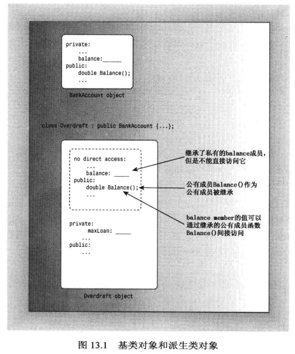
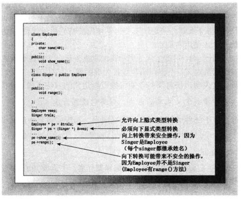
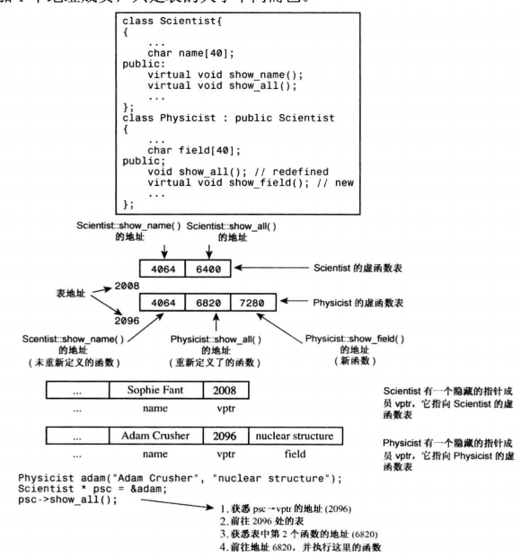

[TOC]

# Unit 5. 类继承

## 简介

面向对象编程的主要目的之一是提供可重用的代码。开发新项目时，重用经过测试的代码比重新编写代码要好得多，可以节省时间，避免在程序中引入错误。
传统的 C 函数库通过提供了一些函数的可重用性，如 strlen()、rand() 等函数。但函数库基本是不会提供源代码的，这就意味着无法根据自己特定的需求队函数进行扩展或修改，只能根据函数库的情况修改自己的程序。而且即使厂商提供了源代码，修改时也有一定的风险，如修改了函数的工作方式或改变了库函数之间的关系。
C++类提供了更高层次的重用性。目前，厂商提供类库，类库由类声明和实现构成。因为类包含数据表示和操作方法，因此提供了比函数库更完整的代码。通常，类库是以源代码的方式提供的，这意味着可以对其进行修改以满足需求。不过，C++提供了比修改代码更好的方法来扩展和修改类 —— 类继承。
继承能够从已有的类派生出新的类，而派生类继承了原有类(称为基类)的特征，包括方法。正如继承财产比自己白手起家更容易一样，通过继承派生的类通常比设计新类要容易得多。下面是通过继承可以完成的一些工作：

- 在已有类的基础上添加新功能；
- 给类添加数据；
- 修改类方法的实现。

当然，可以通过复制原有类的代码，然后对其进行修改来完成上述工作，但继承机制只需要提供新加的特性，而不需要访问源代码就可以派生出类。因此，如果类库中只提供了类方法的头文件和编译后的代码，依旧可以使用继承机制根据苦衷的类派生出新的类。这样可以在不公开代码实现的情况下将自己的类分享给别人，同时允许他们在类中添加新特性。 
从一个类派生出另一个类时，原有的类被称为基类，继承的类称为派生类。

### 一个简单的基类
首先声明一个简单的基类 —— Person：
```cpp
class Person {
private:
    std::string name;
    long authenciation_id;
public:
    Person(const std::string str, long id);
    ~Person();
    void doSomeThings() const;
    void walk() const;
};

Person::Person(const std::string str, long id) {
    name = str;
    authenciation_id = id;
}

Person::~Person() {
    std::cout << name << " destructor." << std::endl;
}

void Person::doSomeThings() const {
    std::cout << name << " do some things.\n";
}

void Person::walk() const {
    std::cout << name << " walk.\n";
}
```
### 派生一个类
从 Person 类派生一个 Student 类：
```cpp
class Student:public Person {

};
```
其中，冒号指出派生类 Student 的基类是 Person 类，public 表名 Person 是一个公有基类。派生类对象包含基类对象，使用公有派生可以让基类的公有成员称为派生类的公有成员；基类的私有部分也将称为派生类的一部分，但是只能通过基类的公有方法和保护方法来访问。
Student 对象将具有以下特征：

- 派生类对象存储了基类的数据成员(派生类继承了基类的实现)；
- 派生类对象可以使用基类的方法(派生类继承了基类的接口)。

因此，Student 对象可以存储 name 和 authenciation_id，还可以使用 doSomeThings() 和 walk() 方法。



派生类中需要添加什么？

- 派生类需要自己的构造函数；
- 派生类需要根据需要添加额外的数据成员和成员函数。


在这个例子中，Student 类将添加两个额外的数据成员 —— 学号(stu_id)和学院(college)，以及一个额外的成员函数 —— study()。

```cpp
class Student:public Person {
private:
    long stu_id; // 学号
    std::string college; // 学院
public:
    Student(const std::string name, long id, const std::string col, long s_id);
    Student(const Person & person, std::string col, long s_id);
    ~Student();
    void study() const;
};
```

### 派生类的构造函数

派生类的构造函数必须给新成员和继承的成员提供数据。在第一个 Student 的构造函数中，每个成员对应一个形参；在第二个构造函数中使用了一个 Person 的参数。
派生类不能直接访问基类的私有成员，必须通过基类方法进行访问。例如，Student 的构造函数不能直接设置继承自 Person 的成员(name 和 authenciation_id)，必须使用基类的公有方法来访问私有的基类成员。也就是说，派生类构造函数必须使用基类的构造函数。但是在穿件派生类对象时，程序首先创建基类对象，也就是说，在程序进入派生类构造函数之前，基类对象就已经创建完毕，因此以下代码不能初始化派生类对象中的基类成员：
```cpp
Student::Student(const std::string name, long id, const std::string col, long s_id) {
    Person(name, id);
    college = col;
    stu_id = s_id;
}
```
在初始化类内的 const 成员与类引用成员时也遇到相似的问题，是采用 C++ 提供的成员初始化列表来解决的。对于想要创建派生类对象之前初始化基类对象的问题，同样采用成员初始化列表来完成这个工作：
```cpp
Student::Student(const Person & person, std::string col, long s_id) : Person(name, id){
    college = col;
    stu_id = s_id;
}
```
其中 `:Person_(_name, id_)_`是成员初始化列表，它调用对应的 Person 构造函数。

Q：如果不调用基类的构造函数会怎么样？
A：如果不用成员初始化列表调用基类的构造函数，将会自动调用基类的默认构造函数，也就是说和下面的代码等价：
```cpp
Student::Student(const Person & person, std::string col, long s_id) : Person(){
    college = col;
    stu_id = s_id;
}
```
对于有默认构造函数的基类来说是可以这样写的，但是由于我们声明的 Person 类没有定义不接受参数的默认构造函数，因此这里会报错。

接下来看一下第二个构造函数的实现代码：
```cpp
Student::Student(const Person & person, std::string col, long s_id) : Person(person){
    college = col;
    stu_id = s_id;
}
```
这里讲 Person 对象传递给 Person 构造函数，将调用基类的复制构造函数，虽然基类没有定义复制构造函数，但是编译器会自动生成一个，因为这个类没有使用动态内存分配，因此不必担心会有问题。

派生类的构造函数的要点如下：

- 首先初始化基类对象；
- 派生类构造函数应通过成员初始化列表将基类信息传递给基类构造函数；
- 派生类构造函数需要初始化派生类新增的数据成员。

创建派生类对象时，程序首先调用基类构造函数，然后再调用派生类构造函数。基类构造函数负责初始化继承自基类的数据成员；派生类构造函数主要初始化新增的数据成员。释放对象的顺序与创建对象的顺序相反，即先执行派生类的析构函数，然后在执行基类的析构函数。

### 使用派生类

```cpp
int main() {
    using std::cout;
    using std::endl;
    Person p1 = Person("YouKa", 20220506);
    p1.doSomeThings();
    p1.walk();

    Student s1 = Student("MoZi", 20220507, "Computer", 202264);
    // 派生类调用基类方法
    s1.doSomeThings();
    s1.walk();
    // 派生类调用新增的成员函数
    s1.study();

    Student s2 = Student(p1, "Music", 202265);
    s2.doSomeThings();
    s2.walk();
    s2.study();
    return 0;
}
```
```cpp
YouKa do some things.
YouKa walk.
MoZi do some things.
MoZi walk.
MoZi study in Computer
YouKa do some things.
YouKa walk.
YouKa study in Music
YouKa destructor.
YouKa destructor.
MoZi destructor.
MoZi destructor.
YouKa destructor.
```

### 派生类和基类的关系

- 派生类对象可以使用基类的公有方法；
- 基类指针可以指向派生类对象(重点!)；
- 基类引用可以指向派生类对象。

需要注意的是，基类指针或引用虽然可以指向派生类对象，但是依旧只能调用基类的公有方法，不能调用派生类的新增的公有方法。
通常，C++要求引用和指针类型与赋给的类型向匹配，但是这一规则对继承来说是个例外。然而这种例外是单向的，即不可以用派生类指针或引用指向基类对象。
> 注：这里的指向表示的是隐式赋值，依旧可以将基类对象强制类型转换为派生类对象，并赋值给派生类指针或引用。

这个规则是有道理的。例如，如果允许基类引用指向派生类对象，则可以使用基类引用为派生类对象调用基类的方法，因为派生类继承了基类的方法，所以这样做不会出现问题。如果可以将基类对象隐式赋给派生类引用，派生类引用调用派生类的方法时就会出现问题。

基类的引用或指针允许指向派生类对象会出现一些有趣的结果：

- 如果某个函数的参数是基类的引用或者指针，则该函数可以接收基类对象，也可以接受派生类对象；
- 学习虚函数之后，可以调用派生类重写后的函数。

### 继承：is-a 关系

派生类和基类之间的特殊关系是基于C++继承的底层模型的。实际上，C++有3种继承方式：公有继承、保护继承和私有继承。其中公有继承是最常用的方式，它建立一种 is-a 关系，即派生类对象也是一个基类对象，可以对基类对象执行的任何操作，也可以对派生类对象执行。因为派生类可以添加新特性，所以这种关系被称为 is-a-kind-of(是一种)关系更准确，但专业术语是 is-a。

来看一些不符 is-a 关系的例子。
公有继承不建立 has-a 关系，例如午餐可能包括水果，但通常午餐并不是水果，所以不能通过从 Fruit 类派生出 Lunch 类来在午餐中添加水果，在午餐中添加水果的正确方法是将其作为一种 has-a 关系：午餐中有水果。因此最容易的方式是将 Fruit 类对象作为 Lunch 类的数据成员。
公有继承不建立 is-like-a 关系，例如，荷花像一把把伞，但是荷花并不是伞，因此，不应从 Umbrella 类中派生 Lotus 类。继承可以在基类的基础上添加属性，但不能删除基类的属性。在有些情况下，可以设计一个包含共有特征的类，然后以 is-a 或 has-a 的关系，在这个类的基础上定义相关的类。
公有继承不建立 is-implemented-as-a(作为...来实现)的关系。例如，可以使用数组来实现栈，但从 Array 类派生出 Stack 类是不合适的，因为栈不是数组。另外，可以用其他方式实现栈，例如链表。正确的方法是，通过让栈包含一个私有的 Array 对象成员来隐藏数组实现。
公有继承不建立 use-a 关系。例如，计算机可以使用打印机，但从 Computer 类派生出 Printer 类是没有意义的。正确方法是，可以通过友元函数或类来处理 Printer 对象和 Computer 对象之间的通信。
在 C++ 中完全可以使用公有继承来建立 has-a、is-implemented-as-a 或 use-a 关系，然而这样做通常会导致编程方面的问题。因此，还是坚持使用 is-a 关系吧。

## 多态与虚函数

### 什么是多态？

- 从字面意思来讲，多态的意思很简单就是多种形态的意思。
- 教材中对多态的描述是：不同对象调用相同函数时，执行不同的动作。
- 从代码的角度讲，就是对于一个函数名有多个实现，并且可以用相同的方式调用这些实现不同的同名函数。在代码中对多态的实现又分为两种：
   - 函数重载 overload：同一作用域、函数名相同、参数特征标不同。仅返回值类型不同不构成重载。
   - 函数重写(覆盖) override：派生类、函数名相同、特征表相同。派生类返回值类型“小于等于”基类返回值类型。

函数重载我们应该已经很熟悉了，在没有接触面向对象编程之前就在学习函数时学过了，学习类的知识时也有使用，比如构造函数的重载、运算符重载。重载可以通过为同名函数传递不同的参数来执行不同的实现，这就是多态。
函数重写是我们本节学习的重点。

### 背景

对于简单的继承，派生类直接继承基类的方法，不做任何修改。然而，可能会遇到这样的情况：即希望同一个方法在派生类和基类中的行为是不同的。换句话来说，方法的行为应取决于调用该方法的对象，这种较复杂的行为被称为多态 —— 具有多种形态，即调用同一个方法(同名函数)会根据调用该方法的对象的不同而执行不同的任务。C++有两种重要的机制用于实现多态：

- 使用虚方法；
- 派生类中重新定义基类的方法。

接下来看一个实例来了解这两种机制。

### 实例：银行账号

现在来看另一个例子。为银行开发两个类，一个类是用于表示基本支票账户 —— Brass，另一个类是用来表示 Brass Plus 支票账户，它添加了透支特性。也就是说，如果用户支付超出其存款金额的支票，但是超出的金额不能很大，银行将同意支付这张支票，对超出的部分收取额外的费用。可以根据要保存的数据以及允许执行的操作来确定这两种账户的特征。
Brass 类：

- 信息：
   - 客户姓名；
   - 账号；
   - 当前余额。
- 操作：
   - 创建账户；
   - 存款；
   - 取款；
   - 显示账户信息。

BrassPlus 类：

- 信息：
   - 透支上限；
   - 透支部分贷款利率；
   - 当前透支的总额。
- 操作(有两种操作的实现不同)：
   - 对于取款操作，必须考虑透支保护；
   - 显示操作必须显示 BrassPlus 账户的其他信息；
   - 修改贷款相关信息。

BrassPlus 应该从 Brass 公有派生吗？要回答这个问题需要先回答另一个问题 —— BrassPlus 类是否满足 is-a 条件？当然满足，BrassPlus 对象是一个 Brass 对象。它们都将保存客户姓名、账号、余额，使用这两个类都可以存款、取款和显示账户信息。

#### 类声明

```cpp
#ifndef BRASS_H_
#define BRASS_H_

#include <string>

class Brass {
private:
    std::string name; // 用户名
    long account; // 账号
    double balance; // 余额
public:
    Brass(const std::string & n = "Null", long ac = -1, double b = 0.0) : name(n), account(ac), balance(b) {}
    void deposit(double money); // 存款
    double getBalance() const { return balance; } // 获取余额
    virtual void withdrawal(double money); // 取款
    virtual void show() const;
    virtual ~Brass() {}
};

class BrassPlus : public Brass {
private:
    double maxLoan; // 贷款上限
    double rate; // 利率
    double totalLoan; // 可贷款的总额
public:
    BrassPlus(const std::string & n = "Null", long ac = -2, double b = 0.0, double ml = 500, double r = 0.1125) : Brass(n, ac, b), maxLoan(ml), rate(r), totalLoan(0) {}
    BrassPlus(const Brass & b, double ml = 500, double r = 0.1125) : Brass(b), maxLoan(ml), rate(r), totalLoan(0) {}
    virtual void withdrawal(double money);
    virtual void show() const;
    void setMaxLoan(double m) { maxLoan = m; }
    void setRate(double r) { rate = r; }
    void setTotalLoad() { totalLoan = 0; }
};

#endif // BRASS_H_
```

- BrassPlus 类在 Brass 类的基础上添加了3个私有数据成员和3个公有成员函数；
- Brass 类和 Brass Plus 类虽然都声明了 withdrawal() 和 show() 函数，但它们的具体实现是有所不同的；
- 在声明 withdrawal() 和 show() 函数时使用了新关键字 virtual，表示这些方法被声明为虚方法；
- Brass 类声明了一个虚析构函数，虽然该析构函数不执行任何操作。

关于第二点，Brass 和 BrassPlus 中的两个 show() 原型表明将有两个独立的方法定义。基类 Brass 版本的限定名为 Brass::show()，派生类 BrassPlus 版本的限定名为 BrassPlus::show()。程序将根据调用 show() 的对象类型来确定使用哪个版本。withdrawal() 同理。而两个行为相同的方法，如 deposit() 和 getBalance() 则只需要在基类中声明即可。
关于第三点使用 virtual 关键字，如果函数是通过引用或指针而不是对象调用的，它将确定使用哪一种函数(是基类的还是派生类的)。如果没有使用 virtual，程序将根据引用类型或指针类型调用对应的方法，此时基类引用或指针调用函数时调用的是基类的函数，哪怕基类引用或指针指向派生类对象；如果使用 virtual，程序将根据引用或指针指向的对象类型来选择函数，如果基类引用或指针指向派生类对象，此时用基类引用或指针调用函数将会调用派生类的函数，而不是基类的函数，这就是 virtual 的作用。
虚函数的这种行为非常方便，因此常在基类中将派生类会重新定义的方法声明为虚方法。方法在基类中被声明为虚的后，它在派生类中将自动成为虚方法。不过在派生类声明中显式使用关键字 virtual 来指出那些函数是虚函数是一个很好的习惯。
关于第三点，基类声明了一个虚析构函数，这样是为了确保释放派生对象时按照正确的顺序调用析构函数。可以在后面介绍完虚函数的知识之后回过来思考下这个问题。
> 注意：如果要在派生类中重新定义基类的方法，通常应将基类方法声明为 virtual，这样程序可以根据对象类型而不是引用或指针的类型来选择方法。为基类声明一个虚析构函数也是一种惯例。

#### 类实现

```cpp
#include "Brass.h"
#include <iostream>
// Brass Methods
void Brass::deposit(double money) { // 存款
    if(money < 0) {
        std::cout << "Failed. Negative deposit not allowed." << std::endl;
        return;
    }
    balance += money;
    std::cout << "Success. " << name << " deposits $" << money << ".\n";
}

void Brass::withdrawal(double money) { // 取款
    if (money < 0)
        std::cout << "Failed. Negative withdrawal not allowed." << std::endl;
    else if (money > balance)
        std::cout << "Failed. Withdrawal amount of $" << money << " exceeds your balance($"<< balance <<").\n";
    else {
        balance -= money;
        std::cout << "Success. " << name << " Withdrawal $" << money << ", Left $" << balance << ".\n";
    }
}

void Brass::show() const {
    std::cout << "Account: " << account << std::endl;
    std::cout << "UserName: " << name << std::endl;
    std::cout << "Balance: " << balance << std::endl;
}

// BrassPlus Methods
void BrassPlus::withdrawal(double money) { // 取款
    double balance = getBalance();
    if (money <= balance) {
        Brass::withdrawal(money);
    } else if (money > balance + maxLoan - totalLoan) { // 取款大于(存款 + 剩余可贷款额度)
        std::cout << "Failed. Withdrawal $" << money << " exceeds upper limit.\n";
    } else {
        // 先向银行借款
        deposit(money - balance);
        // 算上利息共需要还银行的钱
        totalLoan += balance * (1.0 + rate);
        // 然后再取款
        Brass::withdrawal(money);
    }
}

void BrassPlus::show() const {
    Brass::show();
    std::cout << "Max Loan: " << maxLoan << std::endl;
    std::cout << "Total Loan: " << totalLoan << std::endl;
    std::cout << "Rate: " << rate << std::endl;
}
```
派生类不能直接访问基类的私有成员，必须通过基类的公有方法才能访问这些数据。访问的方法取决于方法：派生类的构造函数通过成员初始化列表来设置基类的私有数据成员，参考 BrassPlus 的构造函数；派生类的成员函数可以通过基类公有成员函数的限定名来调用派生类会重写的基类公有成员函数，对于在派生类中没有被重写的函数可以直接使用非限定名来访问其私有成员，参考 BrassPlus 的 show() 和 withdrawal()。在 withdrawal() 的实现中，getBalance() 是基类中定义的公有接口，在派生类中没有被重写，因此可以直接使用非限定名，而基类的 withdrawal() 在派生类中被重写了，因此想调用基类的 withdrawal() 必须使用限定名，否则编译器会认为调用的是派生类的 withdrawal()，这样派生类的 withdrawal() 就变成了递归函数，并且没有终止条件。

#### 使用类

```cpp
int main() {
    using std::cout;
    using std::endl;

    Brass b1("Peppa", 220614, 4000.0);
    BrassPlus bp1("George", 220615, 2000.0);
    b1.show();
    cout << endl;
    bp1.show();
    cout << endl;

    // 指向派生类对象的基类指针
    Brass * p_b1 = &bp1;
    p_b1->show(); // 虽然p_b1是基类指针, 但这里会调用派生类的show(), 而不是基类的show()
    cout << endl;

    b1.withdrawal(4200);
    b1.withdrawal(2000);

    bp1.withdrawal(1000);
    bp1.withdrawal(1100);
    bp1.withdrawal(600);

    b1.show();
    cout << endl;
    bp1.show();
    cout << endl;
}
```
```cpp
Account: 220614
UserName: Peppa
Balance: 4000

Account: 220615
UserName: George
Balance: 2000
Max Loan: 500
Total Loan: 0
Rate: 0.1125

Account: 220615
UserName: George
Balance: 2000
Max Loan: 500
Total Loan: 0
Rate: 0.1125
    
Failed. Withdrawal amount of $4200 exceeds your balance($4000).
Success. Peppa Withdrawal $2000, Left $2000.
Success. George Withdrawal $1000, Left $1000.
Success. George deposits $100.
Success. George Withdrawal $1100, Left $0.
Failed. Withdrawal $600 exceeds upper limit.
Account: 220614
UserName: Peppa
Balance: 2000

Account: 220615
UserName: George
Balance: 0
Max Loan: 500
Total Loan: 1112.5
Rate: 0.1125
```

### 虚函数

#### 什么是虚函数？

在类声明中使用 virtual 关键字修饰的类成员函数被称为虚函数。virtual 关键字只能出现在类声明中，在实现类成员函数时的函数定义(函数实现)处不能出现 virtual，也就是说类外不能出现 virtual。

#### 虚函数有什么用？

用一句话总结虚函数的作用就是：当基类指针或引用指向派生类对象，并且派生类中重写了基类中的虚函数，此时使用指针或引用去调用虚函数是调用派生类的函数实现，而不是调用基类的实现。例如：
```cpp
// BrassPlus继承了Brass类, 并重写了Brass类的show()
class Brass {
public:
    // Brass类将show()函数声明为虚函数, 表示子类可以重写该函数
    virtual void show() const { std::cout << "Brass::show();" << std::endl; }
};

class BrassPlus : public Brass{
public:
    // BrassPlus类重写了父类的show()函数
    virtual void show() const { std::cout << "BrassPlus::show();" << std::endl; }
};

int main() {
    BrassPlus bp;
    Brass b = bp; // 基类对象
    Brass & r_b = bp; // 指向派生类的基类引用
    Brass * p_b = &bp;// 指向派生类的基类指针
    b.show(); // 输出 "Brass::show();"
    r_b.show(); // 输出 "BrassPlus::show();"
    p_b->show(); // 输出 "BrassPlus::show();"
    return 0;
}
```

#### 静态联编和动态联编

**Q：C++支持函数重载和重写，在调用某个函数时到底是执行那个函数？**
这个问题是由编译器负责处理。将代码中的函数调用解释为执行特定的函数代码块的过程被称为**函数名联编**。在 C 语言中，这非常简单，因为 C 语言不支持函数重载和重写，所以每个函数名都对应一个不同的函数。在C++中，由于函数重载的原因，代码中可以有同名的函数，编译器必须查看函数参数以及函数名才能确定使用哪个函数。不过，C/C++编译器可以在编译过程中完成这种联编。**这种在编译过程中进行的联编被称为静态联编，又称为早期联编**。
然而，虚函数使这项工作变得更困难了，因为基类指针或引用调用的是那个虚函数不是在编译过程能确定的，所以编译器必须能在程序运行时选择正确的虚函数的代码，**这种在程序运行中进行联编被称为动态联编，又称为晚期联编**。
> 函数重载是静态联编，函数重写是动态联编。Java 中常称为编译时多态和运行时多态。

```cpp
BrassPlus bp;
Brass * pb;
bp = &bp;
bp->show();
```
**静态联编**：如果在基类中没有将 show() 声明为虚的，则`bp->show()`将因为指针指向的类型是 Brass 而调用`Brass::show()`。而指针类型是在编译期已知的，因此编译器在编译时可以将 show() 关联到`Brass::show()`，即编译器对非虚函数使用静态联编。
**动态联编**：如果在基类中将 show() 声明为虚的，并且派生类中重写了 show()，则`bp->show()`将根据对象类型(BrassPlus)调用`BrassPlus::show()`，通常只有在运行程序时才能知道指针指向的对象的类型，所以编译器生成的代码将在程序执行时，根据对象类型将 show() 关联到`Brass::show()`或`BrassPlus::show()`，即编译器对虚函数使用动态联编。
在大多数情况下，动态联编很好，因为它让程序能够选择为特定类型设计的方法。

**Q：既然动态联编很好，为什么不只使用动态联编？为什么默认联编是静态联编？**
如果静态联编让您能重写类方法，而静态联编在这方面表现很差，为什么不放弃使用静态联编呢？原因有两个，效率和概念模型。
首先是效率。为了使程序能够在运行阶段确定使用那个函数，必须采用一些方法来跟踪基类指针或引用指向的对象类型，这增加了额外的处理开销(稍后将介绍一种动态联编实现原理)。如果类不会用作基类，或者其派生类不会重写基类的任何方法，就不需要用动态联编，这种情况下，使用静态联编更合理，它的效率更高。正是由于静态联编效率更高，因此被设置为C++的默认方式。因此，仅当程序设计确实需要虚函数时，才使用动态联编。
> C++的指导原则之一是，不要为不使用的特性付出代价(内存空间或处理时间)。

接下来看概念模型。在类设计时，可能还会包含一些不需要在派生类重写的成员函数。这些成员函数不能改被设置为虚函数，这有两方面好处：首先效率更高，其次指出该函数不会被派生类重写。因此，在设计类时，仅将那些预期中将被派生类重写的函数声明为 virtual 函数。
> 如果要在派生类中重新定义基类的函数，则将它声明为虚函数；否则，声明为非虚函数。

当然，在设计类时，方法属于那种情况有时并不那么明显，类设计不是一个线性过程。

#### 向上转型和向下转型

在C++中，动态联编与通过指针和引用调用方法相关，从某种程度上说，这是由继承控制的。
**向上类型转换**：通常，C++不允许将一种类型的地址赋值给另一种类型的指针，也不允许一种类型的引用指向两一种类型。但继承除外，C++允许基类指针指向派生类对象，或基类引用指向派生类对象，而不必进行显式类型转换。例如，下面的初始化是被允许的：
```cpp
// BrassPlus 是 Brass 派生类
BrassPlus bp1("YouKa", 220616);
Brass * p_b = &bp1;
Brass & r_b = &bp1;
```
**将派生类的引用或指针转换为(赋值给)基类引用或指针被称为向上类型转换，简称向上转型**。向上类型转换使公有继承不需要进行显式类型转换。BrassPlus 对象都是 Brass 对象，因为它继承了 Brass 对象所有的数据成员和成员函数。所以 Brass 对象执行的任何操作，BrassPlus 对象都可以执行。因此，参数为 Brass 引用或指针的函数一样可以处理 BrassPlus 对象，因为向上类型转换是隐式的，可以自动进行。向上转型是可以传递，也就是说，如果 BrassPlus 派生出一个 BrassPlusPlus 类的话，Brass 指针或引用可以引用 Brass 对象、BrassPlus 对象或 BrassPlusPlus 对象。

**向下类型转换**：和向上类型转换相反的过程是 —— 将基类指针或引用转换为(赋值给)派生类指针或引用，这被称为向下类型转换。和向上转型不同，向下转型必须显式使用，不允许隐式转换。原因在于 is-a 关系通常不可逆。BrassPlus 对象一定是一个 Brass 对象，而 Brass 对象不一定是 BrassPlus 对象。派生类可以新增数据成员，使用这些数据成员的类成员函数不能应用于基类，不然就会出现错误。


#### 虚函数工作原理

C++规定了虚函数的行为，但将实现方法留给了编辑器作者。不需要知道实现方法就可以使用虚函数，但了解虚函数的工作原理有助于更好地理解虚函数。
通常，编辑器处理虚函数的方法是：给每个对象添加一个隐藏的数据成员，这个隐藏成员是一个指针，它指向虚函数表的地址。虚函数表(virtal function table, vtbl)中存储了为类对象声明的虚函数的地址。
例如，基类对象包含一个指向虚函数表的指针，派生类对象也将包含一个指向派生类虚函数表的指针。这样对于类结构来说，基类和派生类都只增加了一个存储指针的空间，只是基类和派生类的这个指针成员指向的虚函数表的大小不同。如果派生类没有重写基类的虚函数，派生类的虚函数表(vtbl)将保存该函数的原始版本(基类)的地址。如果派生类重写了虚函数，派生类的虚函数表将保存新版本(派生类)的函数地址。如果派生类定义了新的虚函数，则该地址会被添加到虚函数表中。
> PS：无论类中包含的虚函数是1个还是10个，都只需要在对象中添加一个指针成员，只是该成员指向的虚函数表的大小不同而已。


调用虚函数时，程序将查看存储在对象中的指向虚函数的指针，然后找到相应的虚函数表。如果调用的是类声明中的第一个虚函数，则程序将使用虚函数表中的第一个函数地址，并去执行该地址的函数。如果调用的是类声明中的第三个虚函数，则程序将使用虚函数表中的第三个函数地址，并执行该地址的函数。
使用虚函数在内存和执行速度上有一定的成本，这个成本包括：

- 每个对象的存储空间都将增大，增大量为存储虚函数表地址的空间，即一个指针的大小；
- 对于每个类，编辑器都将创建一个虚函数表(数组)；
- 对于每个函数调用，都需要执行一项额外的操作，即到虚函数表中查找地址。

#### 为什么基类析构函数要声明为 virtual？

学习了虚函数的相关知识之后，我们再来看看在银行账号这个实例中为什么基类 Brass 的析构函数需要声明为虚函数。首先，看下面的这一段代码：
```cpp
Brass * p_b2 = new BrassPlus("YouKa", 220616, 2000.0);
delete p_b2;
```
如果基类的析构函数不声明为 virtual，对于让 Brass 指针指向一个 new 生成的 BrassPlus 对象，在使用 delete 释放的时候将调用 Brass 的析构函数。
而将基类的析构函数声明为 virtual，释放 Brass 指针指向的内存时将调用 Brass 指针指向的对象类型的析构函数。所以`delete p_b;`将调用 BrassPlus 的析构函数，然后在调用 Brass 的析构函数。
因此，基类使用虚析构函数可以确保正确的析构函数被调用。在本例中，因为 BrassPlus 的析构函数什么也不做，这种行为不是很重要。然而，一旦派生类的析构函数需要完成某个操作，比如释放 new 申请的内存，那么基类的析构函数必须声明为 virtual，不然很容易出现内存泄漏的问题。

#### 虚函数的注意事项

用 virtual 修饰类声明中的函数声明，可以将类的成员函数声明为虚函数。

- 不能声明为 virtual 的函数：
   - **普通函数和友元函数**一定不能被声明为虚函数。因为只有类的成员函数才能被声明为虚函数，而友元函数虽然是出现在类声明中，但是友元函数并不是类的成员函数，而是普通函数。
   - **构造函数**一定不能是虚函数。创建派生类对象时，将调用派生类的构造函数，而不是基类的构造函数。派生类的构造函数将使用基类的构造函数，这种顺序不同于继承机制。因此，派生类不继承基类的构造函数，所以类构造函数声明为虚函数并没有什么意义。
   - **静态成员函数**一定不能是虚函数。静态成员函数是属于类的，而不是某个对象。
   - **内联函数**不能是虚函数。如果内联函数被virtual修饰，计算机会忽略inline使它变成存粹的虚函数。
- 需要声明为 vritual 的函数：
   - 对于基类来说，应该将那些要在派生类中重写的函数声明为虚函数；
   - 基类的析构函数应该被声明为虚函数，即使基类并不需要析构函数。这样在涉及到动态内存分配时才能避免错误；
- 重点！如果使用指向对象的引用或指针来调用虚函数，程序将根据对象类型调用函数，而不是引用或指针类型调用函数。这称为动态联编或晚期联编，是运行时的多态。这种行为非常重要，因为这样基类指针或引用可以指向派生类对象。

**静态成员函数为什么不能是虚函数？**
当调用一个对象的非静态成员函数时，系统会把该对象的起始地址赋给成员函数的this指针。
```cpp
class A {
public:
    void f1(int i);
    // void f1(A * this, int i);
}
```
普通的成员函数其实隐式传递了一个指向本类对象的指针 —— this，因此类 A 中定义的`void f1(int i);`实际上的参数列表应该是`void f1(A * this, int i);`。

静态成员函数并不属于某一对象，它与任何对象都无关，因此静态成员函数不会隐式传递 this 指针。可以说，静态成员函数与非静态成员函数的根本区别是：非静态成员函数有 this 指针，而静态成员函数没有 this 指针。由此决定了静态成员函数不能访问本类中的非静态成员。
虚函数是通过在类中隐式声明一个指向虚函数表的指针成员，该指针在创建对象时通过构造函数对其进行初始化，和 this 指针关系密切，因此静态函数不能是虚函数。

同理还有静态函数不能是 const 函数。因为 const 函数实际上是在隐式传递的 this 参数上用 const 修饰，而静态函数没有 this 指针，也就没办法给 this 指针加上 const 关键字：
```cpp
class A {
public:
    void f1(int i) const;
    // void f1(const A * this, int i);
}
```

**派生类没有重写基类虚函数会怎么样？**
如果派生类没有重写基类的虚函数，派生类将使用该函数的基类版本。如果派生类位于派生链中，则使用最新的虚函数版本，例外情况是基类版本是隐藏的。

**派生类隐藏基类同名函数**
假设编写了以下代码：
```cpp
class Base {
public:
    virtual void f1(int arg1) { std::cout << "Base::f1(int)" << std::endl; }
    virtual void f1(int arg1, int arg2) { std::cout << "Base::f1(int, int)" << std::endl; }
    void f1(int arg1, int arg2, int arg3) { std::cout << "Base::f1(int, int, int)" << std::endl; }
};

class BasePlus : public Base {
public:
    virtual void f1(int) { std::cout << "BasePlus::f1(int)" << std::endl; }
//    void f1() { std::cout << "BasePlus::f1()" << std::endl; }
};
```
在基类 Base 中定义了两个 f1 虚函数，以及一个 f1 非虚函数，在派生类 BasePlus 中重写了基类的 f1(int)，此时编写以下代码：
```cpp
BasePlus bp;
bp.f1(1); // valid, BasePlus::f1(int)
bp.f1(1, 2); // 报错, 因为基类的f1(int, int)被隐藏了
bp.f1(1, 2, 3); // 报错, 因为基类的f1(int, int, int)被隐藏了
```
不光是重写基类的函数，在派生类中重新定义了 f1(void) 同样会隐藏基类中的同名函数。这就引出两条经验规则：

- 如果要重写基类的函数，需要确保重写的函数与原来基类的函数原型完全一致。但如果基类函数返回的是指向基类的指针或引用，则派生类重写时可以修改为指向派生类的指针或引用。这种特性被称为返回类型协变，因为允许返回类型随类型的变化而变化。
- 如果在派生类中重新定义了一个和基类函数同名的函数，则应该在派生类中重新定义所有同名函数的基类版本。如果只定义一个版本，则其他版本会被隐藏，派生类对象将无法直接使用，但是可以通过基类名+作用域解析符来使用。
> PS：这里的重新定义包括重写和重载。

```cpp
BasePlus bp;
bp.f1(1); // valid, BasePlus::f1(int)
bp.f1(1, 2); // 报错, 因为基类的f1(int, int)被隐藏了
bp.f1(1, 2, 3); // 报错, 因为基类的f1(int, int, int)被隐藏了
bp.Base::f1(1, 2); // valid
bp.Base::f1(1, 2, 3); // valid
```

### 难点：重载、重写、隐藏

#### 重载

- **在同一个范围(作用域)内，例如在同一个类中**；
- **函数名相同，参数特征标不同(类型、数目、顺序)**；
- 返回值类型可以相同也可以不同，仅仅返回值类型不同不构成函数重载；
- 与 virtual 关键字无关。

函数重载的工作原理是，编译器会对重载函数在编译时有一个重命名的过程，其命名规则为：作用域+返回类型+函数名+参数列表。
#### 重写 or 覆盖

- **重写函数与被重写函数分别位于派生类与基类中(不在同一个范围内)**；
- **函数名相同，参数特征标相同(类型、数目、顺序)**；
- **派生类的返回值类型必须小于等于基类返回值类型**，即派生类重写函数的返回值类型如果和基类被重写函数的返回值类型不同，那么必须是基类被重写函数返回值类型的派生类。
- **基类函数必须带有 virtual 关键字**。

函数重写的工作原理是虚函数表，在类中会有一个指向虚函数表的隐藏成员(占一个指针的大小)。

#### 隐藏

隐藏的定义是派生类的函数屏蔽了与其同名的基类函数。

- **分别位于派生类与基类中(不在同一个范围内)**；
- 不论基类函数是否为虚函数，只要派生类有与其同名但不同参的函数，该基类函数在派生类中将被隐藏。
- 对于非虚函数的基类函数，如果有派生类函数与此基类函数同名同参，此时该基类函数在派生类中将被隐藏。
> PS：如果基类的虚函数在派生类中有同名同参的函数，那就是重写，而不是隐藏。

如果基类函数在派生类中被隐藏，可以通过全限定名来调用。

### 纯虚函数与抽象类

#### 纯虚函数

**什么样的函数是纯虚函数？**
C++中的纯虚函数，一般在函数原型后使用`=0`作为此类函数的标志。Java、C# 等语言中，则直接使用 abstract 作为关键字修饰这个函数签名，表示这是抽象函数(纯虚函数)。
```cpp
class Father {
public:
    virtual void f() = 0;
}
```
**纯虚函数是干什么的？**
纯虚函数是一种特殊的虚函数，在许多情况下，在基类中不能对虚函数给出有意义的实现，而把它声明为纯虚函数，它的实现留给该基类的派生类去做。这就是纯虚函数的作用。
纯虚函数也可以叫抽象函数，一般来说它只有函数名、参数和返回值类型，**不需要函数体**。这意味着它没有函数的实现，需要让派生类去实现。
> PS：即使给出了纯虚函数的实现，编译器也不会识别的。

#### 抽象类

抽象类的知识其实只需要记住两点。首先，抽象类是类声明中至少有一个成员函数是纯虚函数的类。其次，抽象类不能被实例化，即抽象类不能直接创建对象。
关于第二点，因为抽象类中有一个纯虚函数，而纯虚函数是没有函数定义的，如果可以直接创建抽象类的对象，那么抽象类对象调用这个纯虚函数的时候，编译器找不到该函数的实现部分，因此抽象类并不能拥有对象。
抽象类实际上是声明了一个“接口”，其所有的派生类都需要实现这个接口。
> 抽象类的知识点很少，因此在学校的考试中考察的不是很多，更多情况下都是考察虚函数和多态的知识。但抽象类在实际开发中是很常见的，可能在刚接触的时候没办法理解使用抽象类的好处在哪里，这就需要多看多练。

## 访问控制：protected

到目前为止，我们学习的访问控制关键字只有 private 和 public，这两个关键字可以控制类成员的访问权限。其实还存在另一个访问控制关键字 —— protected。

protected 权限特点：
- protected 与 private 关键字类似，在类外只能通过 public 类成员函数来访问类的 protected 数据成员和成员函数。
- protected 与 private 区别只有在派生类中才会体现出来。派生类的成员可以直接访问基类的保护成员，但不能直接访问基类的私有成员。

因此，对于外部世界来说，类的保护成员与私有成员是一样的，都不能直接访问，必须通过公有成员函数间接访问；但对于派生类来说，保护成员与公有成员是一样的，都可以在派生类中直接访问。
```cpp
class A {
protected:
    int value;
public:
    int getValue() const { return value; }
    bool setValue(int v) { value = v; return true; }
};

class B : public A {
public:
    void f(int v);
};

void B::f(int v) {
    value = v;
}
```
类 A 中将 value 声明为 protected，在其派生类 B 中可以在 f() 函数中直接访问基类的 protected 成员(value)。如果在类 A 中将 value 声明为 private，则在派生类 B 中只能使用类 A 提供的 public 函数间接访问。
使用保护数据成员可以简化派生类代码的编写工作，但存在设计缺陷。例如上例中，类 A 的设计是希望数据成员 value 只能通过 setValue() 修改。但对于类 B，f() 函数将忽略类 A 对 value 数据的保护。
因此，对于类的数据成员推荐使用私有访问控制，在派生类中通过基类的公有函数访问基类数据。保护访问控制更多的是用于成员函数上，它让派生类能够访问公众不能使用的内部函数。

## 继承与动态内存分配
在类设计中，涉及动态内存分配时需要考虑的比较多，比如是否重新定义赋值和复制构造函数，是否重新定义析构函数？那么继承是如何与动态内存分配进行互动的呢？例如，如果基类使用动态内存分配，并重新定义了赋值和复制构造函数，这将怎样影响派生类的实现？这个问题的答案取决于派生类的情况。

### 第一种情况：派生类不用 new

假设在基类中使用了动态内存分配，而派生类中没有使用动态内存分配，例如：

```cpp
// Base Class Using DMA(Dynamic Memory Allocation)
class BaseDMA {
private:
    char * str;
    int num;
public:
    BaseDMA(const char * s = "null", int num = 0);
    BaseDMA(const BaseDMA & rbd); // copy constructor
    virtual ~BaseDMA();
    BaseDMA & operator=(const BaseDMA & rbd); // assignment operator
};

class NoDMA : public BaseDMA {
private:
    int nums[10];
public:
    // ...;
};
```

在基类 BaseDMA 中包含了构造函数在使用 new 时需要的特殊方法：复制构造函数、重载赋值运算符和析构函数。
从 BaseDMA 派生出来的 NoDMA 类并不使用 new，那么需要为 NoDMA 定义复制构造函数、重载赋值运算符和显式析构函数吗？答案是并不需要。
首先，来看是否需要定义复制构造函数。在之前介绍过，默认的复制构造函数是对成员进行复制，而成员复制是根据数据类型采用相应的复制方式。例如，将 int 类型的成员复制到 int 中是通过常规的赋值来完成的，而复制 class 成员或派生类的基类部分时，是使用该类的复制构造函数完成的。因此，NoDMA 的默认复制构造函数使用 BaseDMA 的显式复制构造函数来复制 NoDMA 对象的 BaseDMA 部分。所以，默认复制构造函数对于 NoDMA 来说是正确的，同时对于继承的 BaseDMA 部分来说也是 OK 的。
其次，对于赋值来说也是如此。类的默认赋值运算符将自动使用基类的赋值运算符来对基类部分进行赋值，对派生类新增的成员根据其数据类型采用相应的复制方式。因此，默认赋值运算符也是合适的。
接着来看是否需要显式析构函数。如果没有定义析构函数，编译器将定义一个不执行任何操作的默认构造函数。而这个默认构造函数会执行完自身代码之后调用基类的析构函数。因此，NoDMA 使用默认析构函数是合适的。
事实上，派生类的这些属性也适用于本身是对象的类成员。例如，我们可以在类中使用 string 类对象代替 char 数组来存储字符串。C++的 string 类也采用了动态内存分配，对于使用 string 对象作为类成员的类来说，它们的默认复制构造函数将使用 string 类的复制构造函数来复制 string 成员；它们的默认赋值运算符将使用 string 的赋值运算符给 string 成员赋值；它们的析构函数将自动调用 string 类的析构函数。

### 第二种情况：派生类使用 new

假设在基类中使用了动态内存分配，并且派生类中也使用了动态内存分配，例如：

```cpp
class HasDMA : public BaseDMA {
private:
    char * strArr;
public:
    // ...;
};
```

在这种情况下，必须为派生类定义复制构造函数、赋值运算符和显式析构函数。下面依次考虑这些方法的实现。

首先，复制构造函数。基类 BaseDMA 的复制构造函数遵循用 new 创建 char 数组的常规模式，即先使用 strlen() 计算存储 C 风格字符串所需的空间，以便于为其分配足够的空间(strlen 返回值 +1) 并通过 strcpy() 函数将原始字符串复制到目的地：

```cpp
BaseDMA::BaseDMA(const BaseDMA &rbd) {
    str = new char [std::strlen(rbd.str) + 1];
    std::strcpy(str, rbd.str);
    num = rbd.num;
}
```

派生类 HasDMA 的复制构造函数只能直接访问 HasDMA 的数据，因此它必须通过成员初始化列表来调用 BaseDMA 复制构造函数来处理基类的数据：

```cpp
HasDMA::HasDMA(const HasDMA &rhd) : BaseDMA(rhd) {
    strArr = new char [std::strlen(rhd.strArr) + 1];
    std::strcpy(strArr, rhd.strArr);
}
```

需要注意的是，成员初始化列表将一个 HasDMA 的引用传递给 BaseDMA 的构造函数，而 BaseDMA 没有参数是`const HasDMA &`类型的构造函数，实际上也确实不需要声明这样的构造函数。因为 BaseDMA 有一个参数是`cosnt BaseDMA &`类型的复制构造函数，而基类引用可以指向派生类对象(向上转型)。

> 这也体现了向上转型的一个好处，可以减少我们重复的代码。如果没有向上转型，我们就需要编写一个参数是 const BaseDMA & 的构造函数和一个参数是 const HasDMA & 的构造函数。而有了向上转型，我们只需要编写一个参数是 const BaseDMA & 的构造函数。

其次，重载赋值运算符。基类 BaseDMA 的赋值运算符也遵循常规模式：

- 判断是否是自己给自己赋值；
- 释放 new 分配的内存；
- 重新分配足够的内存，并复制值。

```cpp
BaseDMA & BaseDMA::operator=(const BaseDMA &rbd) {
    if(this == &rbd)
        return *this;

    delete[] str;
    str = new char [std::strlen(rbd.str) + 1];
    strcpy(str, rbd.str);
    num = rbd.num;
    return *this;
}
```
  
派生类 HasDMA 也使用了动态内存分配，所以它也需要一个显式赋值运算符。而 HasDMA 的成员函数 operator=() 只能访问 HasDMA 的数据，不能直接访问基类 BaseDMA 的数据。但派生类的显式赋值运算符又必须负责继承的 BaseDMA 部分的赋值，此时可以通过显式调用基类的赋值运算符来完成这项工作：
  
```cpp
HasDMA & HasDMA::operator=(const HasDMA &rhd) {
    if (this == &rhd)
        return *this;

    BaseDMA::operator=(rhd);
    delete[] strArr;
    strArr = new char [strlen(rhd.strArr) + 1];
    strcpy(strArr, rhd.strArr);
    return *this;
}
```
  
`BaseDMA::operator=(rhd);`这条语句看起来有点奇怪，实际上这只是通过函数表示法而不是运算符表示法来调用基类赋值运算符而已。
  

最后，析构函数。派生类析构函数会自动调用基类的析构函数，所以派生类的析构函数主要是对派生类构造函数执行的工作进行清理。所以 HasDMA 的析构函数需要释放 strArr 指针，并依赖 BaseDMA 的析构函数释放 str 指针管理的内存：

```cpp
BaseDMA::~BaseDMA() {
    delete [] str;
}

HasDMA::~HasDMA() {
    delete[] strArr;
}
```

### 友元与继承

在派生类使用 new 的这个第二种情况中讨论了派生类的复制构造函数、重载赋值运算符、析构函数的实现，这三个成员函数都需要调用基类对应的函数。其中复制构造函数通过成员初始化列表调用基类的构造函数`HasDMA(const HasDMA & rhd) : BaseDMA(rhd);`；重载赋值运算符是显式调用基类赋值运算符`BaseDMA::operator=(rhd);`；析构函数则是由派生类执行完自己的析构函数会自动执行基类的析构函数。
对于普通的成员函数来说，如果基类的公有成员函数没有被派生类重写或隐藏，派生类可以直接使用函数名来调用基类公有成员函数；如果基类的公有成员函数被派生类重写或隐藏，此时派生类想要调用被重写或隐藏的基类的成员函数，就需要通过作用域运算符来访问了，`基类类名::基类函数名(参数列表)`。
这样派生类调用基类的成员函数的情况就已经学习完了，但是在基类的声明中还有一种函数没有讨论，那就是友元函数，它并不是类的成员函数，那么派生类如何访问基类的友元函数？例如，有 FatherFriend、ChildrenFriend 这两个类，ChildrenFriend 类想要通过 operator<< 输出 FatherFriend 的私有数据以及 ChildrenFriend 类的私有数据。

```cpp
class FatherFriend {
public:
    friend std::ostream & operator<<(std::ostream & os, const FatherFriend &  rff);
};

class ChildrenFriend : public FatherFriend {
public:
    friend std::ostream & operator<<(std::ostream & os, const ChildrenFriend & rcf);
};
```

这里有两个问题：

1. ChildrenFriend 类的友元函数如何访问基类 FatherFriend 的私有数据？
    答案是使用基类的友元函数 operator<<() 间接访问基类的私有数据。
2. 因为友元函数不是类的成员函数，所以不能使用作用域解析符来指出使用哪个函数，如何在 ChildrenFriend 的友元函数中调用基类的友元函数？
    答案是使用强制类型转换，将友元函数的参数转换为基类类型。
    
```cpp
// 派生类的友元函数
std::ostream & operator<<(std::ostream & os, const ChildrenFriend & rcf) {
    // ...
    os << (const FatherFriend &) rcf << std::endl; // 基类的友元函数
    // ...
}
```
