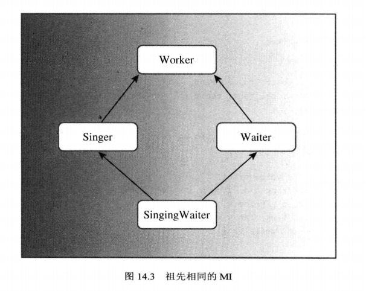
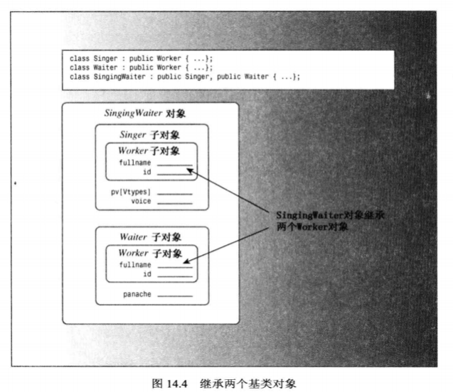
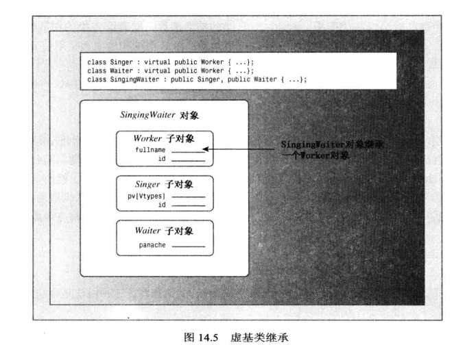

[TOC]

# Unit 6. 代码重用

## has-a 关系

C++的一个主要目标是促进代码重用，实现这一目标的方法有很多：

- 公有继承(is-a)；
- 使用本身是类对象的成员(has-a)；
- 私有继承 or 保护继承(has-a)；
- 多重继承；
- 类模板。
  
> 其中使用本身是类对象的成员也被称为包含、组合或层次化。

### 包含对象成员的类

第一种 has-a 的实现 —— 包含对象成员的类。

#### 类声明

首先，先来看一个例子。开发一个 Person 类，这里将 Person 简化为拥有一个名字的类，名字可以使用字符数组，但这样会限制名字的长度；也可以使用 char 指针和动态内存分配，但这样需要提供大量的支持代码；一种更简单可靠的方法是使用一个由他人开发好的类的对象来表示名字，而C++库正好提供了 string 类。
至此，已经确定了 Person 类 —— 使用一个 string 对象来表示姓名。如何设计呢？可能会考虑公有继承的方式从 string 类派生出 Person 类，并加上其他需要的成员，C++ 允许这样做，但是在这里并不合适，因为公有继承是 is-a 关系，而 Person is not a string。这里的关系实际上是 has-a 关系，即 Person has a name(string)。最常见的建立 has-a 关系的C++技术就是组合(包含 or 层次化)，即创建一个包含其他类对象的类。
例如，可以将 Person 类声明为如下所示：

```cpp
class Person {
private:
    std::string name;
public:
    ...
};
```

与之前的类声明相同，在 Person 类中将数据成员(name)声明为私有的。这意味着 Person 类的成员函数可以使用 string 类的公有接口来访问和修改 name 对象，但在类外不能调用 string 类的接口来直接访问和修改 name 对象，而只能通过 Person 类的公有接口来间接访问和修改 name 对象。对于这种情况，通常被描述为 Person 类获得了其成员对象的实现，但没有继承其接口。例如，Person 对象可以使用 string 的实现，而不是用 `char * name`来实现保存姓名。但 Person 对象并不能天生就有使用函数`string operator+=()`的能力(不继承接口)。

> 接口和实现：公有继承时，派生类可以继承基类的接口，以及除纯虚函数之外的函数实现，获得接口是 is-a 关系的组成部分。而使用组合，类可以获得实现，但不能获得接口，不继承接口是 has-a 关系的组成部分。
> PS：纯虚函数只提供接口，不提供实现。

对于 has-a 关系来说，类对象不能自动获得被包含对象的接口是一件好事。例如，string 类将+运算符重载为将两个字符串连接起来；但从概念上说，将两个 Person 对象串联起来没有任何意义。这也是不使用公有继承的原因之一。
另一方面，被包含的类的接口部分对新类也可能是有意义的。例如，可能希望使用 string 接口中的 operator<() 方法将 Person 对象按姓名进行排序，为此可以定义`Person::operator<()`成员函数，在其实现中使用`string::opeartor<()`进行排序。

#### 初始化被包含的对象

- 使用初始化列表的语法来初始化 name 成员对象。

对于继承的对象，构造函数在成员初始化列表中使用类名来调用特定基类的构造函数；对于成员对象，构造函数使用成员名。这里 name 是成员对象，因此在构造函数中只需要使用成员名即可：

```cpp
Person(const std::string & str) : name(str) {}
```

如果不使用初始化列表语法，情况会如何？C++要求在构建对象的其他部分之前，先构建继承对象的所有成员对象。因此，如果省略初始化列表，C++将使用成员对象所属类的默认构造函数。

> 初始化顺序：基类的成员对象按类声明的顺序依次调用构造函数 -> 基类构造函数 -> 派生类的成员对象按类声明顺序依次调用构造函数 -> 派生类构造函数。

#### 使用被包含对象的接口

被包含对象的接口不是公有的，但可以在类方法中使用它。例如：

```cpp
bool Person::operator<(const Person & p) const {
    return this->name < p.name;
}
```

上述代码中定义了可由 Person 对象调用的方法`Person::operator<()`，该方法内部使用了`std::string::operator<()`。这是因为 name 是一个 string 对象，所以它可以调用 string 类的成员函数。总之，Person 对象调用 Person 的方法，而 Person 的方法实现中使用被包含的 string 对象来调用 string 类的方法。

#### 源代码

```cpp
#ifndef CONTAINS_H_
#define CONTAINS_H_
#include <iostream>

/**
 * 这个类使用包含(组合)的方式实现 has-a 关系.
 */

class Person1 {
private:
    std::string name;
public:
    // 初始化列表中
    explicit Person1(const std::string & str = "null") : name(str) {}
    // 访问包含的类对象
    const std::string & getName() const { return name; }
    // 调用包含的类对象的公有接口
    int getSize() const { return name.size(); }
    bool operator<(const Person1 & rp) const;
    // 友元函数, 将调用包含的类对象的友元函数.
    friend std::ostream & operator<<(std::ostream & out, const Person1 & rp);
};

bool Person1::operator<(const Person1 &rp) const {
    return name < rp.name;
}

std::ostream & operator<<(std::ostream & out, const Person1 & rp) {
    out << "Name: " << rp.name;
    return out;
}
#endif // CONTAINS_H_
```

### 私有继承

C++还有另一种实现 has-a 关系的方式 —— 私有继承。

#### 概念介绍

**私有继承的特征**：使用私有继承，基类的公有成员和保护成员都将成为派生类的私有成员。这意味着基类方法将不会成为派生类公有接口的一部分，但可以在派生类的成员函数中使用它们。简单地说，基类中访问权限是 public、protected 的成员，在私有继承的派生类中访问权限会变成 private，原有权限是 private 的保持不变。

首先探讨下接口问题。使用公有继承，基类的公有方法将会成为派生类的公有方法，即派生类将继承基类的接口，这是 is-a 关系的一部分。使用私有继承，基类的公有方法和保护方法将会成为派生类的私有方法，即派生类不继承基类的接口，这种不完全继承是 has-a 关系的一部分。
使用私有继承，类将继承实现。例如，如果从 string 类派生出 Person 类，后者将由一个 string 类组件，用于保存字符串。另外，Person 方法可以使用 string 方法来访问 string 组件。

**包含和私有继承对比**：包含将对象作为一个命名的成员对象添加到类中，而私有继承将对象作为一个未被命名的继承对象添加到类中。
因此，私有继承提供的特性与包含相同：获得实现，但不获得接口。所以，私有继承也可以用来实现 has-a 关系。

#### 类声明

**私有继承的声明**：要进行私有继承，需要使用关键字 private 而不是 public 来定义类。

> 实际上，private 是继承的默认值，因此省略访问限定符也将导致私有继承。

```cpp
class Person : private std::string {
public:
    ...
};
```

使用包含的版本提供了显式命名的对象成员 —— name，而私有继承提供了无名称的对象成员，这是这两种方法的第一个主要区别。

#### 初始化基类组件

隐式地继承组件而不是成员对象将影响代码的编写，因为不能在使用 name 来描述对象了，而必须使用用于公有继承的技术。例如，对于构造函数，包含使用这样的构造函数：

```cpp
explicit Person(const std::string & str) : name(str) {}
```

而私有继承的构造函数使用成员初始化列表语法时使用类名而不是成员名来标识构造函数：

```cpp
explicit Person(const std::string & str) : std::string(str) {}
```

这里的成员初始化列表中使用`std::string(str)`，而不是`name(str)`，这是包含和私有继承的第二个主要区别。

#### 访问基类的方法

使用私有继承是，只能在派生类的方法中使用基类的方法。但有时候希望基类工具是公有的，例如，在类声明中提出可以使用`Size()`返回字符串大小。
包含使用对象的方式实现`Size()`：

```cpp
int Person::Size() const {
    return name.size();
}
```

然而，私有继承是的能够使用类名和作用域解析运算符来调用基类的方法：

```cpp
int Person::Size() const {
    return std::string::size();
}
```

总之，使用包含时将使用对象名来调用方法，而使用私有继承时将使用类名和作用域解析运算符来调用方法。

#### 访问基类对象

使用作用域解析运算符可以访问基类的方法，但如果要使用基类对象本身，该如何做呢？例如，在包含版本的 Person 中可以实现 getName() 方法，它返回 string 对象成员 name：

```cpp
const std::string & Person::getName() const {
    return name;
}
```

但使用私有继承时，该 string 对象没有名称，那么 Person 类的代码如何访问内部的 string 对象呢？
答案是使用强制类型转换。由于 Person 类是从 string 类派生而来，因此可以通过强制类型转换，将 Person 类对象转换为 string 类对象。this 指针指向用来调用方法的对象，因此`*this`是用来调用方法的对象，在这个例子中，这个对象是 Person 类的对象。为了避免返回对象时调用构造函数创建新对象，可以使用强制类型转换来创建一个引用：

```cpp
const std::string & Person::getName() const {
    return (const std::string &) (*this);
}
```

上述方法返回一个引用，该引用指向用于调用该方法的 Student 对象中继承来的 string 对象。

#### 访问基类的友元函数

用类名显式地限定函数名不适合于友元函数，因为友元函数不属于类，所以访问基类的友元函数不能采用作用域解析运算符的方式，必须通过显式地转换为基类来调用正确的函数。例如，对于下面的友元函数定义：

```cpp
std::ostream & operator<<(std::ostream & out, const Person & rp) {
    out << "Person name is " << (const std::string &) rp << std::endl;
}
```

`out << "Person name is " << (const std::string &) rp << std::endl;`显式地将 rp 转换为 string 类对象的引用，进而调用函数`operator<<(ostream &, const string &)`。
Person 引用 rp 不会自动转换为 string 引用。根本原因在于，在私有继承中，不进行显式类型转换的情况下，不能将指向派生类的引用或指针赋给基类引用或指针。
然而，即使这个例子使用的是公有继承，也必须使用显式类型转换。原因之一是，如果不使用类型转换，`os << rp`将递归调用自己。

#### 源代码

```cpp
#ifndef PRIVATEEXTEND_H_
#define PRIVATEEXTEND_H_
#include <iostream>
/**
 * 这个使用私有继承的方式实现 has-a 关系.
 */
class Person2 : private std::string {
public:
    // 初始化列表中显式调用基类的构造函数.
    explicit Person2(const std::string & str = "null") : std::string(str) {}
    // 访问基类对象
    const std::string & getName() const { return (const std::string &) *this; }
    // 调用基类函数
    int getSize() const { return std::string::size(); }
    bool operator<(const Person2 & rp) const;
    // 友元函数, 将调用基类的友元函数.
    friend std::ostream & operator<<(std::ostream & out, const Person2 & rp);
};

bool Person2::operator<(const Person2 &rp) const {
    return (std::string) *this < (std::string) rp;
}

std::ostream & operator<<(std::ostream & out, const Person2 & rp) {
    out << "Name: " << (std::string) rp;
    return out;
}

#endif // PRIVATEEXTEND_H_
```

### 使用包含还是私有继承？

由于既可以使用包含，也可以使用私有继承来建立 has-a 关系，那么应该使用那种方式呢？
大多数C++程序员倾向于使用包含。**首先，包含更易于理解**。类声明中包含表示被包含类的显式命名对象，代码可以通过这个名称引用这些对象，而继承将使关系更抽象，必须使用强制类型转换来引用这些对象。**其次，继承会引起很多问题**，这个例子比较简单，只继承了一个类，而C++允许继承多个类，而从多个基类继承时，可能必须处理很多问题，如包含同名方法的独立的基类or共享祖先的独立基类。总之，使用包含不太可能遇到这样的麻烦。**最后，包含能够包含多个同类的对象**，而继承只能使用一个。如果某个类需要3个 string 对象，可以使用包含声明3个独立的 string 成员，而继承不行。
然而，私有继承也有它的优势，即私有继承提供的特性比包含多。例如，假设类包含保护成员，则这样的成员在派生类中是可用的，但在继承层次结构之外是不可用的。如果使用组合将这样的类包含在另一个类中，则后者不能直接访问保护成员。但通过私有继承得到的是派生类，因此它能够直接访问保护成员。
另一种需要使用私有继承的情况是需要重新定义虚函数。因为派生类可以重新定义虚函数，但包含类不能。但需要注意的是使用私有继承，重新定义的函数将只能在类中使用(访问权限将变为 private)，而不是公有的。

> 总结：通常，应该使用包含来建立 has-a 关系；如果新类需要访问原有类的保护成员，或者需要重新定义虚函数，则应该使用私有继承。

### 保护继承

保护继承其实是私有继承的变体。
**保护继承的声明**：在类声明列出基类时使用关键字 protected：

```cpp
class A : protected B ,protected C{}
```

**保护继承的特征**：使用保护继承时，基类访问权限为 public 和 protected 的成员在派生类中的访问权限是 protected，基类 private 权限的成员在派生类中保持不变，依旧是 private。

#### 保护继承和私有继承的对比

**相同点**：和私有继承一样，保护继承的派生类也是可以使用基类的接口，但在继承层次结构之外不可用。
**不同点**：保护继承和私有继承的主要区别在于，从派生类派生出另一个类时。使用私有继承时，第三代类不能使用基类的接口，这是因为基类的 public 成员在派生类(第二代类)中变成 private 成员，因此第三代类不能直接使用基类的公有接口了；使用保护继承时，基类的公有成员在派生类(第二代类)中将变成 protected 成员，此时对于继承结构之外的类来说不能使用基类的公有接口，但是在继承结构之内的第三代派生类依旧可以使用基类接口。

#### 公有继承、保护继承、私有继承的总结

| 特征        | 公有继承       | 保护继承       | 私有继承       |
| --------- | ---------- | ---------- | ---------- |
| 基类的公有成员变成 | 派生类的公有成员   | 派生类的保护成员   | 派生类的私有成员   |
| 基类的保护成员变成 | 派生类的保护成员   | 派生类的保护成员   | 派生类的私有成员   |
| 基类的私有成员变成 | 必须通过基类接口访问 | 必须通过基类接口访问 | 必须通过基类接口访问 |
| 能否隐式向上转换  | 能          | 能，但只能在派生类中 | 否          |

> 隐式向上转换意味着无需进行显示类型转换就可以将基类指针或引用指向派生类对象。

对类成员的访问权限有3种 —— 公有、保护、私有。公有访问权限代表所有人都能访问本类的公有成员；保护访问权限代表只有指定的一群人(本类以及派生类)才能访问本类的保护成员；私有访问权限代表只有本类能访问本类的私有成员，其他人不能直接访问。
在继承时指定访问权限，可以理解为规定派生类从基类中继承来的成员的最高访问权限。例如，公有继承意味着派生类从基类中继承来的成员的最高权限是 public，因为 public 是最高权限，因此从基类继承来的成员的权限不会改变；保护继承是派生类从基类继承来的成员的最高权限是 protected，因此从基类继承来的公有成员的权限会被降为 protected，而原来的 protected 成员权限不变；私有继承时派生类从基类继承的成员的权限最高是 private，所以基类的 public、protected 成员在派生类中降为 privated。
至于基类的私有成员，因为基类的私有成员是只有基类能直接访问的，因此对于派生类来说，不论是那种权限的继承都无法直接访问基类的私有成员，只能通过基类提供的非私有接口才能访问。

### 使用 using 重新定义访问权限

使用保护继承或私有继承时，基类的公有成员将成为保护成员或私有成员。如果想要基类的方法在派生类外面可以使用，方法之一是重新定义一个使用该基类方法的派生类方法。例如，希望 Person 类能够使用 string 类的 size() 方法，可以在 Person 类声明中声明一个 size() 方法，然后像下面这样定义该方法：

```cpp
int size() const { return std::string::size(); }
```

这样 Person 对象就能调用`Person::size()`，进而将`std::string::size()`方法应用于被包含的 string 对象。
另一种方法是，将函数调用包含在另一个函数调用中，即使用一个 using 声明 来指出派生类可以使用特定的基类成员，即使采用的是私有继承。例如，希望通过 Person 类能使用 string 类的 size() 方法，可以在 Person 类声明的公有部分加入如下 using 声明：

```cpp
class Person : private std::string {
public:
    using std::string::size;
}
```

上述 using 声明使得`string::size()`可用，就像它是 Person 类的公有方法一样。需要注意的是，using 声明只使用成员名，即没有圆括号、函数特征标(参数列表)和返回类型。using 声明只适用于继承，不适用于包含。

## 多重继承

### 概念介绍

多重继承描述的是有多个直接基类的类。与单继承一样，公有的多重继承也表示 is-a 关系。例如，可以从类 A 和类 B 中公有派生出 C 类：

```cpp
class C : public A, public B {...};
```

请注意，必须使用关键字 public 来限定每一个基类。因为，如果不指出，编译器将认为是私有派生。
私有多重继承和保护多重继承表示 has-a 关系，但我们重点介绍的还是公有多重继承。

### 存在的问题

多重继承可能会给程序员带来很多新问题。其中两个主要问题是：

- 从两个不同的基类继承同名的方法；
- 从两个或更多相关基类那里继承同一个类的多个实例(子对象)。

未解决这些问题，需要使用一些新规则和不同的语法。因此，与使用单继承相比，使用多重继承更困难，也更容易出现问题。
下面会以《C++ Primer Plus》中的例子来演示下多重继承的大多数麻烦。首先定义一个抽象基类 Worker，并使用它派生出 Waiter 和 Singer 类，然后使用多重继承从 Waiter 和 Singer 类派生出 SingingWaiter 类。



### 实例演示

类声明以及实现：

```cpp
#ifndef MULTIPLEINHERITANCE_H_
#define MULTIPLEINHERITANCE_H_

#include <iostream>

/*
 * 练习多重继承
 */
class Worker0 {
private:
    std::string name; // 名字
    long id; // identify
public:
    Worker0() : name("no name"), id(0) {} // default constructor
    Worker0(const std::string &s, long n) : name(s), id(n) {} // constructor
    virtual ~Worker0() = 0; // destructor and pure virtual
    virtual void set();
    virtual void show() const;
};

class Waiter0 : public Worker0 {
private:
    int panache;
public:
    Waiter0() : Worker0(), panache(0) {}
    Waiter0(const Worker0 &wk, int p = 0) : Worker0(wk), panache(p) {}
    Waiter0(const std::string &s, long n, int p = 0) : Worker0(s, n), panache(p) {}
    virtual void set();
    virtual void show() const;
};

class Singer0 : public Worker0 {
public:
    // 其他，女中音，女中音，女高音，男低音，男中音，男高音
    enum { OTHER, ALTO, CONTRALTO, SOPRANO, BASS, BARITONE, TENOR };
    enum { VTYPES = 7 };
private:
    static const char * pv[VTYPES]; // 记录声音类型的字符串
    int voice;
public:
    Singer0() : Worker0(), voice(OTHER) {}
    Singer0(const Worker0 & wk, int v = OTHER) : Worker0(wk), voice(v) {}
    Singer0(const std::string & s, long n, int v = OTHER) : Worker0(s, n), voice(v) {}
    virtual void set();
    virtual void show() const;
};

// Worker0 methods implement
Worker0::~Worker0() {} // 必须提供析构函数的定义，哪怕是纯虚析构函数

void Worker0::set() {
    std::cout << "Please input worker's name: ";
    std::getline(std::cin, name);
    std::cout << "Please input worker's ID: ";
    std::cin >> id;
    while(std::cin.get() != '\n') continue; // 读取剩余字符
}

void Worker0::show() const {
    std::cout << "Name: " << name << std::endl;
    std::cout << "ID  : " << id << std::endl;
}

// Waiter0 methods implement
void Waiter0::set() {
    Worker0::set();
    std::cout << "Please input waiter's panache rating: ";
    std::cin >> panache;
    while (std::cin.get() != '\n')
        continue;
}

void Waiter0::show() const {
    std::cout << "Category: waiter.\n";
    Worker0::show();
    std::cout << "Panache: " << panache << std::endl;
}

// Singer0 methods implement
const char * Singer0::pv[] = { "other", "alto", "contralto",
                         "soprano", "base", "baritone", "tenor" };
void Singer0::set() {
    Worker0::set();
    std::cout << "Please input voice type: \n";
    // 展示选项
    int i = 0;
    while (i < VTYPES) {
        std::cout << i << ": " << pv[i] << "  ";
        if (i % 4 == 3)
            std::cout << std::endl;
        i++;
    }
    if (i % 4 != 0)
        std::cout << std::endl;
    // 输入选项
    while (std::cin >> voice && (voice < 0 || voice >= VTYPES))
        std::cout << "Please input a value >= 0 and < " << VTYPES << std::endl;
    // 处理多余字符
    while (std::cin.get() != '\n')
        continue;
}

void Singer0::show() const {
    std::cout << "Category: singer.\n";
    Worker0::show();
    std::cout << "Vocal range: " << pv[voice] << std::endl;
}
#endif // MULTIPLEINHERITANCE_H_
```

对基类的测试：

```cpp
int main() {
    Waiter0 bob = Waiter0("Bob Apple", 314L, 5);
    Singer0 youka = Singer0("Shen Zhou", 803L, 5);
    Waiter0 w_temp;
    Singer0 s_temp;

    const int NUM = 4;
    Worker0 * p_work[NUM] = {&bob, &youka, &w_temp, &s_temp};
    // 设置 w_temp 和 s_temp
    for (int i = 2; i < NUM; i++) {
        p_work[i]->set();
    }
    // 展示对象信息
    for (int i = 0; i < NUM; i++) {
        p_work[i]->show();
        std::cout << std::endl;
    }
}
```

这种设计看起来是可行的，使用基类 Worker 指针根据对象的类型调用相应对象的 set() 和 show() 方法。然后，如果添加一个从 Singer 和 Waiter 类派生类出的 SingingWaiter 类会带来一些问题：

- 有多少个 Worker？
- 调用那个方法？

#### 问题1. 有多少个 Worker？
  
假设从 Singer 和 Waiter 公有派生出 SingingWaiter：

```cpp
class SingingWaiter : public Singer, public Waiter {...};
```

因为 Singer 和 Waiter 都继承了一个 Worker 组件，因此 SingingWaiter 将包含两个 Work 组件：



正如预期的，这将引起问题。例如，通常可以将派生类对象的地址赋给基类指针，但现在将出现二义性：
  
```cpp
SingingWaiter sw;
Worker * p_work = &sw; // 二义性
```

通常，这种赋值将把基类指针设置为派生类对象中的基类对象的地址。但 sw 中包含两个 Worker 对象，有两个地址可供选择，所以应使用类型转换来指定对象：

```cpp
SiningWaiter sw;
Worker * p_work1 = (Singer *) &sw;
Worker * p_work2 = (Waiter *) &sw;
```

这将使得使用基类指针来引用不同对象(多态性)变得复杂化。
包含两个 Worker 对象拷贝还会导致其他问题。然而，真正的问题在于：为什么需要 Worker 对象的两个拷贝？唱歌的侍者应该和其他 Worker 对象一样，也应只包含一个姓名和一个 ID。C++引用多重继承的同时，也引入了一种新技术 —— 虚基类，这使多重继承成为可能。

#### 解决方案：虚基类

**什么是虚基类**？虚基类使得从多个类(这多个类有相同的基类)派生出的对象只继承一个基类对象。虚基类的声明方式是在类声明中使用关键字 virtual。例如，可以将 Worker 用 virtual 关键字声明为 Singer 和 Waiter 的虚基类：

```cpp
class Singer : public virtual Worker {...};
class Waiter : virtual public Worker {...};
```

> 注意，public 和 virtual 关键字的次序无关紧要

将 Worker 声明为 Singer 和 Waiter 的虚基类之后，可以将 SingingWaiter 类定义为：

```cpp
class SingingWaiter : public Singer, public Waiter {...};
```

现在，SingingWaiter 对象将只包含 Worker 对象的一个副本。从本质上说，继承的 Singer 和 Waiter 对象共享一个 Work 对象，而不是各自引入自己的 Work 对象副本：



因为现在 SingingWaiter 只包含一个 Worker 子对象，所以可以对 SingingWaiter 使用多态。

你可能会对虚基类有这样的疑问：

- 为什么使用术语“虚”(virtual)？
- 为什么不抛弃将基类声明为虚的这种方式，将虚基类这种行为作为多重继承的默认行为？
- 是否存在麻烦？

首先，能发现虚基类和虚函数以及抽象类之间没有什么联系，那么为什么还要使用术语“虚”(或者说为什么还要用关键字 virtual)？这是因为C++用户强烈反对引入新的关键字，因为引入新关键字将会给他们带来很大的压力。例如，如果引入新关键字，而新关键字与已有的重要程序中的重要函数名或变量名相同，这将非常蛮烦。因此，C++对虚基类这个新特性也使用 virtual —— 可以理解为关键字重载。
其次，为什么不抛弃将基类声明为虚的这种做法，将虚基类这种行为做成继承的默认行为？第一，在一些情况下，程序员确实可能需要基类的多个拷贝；第二，将基类作为虚的要求程序完成额外的计算，为不需要的工具付出代价是不应当的；第三，这样做也是有其缺点的。
最后，虚基类是否存在麻烦？是的。为了使虚基类能够工作，需要对C++规则进行调整，必须以不同的方式编写一些代码。另外，使用虚基类还可能需要修改已有代码。例如，将 SingingWaiter 类添加到 Worker 继承层次中时，需要在 Singer 和 Waiter 中添加关键字 virtual。

**新的构造函数规则**：
使用虚基类时，需要对类构造函数采用一种新的方法。对于非虚基类，唯一可以出现在初始化列表中的构造函数是直接基类构造函数。例如：

```cpp
class A {
    int a;
public:
    A(int n) : a(n) {}
};
class B : public A {
    long b;
public:
    B(int n, long m) : A(n), b(m) {}
};
class C : public B {
    double c;
public:
    C(int n, long m, double o) : B(n, m), c(o) {}
};
```

class C 的构造函数只能调用 class B 的构造函数，而 class B 的构造函数只能调用 class A 的构造函数。如果 Worker 是虚基类，则这种信息的自动传递将不起作用。例如，对于下面的多重继承的 SingingWaiter 的构造函数：

```cpp
// 存在一些问题
SingingWaiter(const Worker & wk, int p = 0, int v = Singer::OTHER) : Waiter(wk, p), Singer(wk, v) {}
```

上面这个构造函数存在的问题是，在自动传递信息时，将通过两条不同的途径(即 Waiter 和 Singer 的构造函数)将 wk 传递给 Worker 对象。为避免这种冲突，C++在基类是虚基类时，禁止信息通过中间类自动传递给基类。因此，上述构造函数完成的工作是初始化成员 panache 和 voice，但是 wk 参数中的 Worker 信息不会传递给子对象 Waiter 和 Singer。但编译器必须在构造派生对象之前构造基类对象组件，此时编译器将使用 Work 的默认构造函数来初始化 SingingWaiter 中的 Worker 子对象。
如果不希望使用默认构造函数来构造虚基类对象，则需要显式地调用所需的基类构造函数。因此，构造函数应该是这样的：

```cpp
class SingingWaiter(const Work & wk, int p = 0, int voice = Singer::OTHER)
                    : Worker(wk), Waiter(wk, p), Singer(wk, v) {}
```

上述代码将显式地调用构造函数`Worker(const Worker &)`。请注意，对于虚基类，这种做法是合法且必须这样做的；但对于非虚基类，这样是非法的。

> 警告：如果类有间接虚基类，则除非只需使用该虚基类的默认构造函数，否则必须显式地调用该虚基类的某个构造函数。

#### 问题2. 那个方法？

除了引入虚基类解决多个共同基类子对象的问题需要修改类的构造函数之外，多重继承通常还需要调整其他代码。假设要在 SingingWaiter 类中扩展 Show() 方法。因为 SingingWaiter 类中没有添加新的数据成员，所以可能会认为它只需要使用继承的方法即可。这引出了第一个问题：假设没有在 SingingWaiter 类中重新定义 show() 方法，并试图使用 SingingWaiter 对象调用继承的 show() 方法：

```cpp
SingingWaiter sw_temp = SingingWaiter("You ka", 2022, 5, 3);
sw_temp.show(); // 具有二义性
```

对于单继承，如果没有重新定义 show()，将使用最近的祖先类中的定义。而在本例的多重继承中，两个直接祖先(Singer 和 Waiter)都有一个 show() 函数，这使得上述调用具有二义性，编译器不知道应该调用那个祖先中的实现。

#### 解决方案：模块化的保护方法or保护数据成员

第一种解决方法是，使用作用域解析运算符来澄清程序员的意图是使用那个基类的方法：

```cpp
SingingWaiter sw_temp = SingingWaiter("You ka", 2022, 5, 3);
sw_temp.Singer::show(); // 使用基类 Singer 的 show()
sw_temp.Waiter::show(); // 使用基类 Waiter 的 show()
```

然而，更好的方法是在 SingingWaiter 中重新定义 show()，并指出要使用哪个 show()。例如，如果希望 SingingWaiter 对象使用 Singer 版本的 show()，则可以这样：

```cpp
void SingingWaiter::show() const {
    Singer::show();
}
```

但是这样会忽视 Waiter 组件的信息 panache，而 SingingWaiter 类又不能直接访问 panache，因此不能直接添加 panache 的输出信息，需要使用 Waiter 类的公有方法。可以通过同时调用 Waiter 版本的 show() 来补救：

```cpp
void SingingWaiter::show() const {
    Singer::show();
    Waiter::show();
}
```

但这样会导致显示两次 name 和 id：

```cpp
Category: singer.
Name: You ka
ID  : 2022
Vocal range: contralto
Category: waiter.
Name: You ka
ID  : 2022
Panache: 5
```

因为 Singer::show() 和 Waiter::show() 都调用了 Worker::show()。如何解决这个问题？一种方法是使用模块化方式，而不是递增方式，即提供一个只显示 Worker 数据成员的方法和一个只显示 Waiter 数据成员或 Singer 数据成员(而不是 Waiter/Singer 和 Worker 数据成员)的方法。然后在 SingingWaiter 的 show() 方法中将其组合起来，例如：

```cpp
void Worker::data() const {
    cout << "Name: " << name << endl;
    cout << "ID: " << id << endl;
}
void Waiter::data() const {
    cout << "Panache: " << panache << endl;
}
void Singer::data() const {
    cout << "Vocal range: " << pv[voice] << endl;
}
void SingingWaiter::data() cosnt {
    Singer::data();
    Waiter::data();
}
void Worker::show() const {
    data();
}
void Waiter::show() const {
    cout << "Category: waiter.\n";
    Worker::data();
    data(); // Waiter::data()
}
void Singer::show() const {
    cout << "Category: singer.\n";
    Worker::data();
    data(); // Singer::data();
}
void SingingWaiter::show() const {
    cout << "Category: singing waiter.\n";
    Worker::data();
    data();
}
```

采用这种方式，对象仍可以使用 show() 方法，而 data() 方法只在类内部使用，是作为协助公有方法的辅助方法，所以 data() 应被声明为 private 方法或 protected 方法。然而，如果将 data() 方法声明为私有的将阻止 Worker 的子类 Waiter/Singer 的 data() 中调用`Worker::data()`，这正式保护访问权限的用武之地。
另一种办法是将所有的数据组件设置为保护的，而不是私有的，不过使用保护方法(而不是使用保护数据)能够更严格地控制对数据的访问。
set() 方法根据输入信息设置对象的值，这个方法有和 show() 方法类似的问题。总之，在祖先相同时，使用多重继承必须引入虚基类，并修改构造函数初始化列表。另外，如果在编写这些类时没有考虑到多重继承，则可能还需要重新编写它们。

#### 源代码

```cpp
#ifndef MULTIPLEINHERITANCE_H_
#define MULTIPLEINHERITANCE_H_

#include <iostream>

/*
 * 练习多重继承
 */
class Worker {
private:
    std::string name; // 名字
    long id; // identify
    // ---- modify ----
protected:
    virtual void output() const;
    virtual void input();
    // ---- ------ ----
public:
    Worker() : name("no name"), id(0) {} // default constructor
    Worker(const std::string &s, long n) : name(s), id(n) {} // constructor
    virtual ~Worker() = 0; // destructor and pure virtual
    virtual void set() = 0;
    virtual void show() const = 0;
};

class Waiter : virtual public Worker { // 为了避免多重继承包含多个Worker子对象而引入虚基类
private:
    int panache;
    // ---- modify ----
protected:
    virtual void output() const; // 只显示Waiter组件的数据成员 —— panache
    virtual void input(); // 只输入Waiter组件的数据成员
    // ---- ------ ----
public:
    Waiter() : Worker(), panache(0) {}
    Waiter(const Worker &wk, int p = 0) : Worker(wk), panache(p) {}
    Waiter(const std::string &s, long n, int p = 0) : Worker(s, n), panache(p) {}
    virtual void set();
    virtual void show() const;
};

class Singer : virtual public Worker {
public:
    // 其他，女中音，女中音，女高音，男低音，男中音，男高音
    enum { OTHER, ALTO, CONTRALTO, SOPRANO, BASS, BARITONE, TENOR };
    enum { VTYPES = 7 };
private:
    static const char * pv[VTYPES]; // 记录声音类型的字符串
    int voice;
    // ---- Modify ----
protected:
    virtual void output() const;
    virtual void input();
    // ---- ------ ----
public:
    Singer() : Worker(), voice(OTHER) {}
    Singer(const Worker & wk, int v = OTHER) : Worker(wk), voice(v) {}
    Singer(const std::string & s, long n, int v = OTHER) : Worker(s, n), voice(v) {}
    virtual void set();
    virtual void show() const;
};

class SingingWaiter : public Singer, public Waiter {
// ---- Modify ----
protected:
    virtual void output() const;
    virtual void input();
    // ---- ------ ----
public:
    SingingWaiter() {} // 自动调用基类默认构造函数
    SingingWaiter(const std::string & s, long n, int p = 0, int v = Singer::OTHER)
            : Worker(s, n), Waiter(s, n, p), Singer(s, n, v) {}
    SingingWaiter(const Worker & wk, int p = 0, int v = Singer::OTHER)
            : Worker(wk), Waiter(wk, p), Singer(wk, v) {}
    SingingWaiter(const Waiter & wt, int v = Singer::OTHER)
            : Worker(wt), Waiter(wt), Singer(wt, v) {}
    SingingWaiter(const Singer & sg, int p = 0)
            :Worker(sg), Waiter(sg, p), Singer(sg) {}
    void set();
    void show() const;
};

// Worker methods implement
Worker::~Worker() {} // 必须提供析构函数的定义，哪怕是纯虚析构函数

void Worker::input() {
    std::cout << "Please input name: ";
    std::getline(std::cin, name);
    std::cout << "Please input worker's ID: ";
    std::cin >> id;
}

void Worker::output() const {
    std::cout << "Name: " << name << std::endl;
    std::cout << "ID  : " << id << std::endl;
}

// Waiter methods implement
void Waiter::output() const {
    std::cout << "Panache: " << panache << std::endl;
}

void Waiter::input() {
    std::cout << "Please input waiter's panache rating: ";
    std::cin >> panache;
}

void Waiter::set() {
    Worker::input();
    input();
    while (std::cin.get() != '\n')
        continue;
}

void Waiter::show() const {
    std::cout << "Category: waiter.\n";
    Worker::output();
    Waiter::output();
}

// Singer methods implement
const char * Singer::pv[] = {"other", "alto", "contralto",
                             "soprano", "base", "baritone", "tenor" };

void Singer::input() {
    std::cout << "Please input voice type: \n";
    // 展示选项
    int i = 0;
    while (i < VTYPES) {
        std::cout << i << ": " << pv[i] << "  ";
        if (i % 4 == 3)
            std::cout << std::endl;
        i++;
    }
    if (i % 4 != 0)
        std::cout << std::endl;
    // 输入选项
    while (std::cin >> voice && (voice < 0 || voice >= VTYPES))
        std::cout << "Please input a value >= 0 and < " << VTYPES << std::endl;
}

void Singer::output() const {
    std::cout << "Vocal range: " << pv[voice] << std::endl;
}

void Singer::set() {
    Worker::input();
    input();
    // 处理多余字符
    while (std::cin.get() != '\n')
        continue;
}

void Singer::show() const {
    std::cout << "Category: singer.\n";
    Worker::output();
    Singer::output();
}

// SingingWaiter methods implements
void SingingWaiter::output() const {
    Waiter::output();
    Singer::output();
}

void SingingWaiter::input() {
    Waiter::input();
    Singer::input();
}

void SingingWaiter::set() {
    Worker::input();
    input();
    while (std::cin.get() != '\n')
        continue;
}

void SingingWaiter::show() const {
    std::cout << "Category: singer waiter.\n";
    Worker::output();
    output();
}
#endif // MULTIPLEINHERITANCE_H_
```

#### 代码测试

```cpp
int main() {
    const int SIZE = 5;
    Worker * arr[SIZE];
    // 输入打工人的信息
    int num;
    for (num = 0; num < SIZE; ++num) {
        char choice;
        std::cout << "Input Employee category:\n"
                  << "w: waiter, s: singer, t: singing waiter, q: quit\n";
        std::cin >> choice;
        while (std::strchr("wstq", choice) == NULL) {
//        while (choice != 'w' || choice != 's' || choice != 't' || choice != 'q') {
            std::cout << "Please enter w,s,t,q: " << std::endl;
            std::cin >> choice;
        }
        if (choice == 'q')
            break;
        switch (choice) {
            case 'w':
                arr[num] = new Waiter();
                break;
            case 's':
                arr[num] = new Singer();
                break;
            case 't':
                arr[num] = new SingingWaiter();
                break;
        }
        std::cin.get();
        arr[num]->set();
    }
    // 展示打工人的信息
    std::cout << "Show employee information: \n";
    for (int i = 0; i < num; ++i) {
        arr[i]->show();
        std::cout << std::endl;
    }
    for (int i = 0; i < num; ++i) {
        delete arr[i];
    }
    std::cout << "End.\n";
    return 0;
}
```

### 多重继承的其他问题

回顾刚才学习的内容，多重继承可能会导致包含同一个类的多个实例(子对象)，解决方案是在多重继承的直接基类的类声明中使用虚基类，这样多重继承的派生类将只包含该类的一个实例。多重继承可能导致派生类中有多个直接基类中声明的同名方法，解决方案有两种，一种是在方法调用时使用作用域解析运算符显式的指出调用的是那个基类的方法，另一种方法是在派生类中重新实现该同名方法。相较于第一种方法，第二种方法更灵活，还能够添加派生类需要的额外操作。但是在面对使用虚基类技术的类时，可能会面临多次调用了虚基类中方法的问题，此时可以采用模块化虚基类中的方法，并将其声明为保护方法来解决，也可以将需要操作的虚基类的数据成员声明为 protected，这两种方法更推荐第一种。
下面将介绍其他和多重继承相关的问题。

#### 混合使用虚基类和非虚基类

再来看一下通过多种途径继承一个基类的派生类的情况。如果基类是虚基类，派生类将包含基类的一个子对象；如果基类不是虚基类，派生类可能包含多个子对象。那么，当虚基类和非虚基类混合使用时，情况将如何？
例如，假设类 A 被用作类 B 和 C 的虚基类，同时类 A 还被用做类 M 和 N 的非虚基类，而类 X 是从 B、C、M、N 多重派生而来的：

```cpp
class A {...};
class B : virtual public A {...};
class C : virtual public A {...};
class M : public A {...};
class N : public A {...};
class X : public B, public C, public M, public N {...};
```

在这种情况下，类 X 从虚派生父类(B 和 C)那里继承了一个 A 类子对象，并从每一个非虚派生父类(M 和 N)那里分别继承一个 A 类子对象。因此，类 X 包含三个 A 类子对象。
**总结**：当类通过多条虚途径和非虚途径继承某个特定的基类时，该类将包含一个表示所有的虚途径的基类子对象和分别表示各条非虚途径的多个基类子对象。

#### 虚基类和支配

使用虚基类将改变C++解析二义性的方式。
使用非虚基类时，规则很简单：如果类从不同类那里继承了两个或更多的同名成员(包括数据和方法)，则使用该成员名时，如果没有用类名进行限定，将导致二义性。
但如果使用的是虚基类，则这样不一定会导致二义性。在这种情况下，如果某个名称优先于其他所有名称，则使用它时，即使不使用限定名，也不会导致二义性。那么，如何判定一个成员名优先于另一个成员名呢？派生类中的名称优先于直接或间接祖先类中的相同名称。
虚二义性规则与访问权限无关，也就是说，即使同名方法在基类中被声明为 private，不能在派生类中直接访问，但直接使用该方法也会导致二义性。

## 类模版

### 概念介绍

继承和包含并不总是能够满足重用代码的需要。例如，Stack 类是容器类，容器类设计用来存储其他对象或数据类型。可以定义专门用于存储 double 值或 string 对象的 Stack 类，除了保存的对象类型不同外，这两种 Stack 类的代码是相同的。与其编写新的类声明，不如编写一个泛型栈，然后讲具体的类型作为参数传递给这个类。这样就可以使用通用的代码生成存储不同类型值的栈。
C++的类模板为生成通用的类声明提供了一种方法。模板提供参数化类型，即能够将类型名作为参数传递给接收方来建立类或函数。例如，将类型名 int 传递给 Stack 模板，可以让编译器构造一个对 int 进行排队的 Queue 类。
C++库提供了多个模板类，C++标准模板库(STL)提供了几个功能强大而灵活的容器类模板实现。

### 类模板的定义

#### 类模板声明

类模板声明其实和函数模板很类似，我们先回顾下函数模板：

```cpp
template<class T>
T add(T t1, T t2) {
    return t1 + t2;
}
```

和函数模板的声明类似，类模板的声明格式如下：

```cpp
template<class Type>
class Demo {
private:
public:
    bool f(const Type & t) const;
};
```

`template<class Type>`告诉编译器将要定义一个模板。尖括号中的内容相当于函数的参数列表，可以把关键字 class 视为变量的类型，把 Type 看作是变量的名称，该变量接收类型作为其值。
这里使用 class 不是意味着 Type 必须是个类，而是表明 Type 是一个通用的类型说明符，在使用模板时会用实际传递的类型替换它。较新的C++实现允许使用关键字 typename 替代 class：

```cpp
template <typename Type>
```

Type 可以由程序员自己命名，其命名规则和其他标识符相同，比较常用的选项有 T 和 Type。当模板被调用时，Type 将被具体的类型(如 int、string 等)取代。

#### 类模板成员函数的实现

类模板的成员函数实现时，每个函数头都需要使用模板前缀，并且类限定符需要使用泛型表示：

```cpp
template <typename Type>
bool Demo<Type>::f(const Type & t) const;
```

> 如果是在类声明中实现成员函数(即内联定义)，可以省略模板前缀和类限定符。

需要注意的是，模板不是类和成员函数的定义，类模板是C++编译器指令，它说明了如何生成类和成员函数的定义。模板的具体实现 —— 例如用来处理 string 对象的栈类 —— 被称为实例化或具体化。不能将模板成员函数放在独立的实现文件中，原因就在于模板不是函数，它们不能单独编译。模板必须与特定的模板实例化请求一起使用。因此，最简单的方法就是将所有模板信息放在一个头文件中，并在需要使用这些模板的文件中包含该文件。

#### 实例演示：Stack 模板类

下面以 Stack 类来作为演示类模板：

```cpp
#ifndef CLASSTEMPLATE_H_
#define CLASSTEMPLATE_H_

template<typename Type>
class Stack {
private:
    enum {MAX = 10}; // 默认栈大小
    Type items[MAX];
    int top;
public:
    Stack();
    bool isEmpty() const;
    bool isFull() const;
    bool pop(Type & t);
    bool push(const Type & t);
};

template<typename Type>
Stack<Type>::Stack() {
    top = 0;
}

template<typename Type>
bool Stack<Type>::isEmpty() const {
    return top == 0;
}

template<typename Type>
bool Stack<Type>::isFull() const {
    return top == MAX;
}

template<typename Type>
bool Stack<Type>::push(const Type & t) {
    if (top >= MAX)
        return false;
    items[top++] = t;
    return true;
}

template<typename T>
bool Stack<T>::pop(T &t) {
    if (top <= 0)
        return false;
    t = items[--top];
    return true;
}
#endif // CLASSTEMPLATE_H_
```

### 使用模板类

#### 如何使用模板类

仅在程序中包含模板还不能生成模板类，必须请求实例化。实例化的方法也很简单，声明一个类型为模板类的对象，使用所需的具体类型替换泛型名。例如，下面的代码将创建两个栈对象，一个存储 int，另一个存储 string 对象：

```cpp
Stack<int> s1;
Stack<string> s2;
```

编译器在看到上述声明之后，将按照`Stack<Type>`模板来生成两个独立的类声明和两组独立的类方法。`Stack<int>`将使用 int 替换模板中所有的 Type，而`Stack<string>`将用 string 替换 Type。

需要注意的是，使用的算法必须与类型一致。例如，Stack 类的一个前提是假设可以将一个 item 赋值给另一个 item。这种假设对基本类型、结构体以及类来说是成立的，但对于数据则不成立。

泛型标识符 —— 例如这里的 Type —— 称为类型参数，这意味着它们类似于变量，但赋给他们的不能是数字，而只能是类型。

注意，对于类模板，必须显式地提供所需的类型，这与常规的函数模板是不同的，因为编译器可以根据函数的参数类型来确定要生成哪种函数，因此函数模板可以省略。

#### 实例演示：Stack 模板的使用

```cpp
Stack<std::string> st; // 将调用Stack<std::string>::Stack()来生成空的Stack
std::cout << "Stack is Empty? " << (st.isEmpty() ? "True" : "False") << std::endl;
std::string str[10] = {"YouKa", "MoRu", "XuShang", "YiFei", "ZiFeng",
                       "ZiCheng", "MiBin", "HeMing", "SaiHei", "DaLing"};
for (int i = 0; i < 10; ++i) {
    st.push(str[i]);
}
std::cout << "Stack is Full? " << (st.isFull() ? "True" : "False") << std::endl;
std::cout << "Stack add a string: " << (st.push("world") ? "True" : "False") << std::endl;
std::string temp;
for (int i = 0; i < 10; ++i) {
    std::cout << "Stack remove top string: " << (st.pop(temp) ? "True" : "False") << ". String is " << temp << std::endl;
}
std::cout << (st.pop(temp) ? "True" : "False") << std::endl;

std::string input;
std::cout << "Please input a string to add it to Stack:";
std::cin >> input;
std::cout << "Stack add string: " << (st.push(input) ? "True" : "False") << ". " << input << std::endl;
```

### 类模板与指针

可以将C++内置类型以及类作为模板类`Stack<Type>`的类型。那么指针也可以吗？例如，用 char 指针替换上面程序中的 string 对象是否可以？答案是可以创建指针栈，但是需要对原程序做出修改，否则无法很好地工作。

#### 不正确地使用指针栈

**Version 1.** 直接将上面程序中`string`替换成`char *`。这种方法的主要问题在于`cin >> input`。

```cpp
Stack<char *> st; // 将调用Stack<std::string>::Stack()来生成空的Stack
char * input;
std::cout << "Please input a string to add it to Stack:";
std::cin >> input; // 不报错，但运行时会崩溃，因为没有创建存储字符串的空间
std::cout << "Stack add string: " << (st.push(input) ? "True" : "False") << ". " << input << std::endl;
st.pop(input);
```

将 input 的类型从`string`替换为`char *`之后，将会用 char 指针来接收键盘输入。这种方法并不行，因为 input 指针仅仅创建了指针，没有创建用于保存输入字符串的空间。这样编写程序可以通过编译，但在程序运行到`cin >> input`的时候会崩溃。

**Version 2.** 将 Stack 实例化为保存`char *`的栈，并将`std::string input`替换为`char input[40]`。

```cpp
Stack<char *> st; // 将调用Stack<std::string>::Stack()来生成空的Stack
char input[40];
std::cout << "Please input a string to add it to Stack:";
std::cin >> input;
std::cout << "Stack add string: " << (st.push(input) ? "True" : "False") << ". " << input << std::endl;
```

这种方法代替我们上面的代码，程序可以正常运行，但是存在一些隐藏的问题。
首先，如果在程序的最后加上`st.pop(input)`，就会报错，代码报错的原因在于 pop() 函数是默认传递的实参是可以被赋值的，因为在 pop() 的实现中有将出栈元素赋值给参数：`t = items[--top];`。但上面函数的实参 input 是数组，它是不能被赋值的，因为数组名是不能被修改的。

```cpp
Stack<char *> st; // 将调用Stack<std::string>::Stack()来生成空的Stack
char input[40];
std::cout << "Please input a string to add it to Stack:";
std::cin >> input;
std::cout << "Stack add string: " << (st.push(input) ? "True" : "False") << ". " << input << std::endl;
st.pop(input);// 报错，数组不能被赋值
```

其次，如果想要通过控制台让用户多次输入字符串，并将这多个字符串都入栈也会出现问题：

```cpp
Stack<char *> st; // 将调用Stack<std::string>::Stack()来生成空的Stack
char input[40];
// 第一次输入
std::cout << "Please input a string to add it to Stack:";
std::cin >> input;
std::cout << "Stack add string: " << (st.push(input) ? "True" : "False") << ". " << input << std::endl;
// 第二次输入
std::cout << "Please input a string to add it to Stack:";
std::cin >> input;
std::cout << "Stack add string: " << (st.push(input) ? "True" : "False") << ". " << input << std::endl;
```

这样看上去好像没什么问题，但是我们需要注意 Stack 中保存的是`char *`类型，而两次 push() 的参数是 input，input 是数组，input 的值是数组的首地址，一直是不变的，因此两次 push() 入栈的指针都是指向 input 这个数组的。但 input 数组的内容在第二次输入时发生了变化，可以在后面加上 pop() 函数，查看第一个入栈的元素的内容，会发现它发生了变化：

```cpp
st.pop(temp);
std::cout << "Stack pop: " << temp << std::endl;
st.pop(temp);
std::cout << "Stack pop: " << temp << std::endl;
```

```cpp
Please input a string to add it to Stack:222
Stack add string: True. 222
Please input a string to add it to Stack:333
Stack add string: True. 333
Stack pop: 333 // 第二个入栈的元素
Stack pop: 333 // 第一个入栈的元素，发生了变化，由222变为了333
```

**Version 3.** 将 Stack 实例化为保存`char *`的栈，并将`std::string input`替换为`char * input = new char[40];`。使用数组为输入字符串分配了空间，数组名不能修改，无法作为 pop() 的参数。这就自然想到了用动态内存分配，这样既可以为输入的字符串分配了空间，input 又是个变量，可以与 pop() 兼容。

```cpp
Stack<char *> st; // 将调用Stack<std::string>::Stack()来生成空的Stack
char * input = new char[40];
std::cout << "Please input a string to add it to Stack:";
std::cin >> input;
std::cout << "Stack add string: " << (st.push(input) ? "True" : "False") << ". " << input << std::endl;
std::cout << "Please input a string to add it to Stack:";
std::cin >> input;
std::cout << "Stack add string: " << (st.push(input) ? "True" : "False") << ". " << input << std::endl;
st.pop(input);
std::cout << "Stack pop: " << input << std::endl;
st.pop(input);
std::cout << "Stack pop: " << input << std::endl;
```

想法非常好，这样 input 就可以适配 pop() 函数了，但是同样没有解决 Version 2 中的第二个问题。虽然使用了`char * input = new char[40];`申请空间，但之后 input 指针指向的地址一直没有发生变化，每次输入的内容都是往同一块内存空间写。因此，每次执行入栈操作时压入栈的地址都是相同的，相对的，每次对栈执行出栈操作时出栈的地址也是相同的，它的内容总是读入的最后一个字符串。也就是说，栈并没有保存每一个新的字符串，因此没有任何用途。

#### 正确地使用指针栈

使用指针栈的方法之一是，让调用程序提供一个指针数组，其中每个指针都指向不同的字符串。另一个方法是错误使用指针的 Version 3 中使用的动态内存分配，在每次输入字符串之前重新申请一块内存用于保存这次输入的字符串，在字符指针出栈之后释放申请的内存。这样，把这些指针放入在栈中才是有意义的，因为每个指针都将指向不同的字符串。
> 注意，创建不同指针是调用程序的职责，并不是栈的职责。栈的任务是管理指针，而不是创建指针。

#### 栈与动态内存分配

在实例 Stack 中，栈的大小是固定的，如果想要更改栈的大小需要修改 MAX 的值，并重新编译。通过让 Stack 构造函数接受一个可选大小的参数来创建一个动态数据来实现栈的可变大小。由于要使用动态数组，因此 Stack 类需要包含一个复制构造函数、一个析构函数、一个赋值运算符。

```cpp
template<typename Type>
class Stack {
private:
    enum {MAX = 10};
    int size;
    Type * items;
    int top;
public:
    explicit Stack(int s = MAX);
    Stack(const Stack & s);
    Stack & operator=(const Stack & s);
    ~Stack();
    bool isEmpty() const;
    bool isFull() const;
    bool push(const Type & t); // 入栈
    bool pop(Type & t); // 出栈
};

template<typename Type>
Stack<Type>::Stack(int s) : size(s), top(0) {
    items = new Type[s];
}

template<typename Type>
Stack<Type>::Stack(const Stack & s) : size(s.size), top(s.top){
    items = new Type [size];
    for (int i = 0; i < top; ++i) {
        items[i] = s.items[i];
    }
}

template<typename Type>
Stack<Type> & Stack<Type>::operator=(const Stack<Type> & s) {
    if (this == &s)
        return *this;

    delete [] items;

    size = s.size;
    items = new Type [size];
    for (int i = 0; i < top; ++i) {
        items[i] = s.items[i];
    }
    top = s.top;
    return *this;
}

template<typename Type>
Stack<Type>::~Stack() {
    delete[] items;
}

template<typename Type>
bool Stack<Type>::isEmpty() const {
    return top == 0;
}

template<typename Type>
bool Stack<Type>::isFull() const {
    return top == size;
}

template<typename Type>
bool Stack<Type>::push(const Type & t) {
    if (top >= size)
        return false;

    items[top++] = t;
    return true;
}

template<typename Type>
bool Stack<Type>::pop(Type & t) {
    if (top <= 0)
        return false;

    t = items[--top];
    return true;
}
```

在类模板中的成员函数原型将赋值运算符函数的返回类型声明为`Stack &`，而实际的模板函数定义处将类型定义为`Stack<Type> &`。前者是后者的缩写，只能在类中使用。也就是说，可以在类模板声明以及模板函数定义的内部(花括号内)使用 Stack 缩写，但是在指定返回类型以及使用作用域解析运算符时必须使用完整的名称`Stack<Type>`。

### 非类型参数

#### 概念介绍

```cpp
template<typename Type, int n>
class Demo {...};
```

注意上面程序中的模板头：`template<typename Type, int n>`。关键字 typename 指出 Type 是类型参数，而 int 指出 n 的类型是 int。这种参数被称为非类型参数或表达式参数。

#### 代码演示

模板常用作容器类，这是因为类型参数的概念非常适合于将相同的存储方案用于不同的类型，为容器类提供可重用代码也是引入模板的主要动机。下面将利用另一个例子来探讨非类型参数以及如何使用数组处理继承族
首先介绍一个允许指定数组大小的简单数组模板。一种方法是在类中使用动态数组和构造函数的参数来提供元素数目，这也是我们刚才修改的 Stack 模板所采用的。另一种方法是使用模板的非类型参数来提供常规数组的大小，C++11新增的 array 模板就是这样做的：

```cpp
#ifndef ARRAYTEMPLATE_H_
#define ARRAYTEMPLATE_H_

#include <iostream>

/**
 * 使用非类型参数创建的数组容器模板类
 **/
template<typename Type, int n>
class Array {
private:
    Type arr[n];
public:
    Array() {};
    explicit Array(const Type & t); // 转换函数，将所有元素初始化为t
    virtual Type & operator[](int i);
    virtual Type operator[](int i) const;
};

template<typename Type, int n>
Array<Type, n>::Array(const Type & t) {
    for (int i = 0; i < n; ++i) {
        arr[i] = t;
    }
}

template<typename Type, int n>
Type & Array<Type, n>::operator[](int i) {
    if (i < 0 || i >= n) {
        std::cout << "Array index is out of range.\n";
        exit(EXIT_FAILURE);
    }

    return arr[i];
}

template<typename Type, int n>
Type Array<Type, n>::operator[](int i) const {
    if (i < 0 || i >= n) {
        std::cout << "Array index is out of range.\n";
        std::exit(EXIT_FAILURE);
    }
    return arr[i];
}
#endif // ARRAYTEMPLATE_H_
```

下面的代码将导致编译器定义名为`Array<int, 10>`的类，并创建`Array<int, 10>`类的对象 arr：

```cpp
Array<int, 10> arr;
```

编译器在定义类的时候将使用 int 替换 Type，使用 10 替换 n。

#### 非类型参数的限制

非类型参数有一些限制：

- 可以是整型、枚举、引用或指针。因此 double 将是不合法的，但`double *`是合法的。
- 模板代码不能修改参数的值，也不能使用参数的地址。所以在 Array 模板中不能使用诸如`n++`和`&n`的表达式。
- 实例化模板时，用作非类型参数的值必须是常量表达式。
#### 与动态内存分配的对比
与 Stack 中使用构造函数进行动态内存分配相比，这种通过模板的参数来确定数组大小的方法有一个优点 —— 效率高。构造函数是通过使用 new 和 delete 管理堆内存，而非类型参数这种方法使用的是为自动变量维护的内存栈。这样执行速度将更快，尤其是在使用了很多小型数组时。
而非类型参数的主要缺点在于每种数组大小都将生成自己的模板。也就是说，下面的声明将生成两个独立的类声明：

```cpp
Array<double, 10> arr1;
Array<double, 11> arr2;
```

而 Stack 的声明只生成一个类声明，它将数组大小的信息传递给类的构造函数而不是模板：

```cpp
Stack<double> st1(10);
Stack<double> st2(11);
```

另一个区别是，构造函数方法更通用，这是因为数组大小是作为类成员存储在定义中的。这样可以将一种大小的数组赋值给另一种大小的数组，也可以创建允许数组大小改变的类。

### 模板多功能性

可以将用于常规类的技术用于模板类。模板类可用作基类，也可用作组件类，还可用作其他模板的类型参数。

```cpp
template<typename Type>
class ArrayL {
private:
    Type item;
}; // 基类

template<typename T>
class GrowArrayL : public ArrayL<T> {
    // ...
}; // 派生类

template<typename Type>
class Stack {
    ArrayL<Type> arr;
}; // Array 模板类作为组件类
...
ArrayL < Stack<int> > asi; // Stack<int> 作为 ArrayL 模板类的类型参数生成一个 ArrayL 实例
```

> 注意，C++98要求最后的两个 > 符号至少要被一个空白字符分开，以免于 >> 运算符混淆。C++11则不要求这样做。

#### 递归使用模板

另一个模板多功能性的例子是可以递归使用模板。例如：

```cpp
Array< Array<int, 5>, 10> arr;
```

这使得 arr 是一个包含10个元素的数组，其中每个元素都是一个包含5个 int 类型元素的数组。与之等价的常规数组声明如下：

```cpp
int arr[10][5];
```

需要注意的是，在模板语法中，维的顺序与等价二维数组相反。

```cpp
int main() {
    using std::cout;
    using std::endl;
    Array<int, 10> sum; // 保存和的数组
    Array<double, 10> average; // 保存平均值的数组
    Array<Array<int, 5>, 10> arr; // 保存元素的二维数组相当于 arr[10][5]
    
    int i, j;
    for (i = 0; i < 10; ++i) {
        sum[i] = 0;
        for (j = 0; j < 5; j++) {
            // 为数组元素赋值
            arr[i][j] = (i + 1) * (j + 1);
            // 更新sum数组
            sum[i] += arr[i][j];
        }
        average[i] = (double) sum[i] / 10;
    }
    for (i = 0; i < 10; ++i) {
        for (j = 0; j < 5; ++j) {
            cout.width(2);
            cout << arr[i][j] << " ";
        }
        cout << ": sum = ";
        cout.width(3);
        cout << sum[i] << ", average = " << average[i] << endl;
    }
    cout << "Finish.\n";
    return 0;
}
```

```cpp
 1  2  3  4  5 : sum =  15, average = 1.5
 2  4  6  8 10 : sum =  30, average = 3
 3  6  9 12 15 : sum =  45, average = 4.5
 4  8 12 16 20 : sum =  60, average = 6
 5 10 15 20 25 : sum =  75, average = 7.5
 6 12 18 24 30 : sum =  90, average = 9
 7 14 21 28 35 : sum = 105, average = 10.5
 8 16 24 32 40 : sum = 120, average = 12
 9 18 27 36 45 : sum = 135, average = 13.5
10 20 30 40 50 : sum = 150, average = 15
Finish.
```

#### 声明多个类型参数的模板

```cpp
template <typename T1, typename T2>
class Demo {...};
```

现在我们编写的类模板都只包含一个类型参数，其实模板可以包含多个类型参数。例如，假设希望类可以保存两种值，则可以创建并使用模板来保存两个不同的值。标准模板库中也有提供类似的模板 —— pair，pair 的意思是一对、一双，pair 这个模板类的作用在于将两个指定的类型的数据绑定在一起。现在编写一个 Pair 模板类来实现类似的功能，其中方法 first() 和 second() 可以报告存储的值，也可以通过这两个方法返回的引用来重新设置存储的值。

```cpp
#ifndef PAIRTEMPLATE_H_
#define PAIRTEMPLATE_H_
/**
 * 实现 Pair 模板类
 **/
template <typename T1, typename T2>
class Pair {
private:
    T1 t1;
    T2 t2;
public:
    Pair() {}
    Pair(const T1 & val1, const T2 & val2) : t1(val1), t2(val2) {}
    T1 & first();
    T1 first() const { return t1; }
    T2 & second();
    T2 second() const { return t2; }
};

template<typename T1, typename T2>
T1 & Pair<T1, T2>::first() {
    return t1;
}

template<typename T1, typename T2>
T2 & Pair<T1, T2>::second() {
    return t2;
}

#endif // PAIRTEMPLATE_H_
```
```cpp
int main() {
    using std::cout;
    using std::endl;
    using std::string;

    Pair<string, int> ratings[4] = {
       Pair<string, int>("The one", 4),
       Pair<string, int>("The two", 5),
       Pair<string, int>("The three", 2),
       Pair<string , int>("XYZ", 190)
    };
    int num = sizeof ratings / sizeof (Pair<string, int>);
    cout << "Rating: Eatery\n";
    for (int i = 0; i < num; ++i) {
        cout << ratings[i].second() << ": "
             << ratings[i].first() << endl;
    }
    ratings[3].first() = "ABC";
    ratings[3].second() = 22;
    cout << ratings[3].second() << ": " << ratings[3].first() << endl;
}
```

```cpp
Rating: Eatery
4: The one
5: The two
2: The three
190: XYZ
22: ABC
```

需要注意在调用构造函数时使用的是`Pair<string, int>`而不是`Pair`，因为类名是`Pair<string, int>`而不是`Pair`。

#### 默认类型模板参数

类模板的另一项新特性是，可以为类型参数提供默认值：

```cpp
template <typename T1, typename T2 = int>
class Demo {...};
```

这样，如果省略T2参数，编译器将使用 int：

```cpp
Demo<string, string> d1; // T1 is string, T2 is string
Demo<string> d2; // T1 is string, T2 is int
```

虽然可以为类模板类型参数提供默认值，但不能为函数模板参数提供默认值。然而，对于类模板和函数模板都可以为非类型参数提供默认值。

### 模板的具体化

类模板与函数模板相似，可以有隐式实例化、显式实例化和显式具体化，它们统称为具体化。模板以泛型的方式描述类，而具体化是使用具体的类型生成类声明。

#### 隐式实例化

我们前面所有的模板示例使用的都是隐式实例化，即它们声明一个或多个对象，指出所需的类型，而编译器使用通用模板提供的代码生成具体的类定义：

```cpp
Array<int, 10> arr; // 隐式实例化 implicit instantiation
```

编译器在需要对象之前，不会生成类的隐式实例化：

```cpp
Array<int, 10> * p_arr; // 指针，并没有需要的对象
p_arr = new Array<int, 10>; // 现在才有需要的对象
```

第二条语句才会导致编译器生成类的定义，并根据该定义创建一个对象。

#### 显式实例化

当使用关键字 template 并指出所需类型来声明类时，编译器将生成类声明的显式实例化(explicit instantiation)。声明必须位于模板定义所在的名称空间中。例如，下面的声明将`Array<string, 10>`声明为一个类：

```cpp
template class Array<string, 10>; // 生成Array<string, 10>这个类
```

在这种情况下，虽然没有创建或提及类对象，编译器也将生成类声明(包括方法定义)。和隐式实例化一样，也将根据通用模板来生成具体化。

#### 显式具体化

显式具体化or定制化(explicit specialization)是特定类型(用于替换模板中的泛型)的定义。有时候，可能需要在为特殊类型实例化时，对模板进行修改，使其行为不同。在这种情况下，可以创建显式具体化，具体化也就是特定化，是为类模板的某个类型参数指定一个特殊的版本。
具体化类模板定义的格式如下：

```cpp
template <> class ClassName<TypeName> {...};
```

例如，目前定义了一个用于排序的数组模板类 SortedArray，该数组会根据元素的大小按顺序存储起来：

```cpp
template <typename T>
class SortedArray {
private:
    T arr[10];
    // ..
};
```

这就要求 SortedArray 模板类使用时传递的类型是可以比较大小的。也就是说，如果 T 是数字，是可以的；如果 T 是类的话，需要重载`T::operator>()`方法，这也是可以的；但如果 T 是`const char *` 表示的字符串的话将不管用。虽然 T 是字符串的话，模板也能正常工作，但是这将会按照字符串的地址来排序，程序运行起来和我们希望的效果是不一致的。这就要求 SortedArray 使用字符串的比较函数`strcmp()`来比较大小，而不是运算符`>`。在这种情况下，就可以提供一个显式模板具体化，来为字符串这个具体类型定义一个模板，而不是采用泛型定义的模板。
> 当具体化模板和通用模板都与实例化请求匹配时，编译器优先使用具体化版本。

使用模板具体化提供一个专门处理`const char *`类型的 SortedArray 模板的代码如下：

```cpp
// 类模板声明
tempalte <typename T>
class SortedArray {...}; // 使用>运算符比较元素大小
// 专门处理const char *的模板具体化
template <> class SortedArray <const char *>{...}; // 使用strcmp()比较元素大小
```

在编写的处理`const char *`的模板具体化中使用`strcmp()`替代`>`来比较数组元素的大小。当请求`const char *`类型的 SortedArray 模板时，编译器将使用具体化的模板，而不是通用的模板：

```cpp
SortedArray<int> arr1; // 使用通用模板生成代码
SortedArray<const char *> arr2; // 使用具体化模板
```

#### 部分具体化

C++还允许部分具体化，即部分限制模板的通用性。例如，部分具体化可以给类型参数之一指定具体的类型：

```cpp
// 通用的类模板
template <typename T1, typename T2> class Pair {...};
// 类的显式具体化模板
template <> class Pair<string, int> {...};
// 类的部分具体化模板
template <typename T> class Pair<T, int> {...};
```

关键字 template 后面的`<>`声明的是没有被具体化的类型参数。因此，上述第三个声明中将 T2 具体化为 int，而第一个类型参数依旧保持泛型形式。
> 注意，如果指定所有的类型，则<>内就将为空，这就是显式具体化 —— 第二个声明。

如果有多个模板可供选择，则编译器将使用具体化程度最高的模板：

```cpp
Pair<double, double> p1; // 使用通用类模板
Pair<double, int> p2; // 使用部分具体化模板 Pair<T, int>
Pair<string, int> p3; // 使用显式具体化模板 Pair<string, int>
```

也可以通过为指针提供特殊版本来部分具体化现有的模板：

```cpp
template<typename T> class Demo {...};
template<typename T*> class Demo {...};
```

如果提供的类型不是指针，则编译器使用通用版本；如果提供的是指针，则编译器将使用指针具体化版本：

```cpp
Demo<char> d1; // 通用模板
Demo<char *> d2; // 指针的部分具体化模板
```

如果没有声明指针的部分具体化，则第二个声明将使用通用模板，将 T 转换为`char *`类型。而有了部分具体化，则第二个声明将使用部分具体化模板，将 T 转换为 char。
部分具体化特性能够设置各种限制。例如，可以这样：

```cpp
// 通用类模板
template <typename T1, typename T2, typename T3> class Demo {...};
// 部分具体化。将T3设置为T2
template <typename T1, typename T2> class Demo<T1, T2, T2> {...};
// 部分具体化。将T3和T2设置为T1*
template <typename T1> class Demo<T1, T1*, T1*> {...};
```

```cpp
Demo<int, short, char*> d1; // 通用模板
Demo<int, short> d2; // 部分具体化 Demo<int, short, short>
Demo<char, char *, char *> d3; // 部分具体化 Demo<char, char*, char*>
```

#### 小结

模板的具体化（specialization）分为隐式实例化（implicit instantiation）、显式实例化（explicit instantiation）和显式具体化（explicit specialization）。
模板以泛型的方式描述函数（类），而具体化是使用具体的类型生成函数（类）声明。
**显式实例化和显式具体化的区别**：显式实例化只需要写声明不需要写定义，显式实例化的定义与隐式实例化一样由编译器生成。而显式具体化(也可以称为显式特化或全局特化)，除了声明还必须写定义，也就是说可以选择修改基本模板的功能。
> 可以说显式具体化和基本模板只有名称有关联。

### 将模板作为类成员(嵌套)

#### 概念介绍

模板可用于结构、类或模板类的成员。也就是说，模板类的成员也可以是模板，要完全实现 STL 的设计，必须使用这项特性。

```cpp
template <typename T>
class Demo {
private:
    template <typename U>
    class Member {...}; // 模板成员类
public:
    template <typename V>
    bool func(V); // 模板成员函数
};
```

#### 代码演示

```cpp
#ifndef MEMBERTEMPLATE_H_
#define MEMBERTEMPLATE_H_

/**
 * 成员是模板的模板类
 **/

template <typename T>
class MemberTemplate {
private:
    // 成员模板类
    template<typename V>
    class MemberClass {
    private:
        V val;
    public:
        MemberClass(V v = 0) : val(v) {} // constructor
        void show() const { std::cout << val << std::endl; }
        V getValue() const { return val; }
    };
    MemberClass<T> mc_T; // 模板类实例化对象
    MemberClass<int> mc_int; // 模板类实例化对象
public:
    MemberTemplate(T t, int i) : mc_T(t), mc_int(i) {} // constructor
    // 模板成员函数
    template<typename U>
    U memberFunc(U u, T t) { return (mc_T.getValue() + mc_int.getValue()) * u / t; }
    void show() const { mc_T.show(); mc_int.show(); }
};
#endif // MEMBERTEMPLATE_H_
```

类模板 MemberClass 是在模板类 MemberTemplate 的私有部分声明，因此只能在 MemberTemplate 类中访问它。MemberTemplate 类使用 MemberClass 模板声明了两个数据成员：`MemberClass<T> mc_T;`和`MemberClass<int> mc_int;`。mc_int 是基于 int 类型的 MemberClass 对象，而 mc_T 是基于 T 类型的 MemberClass 对象。

```cpp
int main() {
    MemberTemplate<double> guy(3.5, 3);
    std::cout << "T was set to double\n";

    guy.show();
    std::cout << "V was set to T, which is double, the V was set to int\n";

    std::cout << guy.memberFunc(10, 2.3) << std::endl;
    std::cout << "U was set to int\n";

    std::cout << guy.memberFunc(10.0, 2.3) << std::endl;
    std::cout << "U was set to double\n";

    std::cout << "Finished.\n";
    return 0;
}
```

```cpp
T was set to double
3.5
3
V was set to T, which is double, the V was set to int
28
U was set to int
28.2609
U was set to double
Finished.
```

在 main() 中，通过`MemberTemplate<double> guy(3.5, 3);`指明 T 表示的是 double，因此，guy 对象的 mc_T 的类型为`MemberClass<double>`。
memberFunc() 方法的 U 类型由该方法被调用时的参数值显式确定的，T 类型是由对象的实例化类型确定。在这个例子中，guy 的声明将 T 的类型设置为 double —— `MemberTemplate<double> guy(3.5, 3);`，而`std::cout << guy.memberFunc(10, 2.3) << std::endl;`这个方法的调用的第一个参数将 U 的类型设置为 int。因此，虽然混合类型会将 memberFunc() 中的计算以 double 类型来进行，但返回值的类型为 U(int)，所以它被截断为 28。

#### 类模板中的成员模板的定义

可以在 MemberTemplate 模板中声明 MemberClass 类模板和 memberFunc() 模板函数，然后在 MemberTemplate 模板的外面定义它们：

```cpp
template <typename T>
class MemberTemplate {
private:
    // 成员模板类
    template<typename V>
    class MemberClass;
    // ...
public:
    // ...
    template<typename U>
    U memberFunc(U u, T t);
};

template<typename T>
template<typename V>
class MemberTemplate<T>::MemberClass {
private:
    V val;
public:
    MemberClass(V v = 0) : val(v) {} // constructor
    void show() const { std::cout << val << std::endl; }
    V getValue() const { return val; }
};

template<typename T>
template<typename U>
U MemberTemplate<T>::memberFunc(U u, T t) {
    return (mc_T.getValue() + mc_int.getValue()) * u / t;
}
```

因为模板时嵌套的，因此必须使用下面的语法：

```cpp
template<typename T>
template<typename V>
```

不能使用下面的语法：

```cpp
template<typename T, typename V>
```

### 将模板作为参数

#### 概念介绍

模板可以包含类型参数和非类型参数，模板还可以包含本身是模板的参数，这种参数是模板新增的特性，用于实现 STL。例如：

```cpp
template <template <typename T> class C1>
class Demo {...};
```

其中模板参数是`template <typename T> class C1`，其中`template <typename T> class`是类型，C1 是参数。这意味着对于下面的声明：

```cpp
Demo<C2> d1;
```

Demo 类模板的参数 C2 必须是一个模板类，其声明与模板参数 C1 的声明必须匹配：

```cpp
template <typename T>
class C2 {...};
```

Demo 类模板声明中的 C1 将会被替换为声明 Demo 对象时用作模板参数的模板类型(即 C2)。

#### 实例演示

```cpp
template <template <typename T> class Type>
class Crab {
private:
    Type<int> s1;
    Type<double> s2;
public:
    Crab() {};
    bool push(int a, double x) { return s1.push(a) && s2.push(x); }
    bool pop(int & a, double & x) { return s1.pop(a) && s2.pop(x); }
};
```

Crab 类模板的参数类型是 Type 类模板，这要求使用 Crab 时，需要传递一个与 Type 类模板声明匹配的模板类。例如，下面的例子中 King 类时和 Type 类模板匹配的类模板：

```cpp
Crab<King> legs;
```

此时，Crab 声明的两个对象：

```cpp
Type<int> s1;
Type<double> s2;
```

将被替换为：

```cpp
King<int> s1;
King<double> s2;
```

在 Crab 类的声明中对 Type 代表的类模板做了一些假设，即这个类包含了一个 push() 方法，一个 pop() 方法。Crab 类可以使用任何与 Type 类型声明匹配，并包含方法 push() 和 pop() 的模板类。我们前面正好声明了一个满足这个要求的 Stack 类，这里就用它来演示使用 Crab 类：

```cpp
int main() {
    using std::cout;
    using std::cin;
    using std::endl;

    Crab<Stack> c1;
    int i[3] = { 50, 25, 60 };
    double d[3] = { 22.48, 33.87, 19.12 };
    for (int j = 0; j < 3; ++j) {
        c1.push(i[j], d[j]);
    }
    int temp_int;
    double temp_double;
    while (c1.pop(temp_int, temp_double))
        cout << temp_int << ", " << temp_double << endl;
    cout << "Finished.\n";
    return 0;
}
```

#### 混合使用模板参数和常规参数

例如，Crab 类的声明可以像下面这样：

```cpp
template <template <typename T> class Type, typename U, typename V>
class Crab {
private:
    Type<U> tu;
    Type<V> tv;
};
```

现在成员 tu 和 tv 可以存储的数据类型为泛型，而不是硬编码指定的类型。模板参数 Type 表示一种模板类型，而类型参数 U 和 V 表示非模板类型。
使用时需要将程序中 c1 的声明修改成下面这样：

```cpp
Crab<Stack, int, double> c1; // Type=Stack, U=int, V=double
```

### 模板类和友元

类模板声明也可以有友元。模板的友元分3类：

- 非模板友元；
- 约束模板友元，即友元的类型取决于类被实例化时的类型；
- 非约束模板友元，即友元的所有具体化都是类的每一个具体化的友元。

#### 非模板友元

```cpp
template <typename T>
class Demo {
public:
    friend void f(); // 非模板友元
};
```

上述声明将 f() 函数声明为 Demo 类模板所有实例化的友元。例如，它是`F<int>`和`F<double>`类的友元。这里有几个问题：
**Q1**. 我们都知道友元函数不是通过对象调用的，而 f() 是一个不接受任何参数的友元函数，也就是说它没有对象参数，那么它如何访问 Demo 对象呢？方法其实有很多：可以访问全局对象；可以使用全局指针访问非全局对象；可以创建自己的对象；可以访问独立于对象的模板类的静态成员。

**Q2**. 如果要为友元函数提供模板类参数，可以如下所示进行友元声明吗？

```cpp
template <typename T>
class Demo {
    friend bool f(F &); // 是否正确？
};
```

答案是不可以。因为不存在 Demo 这样的对象，只有特定的具体化 F 类，如`F<int>`。要提供模板类参数，必须指明具体化。例如，可以像下面这样声明：

```cpp
friend bool f(F<T> & fc);
```

需要注意 f() 本身不是模板函数，而是使用一个模板作为参数。这意味着必须为要使用的友元定义显式具体化。例如，我们将要使用`F<int>`和`F<double>`的 f() 函数：

```cpp
template <typename T>
class F {
    friend bool f(F <T> &); // 是否正确？
};

bool f(F<int> & rf) {...}
bool f(F<double> & rf) {...}
```

带`F<int>`参数的 f() 将成为`F<int>`类的友元；带`F<double>`参数的 f() 是 f() 的另一个重载版本 —— `F<double>`类的友元。
> 有些编译器会对使用的非模板友元发出警告(Warning)。


```cpp
template <typename T>
class Friend1 {
private:
    static int cnt;
    T item;
public:
    Friend1(const T & i) : item(i) { cnt++; }
    ~Friend1() { cnt--; }
    friend void counts(); 
    friend void reports(Friend1<T> & rf); 
};

template <typename T>
int Friend1<T>::cnt = 0; // 静态数据成员的初始化

void counts() { // Friend<T> 所有类模板都可使用
    std::cout << "int count: " << Friend1<int>::cnt << "; ";
    std::cout << "double count: " << Friend1<double>::cnt << std::endl;
}

// Friend<int> 的 reports()
void reports(Friend1<int> & rf) { // 只有int的类模板适用
    std::cout << "Friend1<int>: " << rf.item << std::endl;
}

// Friend<double> 的 reports()
void reports(Friend1<double> & rf) { // 只有double的类模板适用
    std::cout << "Friend1<double>: " << rf.item << std::endl;
}
```

```cpp
int main() {
    using std::cout;
    using std::endl;
    cout << "No objects declared now: \n";
    counts(); // 打印模板类对象数量

    Friend1<int> rfi1(7); // 创建一个保存int类型的Friend1类对象
    cout << "After rfi1 declared: \n";
    counts();

    Friend1<int> rfi2(23);
    cout << "After rfi2 declared: \n";
    counts();

    Friend1<double> rfd1(22.2);
    cout << "After rfd1 declared: \n";
    counts();

    reports(rfi1);
    reports(rfi2);
    reports(rfd1);
    cout << "Finished.\n";
    return 0;
}
```

```cpp
No objects declared now:
int count: 0; double count: 0
After rfi1 declared:
int count: 1; double count: 0
After rfi2 declared:
int count: 2; double count: 0
After rfd1 declared:
int count: 2; double count: 1
Friend1<int>: 7
Friend1<int>: 23
Friend1<double>: 22.2
Finished.
```

#### 约束模板友元
在非模板友元的示例中，使用的两个友元函数 —— counts() 和 reports() 本身都不是函数模板。其实友元函数也可以是模板函数。具体地说，为约束模板友元做准备，要使类的每一个具体化都获得与友元匹配的具体化。这比非模板友元复杂些：

- 首先，在类定义的前面声明每个模板函数；
- 其次，在函数中再次将模板声明为友元；
- 最后，为友元提供模板定义。

```cpp
/**
 * 模板类中的约束友元函数
 **/
// Step Unit1. 声明友元函数的模板
template<typename T>
void count();

template<typename T>
void report(T & t);

// Step Unit2. 声明类模板
template<typename Type>
class Friend2 {
private:
    static int ct;
    Type item;
public:
    Friend2(const Type & t) : item(t) { ct++; }
    ~Friend2() { ct--; }
    friend void count<Type>();
    friend void report<>(Friend2<Type> & t);
};

template<typename Type>
int Friend2<Type>::ct = 0;

// Step Unit3. 友元模板函数的定义
template<typename Type>
void count() {
    std::cout << "template count: " << Friend2<Type>::ct << std::endl;
}

template<typename Type>
void report(Type & t) {
    std::cout << t.item << std::endl;
}
```

```cpp
int main() {
    count<int>();
    Friend2<int> rfi1(10);
    Friend2<int> rfi2(20);
    Friend2<double> rfd1(1.05);
    report(rfi1);
    report(rfi2);
    report(rfd1);
    count<int>();
    count<int>();
    count<double>();
    return 0;
}
```

```cpp
template count: 0
10
20
1.05
template count: 2
template count: 2
template count: 1
```

#### 非约束模板友元

约束模板友元函数是在类外面声明模板的具体化。int 类具体化获得 int 函数具体化，以此类推。通过在类内部声明模板，可以创建非约束友元函数，即每个函数具体化都是每个类具体化的友元。对于非约束友元，友元模板类型参数与模板类类型参数是不同的：

```cpp
template<typename T>
class Demo {
public:
    template<typename M, typename N> 
    friend void show(const M &, const N &);
}

template<typename M, typename N>
void show(const M & m, const N & n) {
    ...
}
```

代码演示：

```cpp
/**
 * 类模板中的非约束友元
 **/
template<typename T>
class Friend3 {
private:
    T item;
    static int cnt;
public:
    Friend3(const T & t) : item(t) { cnt++; }
    ~Friend3() { cnt--; }
    template<typename U> friend void counts();
    template<typename U> friend void reports(U & f);
    template<typename U, typename V> friend void show(const U & u, const V & v);
};

template<typename T>
int Friend3<T>::cnt = 0;

template<typename U>
void counts() {
    std::cout << "template counts: " << Friend3<U>::cnt << std::endl;
}

template<typename U>
void reports(U & f) {
    std::cout << f.item << std::endl;
}

template<typename U,typename V>
void show(const U & u, const V & v) {
    std::cout << u.item << ", " << v.item << std::endl;
}
```

```cpp
int main() {
    counts<int>();
    Friend3<int> rfi1(10);
    Friend3<int> rfi2(20);
    Friend3<double> rfd1(10.6);
    counts<int>();
    counts<double>();
    std::cout << "rfi1, rfi2: ";
    show(rfi1, rfi2);
    std::cout << "rfd1, rfi2: ";
    show(rfd1, rfi2);
    return 0;
}
```

```
template counts: 0
template counts: 2
template counts: 1
rfi1, rfi2: 10, 20
rfd1, rfi2: 10.6, 20
```

### 模板别名(C++11)

如果能为类型指定别名，将很方便，在模板设计中尤其如此，可以使用 typedef 为模板具体化指定别名：

```cpp
typedef std::arry<double, 12> arrd_12;
typedef std::arry<int, 12> arri_12;
typedef std::arry<std::string, 12> arrstr_12;

arrd_12 arr1;
arri_12 arr2;
arrstr_12 arr3;
```

但C++11新增了一项功能 —— 使用模板提供一系列别名：

```cpp
template<typename T>
using arr_12 = std::array<T, 12>;
```

上述语句将 arr_12 定义为一个模板别名，可使用它来指定类型：

```cpp
arr_12<double> arr1;
arr_12<int> arr2;
arr_12<std::string> arr3;
```

总之`arr_12<T>`表示类型`std::array<T, 12>`。

C++还允许将语法`using=`用于非模板。用于非模板时，这种语法将与常规 typedef 等价：

```cpp
typedef const char* p_char1;
using p_char2 = const char *;
```

C++11新增的另一项模板功能是可变参数模板，能够定义可以接受可变数量参数的类模板和模板函数。这个主题暂时先了解下即可。

## 总结

C++提供了几种重用代码的手段：
- 公有继承(is-a)，能够使派生类重用基类的代码、重写基类的虚函数。
- 私有继承和保护继承(has-a)，也能够使派生类重用基类的代码，但基类的公有接口会变成派生类的内部接口，这种被称为继承实现，但不继承接口。因此，派生类对象不能显式地使用基类的接口。也是由于这个原因，在不进行显式类型转换的情况下，基类指针或引用将不能指向派生类对象。
- 还可以使用包含(has-a)来重用类代码。包含比私有继承和保护继承更容易实现和使用，所以通常采用这种方法。如果需要重写基类的虚函数或者直接访问类的保护成员，那么需要使用私有继承或保护继承，否则选择包含。
- 多重继承能够使类设计中重用多个类的代码。MI 会带来一些问题，即多次定义同一个名称，继承多个基类对象，可以使用虚基类来避免继承多个基类独享的问题。但使用徐积累后，就需要为编写构造函数初始化列表以及解决二义性问题引入新的规则。
- 类模板使得能够创建通用的类设计。