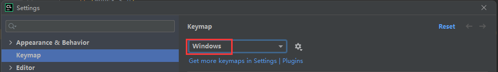

## 电脑键位逻辑

Ctrl  —— 控制、指令。

Shift —— 转换、反向、附加、选择
- 转换：切换大小写字母、切换符号键上方字符或下方字符
- 反向：例如，Tab 键是缩进，Shift+Tab 是反向缩进
- 选择: 例如，我们可以选中一个文件，按住 Shift 再选择另一个文件，那么这两个文件包括它们之间的文件都被选中。

Alt   —— 更改。主要有两类：
- 激活菜单栏
- 配合其他字符按键实现特定功能

Windows 键。与 Windows 操作系统的一些功能和窗口相关。

上面任意四个键位 + 一个其他键位的组合一般都是热键，即频繁使用的键位。一般而言，大部分 IDE 的热键是相同的，建议不要随意修改热键，要熟悉热键。而非热键可以尝试自己用起来顺手的键位。

## 前提

我的 CLione 快捷键风格是 Windows 的，以下快捷键的说明都是基于此的。

  

Red 标注的是编写代码常用的快捷键。
Skyblue 标注的是非 CLion 默认的快捷键，而是我修改后以适应我个人的使用习惯。
Green 标注的是 CLion 中和用户习惯的快捷键有差异的。

## Clion 快捷键

| IDEA 快捷键 | Visual Studio | Type | 功能 | Description
| :-: | :-: | :-: | - | -|
| F2 | - | Edit, 编辑 | 定位错误并显示错误信息 | |
| F3 | - | Find, 查询 | 移动到下一个匹配关键字的位置 | F3 和查询相关。 与 Ctrl + L 是等价的快捷键。|
| Shift + F3 | - | Find, 查询 | 移动到下一个匹配关键字的位置 | 这里 Shift 代表反转。 与 Ctrl + Shift + L 是等价的快捷键。|
| Alt + F3 | - | Find, 查询 | 在当前编辑窗口中查询关键字 | 等价于 Ctrl + F。
| Ctrl + F4 | - | Edit, 编辑 | 关闭当前编辑窗口 | | 
| Alt  + F4 | - | Edit, 编辑 | 关闭 CLion 程序 | | 
| Shift + F6 | - | Edit, 编辑 | 重命名 |
| Alt + 数字 | - | Tool Windows, 工具窗口 | 打开各个工具窗口，也称面板。| 可以不用记哪个数字对应那个窗口，工具窗口大部分都在左下角，点击即可。 即使你将某个窗口取消了固定，也可以用 Ctrl + E 来选择需要打开的工具窗口。  这里我修改了几个窗口的快捷键顺序以适应我个人习惯。

------------------

| IDEA 快捷键 | Visual Studio | Type | 功能 | Description
| :-: | :-: | :-: | - | -|
| Ctrl + | - | Edit, 编辑 | 展开代码 | |
| Ctrl - | - | Edit, 编辑 | 折叠代码 | |
| Ctrl + Backspace | - | Edit, 编辑 | Delete to Word Start, 删除到单词开头 | 从光标开始删除到该单词的开头 Backspace 是往前删除
| Ctrl + Delete | - | Edit, 编辑 | Delete to Word End, 删除到单词结尾 | 从光标开始删除到该单词的结尾 Delete 是往后删除 |
| Alt + Insert | - | Code, 生成代码 | Generate, 生成代码 | 用于快速生成类定义中的构造函数、析构函数、getter、setter、输出运算符(<<)重载、关系运算符(<)重载、等于运算符(==)重载的类函数声明以及实现的框架。
| Shift + Shift | - | 查询 | 查询所有内容，包括类、文件等 |
| Ctrl + ← or → | - | Move, 移动光标 | 在词语内移动光标| 将光标移动到前/后面一个单词 |
| Ctrl + Shift + ← or → | - | Move, 移动光标 | 在词语内移动光标，并选中其中内容 | 没必要死记硬背，这里 Shift 代表选择，移动光标的快捷 + Shift 的默认作用都是将光标移动的这部分选中。|
| Alt + ← or → | - | Move, 切换编辑窗口 | 切换编辑窗口 | 切换到前/后一个窗口 |

------------------

| IDEA 快捷键 | Visual Studio | Type | 功能 | Description
| :-: | :-: | :-: | - | -|
| Ctrl + R | - | Edit, 编辑 | Replace, 替代 | 查找指定内容，并以另一个字符串替代查找的内容。|
| Ctrl + E | - | 查询 | Recent File, 显示最近打开的文件列表 | 包括最近打开的文件、工具窗口(也称面板)。例如，Structure、Git、Terminal 等窗口。
| Ctrl + Y | - | Edit, 编辑 | Delete Line, 删除一行 | - | X Y D: 剪切、删除、复制三兄弟。|
| Ctrl + Alt + Y | - | File | Reload All from Disk, 从硬盘中读取并重新加载。|-
| Ctrl + I | - | Code, 生成代码 | 快速生成实现基类接口的代码框架 | Interface |
| Ctrl + O | - | Code, 生成代码 | 快速生成重写基类方法的代码框架 | Overide |
| Ctrl + P | - | Code, 代码辅助 | 查看方法参数提示 | Parameter |
| Ctrl + Alt + I | - | Code, 修正代码 | 自动调整单行代码的缩进 | 
| Ctrl + \[ | - | Move, 移动光标 | Move Caret to Code Block Start, 将光标移动到代码块起始处 | 移动到代码块的 \{ 处
| Ctrl + Shift + \[ | - | Move, 移动光标 | Move Caret to Code Block Start With Selection, 将光标移动到代码块起始处，并选中这之间的内容 | 移动光标的操作搭配 Shift，默认是选中其中内容。 |
| Ctrl + \] | - | Move, 移动光标 | Move Caret to Code Block End, 将光标移动到代码块结束处 | 移动到代码块的 \} 处
| Ctrl + Shift + \] | - | Move, 移动光标 | Move Caret to Code Block End With Selection, 将光标移动到代码块结束处，并选中这之间的内容 | 移动光标的操作搭配 Shift，默认是选中其中内容。 |
| Ctrl + S | - | File | Save All, 保存所有修改 | 用户普遍的编辑习惯。
| Ctrl + D | - | Edit, 编辑 | 复制当前行 | | CLion 中 X Y D: 剪切、删除、复制三兄弟。D 是 Duplicate(复制) 首字母 |
| Ctrl + F | - | 查询 | 在当前编辑窗口中查询关键字 | 用户普遍的查询习惯。 Clion 中将 Alt + F3 也作为查询快捷键。|
| Ctrl + G | - | 查询 | 跳转到当前窗口中的指定行 |
| Ctrl + J  | - | Code, 生成代码 | Insert Live Template 插入实时模板 | 快速生成 for 循环的框架 
| Ctrl + Alt + L | - | Code, 修正代码 | 代码格式化 | 调整当前编辑窗口中代码的缩进、空行等。|
| Ctrl + Shift + Enter | - | Code, 生成代码 | Complete current statement, 完成当前的语句 | CLion 会自动在结构体、语句等插入必要的尾随逗号、分号等符号以完成一条语句，并将光标移动到下一行。
| Alt + Enter | - | Code, 修正代码 | 代码修正 |
| Ctrl + Z | - | Edit, 编辑 | Undo, 撤销操作 | Ctrl + Z X C V 作为撤销、剪切、复制、粘贴是用户普遍的使用习惯。 Clion 中将 Alt + Backspace 也设置为撤销的快捷键，它们是等价的，看习惯使用即可。
| Ctrl + Shift + Z | - | Edit, 编辑 | Redo, 重做操作 | 这里的 Shift 是反转的意思。在 Clion 中与 Word 里面的习惯不同，Ctrl + Y 不再是重做操作的快捷键，而是删除一行的快捷键，重做操作是加入 Shift 键。 同样的 Alt + Shift + Backspace 也是重做。
| Ctrl + X | - | Edit, 编辑 | Cut, 剪切选中内容，如无选中内容，则剪切当前行 | 用户普遍的编辑习惯。 CLion 中 X Y D: 剪切、删除、复制三兄弟。 X 像把剪刀，所以是剪切。 CLion 中将 Shift + Delete 也设置为剪切的快捷键。
| Ctrl + C | - | Edit, 编辑 | Copy, 复制选中内容，如无选中内容，则复制当前行 | 用户普遍的编辑习惯。 CLion 中将 Ctrl + Insert 也作为复制的快捷键。
| Ctrl + Shift + C | - | Edit, 编辑 | Copy Paths, 复制路径 | 复制文件的绝对路径。 使用方法1：在 Project 面板中选中需要复制的文件，按下快捷键就将这个文件的绝对路径复制下来了； 使用方法2：如果需要复制的文件就是当前编辑的文件，可以直接在编辑窗口中按下快捷键就将当前文件绝对路径复制下来了。|
| Ctrl + Alt + Shift + C | - | Edit, 编辑 | Copy Reference, 复制引用 | 复制所选类、方法或函数的引用，或所选文件的**相对路径**。|
| Ctrl + V | - | Edit, 编辑 | Paste, 粘贴 | 用户普遍的编辑习惯。 CLion 中将 Shift + Insert 也作为粘贴的快捷键。|
| Ctrl + Shift + V | - | Edit, 编辑 | Paster from History clipboards, 从历史剪切板中粘贴。| 可以从过去的剪切板中选择需要粘贴的内容。
| Ctrl + N | - | 查询 | 查询类 | 不用记，可以被 Shift + Shift 代替 |
| Ctrl + . | - | Edit, 编辑 | 选择查找项目并插入点 | 
| Ctrl + / | - | Edit, 编辑 | 注释光标所在行代码 | - 
| Ctrl + Alt + / | - | Edit, 编辑 | 块注释 (/** */) | - |

> 请注意，查询类、文件、方法的快捷键其实可以不用记忆，可以通过双击 Shift，然后按 Tab 键来向后切换到查询类、文件、方法的界面，按 Shift + Tab 键项前切换。