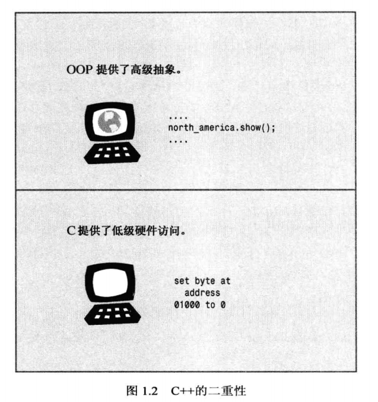
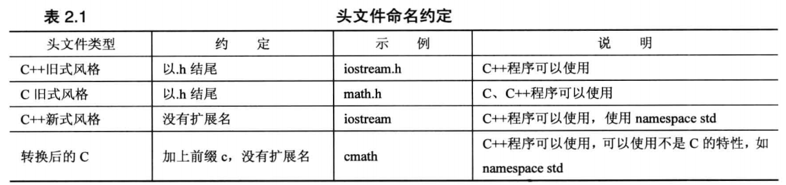
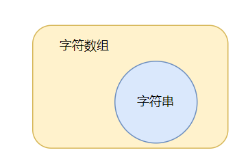
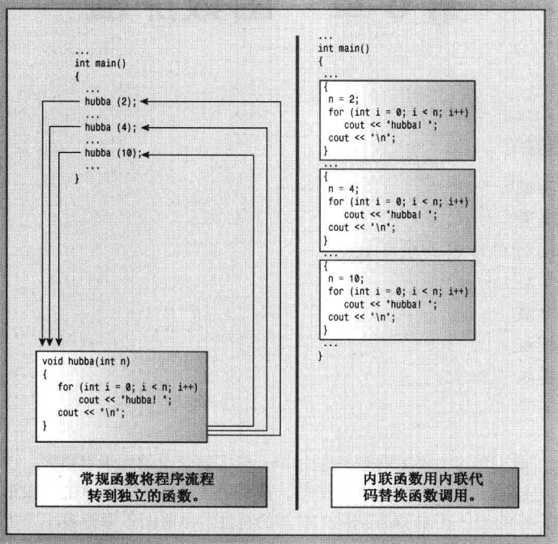

[TOC]

# Unit 1. 基本语法

> 本文默认读者有 C 语言基础，而 C++ 的基本语法和 C 语言差别不大，因此这里只是介绍 C++ 和 C 语言在基本语法上的差异。

## C++ 与 C 语言

C++ 名称中的 ++ 其实就是 C 语言中的递增运算符(++)，这个名称也表明 C++ 是 C 语言的扩充版本，也有的会称呼 C++ 为 C Plus Plus，同时 c++ 的源代码文件也常以 .cpp 结尾。

### C++ 和 C 语言的联系

C++ 在 C 语言的基础上添加了面向对象编程和泛型编程的支持。面向对象编程的特性带来了全新的编程方法，这种方法可以应付复杂程度不断提高的现代编程任务。C++ 的模板特性则提供了另一种全新的编程方法 —— 泛型编程。这也使得 C++ 融合了 3 种不同的编程方式：C 语言传统的**面向过程编程**、C++ 新增的**面向对象编程**(Class)、C++ 模板支持的**泛型编程**。

C++ 在 C 语言的基础上添加面向对象编程(OOP)，这也使得 C++ 既能像 C 语言那样紧密联系硬件，也能使用 OOP 部分将涉及的概念联系起来。




C++ 在 C 语言的基础上添加了面向对象编程和泛型编程这两个编程方式，其实是一个大方向上的变化。C++ 为了支持面向对象编程，新增了异常、运行阶段类型识别等知识；为了支持泛型编程，新增了模板和标准模板库(STL)等知识。

ISO C++ 标准还吸收了 ANSI C 标准，因为 C++ 应尽量是 C 语言的超集，这意味着在理想情况下，任何有效的 C 程序都应是有效的 C++ 程序。但是，需要知道的是，C++ 和 C 语言依旧有一些细节上的差异。

### C++ 与 C 语言的差异

从大方向上看，C++ 在 C 语言的基础上新增了**面向对象编程**和**泛型编程**两大特性，这使得 C++ 新增了很多特性；从语法细节上看，C++ 和 C 语言也有一些差异。其中面向对象编程和泛型编程由于是 C++ 新增的，也是学习 C++ 的时候的重点内容，这里就简单提一下，后面详细讲解。

#### 面向对象编程

针对面向对象编程，C++ 提供了 class 关键字来创建类的声明、允许用户为自定义的类型进行运算符重载、支持函数重载、提供了异常处理机制。

#### 泛型编程

针对泛型编程，C++ 提供了模板编程，可以使用 template 关键字声明模板，并且还封装了标准模板库 STL。

#### 内置基本数据类型的差异 —— bool 类型

C 语言内置的整型数据类型有 char、short、int、long、long long，没有布尔类型，如果想要声明一个布尔类型的变量，需要 `#inclued <stdbool.h>`。导入 stdbool.h 这个头文件之后才可以用 _Bool 来声明一个布尔类型变量，以及使用 true 和 false 表示真假。

而 C++ 将 bool 类型作为内置的基本数据类型，用 true 和 false 表示真假。

#### 变量初始化语法

除了 C 语言支持的初始化方法，C++ 还有 C 语言没有的初始化语法。

```c++
int olws = 1001; // C 语言初始化
int nlws1(1001);   // C++ 初始化
int nlws2 = {1001};// C++
int nlws3{1001};   // C++
```

数组等复合类型变量使用 { } 初始化时也可以省略等号(=)，但不能使用 () 来初始化。

#### C++ 新增字符串 string 类型

除了 C-风格字符串之外，C++ 可以使用 string 类来表示字符串。string 存储字符串比字符数组更灵活。另外 C++11 新增了原始字符串：

```cpp
cout << R"(hello,"Tim", good)" << endl;
// 输出：hello, "Tim", good
```

#### C++ 扩展了结构体

1. C++ 的结构中允许有函数，和 C++ 的 class 的差别在于 struct 的默认访问权限是 public，而 class 的默认访问权限是 private。而 C 语言的结构中不允许有函数，但可以通过声明函数指针的方式来实现。
2. 使用结构描述创建变量时，C++ 可以省略 struct 关键字，而 C 语言不允许省略 struct。

#### 循环语句 —— 新增了一种 for 循环

C++ 新增了基于范围的 for 循环，这简化了一种常见的循环任务：对数组、容器类的每个元素执行相同的操作。例如，打印数组的元素：

```cpp
int arr[10] = {1, 3, 4, 2, 7, 1, 9, 10, 6, 7};
for (int x : arr) {
    std::cout << x << std:: endl;
}
```

如果需要改变元素的值，则需要使用引用：

```cpp
int arr[10] = {1, 3, 4, 2, 7, 1, 9, 10, 6, 7};
for (int &x : arr) {
    x = x << 1; // 修改数组元素，如果声明的 x 不是引用，则此处的修改并不会影响到数组中的元素
}
for (int x : arr) {
    std::cout << x << " "; 
}
std::cout << std:: endl;
```

#### 备选的逻辑运算符

C++ 中可以使用 and、or、not 来代替逻辑运算符 &&、||、!，在 C++ 中 and/or/not 是保留字，不需要像 C 语言那样包含 <iso646.h> 头文件，C++ 不要求使用头文件。

C++ 中 and、or、not 是保留字，虽然不是关键字，但是也不能用作变量名。

#### 函数原型

1. **C++ 不能省略返回值**。C 语言的函数头可以省略返回值，此时默认是 int 类型的返回值。而 C++ 逐步淘汰了这种用法。
2. **参数列表中的 void 的含义不同**。在 C 语言中，参数列表中为空意味着对是否接受参数保持沉默，是否接受参数需要看函数定义，而参数列表中使用 void 表示函数不接受任何参数。而 C++ 中，参数列表中为空和 void 是等效的。

> PS：对于这一点也可以看作是 C 语言不支持函数重载。

函数原型可以确保编译器能够正常处理函数返回值、检查使用的参数数目是否正确、使用的参数类型是否正确。对于参数类型不匹配的情况，C++ 和 C 语言的处理方式不同。例如，如果函数参数是 int 类型(假设是 32 位)，而程序员传递了一个 double 类型(假设 64 位)的参数。C 语言会检查 double 的前 32 位，并试图将其解释为一个 int 值。C++ 则是自动将传递的值转换为原型中指定的类型，条件是两者都是算术类型。但是 C++ 的自动类型转换也不能避免所有可能的错误，仅当有意义时，原型才会类型转换。

#### 函数参数的传递机制

C++ 在 C 语言的值传递和引用传递的基础上新增了引用传递。

**引用和指针的区别**：

1. 引用必须在声明时进行初始化，且一旦绑定对象就不能再和其他对象绑定了，对于这一点可以将引用视为指针常量；

2. 引用一定不为空；

3. 引用效率比指针更高，因为指针还需要分配内存，而引用不需要。

4. 在函数声明使用引用形式的形参，使用函数时需要注意，如果传递的实参是非左值或者与引用参数类型不匹配的值时，实际上是传递了临时变量，这样在函数中修改这个变量不会影响实参的值。 —— 《C++ Primer Plus》262 页，将引用用作函数参数。

#### 函数参数的默认值

C++ 支持函数参数使用默认值，使用默认值时需要注意不要和函数重载冲突。

#### 函数重载

C++ 支持函数重载和运算符重载。

**函数重载**：函数名相同，参数列表不同的函数就是重载。

**运算符重载**：除成员访问运算符 (.)、成员指针访问运算符 (*)、域运算符 (::)、长度运算符 (sizeof)、条件运算符 (?:) 这五个运算符之外的其他运算符都可以被重载。前两个运算符不能重载是为了保证访问成员的功能不能被改变，域运算符和 sizeof 运算符的运算对象是类型而不是变量或一般表达式，不具备重载的特征。

#### 内联函数

C++ 新增内联函数替代宏函数，后来 C 语言也引入了内联函数。同样的，C++ 使用 const 关键字声明常量来代替宏定义，后来 C 语言也引入了 const 关键字。

#### 函数模板

这是 C++ 支持泛型编程而提供的新特性。

#### 动态分配内存

**首先，C++ 中使用 malloc() 等动态分配内存的库函数时，类型转换更加严格**。

在 C 语言中允许将 void* 类型的数据赋值给其他类型的指针

```c
int* p = malloc(10 * sizeof(int)); // 允许
free(p);
```

在 C++ 中将 void* 类型的数据赋值给其他类型的指针必须使用强制类型转换

```cpp
int* p = malloc(10 * sizeof(int)); // 不允许
int* q = (int*) malloc(10 * sizeof(int)); // 允许
free(q);
```

**其次，C++ 可以使用 new 和 delete 运算符来申请和释放内存**。

#### auto 关键字

C 语言中 auto 关键字用来表示声明的变量是自动存储类型的变量，而 C++ 中 auto 关键字表示自动类型变量，可以根据初始化的值来判断变量的类型。

另外，C++11 使用 auto 进行后置返回类型声明来解决函数模板的一些问题。

```cpp
template <typename T1, typename T2>
auto f(T1 & x, T2 & y) -> decltype(x + y); 
```

#### register 关键字

在 C 语言中，register 关键字用来建议编译器使用 CPU 寄存器来存储自动变量，被 register 修饰的变量无法取地址。

在 C++11 之前，register 关键字的用法始终未变，但是在 C++11 中，关键字 regitster 只是显式地指出变量是自动的，这与 auto 以前的用途完全相同。

#### const 关键字

在 C++ 中，const 全局变量的链接性为内部的，也就是说，在 C++ 看来，全局 const 定义就像使用了 static 说明符一样。

```cpp
const int a = 10;
// 上面的语句和下面的语句等价
static const int a = 10;
```

#### 作用域运算符(::)

C++ 比 C 语言更进一步 —— 它提供了作用域解析运算符(::)。放在变量名前面时，该运算符表示使用变量的全局版本。

#### 头文件命名

**C 语言的头文件都是以 h 作为后缀扩展名**。例如，math.h、stdio.h、stdlib.h 等。这种方式可以通过文件名称识别文件类型为头文件。

**C++ 的头文件没有扩展名**，有些 C 语言的头文件被转换为 C++ 头文件，这些文件的扩展名会被去掉，并添加了 c 作为前缀。例如，C++ 版本的 math.h 为 cmath。对于纯粹的 C++ 头文件而言，去掉 h 不只是形式上的变化，没有 h 的头文件可以包含名称空间。

> PS：名称空间也是 C++ 的一个新特性。



由于 C 语言使用不同的文件扩展名来表示不同文件类型，因此用一些特殊的扩展名来表示 C++ 头文件是有道理的，C++ 标准制定委员会也这样认为。但问题在于究竟使用哪种扩展名，因此最终他们一致决定同意不使用任何扩展名。

## 复合类型

C++ 和 C 语言一样有数组、字符串、指针、结构体、共用体、枚举这些复合类型，它们的基本使用都是差不多的。

### 数组

和 C 语言一样，C++ 的数组也是存储**多个相同类型**的数据格式。

**数组声明:**

```c
typeName arrayName [Size];
```

**数组初始化:**

1. 延续 C 语言部分：只有在声明数组时才可以初始化，此后就再也不能初始化了。不允许用数组直接给另一个数组赋值。可以使用列表初始化。初始化数组时，提供的值少于数组元素数目，省略的元素被设置为 0。

2. C++ 新增部分：

   首先，初始化数组时可以省略等号(=)。

    ```c
    int arr[10] {1, 23, 43, 2}; // C++ 允许
    ```
    其次，可以不在大括号中包含任何东西，这将所有元素都设置为 0。(现在很多 C 编译器也允许这样做)

    ```c
    int arr[10] {}; // C++将arr的所有数组元素都设置为0.
    ```
    第三，列表初始化禁止缩窄转换。

    ```cpp
    int arr1[] = {25, 92, 3.0}; // C++不允许
    char arr2[]  {'h', 11223344, '\0'}; // C++ 不允许
    char arr3[]  {'h', 112, '\0'}; // C++ 允许
    ```
	在上述代码中，第一条语句不能通过编译，因为将浮点型转换为整型是缩窄操作，即使浮点数小数点后面是 0，也不可以。第二条语句也不能通过编译，因为 11223344 超过了 char 类型能表示的范围。第三条语句可以通过编译，虽然 112 是一个 int 值，但它在 char 变量的取值范围内。


**数组访问**

可以使用下标作为索引来进行数组访问，下标从 0 开始计数。

**数组替代品**：

C++ 标准模板库 (STL) 提供了一种数组的替代品 —— 模板类 vector，并且 C++11 新增了 array 模板类。这些替代品比内置复合类型数组更复杂、更灵活。

### 数组的替代品

模板类 vector 和 array 都是数组的“替代品”。

#### vector

模板类 vector 类似于 string 类，也是一种动态数组。可以在运行阶段设置 vector 对象的长度，可以在末尾添加新数据，还可以在中间插入新数据。基本上，它是使用 new 创建动态数组的替代品。实际上，vector 类确实是用 new 和 delete 管理内存的，但这个工作是自动完成的。

这里只是简单介绍一下如何使用 vector。首先，要使用 vector 对象，必须包含头文件 vector。其次，vector 包含在名称空间 std 中，因此您可以使用 using 编译指令，using 声明或者 std::vector。第三，模板使用不同的语法来指出它存储的数据类型。第四，vector 类使用不同的语法来指定元素数。

```cpp
#include <vector>
#include <iostream>
using namespace std;
int main()
{
    vector<int> vi;
    int n;
    cin >> n;
    vector<double> vd(n);
}
```

下面的声明创建一个 vector 对象，它可以存储 n_elem 个类型为 typeName 的元素：

```cpp
vector<typeName> varName(n_elem);
```

#### arary

vector 类的功能比数组强大，但付出的代价就是效率稍低。如果您需要的是长度固定的数组，使用数组是最佳的选择，但代价是不那么方便和安全。有鉴于此，C++11 新增了模板类 array，它也位于名称空间 std 中。与数组一样，array 对象的长度也是固定的，也使用栈，而不是堆，因此其效率与数组相同，但更安全、方便。

```cpp
#include <array>
using namespace std;
int main()
{
    array<int, 10> arr = {1, 3, 4};
    return 0;
}
```

声明 array 的通用格式：

```cpp
array<typeName, n_elem> varName;
```

和声明 vector 对象不同，n_elem 不能是变量。

在 C++11 中可以将列表初始化用于 vector 和 array 对象，但在 C++98 中，不能对 vector 这样做。

#### 模板类和数组的比较

首先，无论是数组、vector 对象还是 array 对象都可以使用标准数组表示法来访问各个元素。

其次，array 对象和数组存储在栈中，而 vector 存放在堆中。

第三，可以将一个 array 对象赋值给另一个 array 对象，而数组不可以。

### 字符串

字符串是存储在内存的连续字节中的一系列字节。C++ 处理字符串的方式有两种 —— 来 C 语言的 C-风格字符串，以及 C++ 基于 string 类库的方法。

#### C 风格字符串

存储在连续字节中的一系列字符意味着可以将字符存储在 char 数组中，其中每个字符都位于自己的数组元素中。字符串提供了一种存储文本信息的便捷方式。

C-风格字符串有一种特殊的性质：以空字符串 ('\0') 结尾，空字符的 ASCII 码为 0，用来标记字符串的结尾。因此 C-风格字符串是一种特殊的字符数组 —— 以空字符串为结尾的字符数组。



```c
char arr1[] = {'h', 'e', 'l', 'l', 'o'}; // 是字符数组，不是字符串
char arr2[] = {'h', 'e', 'l', 'l', 'o', '0'}; // 是字符数组，也是字符串
```

这两个数组都是字符数组，但只有第二个是字符串。空字符对 C-风格字符串至关重要，C++ 很多处理字符串的函数，其中包括 cout 对象使用的哪些函数。它们的处理逻辑都是逐个处理字符串中的字符，直到处理到空字符为止。因此，用 cout 处理 arr1 将会多显示一些我们不需要的字符，直到它遇到空字符为止。

> 虽然字符串是字符数组的子集，但是在编程中见到的基本都是字符串，字符串的使用比不是字符串的字符数组要频繁的多。

**字符串初始化**：

可以使用一种简洁的字符串初始化的方法 —— 字符串常量(也称字符串字面量)。字符串常量是由双引号括起来的字符串。双引号括起来的字符串隐式包含结尾的空字符，所以不必显式的包含它。

```c
char arr[] = "Hello, World"; // 字符串
```

> PS：再确定存储字符串所需的最短数组时，别忘了将结尾的空字符计算在内。

#### string 类

ISO/ANSI C++98 标准通过添加 string 类扩展了 C++ 库，因此现在可以用 string 类的对象代替字符数组来存储字符串。string 类使用起来比数组简单，同时提供了将字符串作为一种数据类型的表示方法。

要使用 string 类，必须在程序中包含 string 头文件，string 类位于名称空间 std 中，因此还必须提供一条 using 编译指令，或者用 std::string 来引用它。string 类隐藏了字符串的数组性质，可以像处理普通变量那样处理字符串。在很多方面，使用 string 对象的方式与使用字符数组相同。

1. 1. 可以使用 C-风格字符串来初始化 string 对象。
   2. 可以使用 cin 来将键盘输入存储到 string 对象中。
   3. 可以使用 cout 来显示 string 对象。
   4. 可以使用数组表示法来访问存储在 string 对象中的字符。

string 对象和字符数组之间的主要区别是，可以将 string 对象声明为简单变量，而不是数组。string 类设计为可以让程序能够自动处理 string 的大小。这使得与使用数组相比，使用 string 对象更方便，也更安全。从理论上来说，可以将 char 数组视为一组用于存储一个字符串的 char 存储单元，而 string 类变量是一个表示字符串的实体。

#### 原始字符串

在 C++11 中新增了一种类型 —— 原始字符串。在原始字符串中，字符表示的就是自己，例如，序列 \n 不再代表换行符，而是代表两个常规字符 —— 斜杠和 n。原始字符串使用前缀 R 来表示，并用 "( 和 )" 作为定界符。

```cpp
cout << R"(Jim "King" Tutt uses \n instead of  endl.)";
```

上述代码将显示：Jim "King" Tutt uses "\n" instead of  endl.

### 结构体

数组是存储多个相同类型数据，而结构可以存储多种类型数据的数据格式。例如，要存储有关篮球运动员的信息，则可能需要存储他的姓名、工资、身高、体重、平均得分、命中率、助攻次数等。可以通过结构将这些信息存储在一个单元中，而数组不能，因为数组虽然可以存储多个元素，但是所有元素的类型必须相同。

结构是用户定义的类型，而结构声明定义了这种类型的数据属性。创建结构包括两步，首先，定义结构描述，然后按描述创建结构变量。

```cpp
struct Student {
    char name[20];
    int age;
};
int main(void) {
    Student stu = {"Zhang San", 14};
    return 0;
}
```

和 C 语言不同，C++ 允许在声明结构变量时省略关键字 struct。在 C++ 中，结构标记的用法与基本类型名相同，这种变化强调的是，结构声明创建了一种新类型。

通过成员运算符(.)来访问各个成员，就像通过索引能访问数组元素一样。顺便说一句，访问成员函数的方式就是从访问结构的成员变量的方式衍生的。

### 共用体

共用体也是一种数据格式，它能够存储不同的数据类型，但只能同时存储其中的一种类型。也就是说，结构可以同时存储 int、long 和 double，共用体只能存储 int、long 或 double。共用体的句法与结构相似，但含义不同。

共用体的用途之一是，当数据项使用两种或更多种格式(但不会同时使用)时，可以使用共用体来节省空间。

### 枚举

枚举提供了另一种创建符号常量的方式，这种方式可以代替 const。它还允许定义新类型，但必须按照严格的限制进行。枚举的句法和使用结构相似。

```cpp
enum color {red, orange, yellow, green, blue, voilet};
```

上述语句完成了两项工作：1. 让 color 成为新类型的名称；将 red,yellow,voilet 等作为符号常量，对应整数值 0~5，这些常量叫做枚举量。


I. 默认情况下，将第一个枚举量被赋值为 0，此后的枚举量的值依次加一。也可以显式对枚举量赋值。

```cpp
enum color { red, orange, yellow, green, blue, voilet };
// red=0, orange=Unit1, yellow=Unit2, green=Unit3, blue=Unit4, voilet=Unit5
enum week { monday=3, tuesday, wednesday=2, thursday, friday=-1, saturday, sunday};
// monday=Unit3, tuesday=Unit4, wednesday=Unit2, thursday=Unit3, friday=-Unit1, saturday=0, sunday=Unit1
```

II. 枚举中，可以有值相同的枚举量 (例如，monday 和 thursday)。

III. 枚举量可以赋值给 int 类型变量，但 int 类型不能自动转换为枚举类型。即不能直接将整型数值赋值给枚举类型的变量。

```cpp
enum color tmp1 = red; // ok
enum color tmp2 = 3;   // 不被允许
enum color tmp3 = (enum color) 4; // 使用强制类型转换，ok
```

IV. 枚举类型只定义了赋值运算符，具体地说，没有为枚举定义算术运算。

V. 枚举值只能是整数。

> C++ 提供了一种新的枚举，将在学习类相关知识时进行介绍。

### 指针

指针是一个变量，该变量存储的是地址，而不是值本身。指针是 C++ 内存管理编程理念的核心。

#### 动态内存分配

可以将指针初始化为变量的地址，变量是在编译时分配的有名称的内存，而指针的这种用法只是为可以通过名称直接访问的内存提供了一个别名来间接访问。

指针的真正用武之地在于，在运行阶段分配未命名的内存以存储值。在这种情况下，只能通过指针来访问内存。在 C 语言中，可以用库函数 malloc() 来分配内存，在 C++ 中依旧可以这样做，但是 C++ 有更好的方法 —— new 运算符。程序员使用 new 运算符时需要告诉 new，需要为那种类型分配内存，new 将会根据这种类型需要的内存找到一个正确的内存块，并返回该内存的地址。程序员的职责是将该地址赋值给一个指针：

```c
int* p = new int;
```

为一个数据对象获得并指定分配内存的通用格式为：`typeName* poniter_name = new typeName;`，需要在两个地方指定数据类型：用来声明合适的指针和指定需要什么样的内存。

**重点知识**：new 分配的内存块通常与常规变量声明的内存块不同。变量存储在栈(stack)中，而 new 从被称为堆(heap)或自由存储区(free store)的内存区域分配内存。因此，指针变量 p 位于 stack 中，而 p 指向的地址位于 heap 中。


和 stdlib.h 库中的 malloc() 库函数分配内存之后需要用 free() 来释放不需要的内存一样，C++ 提供了 delete 运算符来释放 new 运算符申请的内存，这样在使用完内存之后，能够将其归还给内存池，这是有效使用内存的关键一步。如果只申请内存，在使用完之后不释放内存，就会发生**内存泄漏**(memory leak)，也就是说，被分配的内存再也无法使用了。

**注意**：1. 只能用 delete 来释放 new 申请的内存；2. 不要释放已释放的内存块，这样做的结果是不确定的；3. 对空指针使用 delet 是安全的。

**建议**：一般来说，不要创建两个指向同一块内存块的指针，因为这样将会增加错误地删除同一个内存块两次的可能性。

#### 动态数组

对于大型数据，如数组、字符串、结构，应该使用 new，这正是 new 的用武之地。例如，假设要编写一个程序，它是否需要数组取决于运行时用户提供的信息。如果通过声明来创建数组，则程序被编译时将会给它分配内存空间。不管程序最终是否使用数组，数组都会在那里占据内存。

在编译时给数组分配内存被称为静态联编，意味着数组是在编译时加入到程序中的。但使用 new 时，如果在运行阶段需要数组，则创建它，如果不需要，则不创建它，还可以在运行时选择数组的长度，这称为动态联编。这意味着数组是在程序运行时创建的，这种数组称为动态数组。


在 C++ 中，创建动态数组很容易，只要将数组的元素类型和元素数目告诉 new 即可。必须在类型名后面加上方括号，其中包括元素数目。例如，要创建一个包含 10 个 int 元素的数组，可以这样做：

```cpp
int* p = new int [10];
```

对于动态数组，释放时使用 delete[] ：

```cpp
delete [] p;
```

方括号告诉程序，应释放整个数组，而不仅仅是指针指向的元素。如果使用 new 的时候不带 []，则使用 delete 时也不应带 []；如果使用 new 时带 []，则使用 delete 时也应带 []。

#### 注意事项总结

- 不要使用 delete 释放不是 new 分配的内存。
- 不要使用 delete 释放同一个内存两次。
- 如果使用 new[] 为数组分配内存，则应该使用 delete [] 来释放。
- 如果使用 new 为一个实体分配内存，则应该使用 delete 来释放。
- 对空指针应用 delete 是安全的。
- 不能用 sizeof 运算符来确定动态分配的数组包含的字节数。

指针是功能最强大的 C++ 工具之一，但也最危险，因为它们允许执行对计算机不友好的操作。

#### 指针和数组的区别

区别 1：可以修改指针值，但不能修改数组名，数组名是常量。

区别 2：对数组名应用 sizeof 运算符得到的是数组的长度，而对指针应用 sizeof 运算符得到的是指针的长度，即使指针指向的是一个数组。而指针的长度在 64 位系统中为 8 字节，在 32 位系统中为 4 字节。

## 函数探幽

前面的知识中，C++ 和 C 语言的差别其实并不大，C++ 只是新增了 bool 类型变量、const 关键字、变量初始化方法、修改了 auto 关键字的作用。

> PS：C 语言后来也引入了 const 关键字，_Bool 类型。

在函数这里，C++ 提供了很多新的函数特性，包括内联函数、按引用传递变量、默认参数值、函数重载以及模板函数。函数是进入加加 (++) 领域的重要一步。

### 内联函数

内联函数是 C++ 提高程序运行速度所做的一项改进。常规函数和内联函数之间的区别不在于编写方式，而在于 C++ 编译器如何将它们组合到程序中。

**定义内联函数需要在函数声明和函数定义前面加上关键字 inline**，但由于内联函数通常都是比较简短的，因此，通常的做法是省略函数原型，而是将整个函数定义放到本应提供函数原型的地方。



C++ 新增的内联函数和 C 语言中宏函数的定位很相似，但内联函数和宏函数是有差别的。

在使用上比宏函数安全的多，内联函数采用函数的值传递的方式来传递参数，而宏函数则是文本替换的方式传递参数，这导致定义宏函数时需要非常小心，否则使用时可能出现偏差。

程序员定义一个内联函数时，只是请求将函数作为内联函数，编译器并不一定满足这种要求(可以参考 C 语言中的 register 关键字)。编译器可能会认为该函数过大或注意到函数调用了自己(内联函数不能递归)，因此可能会出现即使程序员声明时使用了 inline 关键字，但是编译器并不将其作为内联函数的情况。而有些编译器可能并没有启动或实现这种特性。

> C 语言后来也增加了 inline 关键字，新增内联函数的特性。

### 引用变量

**什么是引用？**

C++ 新增了一种符合类型 —— 引用变量，引用是已定义的变量的别名。

**如何声明引用？**

```c
Type & name = var;
```

在声明引用变量时，必须进行初始化，并且不能为 null，一旦关联某个变量，就不能再关联其他变量。引用更像是指针常量。

**引用有什么用？**

引用常用作函数参数，这种传递参数的方式叫做引用传递。

在函数中使用引用参数的主要原因有两个：1. 程序员能够修改调用函数中的数据对象；2. 通过传递引用而不是整个数据对象，可以提高程序的运行速度。


**什么时候用引用？**

对于使用传递的值，而不需要修改的函数：

- 如果数据对象很小，如内置数据类型或者小型结构，使用**按值传递**。
- 如果数据对象是数组，则只能使用**指针**，因为这是唯一的选择，并且需要声明为常量指针。
- 如果数据对象是较大的结构，则使用**常量指针**或者**常引用**，以提高程序效率。这样可以节省复制结构所需的时间和空间。
- 如果数据对象是类对象，则推荐使用**常引用**。类设计的语义常常要求使用引用，这是 C++ 新增这项特性的主要原因。因此，传递类对象参数的标准方式是按引用传递。

对于需要修改调用函数中数据的函数：

- 如果数据对象是内置数据类型，使用**指针**，这样在函数调用时可以很清楚的区分该函数是不是会修改这个数据对象**。**
- 如果数据对象是数组，则只能使用**指针**。
- 如果数据对象是结构，则使用**指针**或者**引用**都可。
- 如果数据对象是类对象，则推荐使用**引用**。

### 函数的默认参数

默认参数是 C++ 的另一项新内容。**默认函数是指当函数调用中省略了实参时自动使用的一个值**。例如，如果将 void wow(int n) 设置成 n 的默认值为 1，则函数调用 wow() 相当于 wow(1)，这极大地提高了程序使用函数的灵活性。而如果我们需要传递的参数不是 1，而是 4，这可以使用 wow(4) 来调用，4 会覆盖默认值 1。


如何设置默认值？必须通过函数原型来设置默认值！因为编译器是通过函数原型来了解函数所使用的参数数目的，因此函数原型必须将可能的默认参数告知编译器。方法是**将默认值赋值给函数原型中的参数**，函数定义不需要改变。

```cpp
char * left(const char * str, int n = 1);
```

调用上面的函数时，如果不传递参数 n，则它的值默认为 1；否则，传递的值将覆盖 1。


需要注意的点：**对于带参数列表的函数，必须从右向左添加默认值**。这也意味着，如果要为某个参数设置默认值，则必须为它右边的所有参数提供默认值。

```cpp
int harpo(int n, int m = 4, int j = 5); // 有效
int chico(int n, int m = 4, int j); // 无效
```

harpo 原型允许调用该函数时提供 1、2 或者 3 个参数：

```cpp
int tmp;
tmp = harpo(1);       // 等价于 harpo(Unit1, Unit4, Unit5);
tmp = harpo(2, 6);    // 等价于 harpo(Unit2, Unit6, Unit5);
tmp = harpo(3, 7, 8); // 没有使用默认参数
```

默认参数并非编程方面的重大突破，而只是提供了一种便捷的方式。在设计类的时候会发现，通过使用默认参数，可以减少需要定义的析构函数、方法以及方法重载的数量。

### 函数重载

函数多态是 C++ 在 C 语言的基础上新增的功能。在 C 语言中，函数名不能重名，而 C++ 中允许声明多个同名的函数。

- **默认参数**使得 C++ 能够使用不同数目的参数调用同一个函数。
- **函数重载**使得 C++ 能够使用多个同名的函数。
- **函数重写**子类重新定义父类中有相同名称和参数的虚函数 —— 在学习 class 的时候讲解。

函数重载和函数重写是不同的概念，只是名称有些类似而已。


术语“函数多态”指的是函数有多种形式；术语“函数重载”指的是可以有多个同名函数，因此对名称进行了重载。这两个术语指的是一回事，但我们通常使用函数重载。可以通过函数重载来设计一系列函数 —— 它们完成相同的工作，有着相同的函数名，使用不同的参数列表。


函数重载的关键是函数的参数列表 —— 也称为**函数特征标**。**如果两个函数的参数数目和类型相同，同时参数的排列顺序也相同，则它们的特征标相同，而变量名和返回值是无关紧要的**。C++ 允许定义名称相同的函数，条件是它们的特征标不同：

```cpp
void print(int a, int b);    // #Unit1
void print(int c, int d);    // #Unit2
int print(int a, int b);     // #Unit3
void print(int a, double b); // #Unit4
void print(double a, int b); // #Unit5
void print(int a);           // #Unit6
```

\#2 和 #3 不满足函数重载条件，它们和 #1 的特征标相同。

\#4 和 #5 是函数重载，它们的参数类型和数目相同，但是参数顺序不同，是不同的特征标。


**注意**：有些看起来彼此不同的特征标是不能共存的，请从编译器角度考虑。例如，编译器将把类型引用和类型本身视为同一个特征标。

虽然函数重载很吸引人，但也不要滥用。仅当函数基本上执行相同的任务，但是使用不同形式的数据时，才应该采用函数重载。


简单了解：C++ 编译器编译程序时，编译器会执行一些神奇的操作 —— 名称修饰或名称矫正，它根据函数原型中指定的形参类型对每个函数名进行加密。

```cpp
long f(int a, double b); // 函数原型
?f_int_double();// 编译器处理
long f(double a, int b); // 函数原型
?f_double_int();// 编译器处理
```

这只是举了个例子，实际中的编译器可能是用一系列无意义的符号来对参数类型和数目进行编码的，而且修饰时使用的符号因编译器而定。

### 函数模板

现在的 C++ 编译器实现了 C++ 新增的一项特性 —— 函数模版。

函数模版是通用的函数描述，也就是说，它们使用泛型来定义函数。其中泛型可以用具体的类型来替换。通过将类型作为参数传递给模版，可以使得编译器生成该类型的函数。

#### 建立模版声明

```cpp
template <typename T>
void swap(T& a, T& b) {
    T tmp;
    tmp = a;
    a = b;
    b = tmp;
}
```

第一行指出要创建一个模版，并将类型命名为 T。关键字 template 和 typename 是必须的，除非用 class 代替 template。另外，必须用尖括号。上面代码中使用的类型名 T 可以随意起名，只要遵守 C++ 命名规则即可。

模版并不会创建任何函数，而只是告诉编译器如何定义函数。当需要交换 int 类型的函数时，编译器将根据模版创建这样的函数，并用 int 代替 T。

在 C++98 标准添加 typename 关键字之前，C++ 一直是使用 class 来创建模版。也就是说，也可以这样编写模版定义：

```cpp
template <class K>
void swap(K& a, K& b) {
    K tmp;
    tmp = a;
    a = b;
    b = tmp;
}
```

#### 函数模板重载的演示

```cpp
#include <iostream>

template <typename T>
void swap(T &, T &);

template <typename T>
void swap(T * a, T * b, int c);

template <class T>
void show_arr(T * arr, int n = 10);
int main(void) {
    int a = 10, b = 20;
    // use swap(T &, T &) generates swap(int &, int &)
    std::cout << "a = " << a << ", b = " << b << std::endl;
    swap(a, b);
    std::cout << "a = " << a << ", b = " << b << std::endl;
    double c = 2.9, d = -9.7;
    std::cout << "c = " << c << ", d = " << d << std::endl;
    swap(c, d);
    std::cout << "c = " << c << ", d = " << d << std::endl;

    int arr_a[10] = {1, 3, 5, 7,  9, 11, 13, 15, 17, 19};
    int arr_b[10] = {2, 4, 6, 8, 10, 12, 14, 16, 18, 20};
    std::cout << "arr_a:";
    show_arr(arr_a, 10);
    std::cout << "arr_b:";
    show_arr(arr_b);
    swap(arr_a, arr_b, 10);
    std::cout << "arr_a:";
    show_arr(arr_a);
    std::cout << "arr_b:";
    show_arr(arr_b);
    return 0;
}

template <typename T>
void swap(T & a, T & b) {
    T temp = a;
    a = b, b = temp;
}

template <typename T>
void swap(T * a, T * b, int n) {
    T temp;
    for (int i = 0; i < n; i++) 
        temp = a[i], a[i] = b[i], b[i] = temp;
}

template <class T>
void show_arr(T * arr, int n) {
    for (int i = 0; i < n; i++) 
        std::cout << arr[i] << " ";
    std::cout << std::endl;
}
```

上面的程序演示了默认参数、函数重载、函数模版的混合使用。

注意：模版不能缩短可执行程序，而是像手工方式定义了独立的函数一样。最终的代码中不包含任何模版，而只包含了为程序生成的实际函数。使用模版的好处是，它使得生成多个函数定义更简单、可靠。

更常见的情形是，将模版放在头文件中，并在需要使用模版的文件中包含该头文件。

#### 函数模板的局限性

假设有以下模版函数：

```cpp
template <class T>
void f(T a, T b)
{ ... }
```

通常，代码假定执行某些操作。例如，a = b 就假定使用的数据类型已经定义了赋值。但如果 T 是数组类型，这种假定就不成立。a < b 同样假定使用的数据类型已经定义了 <，但如果 T 为结构，该假设不成立。另外，数组名虽然定义了 <，但是数组名比较的是地址，这可能不是我们想要的。


总之，编写的模版函数很可能无法处理某些类型。另一方面，有时候通用化是有意义的，但 C++ 语法不允许这样做。例如，将两个包含位置坐标的结构相加是有意义的，虽然没有为结构定义运算符 +。一种解决方案是，C++ 允许您重载运算符 +，以便能够将其用于特定的结构或类。这样使用运算符 + 的模版便可以处理重载了运算符 + 的结构。另一种解决方案是，为特定类型提供具体化的模版定义。

#### 函数模板的具体化

假设定义了如下的结构：

```cpp
struct job {
    char name[40];
    double salary;
    int floor;
};
```

另外，假设希望能够交换两个这种结构变量的内容，原来的模版使用下面的代码来进行交换：

```cpp
temp = a;
a = b;
b = temp;
```

由于 C++ 允许将一个结构赋值给另一个结构，因此即使 job 是一个结构体，上述代码也适用。但是，如果只想交换 salary 和 floor 成员，而不交换 name 成员，则需要使用不同的代码，但是 swap() 的参数将保持不变，因此无法使用函数模版重载来提供其他的代码。

然而，可以提供一个具体化的函数定义 —— 称为显式具体化，其中包含所需的代码。当编译器找到与函数调用匹配的具体化定义时，将使用该定义，而不再寻找模版。


具体化机制随着 C++ 的演变而不断变化。C++ 98 选择了下面的方法：

- - 对于给定的函数名，可以有非模版函数、模版函数和显式具体化模板函数以及它们的重载版本。
  - 显式具体化的原型和定义应该以 template<> 打头，并通过名称来指出类型。
  - 具体化优先于常规模板，而非模板函数优先于具体化和常规模板。

```cpp
// job 的非模板函数
void swap(job &, job &);
// job 的常规模板函数
template <typename T>
void swap(T &, T &);
// job 的具体化模板
template <> void swap<job>(job &, job &);
// <job> 是可选的，与下面的函数原型等价
template <> void swap(job &, job &);
...
template <typename T>
void swap(T &, T &);
template <> void swap<job>(job &, job &);
int main(void) {
 	double u, v;
    ...
    swap(u, v);// 使用通用模板 
    job a, b;
    swap(a, b);// 使用job具体化模板
    return 0;
}
template <typename T>
void swap(T &, T &) {
    ...
}
template <> void swap<job>(job &, job &) {
    ...
}
```

#### 模板的实例化与具体化的辨析

```cpp
template <typename T>
void swap (T & a, T & b);

template <> void swap<int>(int & a, int & b); // 显式具体化
template void swap<double>(double &a, double &b); // 显式实例化

int main (void) {
  ...
}

template <> void swap<int>(int &a, int &b) {
	...
}
```

显式实例化是使用 swap 的模板函数生成一个使用 double 类型的实例，也就是说，该声明的意思是“使用 swap() 模板生成 double 类型的函数定义”。

显式具体化的意思是“不要使用 swap() 模板生成函数定义，而应该使用专门为 int 类型显式定义的函数定义”。

> 警告：试图在同一个文件中使用同一种类型的显式实例和显式具体化将出错。

#### 函数模板的发展

在C++发展的早期，大多数人都没有想到模板函数和模板类会有这么强大而有用，它们甚至没有就这个主题发挥想象力。但聪明而专注的程序员挑战模板技术的极限，阐述了各种可能性。根据熟悉模板的程序员提供的反馈，C++98标准做了相应的修改，并添加了标准模板库。从此以后，模板程序员在不断探索各种可能性，并消除模板的局限性。C++11标准根据这些程序员的反馈做了相应的修改。下面介绍一些相关的问题及其解决方案。


**1.是什么类型**

在C++98中，编写模板函数时，一个问题是并非总能知道应在声明中使用哪种类型。请看下面这个不完整的示例：

```cpp
template<class T1, class T2> 
void ft(T1 x, T2 y) {
	...
	?type? xpy = x + y;
    ...
}
```

xpy 应为什么类型呢？由于不知道 ft() 将如何使用，因此无法预先知道这一点。正确的类型可能是 T1、T2 或其他类型。例如，T1 可能是 double，而 T2 可能是 int，在这种情况下，两个变量的和将为 double 类型。T1 可能是 short，而 T2 可能是 int，在这种情况下，两个变量的和为 int 类型。T1 还可能是 short，而 T2 可能是 char，在这种情况下，加法运算将导致自动整型提升，因此结果类型为 int。另外，结构和类可能重载运算符 +，这导致问题更加复杂。因此，在 C++98 中，没有办法声明 xpy 的类型。


**2.关键字 decltype ( C++11 )**

C++11 新增的关键字 decltype 提供了解决方案。可以用 decltype() 代替数据类型来声明变量。例如，可以这样使用该关键字: 

```cpp
int x;
decltype(x) y; // make y the same type as x
```

给 decltype 提供的参数可以是表达式，因此在前面的模板函数 ft() 中，可使用下面的代码：

```cpp
decltype(x + y) xpy; // make xpy the same type as x + y
xpy = x + y;
```

另一种方法是，将这两条语句合而为一：

```cpp
decltype(x + y) xpy = x + y;
```

因此，可以这样修复前面的模板函数 ft():

```cpp
template<class T1, class T2> 
void ft(T1 x, T2 y) {
	...
	decltype(x + y) xpy = x + y;    
    ...
}
```

decltype 比这些示例演示的要复杂些。为确定类型，编译器必须遍历一个核对表。假设有如下声明： 

```cpp
decltype(expression) var;
```

则核对表的简化版如下：

**第一步：如果expression是一个没有用括号括起的标识符，则var的类型与该标识符的类型相同，包括const等限定符**：

```cpp
double x = 5.5;
double y = 7.9;
double &rx = x;
const double * pd;
decltype(x) w; // w is type double
decltype(rx) u = y; // u is type double & 
decltype(pd) v; // v is type const double *
```

**第二步：如果expression是一个函数调用，则var的类型与函数的返回类型相同**：

```cpp
long indeed(int);
decltype (indeed(3)) m; // m is type int
```

> 注意：并不会实际调用函数，编译器通过查看函数的原型来获悉返回类型，而无需实际调用函数。

**第三步：如果 expression 是一个左值，则 var 为指向其类型的引用**。这好像意味着前面的 w 应为弓I用类型，因为 x 是一个左值。但别忘了，这种情况己经在第一步处理过了。要进入第三步，expression 不能是未用括号括起的标识符。那么，expression 是什么时将进入第三步呢？ 一种显而易见的情况是，expression 是用括号括起的标识符：

```cpp
double xx = 4.4；
decltype ((xx)) r2 = xx； // r2 is double &
decltype(xx) w = xx；       // w is double (Stage Unit1 match)
```

> 顺便说一句, 括号并不会改变表达式的值和左值性。

**第四步：如果前面的条件都不满足,  则 var 的类型与 expression 的类型相同。**

```cpp
int j = 3;
int &k = j;
int &n = j;
decltype(j+6) i1; // i1 type int
decltype(100L) i2;  // i2 type long
decltype(k+n) i3;   // i3 type int；
```

请注意，虽然 k 和 n 都是引用，但表达式 k+n 不是引用；它是两个 int 的和，因此类型为 int。如果需要多次声明，可结合使用 typedef 和 decltype：

```cpp
template<class T1, class T2> 
void ft(T1 x, T2 y)
{
    ...
    typedef decltype(x + y) xytype；
    xytype xpy = x + y;
    xytype arr [10]；
    xytype & rxy = arr[2] ；  // rxy a reference
    ...
}
```


**3.另一种函数声明语法(C++11后置返回类型)**

有一个相关的问题是 decltype 本身无法解决的。请看下面这个不完整的模板函数： 

```cpp
template<class T1, class T2>
?type? gt(T1 x, T2 y)
{
    ...
    return x + y;
}
```

同样，无法预先知道将 x 和 y 相加得到的类型。好像可以将返回类型设置为 decltype (x + y)，但不幸的是，此时还未声明参数 x 和 y，它们不在作用域内(编译器看不到它们，也无法使用它们)。必须在声明参数后使用 decltype。为此，C++ 新增了一种声明和定义函数的语法。下面使用内置类型来说明这种语法的工作原理。对于下面的原型：

```cpp
double h(int x, float y);
```

使用新增的语法可编写成这样： 

```cpp
auto h(int x, float y) -> double;
```

这将返回类型移到了参数声明后面。->double 被称为后置返回类型。其中 auto 是一个占位符，表示后置返回类型提供的类型，这是 C++11 给 auto 新増的一种角色。这种语法也可用于函数定义：

```cpp
auto h(int x, float y) -> double 
{/* function body */}；
```

通过结合使用这种语法和 decltype，便可给 gt() 指定返回类型，如下所示：

```cpp
template<class T1, class T2>
auto gt(T1 x, T2 y) -> decltype(x + y) {
	...
    return x + y; 
}
```

现在，decltype 在参数声明后面，因此 x 和 y 位于作用域内，可以使用它们。

## 内存模型

### 存储期

根据用于分配内存的方法，C++ 有 3 种管理数据内存的方式：自动存储、静态存储、动态存储 (有时也叫作自由存储空间或堆)。C++11 新增了第四种类型 —— 线程存储。

#### 自动存储

在函数内部定义的常规变量使用自动存储空间，被称为自动变量。这意味着它们在所属的函数被调用时自动产生，在该函数结束时自动消亡。

实际上，自动变量是一个局部变量，其作用域为包含它的代码块。

> PS：代码块是被包含在花括号中的一段代码。

自动变量通常存储在栈中，这意味着执行代码块时，这些变量依次入栈，而在离开代码块时，这些变量按照相反的顺序被释放。因此，在程序执行过程中，栈将不断增大和缩小。

C++ 有两种存储期为自动存储的变量。

#### 静态存储

静态存储是在整个程序执行期间都存在的存储方式。

使变量称为静态的方式有两种：1. 在函数外面定义它；2. 在声明变量时使用 static 关键字。C++ 有三种存储期为静态存储的变量。

```cpp
#include <iostream>
int a; // 静态存储的变量
static double b; // 静态存储的变量
void f() {
	static char c; // 静态存储的变量
    short d; // 自动存储的变量
}
int main (void) {
    ...
    f();
    ...
}
```

上述代码中，变量 a、b、c 都是静态存储的变量，在程序被执行的期间一直存在，而变量 d 随着 f() 被调用而被创建，当 f() 执行完毕就会被销毁。

#### 动态存储

new 和 delete 运算符提供了一种比自动变量和静态变量更灵活的方法。它们管理了一个内存池，这在 C++ 中被称为自由存储空间 or 堆。动态内存使用的内存池、自动变量使用的内存、静态变量使用的内存都是分开的。

与使用常规变量相比，使用 new 和 delete 让程序员对于程序如何使用内存有更大的控制权，然而，这样的代价是内存管理更加复杂。

### 作用域

作用域描述了名称在文件(翻译单元)中的多大范围内可见(程序可使用)。

例如，函数中定义的变量可以在该函数中使用，但不能被其他函数使用；而在文件的函数定义之前定义的变量则可以在其后的所有函数中使用。

1.局部(代码块)作用域：局部变量，变量仅在定义的代码块中可用。

2.全局(文件)作用域：全局变量，变量从定义位置开始到文件结尾之间均可用。

3.函数原型作用域：在函数原型中使用的名称只在包含参数列表的括号内可用。这也是为什么这些名称是什么以及是否出现都不重要的原因。

4.类作用域。

5.名称空间作用域：文件作用域是是名称空间作用域的特例。

```cpp
void f1() {
	static int a;
}
void f2() {
    a++; // 报错
}
int main(void) {
    f1();
    f2();
}
```

f1() 中的变量 a 被声明为静态存储的变量，但是 a 的作用域是块作用域，即仅在 f1() 中可见。在调用 f2() 的时候，内存中虽然保存有 f1() 中的静态存储变量 a，但是对 f2() 来说 a 不可见，不能使用 a 变量。

### 链接性

链接性描述了名称是否可以在不同文件间共享。链接性为外部链接的名称可以在文件间共享；链接性为内部链接的名称只能由同一个文件中的函数共享；自动变量名称不能共享，因此它们的链接性为无链接。

<hr>

<hr>