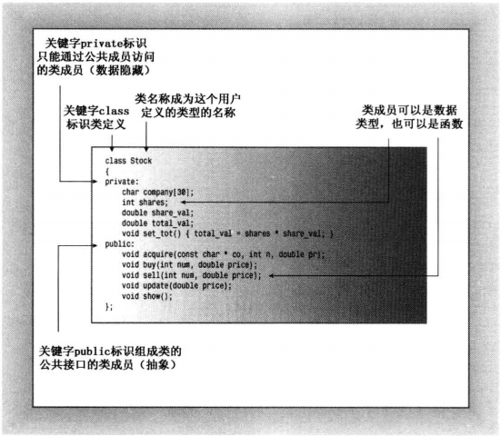
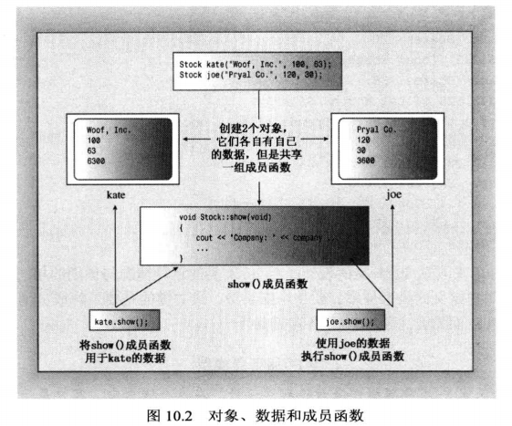
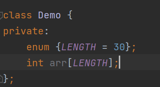
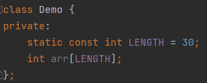
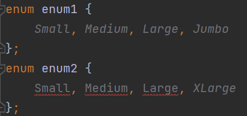
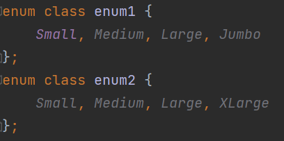
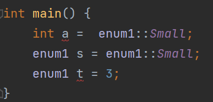

[TOC]

# Unit 2. 类和对象

> 本章主要是讲解类和对象的概念，以及如何声明以及使用一个简单的类。

## 面向对象编程(OOP)

> 本节主要解释一些名词概念。

### OOP 和 POP

OOP 全称 Object Oriented Programming，即面向对象编程；POP 全程 Procedure Oriented Programming，即面向过程编程 or 过程性编程。

面向对象编程是一种特殊的设计程序的概念性方法，它是一种编程思想，并不是 C++ 特有的。实际上，使用 C 语言依旧可以采取面向对象编程，只是 C++ 通过一些特性改进了 C 语言，使得 C++ 应用面向对象编程更容易。
面向对象编程的**重要特性**有：**抽象、封装、继承、多态**、代码的可重用性。为了实现面向对象编程的特性，C++ 做的最重要的改进就是提供了**类**(**class**)。之后会介绍类的概念，并解释抽象和封装，并演示类是如何实现这些特性的。


面向对象编程和面向过程编程的思路是不同的。采用面向过程编程方法时，首先考虑要遵循的步骤，然后考虑如何表示这些数据；而面向对象编程时，首先考虑的是数据，然后是如何使用数据。

总之，OOP 是从用户角度考虑对象 —— 描述对象所需的数据以及描述用户与数据交互所需的操作。完成对接口的描述后，需要确定如何实现接口和数据存储。最后，使用新的设计方案创建出程序。

### 抽象

面向对象编程的第一步是描述数据，这个数据并不是 C++ 的基本数据类型，因为基本数据类型太简单了，单靠基本数据类型是无法描述一些复杂的数据，因此需要用户自定义数据类型。说到自定义类型，可能会想到前面学习的结构体，没错，类和结构体很相似，类是 C++ 的自定义数据类型。另外 C++ 对结构体进行了一些拓展，使得 C++ 结构体与类实际上没有太大的差别，但类更适应于面向对象编程。因此，在实际的编程中类比结构体常用的多。


生活中充满了复杂性，处理复杂性的方法之一就是**简化和抽象**。抽象：将问题的本质特征抽象出来，并根据特征来描述解决方案。抽象是通往用户定义类型的捷径，在 C++ 中，用户定义类型指的是实现抽象接口的类设计。


例如，现在需要编写一个学生档案管理系统，那么学生就是我们需要描述的数据。但是描述一个学生是复杂的，因为他会具有很多特征，如性别、高矮、胖瘦等等，但是这些特征并不全是学生档案管理系统需要的，因此我们需要从学生的特征中抽象出档案管理系统需要的本质特征即可。比如，这里我们可以将学生的性别、出生年月、教育经历作为描述的数据，其他的胖瘦等特征则不进行描述。


**为什么要在自定义类型之前进行抽象？**因为世间的事物都是多面的，每一个事物都具有很多特征，是无限的，而计算机描述事物要求有限性，因此必须从中抽象出有限个特征进行描述。另外，即使事物的特征是有限的，但是在解决指定问题时，并不是所有特征都是需要的，如果全都描述出来也是浪费资源，因此需要抽象出有用的特征进行描述。总之，抽象是为了从事物中提取有限个有用的特征来描述数据的。

### 封装

封装：隐藏对象的属性和实现细节，仅对外公开接口来对象进行交互，将数据和操作数据的方法进行有机结合。封装是面向对象的三大特性之一。

数据隐藏(将数据放到类的私有部分中)是一种封装，将实现的细节隐藏在私有部分中(私有成员函数)，也是一种封装。封装的另一个例子是将类函数定义和类声明分别放在不同的文件中。

> 注：C 语言虽然也可以采取面向对象编程，但是 C 语言没有访问控制，因此直接访问结构成员并没有违反 C 语言规则，却会违反面向对象的精神。而 C++ 程序中试图直接访问私有成员就会违反 C++ 规则，被编译器捕获。

**数据隐藏**不仅**可以防止直接访问数据，保证数据安全性**，**还让开发者** (使用类的开发人员) **无需了解该类中数据是如何表示的**。从使用类的角度看，需要知道的只是各种 public 成员函数的功能；也就是说，需要知道成员函数接受什么样的参数、返回什么类型的值。


原则上，是将成员函数的实现细节从接口设计中分离出来。如果以后找到更好的实现函数细节的方法可以对这些细节进行修改，而无需修改程序接口，这使得程序维护起来更容易。

> 名称解释：
> **成员函数**，在类中定义的函数被称为类的成员函数。
> **接口设计**，简单来说就是固定好成员函数的参数列表和返回值类型。

## 类的声明

> 本节会讲述如何声明一个类。

### 自定义类型

在自定义类型之前，需要了解定义类型都需要做什么。C++ 的基本数据类型完成了三项工作：

- 决定数据对象需要的内存数量；
- 决定如何解释内存中的位；
- 决定如何使用数据对象执行的操作或方法。

对于内置类型来说，有关操作被内置到编译器中。例如，整型可以进行 % 运算，而浮点型不可以。


**自定义类型的演示：**在 C++ 中定义用户自定义的类型时，就必须自己提供操作自定义类型的方法。付出这些劳动换来了根据实际需要定制新数据类型的强大功能和灵活性。例如，自定义一个复数类型，并进行复数加法操作。如果是 C 语言的自定义类型，无法在自定义类型时声明操作该类型的方法，只能声明一个方法，将自定义类型作为参数去处理。

```c
// C 语法的自定义类型与使用
#include <stdio.h>
#include <stdlib.h>
// 自定义复数类型
typedef struct Complex {
    double real;
    double imag;
} Complex;

Complex add(const Complex * c1, const Complex * c2) {
    Complex tmp;
    tmp.real = c1->real + c2->real;
    tmp.imag = c1->imag + c2->imag;
    return tmp;
}

int main () {
    Complex c1 = {10.4, 4.3};
    Complex c2 = {13.2, 54.2};
    Complex c = add(&c1, &c2); // Complex 加法操作
    printf("Complex: %lf, %lf\n", c.real, c.imag);
    return 0;
}
```

而 C++ 中则是将操作方法和数据封装到一起，并且可以重载运算符，虽然在定义类型时增加了工作量(声明与实现类函数)，但是在使用时更加方便、灵活(使用+号来计算 Complex 的加法)。

```cpp
// C++ 语法
#include <iostream>
class Complex {
private:
    double real;
    double imag;
public:
    Complex();
    Complex(double, double);
    Complex operator+(Complex &) const;
    void show();
};

Complex::Complex() {
    real = 0;
    imag = 0;
}

Complex::Complex(double real, double imag) {
    this->real = real;
    this->imag = imag;
}
Complex Complex::operator+(Complex& complex) const {
    Complex sum;
    sum.real = this->real + complex.real;
    sum.imag = this->imag + complex.imag;
    return sum;
}

void Complex::show() {
    std::cout << "C Plus Plus Complex: " << real << ", " << imag << std::endl;
}

int main() {
    Complex c1 = Complex(10.4, 4.3);
    Complex c2 = Complex(13.2, 54.2);
    Complex tmp = c1 + c2; // Complex 加法操作
    tmp.show();
    return 0;
}
```

接下来，我们将学习如何用类来自定义类型。

### 建立类的声明

类是一种将抽象转换为用户自定义类型的工具，它将数据表示和操纵数据的方法组合成一个简洁的包。**类包含数据以及操纵数据的方法**，这一点也是和 C 语言中的结构体不同的地方。C 语言的结构体只包含数据，操纵结构体数据的方法并不是在结构体中声明的。

> 注\*：C 语言的结构体不能包含函数声明，但可以包含函数指针，进而间接的实现类似成员方法的效果；而C++ 对结构体进行了扩展，可以声明成员方法。

#### Stock 类的声明

下面演示自定义一个表示股票的类型。股票有很多信息，我们只需要抽象出必需的信息来自定义类型即可，这里我们将存储以下信息：

- 公司名称；
- 持有该公司股票的数量；
- 每股价格；
- 股票总值。

> PS：实际中的股票由于买入时机不同，购买时每股的价格可能也不同，这里不考虑那么复杂，默认股票价格不变。

可对股票类执行的操作有：

- 获得股票；
- 增持；
- 卖出；
- 更新股票价格；
- 显示关于所持有股票的信息。


已经抽象出股票的描述，接下来将定义类。一般来说，类规范由两个部分组成：

- 类声明：以数据成员的方式描述数据部分，以成员函数(被称为方法)的方式描述公有接口。
- 类方法定义：描述如何实现类成员函数。

简单来说，类声明提供了类的蓝图，而类方法定义则提供了方法的实现细节。


为开发一个类并编写一个使用这个类的程序需要完成多个步骤。这里将开发过程分为多个阶段，而不是一次性完成。通常，C++ 程序员将类定义放在头文件中，并将类方法的实现放在源代码文件中。这里也将采取这种经典方法。

```cpp
// source/Unit2.Unit1/stock00.h
#ifndef STOCK00_H_
#define STOCK00_H_

#include <iostream>
class Stock {
private:
    std::string company;
    long shares;
    double share_value;
    double total_value;
  	void set_tot() { total_value = shares * share_value; };
public:
    void accquire(const std::string& co, long n, double pr);
    void buy(long num, double price);
    void sell(long num, double price);
    void update(double price);
    void show();
};

#endif // STOCK00_H_
```

> 源码见 source/2.1/stock0.h 文件。

#### 类的对象

稍后将介绍类的细节，但是这里要先看一下更通用的特性。

C++ 用 class 关键字指出这些代码定义了一个类设计。这种语法指出 Stock 是这个新类的类型名，即自定义的类型名。该声明让我们能够像声明基本数据类型的变量一样声明 Stock 类型的变量，不过我们通常称呼某个类的变量为该类的对象或实例。声明的类名是数据类型，对象或实例是该类的变量。每个对象都表示一只股票。 

> 注意，这里和模版参数不同，class 和 typename 不是同义词，不能用 typename 代替 class。

例如，下面的声明创建两个 Stock 对象，它们分别名为 sally 和 solly：

```cpp
Stock sally;
Stock solly;
```

将数据和方法组合成一个单元是类最吸引人的一个特性。有了这种设计，创建 Stock 对象时将自动制定使用对象的规则。

#### 访问控制权限

private 和 public 也是 C++ 新增的关键字，它们描述了对类的访问控制。使用类对象的程序可以直接访问 public 部分，对于私有部分是不能直接访问的，需要通过公有接口(或者友元函数)来间接访问。例如，Stock 类的 shares 成员是 private，想要修改 shares 只能通过 Stock 的成员函数。因此，公有成员函数是程序和对象的私有成员之间的桥梁，提供了对象和程序之间的接口。这种防止程序直接访问数据的方式被称为**数据隐藏**。



**Q：哪些应该放在 public 中，哪些应该放在 private 中？**

**A：无论是类的数据成员还是成员函数，都可以在类的公有部分或私有部分中声明它**。但是由于隐藏数据是面向对象编程的主要目标之一，因此一般会进行如下处理：

- **数据项通常放在私有部分**。
- **用于作为类接口的成员函数需要放在公有部分**，否则无法在程序中调用这些作为接口的函数。
- **不作为类接口的成员函数则可以放在私有部分**，这些函数无法在程序中调用，但是可以在公有方法中调用。通常使用私有函数来处理不属于公有接口的实现细节。

在类声明中，可以不使用 private 关键字，因为 private 是类对象的默认访问控制权限：

```cpp
class Work {
    float mass; // private
public:
    void tellall(void); // public
}
```

不过，为了强调数据隐藏的概念，所有的代码都以显式使用 private 为主。

> PS：类描述看上去很像是包含成员函数以及 public、private 可见性标签的结构声明。实际上，C++ 对结构进行了扩展，使之具有与类相同的特性。它们之间唯一的区别是，结构默认访问类型是 public，而类为 private。C++ 程序员通常使用类来实现类描述，而把结构限制为只表示纯粹的数据对象。

### 成员函数的实现

#### 成员函数的定义

复习一下普通函数的定义是怎样的：

```cpp
返回值类型 函数名(函数列表) {
    // 实现细节
    return 返回值;
}
```


在类声明的演示示例中已经声明了一个 Stock 类，该声明描述了类中保存的数据，以及可以进行的一系列操作(函数)，但是并没有给出这些函数的实现细节，因此还需要进行创建类第二部分 —— 为类声明中的函数原型表示的成员函数提供实现的代码，即提供函数定义。

成员函数的定义与普通函数的定义非常相似，有函数头和函数体，也可以有返回值和参数列表。但成员函数定义有两个特殊的特征：

- **定义成员函数时，使用作用域解析符(::)来标识函数所属的类；**
- **类方法可以访问类的 private 成员。**

以 Stock 类的 update 函数为例，其实现如下所示：

```cpp
// Stock类成员函数update()的实现
void Stock::update(double price) {
    share_val = price;
    set_tot();
}
```

在 update() 中演示了这两个特殊的特征。首先是使用了作用域解析符来标识函数所属的类，一个类就是一个名称空间，因此类中的函数的实现需要用到作用域解析符，这也意味着我们可以将另一个类的成员函数也命名为 update()。

因此，**作用域解析符确定了方法定义对应的类的身份**。我们称标识符 update() 具有类作用域。

Stock 类的其他成员函数不必使用作用域解析符就可以使用 update() 方法，这是因为它们属于同一个类，因此它们对于 update() 是可见的。然而，在类声明和类方法的定义之外使用 update() 的时候，需要采取特殊的措施。

类方法的完整名称中包含类名。我们说 Stock::update() 是类函数的限定名(全名)；而简单的 update() 是全名的缩写(非限定名)，它只能在类作用域中使用。例如，类声明、类方法的定义中。


示例中的第二个特点是，类方法可以访问类的私有成员。私有访问控制权限是限制类外访问的，而类方法都是类内，不会被限制访问私有成员。

> 友元函数除外，它可以打破私有访问权限，从类外访问类的私有成员。

#### Stock 类成员函数的实现

这里将成员函数的实现放在了另一个独立的实现文件中。

> 源码见 source/2.1/stock0.cpp 文件。

```cpp
#include "stock0.h"

void Stock::acquire(const std::string &co, long n, double pr) {
    company = co;
    if (n < 0) {
        std::cout << "购买股票的数目无效，" << company << " 公司股票数目设置为 0.\n";
        shares = 0;
    }
    else {
        shares = n;
    }
    share_value = pr;
    // 更新 total_value
    set_tot();
}

void Stock::buy(long num, double price) {
    if (num < 0) {
        std::cout << "购买 " << company << " 公司股票数目异常,购买无效\n";
        return;
    }
    shares += num;
    share_value = price;
    set_tot();
}

void Stock::sell(long num, double price) {
    if (num < 0) {
        std::cout << "出售 " << company << " 公司股票数目异常，出售无效\n";
    } else if (num > shares) {
        std::cout << "出售数目多于持有数目\n";
    } else {
        shares -= num;
        share_value = price;
        set_tot();
    }
}

void Stock::update(double price) {
    share_value = price;
    set_tot();
}

void Stock::show() {
    std::cout << "Company: " << company << std::endl
              << "Shares: " << shares << std::endl
              << "Share Price: $" << share_value << std::endl
              << "Total Worth: $" << total_value <<std::endl;
}
```

对成员函数的说明：

- acquire() 函数管理对某个公司股票的首次购买。
- buy() 和 sell() 确保买入或卖出的股数不为负数。另外，sell() 还确保用户无法卖出超过他持有的股票数量。
- update() 函数更新股票价格。
- 以上四个成员函数都涉及对 total_val 成员值的设置，这个类中并非将计算代码编写了 4 次，而是让每个函数都调用 set_tot() 函数。如果计算代码很长，这种方法可以省去许多输入代码的工作，并可节省空间。不过，这种方法的主要价值在于，通过函数调用，而不是每次重新输入计算代码，可以确保执行的计算完全相同。另外，如果需要修改计算代码，只需要在一个地方进行修改即可。


**内联方法：函数定义位于类声明中的函数都将自动成为内联函数**，因此 Stock::set_tot() 是一个内联函数。类声明常常将短小的成员函数作为内联函数。如果愿意，也可以在类声明之外定义成员函数，并使之成为内联函数。只需要在类实现部分中定义函数时使用关键字 inline 即可：

```cpp
class Stock {
private:
    //...
    void set_tot();
    //...
public:
    //...
}

inline void Stock::set_tot() {
    total_value = shares * share_value;
}
```

根据改写规则，在类声明中定义方法等同于用函数原型替换方法定义，然后在类声明后面将定义改写为内联函数。也就是说，以上代码中的 set_tot() 的内联定义与之前在类声明中定义是等价的。


内联函数的特殊规则要求：**在每个使用内联函数的文件中都对其进行定义**。确保内联函数定义在多文件程序中的所有文件都可用，最简单的方法是：将内联函数的定义放在类声明的文件中。

#### 成员函数使用的是那个对象？

调用成员函数时，它将使用被用来调用该方法的对象的数据成员。不同的对象有着各自的数据，但是成员函数是共用一组成员函数。



### 类声明的小结

- 程序员可以通过 class 来自定义类型，将数据和操作数据的方法封装在一起。
- **类名称空间**。C++ 的每一个类都是一个名称空间，因此在实现类方法的时候必须使用 `类名::方法名(...) {...}` 的格式。
- **什么是对象**？class 声明的类就是数据类型，而对象就是该类型的一个变量，只是通常称为对象。
- **创建对象**。可以像创建基本数据类型变量那样创建自定义类型的对象，也可以进行初始化操作，不过 class 创建的自定义类型的初始化需要用到构造函数，使用上和基本数据类型变量不同。
- **访问控制权限**。类外可以访问 public 的成员；private 修饰的成员只能在类内访问，其实也就是类方法中可以直接使用 private 的成员(友元函数除外)。
- **内联方法**。

- - 直接将成员方法的定义放在类声明之中，将自动成为内联函数，不需要 inline 关键字修饰。
  - 在类声明中声明成员函数，在类声明之后显式的使用 inline 修饰成员函数的定义。但是这种需要注意，最好将内联方法的定义和类声明放在一个文件中，而不是和类成员方法实现放在一个文件中。

## 类的使用

知道如何定义类及其方法之后，我们将用上面声明的 Stock 类来学习下对象的创建与使用。


C++ 的目标是使得类与使用基本的内置类型(如 int、char) 尽可能的相同：

- 创建类的对象。可以声明类的变量；也可以使用 new 为类的对象分配存储空间，并返回一个地址赋值给对应的指针。
- 对象可以作为函数的参数、返回值。
- 可以将一个对象直接赋值给另一个对象。对于需要深拷贝的类，可以通过重载赋值运算符以及复制构造函数的方式完成。由于深拷贝涉及到类成员动态内存分配，这里暂时不做讲解。
- C++ 提供了一些工具用于初始化对象、让 cin、cout 识别对象，甚至可以在相似的类对象之间进行类型转换。

虽然要做到这些工作还需要学习一些内容，但是目前已知的类相关的知识已经足以让我们创建一个简单的程序了。

```cpp
#include "stock0.h"

int main(void) {
    // 声明 Stock 变量
    Stock sally;
    // 首次购买 Coke 股票
    sally.acquire("Coke", 3, 10.4);
    sally.show();
    
    sally.buy(-1, 5);
    sally.buy(3, 6);
    sally.show();
    
    sally.sell(-1, 3);
    sally.sell(3, 7);
    sally.show();
    
    sally.sell(7, 9);
    sally.show();
}
```

```
// 程序的输出
Company: Coke
Shares: 3
Share Price: $10.4
Total Worth: $31.2
购买 Coke 公司股票数目异常,购买无效
Company: Coke
Shares: 6
Share Price: $6
Total Worth: $36
出售 Coke 公司股票数目异常，出售无效
Company: Coke
Shares: 3
Share Price: $7
Total Worth: $21
出售数目多于持有数目
Company: Coke
Shares: 3
Share Price: $7
Total Worth: $21
```

main() 只是用来测试 Stock 类的设计。当 Stock 类的运行情况与预期的相同后，便可以在其他程序中将 Stock类作为用户自定义的类型来使用 (只需要在使用 Stock 类的 cpp 文件中加上 #include "stock0.h")。

使用一个新类型时，最关键的是了解成员函数的功能，而不必考虑其实现细节。

## 构造函数与析构函数

对于类声明，还有一些其他工作要做 —— 应为类提供**构造方法**和**析构方法**。

### 构造函数

#### 为什么要提供构造函数？

C++ 的目标之一就是**使用类对象可以像使用内置类型变量一样**。到目前为止，可以像声明内置类型变量那样声明类对象，`int a;`--> `Stock sally;`；但是无法像初始化内置类型变量或者结构那样来初始化类对象。也就是说，常规的初始化语法不适用于自定义的类。

```cpp
// 有效的初始化
int a = 20; 

struct Thing {
  char *ptr;
  int t;
};
// 有效的初始化
Thing b = {"Hello", -1}; 

class Book {
private:
	char* name;
  char* author;
  double value;
public:
  ...
};
// 无效初始化，会报错
Book c = {"C++ Primer Plus", "Stephen Prata", 40.8};
```

Book 类不能像 int 和 Thing 结构那样初始化的原因在于，Book 类的数据部分是私有访问权限，这意味着程序不能直接访问数据成员。这和我们之前学习的是一致的，程序只能通过成员函数来访问数据成员，因此需要设计一个合适的成员函数，才能成功地将对象初始化，这个成员函数就是构造函数。

> PS：如果将数据成员**全部**设置为公有访问权限，是可以像结构体那样用初始化列表来进行初始化的，但是，这样就违背了类的主要初衷 —— 数据隐藏。而只要有数据成员是私有访问权限，就不能直接通过初始化列表来进行初始化，必须定义构造函数。

```cpp
class Stock {
private:
    ...
public:
    void acquire(const std::string& co, long n, double pr);
    void buy(long num, double price);
    void sell(long num, double price);
    void update(double price);
    void show();
}; // 注意类声明以分号结尾

inline void Stock::set_tot() {
    total_value = shares * share_value;
}
```

Stock 类目前的设计是假设用户在调用任何其他成员函数之前需要调用 acquire()，但是无法将这个假设强加给用户，即用户使用时可能并不会先调用 acquire() 而直接使用其他成员函数。

避开这个问题的方法之一是：在创建对象时，自动对它们进行初始化。为此，C++ 提供了一个特殊的成员函数 —— 构造函数，专门用于构造新对象，并将值赋给它们的数据成员。更准确地说，C++ 已经为构造函数提供了名称、使用语法，而程序员只需要提供定义。


构造函数和普通成员函数有一些差别：

1. 构造函数的函数名是固定的，与类名一致。
2. 构造函数没有返回值。虽然没有返回值，但并没有被声明为 void。

#### 创建构造函数的函数声明与函数定义

下面将创建 Stock 类的构造函数来代替 acquire() 函数。

```cpp
#ifndef STOCK1_H_
#define STOCK1_H_

#include <iostream>
/*
 * 构造函数和析构函数的练习
 */
class Stock {
private:
    std::string company; // 公司
    long shares; // 持有的股数
    double share_value; // 股票实时单价
    double total_value; // 持有的股票总价
    void set_tot();
public:
    // 股票初始化，
    Stock(const std::string& co, long sh = 0, double val = 0);
    // 购买股票
    void buy(long num, double price);
    // 出售股票
    void sell(long num, double price);
    // 更新股票价格
    void update(double price);
    // 展示股票信息
    void show();
};
inline void Stock::set_tot() {
    total_value = share_value * shares;
}
#endif // STOCK1_H_
#include "stock1.h"
Stock::Stock(const std::string &co, long num, double val) {
    std::cout << "这里是 Stock(const std::string &co, long sh = 0, double val = 0.0)" << std::endl;
    company = co;
    if (num < 0) {
        std::cout << "购买数目不能为负，将 " + co + " 股票数目设置为 0." << std::endl;
        shares = 0;
    } else
        shares = num;
    share_value = val;
    set_tot();
}
```

上述代码和之前定义的 acquire() 实现是相同的，区别在于，程序声明 Stock 对象时，将自动调用构造函数，而 acquire() 需要手动调用。

#### 构造函数的使用

C++ 提供了两种使用构造函数的方法 —— 显式调用构造函数和隐式调用构造函数。

```cpp
#include "stock1.h"

int main(int argc, char** args) {
    // 显示调用构造函数
    Stock s1 = Stock("可口可乐", 300, 1.25);
    Stock s2 = Stock{"茅台", 540, 3.7};
    Stock* p1 = new Stock("比亚迪", 500, 3.8);
    // 隐式调用构造函数
    Stock s3("宁德时代", 1030, 4.8);
    Stock s4 = {"药明康德", 680, 2.75};

    delete p1;
    return 0;
}
这里是 Stock(可口可乐, 300, 1.25)
这里是 Stock(茅台, 540, 3.7)
这里是 Stock(比亚迪, 500, 3.8)
这里是 Stock(宁德时代, 1030, 4.8)
这里是 Stock(药明康德, 680, 2.75)
```

其中 Stock 指针 p1 是将构造函数与 new 一起使用。这条语句创建了一个 Stock 对象，将其初始化为参数提供的值，并将该对象的地址赋给 p1 指针。在这种情况下，对象没有名称，但是可以通过 p1 指针来管理该对象。

> 构造方法的使用方式和普通成员函数是不同的，一般来说使用对象调用方法都会用 . 运算符，但无法使用对象来调用构造函数，因为在构造函数构造出对象之前，对象是不存在的。因此，构造函数是用来创建对象，而不能通过对象来调用。

### 特殊的构造函数

#### 默认构造函数

**默认构造函数没有任何参数**。默认构造函数是指在没有提供显式初始值时，用来创建对象的构造函数。

定义默认构造方法有两种：

第一种方法，重载一个没有任何参数的 Stock 构造方法：

```cpp
class Stock {
private:
    ...
public:
    Stock();
}

Stock::Stock() {
	...
}
```

第二种方法，给已有构造函数的所有参数都提供默认值：

```cpp
class Stock {
private:
    ...
public:
    Stock(const std::string& co = "no name", int num = 0, double value = 0.0);
}

Stock::Stock(const std::string& co = "no name", int num = 0, double value = 0.0) { {
	...
}
```

> PS：**只能有一个默认构造方法，因此不要同时采用这两种方式**。

实际上，通常应初始化所有的对象，以确保所有成员一开始就有已知的合理值。因此，用户定义的默认构造函数通常给所有成员提供隐式初始值，而编译器自动提供的默认构造函数则是什么也不做。

> PS：**在设计类时，通常应提供对所有类成员做隐式初始化的默认构造函数**。

#### 复制构造函数

**复制构造函数只有一个参数，参数的类型是本类的引用**。主要是针对类成员有动态内存分配情况的问题，涉及到深拷贝。

#### 转换构造函数

可以将其他类型的值转换为一个本类的对象。下例将 double 值转换为 Demo 对象：

```cpp
class Demo {
    ...
public:
    Demo(double d);
}
```

与之相反的是转换函数，用于将本类的对象转换为其他类型。下例将 Demo 对象转换为 double 值：

```cpp
class Demo {
    ...
public:
    operator double();
}
```

> 示例中只是将 Demo 和 double 相互转换，实际上完全可以让 Demo 与其他类进行转换。

### 析构函数

**名词解释**：析构其实是翻译来的，它的英文是 destructor，销毁、毁灭的意思，destructor 是 constructor(构造) 的反义词。从名字就能看出来，构造函数和析构函数是一对小冤家，构造函数是创建对象时调用的，而析构函数则是销毁对象时调用的。用构造函数创建对象后，程序负责跟踪对象，直到其过期为止。对象过期时，程序将自动调用一个特殊的成员函数 —— 析构函数。析构函数完成对象销毁的清理工作。

事实上，析构函数的清理工作**主要是针对动态分配内存的释放**。由于 Stock 类并没有使用动态内存分配，因此 Stock 类的析构函数实际上并没有需要完成的任务。在这种情况下，只需要让编译器生成一个什么都不需要做的默认析构函数即可。我们前面的 Stock 类声明中就是这样做的。然而，了解如何声明和定义析构函数是绝对必要的。


和构造函数一样，析构函数也很特殊：函数名是在类名前面加上~，没有返回值类型。但是与构造函数不同的是析构函数没有参数。因此，Stock 类的析构函数必须为 ~Stock()。由于 Stock 类没有使用动态内存分配，因此 ~Stock() 并不承担任何工作，可以将其编写为不执行任何操作的函数：

```cpp
Stock::~Stock() {}
```

但是因为析构函数是在对象被销毁的时候自动被调用的，在代码中是不会有析构函数被调用的痕迹的，因此为了能够看出析构函数何时被调用，在析构函数中输出一句话：

```cpp
Stock::~Stock() {
	std::cout << "Stock 析构函数, Company: " << company << std::endl;
}
```

什么时候调用析构函数？这由编译器决定，通常不会在代码中显式调用析构函数。编译器调用构造函数的时间和内存模型相关。

- 如果创建的是**自动存储**的类对象，则其析构函数将在程序执行完代码块(类对象在其中定义)时自动被调用；
- 如果创建的是**静态存储**的类对象，则其析构函数将在程序结束时自动被调用；
- 如果创建的是**动态存储**的类对象，即通过 new 创建的类对象，则其析构函数将在使用 delete 释放内存时被调用；
- 如果创建的是临时对象来完成特定的操作，程序将在结束对该临时对象的使用时自动调用其析构函数。


在类对象过期时析构函数将被自动调用，因此必须有一个析构函数。在程序员没有提供析构函数的时候，函数将隐式的声明一个默认析构函数，并在发现导致类对象被删除的代码之后，提供默认析构函数的定义。

### 代码演示

修改 Stock 类的代码，为了更直观的看到构造方法和析构方法在什么时候调用，在构造函数和析构函数的实现中输出一些语句。

```cpp
// stock2.h
#ifndef STOCK2_H_
#define STOCK2_H_
#include <iostream>
class Stock {
private:
    std::string company; // 公司
    long shares; // 持有的股数
    double share_value; // 股票实时单价
    double total_value; // 持有的股票总价
    void set_tot() { total_value = share_value * shares; }

public:
    Stock();
    Stock(const Stock &);
    Stock(const std::string com, long num = 0, double price = 0.0);
    ~Stock();

    void buy(long num, double price);
    void sell(long num, double price);
    void update(double price);
    void show();
};
#endif // STOCK2_H_
// stock2.cpp
#include "stock2.h"
Stock::Stock() {
    std::cout << "This is Default Constructor Function.(默认构造函数)\n";
    company = "No Company";
    shares = 0;
    share_value = 0.0;
    set_tot();
    std::cout << "Default Constructor Function END." << std::endl;
}

Stock::Stock(const Stock & stock) {
    std::cout << "This is Copy Constructor Function.(复制构造函数)\n";
    company = stock.company;
    shares = stock.shares;
    share_value = stock.share_value;
    set_tot();
    std::cout << "Copy Constructor Function END." << std::endl;
}

Stock::Stock(const std::string com, long num, double price) {
    std::cout << "This is a Constructor Function —— Stock(const std::string, long, double)\n";
    company = com;
    if (num < 0) {
        std::cout << "Number is invalid. Number is set 0.\n";
        shares = 0;
    } else
        shares = num;
    share_value = price;
    set_tot();
    std::cout << "Constructor Function END." << std::endl;
}

Stock::~Stock() {
    std::cout << "Destructor Function. Company is " << company << std::endl << std::endl;
}

void Stock::buy(long num, double price) {
    if (num < 0) {
        std::cout << "Number is invalid.Buy Failed.\n";
        return;
    }
    shares += num;
    share_value = price;
    set_tot();
}

void Stock::sell(long num, double price) {
    if (num < 0) {
        std::cout << "Number is invalid. Sell Failed.\n";
        return;
    }
    if (num > shares) {
        std::cout << "Shares isn't enough. Sell Failed.\n";
        return;
    }

    shares -= num;
    share_value = price;
    set_tot();
}

void Stock::update(double price) {
    share_value = price;
    set_tot();
}

void Stock::show() {
    std::cout << "Company: " << company << std::endl
              << "Shares: " << shares << std::endl
              << "Share Price: $" << share_value << std::endl
              << "Total Worth: $" << total_value <<std::endl;
}
// use_stock2.cpp
#include "stock2.h"

Stock s1 = Stock("Stock1", 30, 55.5);
static Stock s2 = Stock("Stock2", 40, 40.3);
int main() {
    using std::cout;
    using std::endl;

    cout << endl << "Show s1 Information: " << endl;
    s1.show();
    cout << endl << "Show s2 Information: " << endl;
    s2.show();
    {
        cout << endl << "Create s3: " << endl;
        Stock s3 = Stock("Stock Unit3", 20, 10.4);
        cout << "Show s3 Information: " << endl;
        s3.show();
        cout << endl << "Create s4: " << endl;
        static Stock s4 = Stock("Stock Unit4", 30, 20.4);
        cout << "Show s4 Information: " << endl;
        s4.show();
        cout << endl << "Create s5: " << endl;
        Stock s5 = s1;
        cout << "Show s5 Information: " << endl;
        s5.show();
        cout << "Assign s2 to s5: " << endl;
        s5 = s2;
        cout << "Show s5 Information: " << endl;
        s5.show();
        cout << "Assign s5: " << endl;
        s5 = Stock("Stock Unit5", 23, 6);
        cout << "Show s5 Information: " << endl;
        s5.show();
    }
    cout << "Main END.\n";
    return 0;
}
This is a Constructor Function —— Stock(const std::string, long, double)
Constructor Function END.
This is a Constructor Function —— Stock(const std::string, long, double)
Constructor Function END.

Show s1 Information: 
Company: Stock1
Shares: 30
Share Price: $55.5
Total Worth: $1665

Show s2 Information: 
Company: Stock2
Shares: 40
Share Price: $40.3
Total Worth: $1612

Create s3: 
This is a Constructor Function —— Stock(const std::string, long, double)
Constructor Function END.
Show s3 Information: 
Company: Stock 3
Shares: 20
Share Price: $10.4
Total Worth: $208

Create s4: 
This is a Constructor Function —— Stock(const std::string, long, double)
Constructor Function END.
Show s4 Information: 
Company: Stock 4
Shares: 30
Share Price: $20.4
Total Worth: $612

Create s5: 
This is Copy Constructor Function.(复制构造函数)
Copy Constructor Function END.
Show s5 Information: 
Company: Stock1
Shares: 30
Share Price: $55.5
Total Worth: $1665
Assign s2 to s5: 
Show s5 Information: 
Company: Stock2
Shares: 40
Share Price: $40.3
Total Worth: $1612
Assign s5: 
This is a Constructor Function —— Stock(const std::string, long, double)
Constructor Function END.
Destructor Function. Company is Stock 5

Show s5 Information: 
Company: Stock 5
Shares: 23
Share Price: $6
Total Worth: $138
Destructor Function. Company is Stock 5

Destructor Function. Company is Stock 3

Main END.
Destructor Function. Company is Stock 4

Destructor Function. Company is Stock2

Destructor Function. Company is Stock1
```

s1、s2、s3、s4 构造函数没什么可说的，s5 是利用复制构造函数创建的，之后将 s2 赋值给 s5，此时是用的赋值运算符，并不是构造函数(因为此时是给 s5 赋值，并不是初始化 s5)。

接下来有一个需要注意的地方：观察 Log，会发现`s5 = Stock("Stock 5", 23, 6);`会调用一次构造函数，以及一次析构函数 —— Log 50-53 行。这是因为`s5 = Stock("Stock 5", 23, 6);`这条语句其实相当于`Stock tmp = Stock("Stock 5", 23, 6);s5 = tmp;`这两条语句的结合。这里会先用构造函数创建一个临时对象，然后将这个临时变量赋值给 s5，这里依旧是用的赋值运算符，而不是复制构造函数，构造函数只有在对象初始化时才会用到，一旦对象创建成功就不会再调用了。当临时变量成功的赋值给 s5 之后，会被删除，这也是 Log 53 行调用一次析构函数的原因 —— 临时对象被销毁。

最后，来看一下类对象的释放顺序：s5 s3 s4 s2 s1。s3 和 s5 都是自动变量，在退出代码块的时候被销毁，因此 s3 和 s5 在 Main END 这条 Log 之前调用析构函数。s1、s2、s4 都是静态变量，在程序结束之后销毁，因此在 Main END 之后调用析构函数。

### C++ 11列表初始化

C++11 之后，除了使用构造函数初始化之外，还可以将列表初始化语句用于类对象的初始化，但是需要有对应的构造函数。

```cpp
Stock s6 = {"Stock Unit6", 32, 4.9};
```

列表初始化会调用对应的构造函数进行初始化。

### 小结

**I. 为什么需要构造函数和析构函数？**

C++ 希望能够像初始化变量一样初始化类对象。如果类的数据都是 public 权限，则可以直接用初始化列表来初始化类对象，但这样违背了数据隐藏原则。因此，为了实现初始化含有 private 数据的类的对象，C++ 提供了构造函数来完成类对象的初始化。构造函数在创建对象时被调用。

有的类可能初始化的时候会为数据申请一些资源，例如，动态内存分配(会单独拿出来讲)，在对象销毁的时候，如果不回收分配出去的内存就会造成内存泄漏，因此 C++ 提供了析构函数来销毁类对象。析构函数在销毁对象时被调用。

**II. 构造函数和析构函数的函数原型比较特殊**。

1. 没有返回值类型。
2. 构造函数和析构函数的函数名都很特殊。构造函数的函数名和类名一致，析构函数的函数名是在类名前面加上了 ~。

**III.** 当程序员没有定义构造函数、析构函数时，编译器会提供无参的默认构造函数、默认复制构造函数、默认析构函数。

**IV.**  构造函数可以有参数，允许重载构造函数，所以一个类可以有多个构造函数；析构函数没有参数，因此不存在特征标不同的情况，无法重载析构函数，所以一个类只有一个析构函数。

**V.** 如果程序员定义了一个带参构造函数，则编译器不会自动生成一个无参的默认构造函数。

**VI.** 复制构造函数、重载赋值运算符、析构函数的工作和类内的动态内存分配相关，因此都需要和动态内存一起学习；virtual 修饰的析构函数和继承相关知识关联，因此将放在类的继承哪里学习。

**V.** 注意区分复制构造函数和赋值运算符的区别。

## 对象数组

用户通常都需要创建同一个类的多个对象，可以创建独立的对象变量，但也可以创建对象数组。其实前面已经学过结构数组了，对象数组这部分内容很容易就能掌握了。

### 声明对象数组

**声明对象数组的方法和声明标准类型数组相同**：

```cpp
Stock arr[10]; // 创建10个Stock对象的数组
```

上述代码没有显式初始化，所有对象都将调用默认构造函数。除此之外，还可以用构造函数来初始化数组元素。

```cpp
Stock arr[5] = {
    Stock(), // 手动调用默认构造函数
    Stock("Stock1", 3, 2.5),
    Stock(arr[1])
    // 其余元素将自动调用默认构造函数
};
```

### 疑问

初始化对象数组的方案是：首先使用默认构造函数创建数组元素，然后花括号中的构造函数将创建临时对象，然后将临时对象的内容复制到对应的元素中。因此，要创建类对象数组，则这个类必须有默认构造函数 —— 《C++ Primer Plus》。

但是我运行上述代码时，并没有先用默认构造函数创建数组，再创建临时对象复制给对应元素，而是直接用构造函数创建数组元素。打印的输出如下所示：

```cpp
This is Default Constructor Function.(默认构造函数)
Default Constructor Function END.
This is a Constructor Function —— Stock(const std::string, long, double)
Constructor Function END.
This is Copy Constructor Function.(复制构造函数)
Copy Constructor Function END.
This is Default Constructor Function.(默认构造函数)
Default Constructor Function END.
This is Default Constructor Function.(默认构造函数)
Default Constructor Function END.
Destructor Function. Company is No Company

Destructor Function. Company is No Company

Destructor Function. Company is Stock1

Destructor Function. Company is Stock1

Destructor Function. Company is No Company
```

可能是编译器有所优化？

## 类作用域与常量

之前学习过全局(文件)作用域和局部(代码块)作用域。全局作用域的变量可以在其所属文件的任何地方使用它，而局部作用域的变量只能在其所属的代码块中使用。函数名的作用域不能是局部作用域 —— 不能在函数中定义函数。C++ 引入了一个新的作用域 —— 类作用域。

### 类作用域的介绍

**类作用域**：在类中定义的名称的作用域为整个类。例如，类的数据成员名和成员函数名。作用域为整个类的名称只在该类中是已知的，在类外是不可知的。因此，可以在不同类中使用相同的类成员名而不会引起冲突。另外，类作用域意味着不能从外部直接访问类的成员，公有函数也是如此。也就是说，如果要调用公有成员函数，必须通过对象调用。同样，在定义成员函数时，必须使用作用域解析运算符。

总之，在类声明或成员函数定义中，可以使用未修饰的成员名称(非限定名)，即直接使用成员函数的函数名。构造函数名称在被调用时，才能被识别，因为它的名称与类名相同。在其他情况下(类外)，使用类成员名时，必须根据上下文使用运算符，例如，对象使用直接成员运算符(.)，指针使用间接成员运算符(->)，函数定义使用作用域解析运算符（::）。

### 类作用域中的常量

有时候，在类声明中定义一个常量很有用。例如，在类声明中可能会使用字面值 30 来指定数组的长度。你可能会认为应该这样声明：

```cpp
class Demo {
private:
    const int LENGTH = 30;
    int arr[LENGTH];
    ...
}
```

事实上，这样是不行的。类声明只是描述类对象的形式，并没有真正创建类对象。因此，在创建类对象之前，并没有用于存储值的空间，所以创建 arr 的时候会报错。


想要在类中定义一个常量有两种方法：枚举、static 关键字。这两种方案都可以实现在类内定义一个常量，并且效果相同。

#### 类作用域中的枚举

在类声明中声明的枚举的作用域为整个类，因此可以用枚举为整型常量提供作用域为整个类的符号名称。也就是说，可以这样定义类的声明：



注意，用这种方式声明的枚举并不会创建类数据成员。也就是说，所有对象中都不包含枚举。另外， LENGTH 只是一个符号名称，在作用域为整个类的代码中遇到它时，编译器将用 30 代替它。

由于这里使用枚举只是为了创建符号常量，并不需要创建枚举类型的变量，所以不需要提供枚举名。顺便说一句，在很多实现中，ios_base 类在其公共部分中完成了类似的工作：

```cpp
// ios_base.h
class ios_base {
public:
    ...
	enum { _S_local_word_size = 8 };
    ...
}
```

#### static 常量

C++ 提供了另一种在类中定义常量的方式 —— 使用关键字 static：



这将创建一个名为 LENGTH 的常量，该常量将会和其他静态变量存储在一起，而不是存储在对象中。因此，只有一个 LENGTH 常量，它被所有的对象共享。这里只是简单了解下 static 常量，关于静态类成员相关知识以后会详细学习。

C++ 98 中，static 只能声明整型或枚举的静态常量，不能存储 double，而 C++ 11 消除了这种限制。

### 作用域内的枚举(C++1)

传统的枚举存在一些问题，例如，两个枚举定义中的枚举量可能存在冲突；存在类型安全问题(类型转换)等。



因为 enum1 和 enum2 位于相同的作用域内，它们将发生冲突。为了避免这种情况，C++ 11 提供了一种新枚举，其枚举量的作用域为类作用域。



> 也可以用 struct 来代替 class，但不论是那种形式，使用枚举量的时候都需要使用枚举量的限定名。

```cpp
int a = (int) enum1::Small;
enum1 s = enum1::Small;
enum1 t = (enum1) 3;
```

枚举量的作用域为类之后，在不同的枚举定义中的枚举量就不会发生名称冲突了。另外，C++ 11 还提高了作用域内枚举的类型安全 —— 作用域内枚举不能隐式转换为整型。在必要时，可以使用显式类型转换。这意味着上述代码中将强制类型转换去除之后会报错。



枚举在底层是用某种整型类型表示。在 C++ 98 中，如何选择是取决于实现，因此枚举的长度可能随系统而异。但 C++ 11 消除了作用域内枚举的这种依赖性。默认情况下，C++ 11 作用域内枚举的底层类型为 int。另外，还提供了一种语法，用于做出不同的选择：

```cpp
enum class enum3:short{
    Small, Medium
};
```

:short 将底层类型指定为 short。底层类型必须为整型。

> PS: 《C++ Primer Plus》中是 enum class : short pizza { Small, Medium }，但我这样写会报错。

## 复习

面向对象编程强调的是程序如何表示数据。面向对象编程解决编程问题的第一步就是根据它与程序之间的接口来描述数据，从而指定如何使用数据。然后，设计一个类来实现该接口。一般来说，私有数据成员存储信息，公有成员函数提供访问数据的唯一途径。当公有成员函数的代码过长，可以将其分为多个私有成员函数。类将数据和方法组成一个单元，其稀有性实现数据隐藏。


通常将类的声明分为两部分，这两部分通常保存在不同的文件中(多文件编程)。类声明放在头文件中，定义成员函数的源代码放在方法文件中。这样便将接口描述与实现细节分开了。从理论上说，只需要知道公有接口就可以使用类。当然，可以查看实现方法，但程序不能依赖于其实现细节。只要程序和类只通过定义接口的方法进行通信，程序员就可以随意地对任何部分做独立的改进，而不必担心这样做会导致意外的不良影响。


类是用户定义的类型，而对象是类的实例(变量)。C++ 试图让用户自定义的类型尽可能与内置类型类似，因此可以声明对象、指向对象的指针、对象数组；可以用对象为对象赋值；可以按值、按引用、按地址传递对象，将对象作为函数返回值。在创建对象时可以根据构造函数初始化对象。

对象将存储自己的数据成员，共享类方法。对象可以使用成员运算符(.)调用成员，对象指针则是使用 -> 运算符调用成员。


构造函数是特殊的成员函数，没有返回值，函数名与类名相同，可以被重载。由于构造函数是用于初始化对象的，在构造函数被调用之前对象还不存在，因此不会出现`对象.构造函数()`的用法。

默认构造函数：如果程序员不曾定义构造函数，编译器会自动生成一个默认构造函数，没有任何参数，用于初始化对象。

复制构造函数：接受一个本类的引用作为参数，当使用一个本类对象来初始化另一个本类对象时被调用。如果程序员不曾定义复制构造函数，则编译器会自动生成一个默认复制构造函数，该构造函数的功能是拷贝数据成员，但需要注意这里的拷贝是浅拷贝，因此，如果数据成员是在构造函数中用 new 分配的内存，默认复制构造函数会出现一些问题，将在 Unit 4 中详细介绍。

转换构造函数：接受一个非本类类型的参数，可以是内置类型的变量，也可以是其他类的对象。需要和转换函数作区分，在 Unit 3 中详细介绍。


析构函数也没有返回值，函数名是 ~ClassName()，不接受任何参数。因此，一个类只有一个析构函数，不能被重载。析构函数在销毁对象时被调用，当构造函数中使用 new 来为成员分配内存时，析构函数中必须使用对应的 delete 来释放内存，将在 Unit 4 中详细介绍。

没有返回值的函数除了构造函数、析构函数之外，还有转换函数(Unit 3 中介绍)。


在类中声明常量可以用 static const，也可以用枚举，类中声明的枚举具有类作用域，不同类中可以存在相同名称的枚举量。还介绍了 C++ 新引入的一种枚举 —— 类作用域枚举`class enum`。

<hr>

<hr>