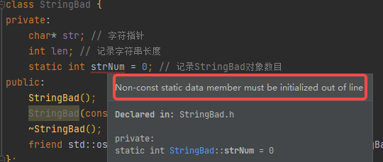
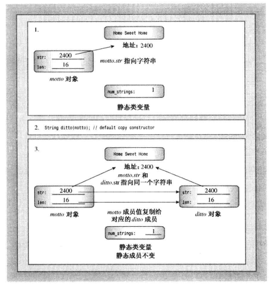
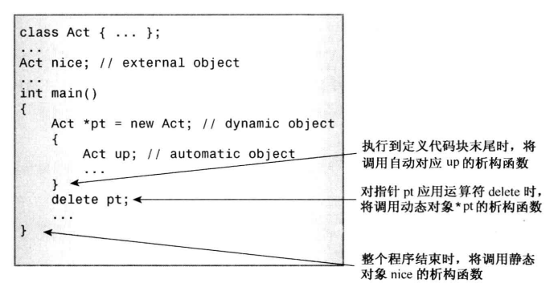
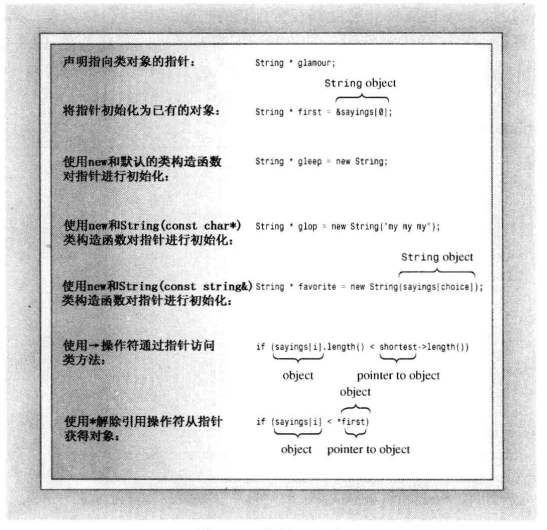
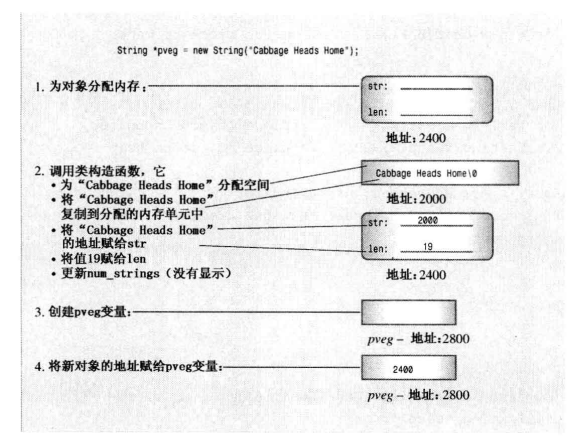
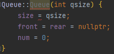

[TOC]

# Unit 4. 类和动态内存分配

假设要创建一个类，该类的一个成员表示人的姓名。最简单的方法是使用字符数组来保存姓名，但这种方法有一些缺陷，刚开始也许会使用一个10个字符的数组，然后发现有的人名字太长，数组存不下，更保险的方法是，使用一个40个字符的。然而，如果创建包含2000个这种对象的数组，因为字符数组只使用了一部分，就会浪费大量的内存。

解决这种问题的方法是：在程序运行时(而不是编译时)就确定使用多少的内存。C++ 的方法是，在类构造函数中使用 new 运算符在程序运行时分配所需的内存。对于保存姓名字符的这种情况，通常是使用 string 类，该类为我们处理内存管理的细节，但是这样就没有机会深入学习内存管理了，因此本节自定义 string 类代码。

这里首先将设计一个 StringBad 类，然后再设计一个功能稍强的 String 类。StringBad 和 String 类将包含一个字符串指针和一个表示字符串长度的值。这里使用 StringBad 和 String 类是为了深入了解 new、delete 和静态类成员的工作原理。之所以命名为 StringBad 是为了提示 StringBad 是一个有缺陷的类。

## 演示：StringBad 类

### 类声明

```cpp
#ifndef STRINGBAD_H_
#define STRINGBAD_H_
#include <iostream>
class StringBad {
private:
    char* str; // 字符指针
    int len; // 记录字符串长度
    static int strNum; // 记录StringBad对象数目
public:
    StringBad();
    StringBad(const char *);
    ~StringBad();
    friend std::ostream & operator<<(std::ostream &, const StringBad &);
};
#endif // STRINGBAD_H_
```

对于这个类声明需要注意两点：

首先，使用 char 指针来表示姓名，而不是 char 数组。这意味着类声明没有为字符本身分配存储空间，而是在构造函数中使用 new 来为字符串分配空间，这避免了在声明中预先定义字符串的长度。

其次，将 strNum 声明为静态存储的类型。静态类成员有一个特点：无论创建了多少对象，程序都只创建一个静态类成员的副本。也就是说，类的所有对象都共享同一个静态成员，这对于所有类对象都具有相同值的类私有数据是非常方便的。

### 类实现

```cpp
#include "StringBad.h"
#include <cstring>
using std::cout;

int StringBad::strNum = 0;
// const double StringBad::s = Unit3.Unit6;
StringBad::StringBad() {
    len = 4;
    str = new char[4];
    std::strcpy(str, "C++");
    strNum++;
    cout << "(+)" << strNum << ":\"" << str << "\" default object created\n";
}

StringBad::StringBad(const char * s) {
    len = strlen(s) + 1;
    str = new char[len];
    strcpy(str, s);
    strNum++;
    cout << "(+)" <<  strNum << ":\"" << str << "\" object created\n";
}

StringBad::~StringBad() {
    cout << "(-):\"" << str << "\" object deleted, " << --strNum << " left.\n";
    delete [] str;
}

std::ostream & operator<<(std::ostream & out, const StringBad & sb) {
    out << sb.str;
    return out;
}
```

在 StringBad 这个类的实现中有几个地方需要注意，下面依次进行讲解。

#### 静态成员的初始化

`int StringBad::strNum = 0;`这条语句将静态成员 strNum 的值初始化为零。需要注意：不能在类声明中初始化静态成员变量，这是因为声明描述了如何分配内存，但并不分配内存。对于静态类成员，可以在类声明之外使用单独的语句进行初始化，这是因为静态类成员是单独存储的，而不是对象的组成部分。还需要注意静态变量的初始化语句指出了类型，使用了作用域运算符，但没有使用关键字 static。



静态类成员初始化是在函数的实现文件中，而不是类声明文件中进行的，这是因为类声明位于头文件中，程序可能将头文件包括在其他几个文件中。如果在头文件中进行初始化，将出现多个初始化语句副本，从而引发错误。

> 唯一可以在类声明中初始化的特例是静态数据成员为 const 整型or枚举型数据，其他类型的 const 变量也是要在类外初始化的。

接下来，注意到每个构造函数都包含表达式 strNum++，这确保程序每创建一个新对象，共享变量 strNum 的值都会 +1，从而记录 String 对象的总数。另外，析构函数中 --strNum，因此，StringBad 类也能跟踪对象被删除的情况，从而使 strNum 成员的值是最新的。

#### 构造函数

```cpp
StringBad::StringBad(const char * s) {
    len = strlen(s) + 1;
    str = new char[len];
    strcpy(str, s);
    strNum++;
    cout << strNum << ":\"" << str << "\" object created\n";
}
```

该构造函数使用一个常规的 C 字符串来初始化 StringBad 对象。类成员 str 是一个字符指针，因此需要构造函数分配足够的内存来存储字符串，然后将字符串的内容复制到申请的内存中。下面来介绍其中的每一个步骤：

首先，使用 \<cstring> 中的 strlen() 函数来计算字符串的长度，并对 len 成员进行初始化；

其次，使用 new 分配足够的空间，并将该地址赋值给 str 成员；

第三，使用 strcpy() 函数将传递的字符串复制到申请的内存中；

第四，更新对象的技术；最后，构造函数将显示当前的对象数目和当前对象中存储的字符串，这样便于掌握程序的运行情况，以便稍后故意使 StringBad 出错时，该特性将排上用场。


必须要使用上面代码中构造函数里的这种字符串赋值方式，因为字符串并不是保存在对象中，而是单独保存在堆内存中，对象中的 str 仅保存了到哪里去查找字符串。因此不能这么做：

```cpp
StringBad::StringBad(const char * s) {
    str = s;
}
```

这样只是让 str 指向了参数 s 指向的地址，并没有创建字符串的副本。

默认构造函数和该构造函数相似，默认构造函数提供了一个默认的字符串 —— "C++"。

#### 析构函数

```cpp
StringBad::~StringBad() {
    cout << ":\"" << str << "\" object deleted, " << --strNum << " left.\n";
    delete [] str;
}
```

cout 语句将会在析构函数被调用时输出一些信息，以便能够得知析构函数何时被调用，这部分不是必不可少的。然而，delete 语句却是至关重用的。str 成员指向的是 new 分配的内存，StringBad 对象过期时，str 也将过期，所以 str 指向的内存应该被释放。也就是说，删除对象可以释放对象本身占用的内存，但并不能自动释放属于对象成员的指针指向的动态分配的内存。因此，必须使用析构函数，在析构函数中使用 delete 语句确保对象过期时，有构造函数使用 new 分配的内存被释放。

> PS：在构造函数中使用 new 来分配内存时，必须在析构函数中使用 delete 来释放内存；在构造函数中使用 new[] 来分配内存时，必须在析构函数中使用 delete[] 来释放内存。

### 类设计的缺陷

下面的程序演示了 StringBad 的构造函数和析构函数何时运行以及如何运行的。

```cpp
int main() {
    using std::cout;
    using std::endl;
    {
        cout << "Use StringBad.\n";
        StringBad sb1("Hello, World");
        StringBad sb2("You Ka");
        StringBad sb3("Mo Xu");
        cout << "sb1: " << sb1 << endl;
        cout << "sb2: " << sb2 << endl;
        cout << "sb3: " << sb3 << endl;
        callStringBad1(sb1);
        cout << "sb1: " << sb1 << endl;
        callStringBad2(sb2);
        cout << "sb2: " << sb2 << endl;
        cout << "Initialize one object to another:\n";
        StringBad sb4 = sb3;
        cout << "sb4: " << sb4 << endl;
        cout << "Assign one object to another:\n";
        StringBad sb5;
        sb5 = sb1;
        cout << "sb5: " << sb5 << endl;
        cout << "End of useStringBad().\n";
    }
    return 0;
}
```

```
// 输出结果
Use StringBad.
(+)1:"Hello, World" object created
(+)2:"You Ka" object created
(+)3:"Mo Xu" object created
sb1: Hello, World
sb2: You Ka
sb3: Mo Xu
Passed By Reference --- StringBad: "Hello, World"
sb1: Hello, World
Passed By Value --- StringBad: "You Ka"
(-):"You Ka" object deleted, 2 left.
sb2: You Ka
Initialize one object to another:
sb4: Mo Xu
Assign one object to another:
(+)3:"C++" default object created
sb5: Hello, World
End of useStringBad().
(-):"Hello, World" object deleted, 2 left.
(-):"Mo Xu" object deleted, 1 left.
(-):"Mo Xu" object deleted, 0 left.
(-):"You Ka" object deleted, -1 left.
(-):"Hello, World" object deleted, -2 left.
```

仔细观察输出结果，发现析构函数输出的信息中，剩余对象数量竟然出现负数，这很不正常。程序在刚开始时还是正常的，但逐渐变得异常，我们先来看程序运行正常的部分。使用 StringBad 构造方法创建了3个 StringBad 对象，使用友元函数重载的 << 运算符展示这三个对象，对应的输出如下：

```
Use StringBad.
(+)1:"Hello, World" object created
(+)2:"You Ka" object created
(+)3:"Mo Xu" object created
sb1: Hello, World
sb2: You Ka
sb3: Mo Xu
```

然后，程序将 sb1 作为实参传递给 callStringBad1() 函数，并在调用后再展示一次 sb1，对应的输出如下：

```cpp
Passed By Reference --- StringBad: "Hello, World"
sb1: Hello, World
```

这部分是正常的，但程序之后将 sb2 作为实参传递给 callStringBad2() 函数，然后在调用之后展示 sb2，对应的输出如下：

```cpp
Passed By Value --- StringBad: "You Ka"
(-):"You Ka" object deleted, 2 left.
sb2: You Ka
```

这里 callStringBad2() 按值传递 sb2，输出表明这是一个严重的问题！因为 callStringBad2() 调用结束时调用了一次析构函数，此后为对象自动调用析构函数时就会出现下面的情况：

```cpp
(-):"Hello, World" object deleted, 2 left.
(-):"Mo Xu" object deleted, 1 left.
(-):"Mo Xu" object deleted, 0 left.
(-):"You Ka" object deleted, -1 left.
(-):"Hello, World" object deleted, -2 left.
```

实际上，计数异常是一条线索，因为每个对象被构造和析构一次，因此调用构造函数的次数应该与析构函数的调用次数相同。对象计数递减次数比递增多两次，这表明使用了不将 strNum 递增的构造函数创建了两个对象。在类声明中定义了两个将 strNum 递增的构造函数，但结果表明，存在第三个构造函数。例如，请看下面的代码：

```cpp
StringBad sb4 = sb3;
```

这使用的是那个构造函数呢？不是默认构造函数，也不是参数为 const char * 的构造函数，其实该语句等效于下面的语句

```cpp
StringBad sb4 = StringBad(sb3);
```

因此该构造函数的原型应该如下：

```cpp
StringBad(const StringBad &);
```

当使用一个对象来初始化另一个对象时，编译器将自动上述构造函数，该构造函数被称为复制构造函数。这个例子中所有的问题都是由于编译器自动生成的复制构造函数造成的。

## 复制构造函数问题

### 问题描述

StringBad 使用程序中出现的异常之处 —— 析构函数的调用比构造函数次数多2次，原因是程序使用默认的复制构造函数另外创建了两个对象。在程序 callStringBad2() 被调用时用复制构造函数初始化形参，还使用复制构造函数初始化 sb4 对象。默认的复制构造函数只是将非静态成员的值复制了，没有修改静态成员 strNum，但析构函数被调用时更新了 strNum。对于这个问题的解决方案就是声明一个对 strNum 进行更新的显式复制构造函数。

### 什么是复制构造函数？

复制构造函数用于将一个对象复制到新创建的对象中，也就是说，它用于对象初始化过程中(包括按值传递参数)，而不是常规的赋值过程中。类的复制构造函数原型通常如下：

```cpp
class_name(const class_name &);
```

它接受一个指向本类的对象的常量引用作为参数。例如，上例中 StringBad 类的复制构造函数的原型如下：

```cpp
StringBad(const StringBad &);
```

对于复制构造函数需要知道两点 —— 何时调用以及有什么功能。

### 何时调用

新建一个对象并将其初始化为同类现有对象时，复制构造函数将被调用。这在很多情况下都可能发生，最常见的情况是将新对象显示地初始化为一个现有对象。例如，假设 sb 是一个 StringBad 对象，下面的声明都将调用复制构造函数：

```cpp
StringBad sb1 = StringBad(sb);
StringBad sb2 = sb;
StringBad sb3(sb);
StringBad * psb = new StringBad(sb);
```

前两种声明可能会使用复制构造函数直接生成 sb2 和 sb3，也可能使用复制构造函数生成一个临时对象，然后将临时对象的内容赋给 sb2 和 sb3，这取决于具体实现。
另一种常见的调用复制构造函数是：调用函数时按值传递类对象或者函数按值返回对象。更广泛地来说，生成临时对象时都会调用复制构造函数。例如，重载 + 运算符之后，将 3 个类对象相加时，编译器可能生成临时的类对象来保存中间结果。具体来说，上面 StringBad 类的使用程序中，下面的函数调用将调用复制构造函数：

```cpp
 callStringBad2(sb2);
```

正是由于按值传递类对象将调用复制构造函数，因此应该按引用传递对象，这样可以节省调用构造函数的时间以及存储新对象的空间。

### 默认复制构造函数(浅拷贝)

默认的复制构造函数逐个复制非静态成员，复制的是成员的值，在代码中下述语句：

```cpp
 StringBad sb4 = sb3;
```

与下面的代码等效(不过由于私有成员无法访问，因此这些代码不能通过编译)：

```cpp
StringBad sb4;
sb4.str = sb3.str;
sb4.len = sb3.len;
```

如果类的成员本身就是类对象，则使用该类的复制构造函数来复制成员对象。



### 解决方案

显式声明一个更新 strNum 成员的复制构造函数：

```cpp
class StringBad {
public:
    // ...
    StringBad(const StringBad &);
}

StringBad::StringBad(const StringBad & sb) {
    str = sb.str;
    len = sb.len;
    strNum++;
    cout << "(+)" << strNum << ":\"" << str << "\" object created(Copy constructor)\n";
}
```

添加了 StringBad 类的复制构造函数之后再次运行程序，可以发现计数异常问题已经被解决：

```cpp
Use StringBad.
(+)1:"Hello, World" object created
(+)2:"You Ka" object created
(+)3:"Mo Xu" object created
sb1: Hello, World
sb2: You Ka
sb3: Mo Xu
Passed By Reference --- StringBad: "Hello, World"
sb1: Hello, World
(+)4:"You Ka" object created(Copy constructor)
Passed By Value --- StringBad: "You Ka"
(-):"You Ka" object deleted, 3 left.
sb2: You Ka
Initialize one object to another:
(+)4:"Mo Xu" object created(Copy constructor)
sb4: Mo Xu
Assign one object to another:
(+)5:"C++" default object created
sb5: Hello, World
End of useStringBad().
(-):"Hello, World" object deleted, 4 left.
(-):"Mo Xu" object deleted, 3 left.
(-):"Mo Xu" object deleted, 2 left.
(-):"You Ka" object deleted, 1 left.
(-):"Hello, World" object deleted, 0 left.
```

> 如果类中包含静态数据成员，并且该成员在新对象被创建时发生变化，则应该提供一个显式的复制构造函数来处理。

## 动态内存分配问题

### 问题描述

虽然从改进之后输出的 Log 上看，该程序好像挺正常的，但实际上还存在一个更危险的问题 —— 字符指针指向的动态内存分配被多次释放。原因在于声明的复制构造函数中 str 成员是按值复制的：

```cpp
str = sb.str;
```

这里复制的不是字符串的内容，而是一个指向字符串的指针，也就是说，通过复制构造函数初始化的对象和原先的对象的 str 成员指向的是同一个字符串的指针。当某一个对象调用析构函数释放动态分配的内存之后，另一个对象的 str 成员指向的就是一块已经被释放过的地址。例如：

```cpp
(+)4:"You Ka" object created(Copy constructor)
Passed By Value --- StringBad: "You Ka"
(-):"You Ka" object deleted, 3 left.
sb2: You Ka
```

在调用 callStringBad2() 函数时，将通过复制构造函数初始化形参，此时形参和 sb2 的 str 成员指向同一个地址，当 callStringBad2() 调用结束会调用形参的析构函数销毁形参，此时 sb2 的 str 成员指向的就是一个被释放过的地址。虽然在 callStringBad2() 调用之后使用了 << 运算符展示的 sb2 看上去并没有问题，但这段代码非常危险，会导致不确定的、可能有害的后果，特别是尝试释放内存两次可能导致程序异常终止。

### 解决方案

解决这类问题的办法是声明复制构造函数时采用深拷贝。也就是说，复制构造函数应当复制字符串的内容并将副本的地址赋给 str 成员。这样每个成员都拥有自己的字符串，而不是引用另一个对象的字符串，每个对象在调用析构函数时都将释放不同的字符串，而不会去释放已经被释放的字符串。深拷贝的复制构造函数可以这样编写：

```cpp
StringBad::StringBad(const StringBad &sb) {
    // 正确的复制构造函数
    len = sb.len;
    str = new char[len + 1];
    strcpy(str, sb.str);
    strNum++;
    cout << "(+)" << strNum << ":\"" << str << "\" object created(Copy constructor)\n";
}
```

> 如果类成员是使用 new 初始化的指针成员，应定义一个赋值构造函数，以复制指向的数据，而不是指针，这被称为深拷贝。

## 赋值运算符问题

### 问题描述

除了默认复制构造函数的问题之外，StringBad 类设计中还存在赋值运算符的问题。ANSI C 允许结构赋值，而 C++ 允许类对象赋值，这是通过编译器自动为类重载赋值运算符来实现的。如果不显式声明一个赋值运算符，在运行下面的程序时会出现释放同一块内存的现象：

```cpp
StringBad sb5;
sb5 = sb1;
```

### 介绍

赋值运算符的原型如下：

```cpp
class_name & class_name::operator=(const class_name &);
```

赋值运算符接受并返回一个指向类对象的引用。例如，StringBad 类的赋值运算符的原型如下：

```cpp
StringBad & StringBad::operator=(const StringBad &);
```

### 何时调用？

将已有的对象赋给另一个对象时，将使用重载的赋值运算符：

```cpp
StringBad sb5;
sb5 = sb1;
```

在初始对象时，不一定会使用赋值运算符：

```cpp
StringBad sb = sb1;
```

这里 sb 是新创建的对象，被初始化为 sb1 的值，因此使用的复制构造函数。然而，实现时也可能是分两步来处理这条语句：使用复制构造函数创建一个临时对象，然后通过赋值运算符将临时对象复制到新对象中。当然，也可能是通过复制构造函数一步到位，具体看编译器的实现。总的来说，初始化总是会调用复制构造函数，而使用=运算符时也可能调用赋值运算符。
与复制构造函数相似的是，赋值运算符的隐式实现也对成员进行逐个复制。如果成员本身的类对象，则程序将使用改成员类定义的赋值运算符来复制该成员，但静态数据不受影响。

因此，在 StringBad 程序运行的最后释放对象时：

```cpp
(-):"Hello, World" object deleted, 4 left.
(-):"Mo Xu" object deleted, 3 left.
(-):"Mo Xu" object deleted, 2 left.
(-):"You Ka" object deleted, 1 left.
(-):"Hello, World" object deleted, 0 left.
```

第一个"Hello, World"是 sb5 对象释放指针指向的地址，而最后一个"Hello, World"会再次释放该地址。

### 解决方案

解决这类问题的方案是显式声明一个赋值运算符函数进行深拷贝，其实现与复制构造函数相似，但也有一些差别：

- 由于目标对象可能引用过之前分配的数据，因此在赋值运算符重载函数中应该使用 delete[] 来释放这些数据。
- 函数应避免将对象给自身，不然的话，在给对象重新赋值之前释放内存的操作可能删除对象的指针成员指向的内容。
- 函数返回一个指向调用对象的引用。

通过返回一个对象，函数可以想常规赋值操作那样，连续进行赋值：

```cpp
S0 = S1 = S2;
```

对应的函数表示法如下：

```cpp
S0.operator=(S1.operator=(S2));
```

下面的代码是为 StringBad 类编写的赋值运算符：

```cpp
StringBad & StringBad::operator=(const StringBad &sb) {
    if (this == &sb) // 自己给自己赋值
        return *this;

    delete [] sb.str; // 释放之前指向的内存
    this->len = sb.len;
    this->str = new char[len + 1];
    strcpy(this->str, sb.str);
    cout << "(+)" << strNum << ":\"" << str << "\" object modify(operator =)\n";
    return *this;	
}
```

代码首先检查是否是自我赋值，这是通过判断两个对象的地址是否相同来完成的。如果地址相同，说明这两个对象是同一个对象，此时程序返回 \*this，然后结束。
如果地址不同，函数将释放 str 指向的内存，这是因为稍后要将一个新的字符串的地址赋值给 str，因此 str 需要先将当前指向的内存释放掉，防止内存被浪费(内存泄漏)。

> 注：释放 str 指向的内存这里不需要先判断 str 是否为空，因为 delete 允许释放 NULL 指针，实际上是因为 delete 的实现中会进行 NULL 判断的。

接下来的操作与赋值构造函数相似，完成上述操作之后程序返回 *this 并结束。由于赋值运算符并不创建新的对象，因此不需要更新静态成员 strNum 的值。

将前面的复制构造函数和赋值运算符添加到 StringBad 类中之后，所有的问题都解决了。

## 改进 —— String 类

有了更丰富的知识后，可以对 StringBad 类进行修订，将它重命名为 String。首先，添加前面介绍过的复制构造函数和赋值运算符，使类能够正确管理类对象使用的内存。其次，将会添加一些新功能，使 String 类更贴近 C++ 的 string 类的功能。 需要添加的函数如下：

```cpp
int length() const;
friend bool operator<(const String & s1, const String & s2);
friend bool operator>(const String & s1, const String & s2);
friend bool operator==(const String & s1, const String & s2);
friend std::istream operator>>(std::istream & in, String & s);
char & operator[](int index);
const char & operator[](int index) const;
static int HowMany();
```

第一个新方法返回存储的字符串的长度，接下来的三个友元函数实现字符串的比较，>>运算符重载提供简单的输入功能；两个 operator\[]() 函数提供数组表示法访问字符串中的字符，之所以返回字符引用是为了能够通过数组表示法修改字符串指定位置的字符，静态方法 HowMany() 将补充静态类成员 strNum。

鉴于 String 类构造函数以及析构函数在 StringBad 类的解决方案中已经列出，这里就不在展示，以下主要讲解这几个新函数的实现。

### 比较成员函数

```cpp
bool operator<(const String & s1, const String & s2) {
    if (strcmp(s1.str, s2.str) < 0)
        return true;
    return false;
}

bool operator>(const String & s1, const String & s2) {
    return s2 < s1;
}

bool operator==(const String & s1, const String & s2) {
    return strcmp(s1.str, s2.str) == 0;
}
```

将比较函数声明为友元函数的好处在于可以将 String 对象与常规的 C 字符串进行比较。例如，假设 str 是 String 类对象，则下面的代码：

```cpp
if ("C++" < str)
```

将被转换成：

```cpp
if(operator<("C++", str))
```

然后编译器会调用构造方法将代码转换为：

```cpp
if(operator<(String("C++"), str))
```

如果不将比较函数声明为友元函数，则只能接受 `str < "C++"` 这样顺序的调用。

### 数组表示法访问 String

```cpp
char & String::operator[](int index) {
    return str[index];
}

const char & String::operator[](int index) const {
    return str[index];
}
```

首先，\[] 运算符只能作为成员函数来重载；其次，返回 char & 类型可以给指定位置的字符赋值。例如，可以这样使用 String 对象：

```cpp
String s("YouKa");
s[3] = 'M'; 
```

`const char & String::operator[](int index) const`函数则是用于 const String 对象读取字符。

### 静态类成员函数

可以将成员函数声明为静态的。

```c++
int String::HowMany() {
    return strNum;
}
```

静态成员函数不能通过对象调用，甚至不能使用 this 指针。如果静态成员是 public 声明的，则可以使用类名和作用域解析运算符来调用它。例如，String 类的 HowMany 静态成员函数可以这样调用：

```cpp
int count = String::HowMany();
```

由于静态成员函数不与特定的对象相关联，因此只能使用静态数据成员。例如，静态方法 HowMany() 可以访问静态成员 strNum，但不能访问 str 和 len。
静态成员函数常用于设置类级标记，以控制某些类接口的行为。

### 进一步重载赋值运算符

假设现在要将常规字符串复制到 String 对象中，例如使用 getline() 读取了一个字符串，并且要将这个字符串放置到 String 对象中，此时 String 对象有以下函数：

```cpp
String & operator=(String &);
String(char * p);
String(const String &);
```

因此，对于前面的需求，如果是首次输入字符串，可以编写以下代码：

```cpp
// 首次输入
char temp[20];
cin.getline(temp, 20);
String s = String(temp);
```

继续输入字符串并保存在对象 s 中：

```cpp
// 首次输入
char temp[20];
cin.getline(temp, 20);
String s = String(temp);
// 再次输入
cin.getline(temp, 20);
s = temp;
```

重载的赋值运算符只接受 String & 类型的参数，而 temp 是 char * 类型的变量，因此会先使用转换构造函数`String(const String &);`生成一个临时对象，然后将这个临时对象赋值给 s，之后程序调用析构函数 ~String() 删除临时对象。
为了提高处理的效率，最简单的方法就是新增一个重载赋值运算符，接受常规字符串作为参数，这样就不必创建和删除临时对象了。

```cpp
String & String::operator=(const char * p) {
    delete [] this->str;

    this->len = strlen(p);
    this->str = new char[len + 1];
    strcpy(str, p);
    std::cout << "(+)" << strNum << ":\"" << str << "\" object modify(operator =)\n";
    return *this;
}
```

### 重载 >> 运算符

通过重载 >> 运算符提供一种将键盘输入读入到 String 对象中的方法，如果由于某种原因导致输入失败，istream 对象的值将被置为 false。

```cpp
std::istream & operator>>(std::istream & is, String & s) {
    char temp[40];
    std::cin.get(temp, 40);
    
    // 赋值
    if (is) s = temp;
    // 清除无效字符
    while(is && is.get() != '\n') continue;

    return is;
}
```

### 使用 String 的程序

```cpp
using std::cout;
using std::endl;
const int SIZE = 10;
const int CHAR_SIZE = 40;
String arr[SIZE];

for (int i = 0; i < SIZE; i++) {
    cout << "Please input " << SIZE - i << " words.\n";
    std::cin >> arr[i];
}

for (int j = 0; j < SIZE; j++) {
    cout << arr[j] << endl;
}
```

## 小结：在构造函数中使用 new 的注意事项

- 如果在构造函数中使用 new 来初始化指针成员，则应在析构函数中使用 delete；如果构造函数中使用的是new[]，析构函数中应使用 delete[]。
- 如果有多个构造函数都是用 new，那么他们必须以相同的方式使用，要么都带中括号，要么都不带中括号。因为只有一个析构函数，所有的构造函数都必须与它兼容。不过可以在一个构造函数中使用 new，另一个构造函数中将其初始化为 nullptr，这是因为 delete 可用于空指针。
- 应该定义一个复制构造函数，通过深拷贝将一个对象初始化为另一个对象。通常，这种构造函数与下面类似：

```cpp
String(const String & s) {
    strNum++;
    len = s.len;
    str = new char[len + 1];
    strcpy(str, s.str);
}
```

- 应该定义一个赋值运算符，通过深拷贝讲一个对象复制给另一个对象。通常，该类方法与下面的类似：

```cpp
String & operator=(const String & s) {
    if(this == &s)
        return *this;
    delete str;
    len = strlen(s.str);
    str = new char[len + 1];
    str = strcpy(str, s.str);
}
```

## 有关函数返回对象的说明

当成员函数或独立的函数返回对象时，有几种返回方式可供选择。可以返回指向对象的引用、指向对象的 const 引用、const 对象。

### 返回指向 const 对象的引用

使用 const 引用的常见原因是旨在提高效率，但对于何时采用这种方法存在一些限制。如果函数返回传递给它的对象，可以通过返回引用来提高效率。例如，编写函数 Max()，它返回两个 Object 对象中较大的一个(假设 Object 类重载了比较运算符)。

```cpp
// Version Unit1
Object Max(const Object & obj1, const Object & obj2) {
    if(obj1 < obj2)
        return obj2;
    else
        return obj1
}
// Version Unit2
const Object & Max(const Object & obj1, const Object & obj2) {
    if(obj1 < obj2)
        return obj2;
    else
        return obj1
}
```

这里有三点需要说明。首先，返回对象将调用复制构造函数，而返回引用不会。因此，Version 2 所做的工作更少，效率更高。其次，引用指向的对象应在调用函数执行时存在。在这个例子中，obj1、obj2 的引用指向的对象都是在调用 Max 的函数中存在的。第三，obj1 和 obj2 都被声明为 const 引用，因此返回类型必须为 const 才能匹配。

### 返回指向非 const 对象的引用

两种常见的返回非 const 对象的情形是重载赋值运算符以及重载与 cout 一起使用的 << 运算符。前者这样做旨在提高效率，而后者必须这样做。

operator=() 返回对象的引用可用于连续赋值：

```cpp
String s1("YouKa");
String s2, s3;
s3 = s2 = s1;
```

上诉代码中，s2.operator=() 的返回值被赋给 s3.为此，返回 String 对象或 String 对象的引用都是可行的，但通过使用引用可以避免该函数在返回对象时调用 String 复制构造函数来创建一个新的 String 对象，提高效率。这个例子中，返回类型不是 const，因为方法 operator=() 返回一个指向 s2 的引用，可以对该对象进行修改。


operator<<() 返回对象用于串接输出：

```cpp
String s1("YouKa");
cout << s1 << std::endl;
```

在上述代码中，operator<<(cout, s1) 的返回值称为一个显示换行的对象，返回值类型必须是 ostream &，而不能是 ostream。如果使用返回类型 ostream，将要求调用 ostream 类的复制构造函数，而 ostream 没有公有的复制构造函数。

### 返回对象

如果被返回的对象是被调用函数中的局部变量，则不应按引用方式返回它，因为在被调用函数指向完毕时，局部对象将调用其析构函数。因此，当控制权回到调用函数时，引用指向的对象将不在存在。在这种情况下，应返回对象而不是引用。通常，被重载的算术运算符属于这一类。

```cpp
Object Object::operator+(const Object & obj) const {
    return Object(this->value + obj.value);
}
```

在这种情况下，存在调用复制构造函数来创建被返回的对象的开销，然而这是无法避免的。

### 返回 const 对象

前面定义的 Object::operator+() 有一个奇怪的属性，本来它是希望能够以下面的方式使用它：

```cpp
Object obj3 = obj1 + obj2;
```

但这种定义形式也允许这样使用它：

```cpp
obj1 + obj2 = obj3;
```

首先，没有任何编写这种语句的理由，但这种语句并没有违反语法规则，所以不是所有的代码都是合理的。

其次，这种代码之所以可行，是因为复制构造函数创建一个临时对象来表示返回值。因此前面的代码中，obj1 + obj2 的结果为一个临时对象。在第一种使用形式中，该临时对象被赋值给 obj3，在第二中使用形式中，将 obj3 赋值给临时对象。

第三，使用完临时对象后将把它丢弃。例如，对于第二种使用形式，程序将计算 obj1 和 obj2 之和，将结果复制到临时返回对象中，再用 obj3 的内容覆盖临时对象的内容，然后将该临时对象丢弃。原来的 obj1 和 obj2 值都不变。

第四，如果担心这种行为可能引发无用，有一种简单的解决方案：将返回类型声明为 const Object，这样第一种使用形式依旧合法(const 对象可以赋值给非 const 对象)，但第二种使用形式是非法的。


总之，如果函数要返回局部对象，应返回对象，而不是指向对象的引用。在这种情况下，将使用复制构造函数来生成返回的对象。如果方法或函数要返回一个没有公有复制构造函数的类的对象，必须返回一个指向这种对象的引用。最后，有些函数可以返回对象，也可以返回指向对象的引用，在这种情况下，首选引用，因为效率更高。

## 指向对象的指针

C++程序经常使用指向对象的指针，通常会搭配 new 来使用，例如，Class_Name 是类，value 是 Type_Name 类型：

```cpp
Class_Name * ptr = new Class_Name(value);
```

该语句会调用如下的构造函数：

```cpp
Class_Name(Type_Name &);
```

而下面的初始化则是会调用默认构造函数：

```cpp
Class_Name * ptr = new Class_Name;
```

### 再谈 new 和 delete

对于类对象我们可以在两个层次上使用 new 和 delete。

首先，可以使用 new 为类的数据成员分配存储空间。例如，String 类的`char * str` 成员，在构造函数中使用 new 生成足够存储字符串的空间，并将地址赋值给 str。由于这是在构造函数中进行的，因此在析构函数中必须使用 delete 释放空间。因为字符串是字符数组，所以构造函数和析构函数中使用带中括号的 new 和 delete。

其次，可以使用 new 来为整个类对象分配内存。`String * pstr = new String("YouKa");`这不是为要存储的字符串分配内存，而是为对象分配内存，即为保存字符串地址的 str 指针和 len 成员分配内存。需要注意，程序不会给 strNum 成员分配内存，因为 strNum 是静态成员，是独立于对象的。创建对象将调用构造函数，构造函数分配用于保存字符串的内容，并将字符串的地址赋给 str。当程序不在需要该对象时，可以使用 delete 删除它，`delete pstr;`，这里的 delete 只释放保存 str 和 len 成员的空间，不释放 str 指向的空间，该任务是由析构函数完成的。



在下述情况下析构函数将被调用：

- 如果对象是自动变量，则当执行完定义该对象的程序块时，将调用改对象的析构函数。
- 如果对象是静态变量，则在程序结束时将调用对象的析构函数。
- 如果对象是用 new 创建的，则仅当显式使用 delete 删除对象时，析构函数才会被调用。

### 指针和对象的小结

使用对象指针时，要注意几点：

- 使用常规表示法来声明指向对象的指针：`String * pstr;`
- 可以将指针初始化为指向已有的对象。
- 可以使用 new 来初始化指针，调用相应的类构造函数来初始化创建一个新的对象。
- 可以使用 -> 运算符通过指针访问类方法。
- 可以对对象指针应用解除引用运算符(*)来获得指针指向的对象。





### 定位 new 运算符

定位 new 运算符能够在分配内存时指定内存位置。使用定位 new 运算符必须先包含头文件 \<new>。

```cpp
#include <new>
#include <iostream>

struct book{
    char name[20];
    double price;
};
char buffer1[100];
char buffer2[100];
int main() {
    std::cout << "buffer1 address: " << (void *) buffer1 << std::endl;
    std::cout << "buffer2 address: " << (void *) buffer2 << std::endl;
    book *p1, *p2;
    p1 = new book;
    // 定位 new 运算符，在 buffer1 的位置上创建一个 book 结构的变量
    p2 = new (buffer1) book;
    std::cout << "p1 address: " << p1 << std::endl;
    std::cout << "p2 address: " << p2 << std::endl;
    int * p3 = new (buffer2) int[10];
    std::cout << "p3 address: " << p3 << std::endl;
    return 0;
}
```


将 new 定位运算符运用在对象上，还会有所不同。

```cpp
class TestType {
public:
    TestType(const std::string & s = "Just use to test", int number = 0) {
        words = s;
        this->number = number;
        std::cout << words << " constructed.\n";
    }
    ~TestType() {
        std::cout << words << " destructed.\n";
    }
    friend std::ostream & operator<<(std::ostream & out, const TestType & t);
private:
    std::string words;
    int number;
};

std::ostream & operator<<(std::ostream & out, const TestType & t) {
    std::cout << t.words << ", " << t.number;
    return out;
}
int main() {
    char * buffer = new char[512];
    std::cout << "Memory address: " << (void *) buffer << std::endl;

    TestType * p1, *p2, *p3, *p4;
    p1 = new (buffer) TestType;
    p2 = new TestType("Heap1", 20);
    std::cout << "buffer(p1) address: " << p1 << std::endl;
    std::cout << "heap(p2)  address: " << p2 << std::endl;
    std::cout << "Memory content:\n";
    std::cout << p1 << ": " << *p1 << "; " << p2 << ": " << *p2 << std::endl << std::endl;

    p3 = new (buffer) TestType("Bad", 6);
    p4 = new TestType("Heap2", 10);
    std::cout << "Memory content:\n";
    std::cout << p3 << ": " << *p3 << "; " << p4 << ": " << *p4 << std::endl << std::endl;

    std::cout << "p1: " << *p1 << std::endl << std::endl;
    
    delete p2;
    delete p4;
    delete [] buffer;
    std::cout << "Finish.\n";
    return 0;
}
```

该程序使用 new 运算符创建了一个 512 字节的内存缓冲区；然后使用 new 运算符在堆中创建两个 TestType 对象，使用定位 new 运算符在内存缓冲区中创建两个 TestType 对象；最后，它使用 delete 来释放使用 new 分配的内存。下面是程序的输出：

```cpp
Memory address: 0xd95e60
Just use to test constructed.
Heap1 constructed.
buffer(p1) address: 0xd95e60
heap(p2)  address: 0xd91b10
Memory content:
0xd95e60: Just use to test, 0; 0xd91b10: Heap1, 20

Bad constructed.
Heap2 constructed.
Memory content:
0xd95e60: Bad, 6; 0xd91b40: Heap2, 10

p1: Bad, 6

Heap1 destructed.
Heap2 destructed.
Finish.
```

该程序使用定位 new 运算符时存在两个问题：

- 在创建第二个对象时，定位 new 运算符使用一个新对象来覆盖第一个对象的内存单元。显然，如果类使用 new 为其成员动态分配内存将引发问题。
- 其次，将 delete 用于 p2 和 p4 时，将自动调用 p2 和 p4 指向的对象调用其析构函数；然而，将 delete[] 用于缓存区 buffer 时，不会为使用 定位 new 运算符创建的对象调用析构函数。

该程序给我们的第一个教训是，程序员必须负责确保使用定位 new 运算符使用的缓冲区内存单元正确。要使用不同的内存单元，程序员需要提供两个位于缓冲区的不同地址，并确保这两个地址单元不重叠。例如，可以这样做：

```cpp
p1 = new (buffer) TestType;
p3 = new (buffer + sizeof(TestType)) TestType("Bad", 6);
```

其中 p3 指针指向相对于 p1 的偏移量为 TestType 对象的地址。


第二个教训是，如果使用定位 new 运算符来为对象分配内存，必须确保其析构函数被调用。但如何确保呢？对于在堆中创建的对象，可以这样做：`delete p2;`，但由定位 new 运算符创建的对象不能这样做：`delete p1; delete p3;`。原因在于 delete 可与常规 new 运算符配合使用，但不能与定位 new 运算符配合使用。另一方面，指针 p1 指向的地址与 buffer 相同，但 buffer 是使用 new[] 初始化的，因此必须使用 delete[] 而不是 delete 来释放。即使 buffer 是使用 new 而不是 new[] 初始化的，delete p1 也将释放 buffer，而不是 p1。这是因为 new/delete 系统知道已分配的 512 字节块 buffer，但对于定位 new 运算符对该内存块做了何种处理一无所知。

`delete [] buffer;`释放使用常规 new 运算符分配的整个内存块，但它没有为定位 new 运算符在该内存块中创建的对象调用析构函数，这一点可以根据输出信息来确定。输出信息中有 p2、p4 这两个在堆中申请内存的对象的析构函数调用痕迹，而 p1 和 p3 指向的对象没有调用析构函数。

这种问题的解决方案是，显式地为使用定位 new 运算符创建的对象调用析构函数。正常情况下需要自动调用析构函数，这是需要显式调用析构函数的少数几种情况之一。显式地调用析构函数时，必须指定要销毁的对象，由于有指向对象的指针，因此可以使用这些指针：

```cpp
p3->~TestType();
p1->~TestType();
```

需要注意的一点是正确的删除顺序！对于使用 new 运算符创建的对象，应用与创建顺序相反的顺序进行删除。原因在于，晚创建的对象可能依赖于先创建的对象。另外，仅当所有对象都被销毁之后才能释放用于存储这些对象的缓冲区。

正确使用定位 new 运算符创建对象的程序如下：

```cpp
int main() {
    char * buffer = new char[512];
    std::cout << "Memory address: " << (void *) buffer << std::endl;

    TestType * p1, *p2, *p3, *p4;
    p1 = new (buffer) TestType;
    p2 = new TestType("Heap1", 20);
    std::cout << "buffer(p1) address: " << p1 << std::endl;
    std::cout << "heap(p2)  address: " << p2 << std::endl;
    std::cout << "Memory content:\n";
    std::cout << p1 << ": " << *p1 << "; " << p2 << ": " << *p2 << std::endl << std::endl;

    // 错误, 这样创建对象会覆盖 p1 指向的对象. 如果类动态为成员分配内存, 会导致内存泄漏.
//    p3 = new (buffer) TestType("Bad", Unit6);
    p3 = new (buffer + sizeof (TestType)) TestType("Bad", 6);
    p4 = new TestType("Heap2", 10);
    std::cout << "Memory content:\n";
    std::cout << p3 << ": " << *p3 << "; " << p4 << ": " << *p4 << std::endl << std::endl;

    std::cout << "p1: " << *p1 << std::endl << std::endl;

    delete p2;
    p2 = nullptr;
    delete p4;
    p4 = nullptr;
    p3->~TestType();
    p3 = nullptr;
    p1->~TestType();
    p1 = nullptr;
    delete [] buffer;
    std::cout << "Finish.\n";
    
    return 0;
}
```

该程序使用定位 new 运算符在相邻的内存单元中创建了两个对象，并调用了合适的析构函数。

## 练习 —— 队列模拟
假设现在要建立一个 ATM，并对顾客排队等待的时间进行估测，需要编写一个程序来模拟这种情况。对于这种问题，最自然的方法是使用队列。
### Queue 类
#### 类接口
首先，要设计一个 Queue 类，这里先列出队列的特征：

- 队列存储有序的项目序列；
- 队列容纳的项目数有限制；
- 能创建空队列；
- 能检查队列是否为空；
- 能检查队列是否为满；
- 能在队尾添加项目；
- 能在队首删除项目；
- 能确定队列中项目数。
#### 链表
首先需要解决的问题就是如何表示队列数据？一种方法是使用 new 动态分配一个数组，但对于队列操作而言，数组有点不太合适，要么在添加、删除元素时进行元素的移动，要么作一些更费力的工作，如将数组视为是循环的。然而，相比数组使用列表能够满足队列要求。
```cpp
class Queue {
private:
    struct Node {
        Item item;
        Node * next;
    };
    enum {SIZE = 10}; // 队列的项目数
    Node * front; // 头指针
    Node * rear; // 尾指针
    int num; // 队列中元素的数目
    const int size; // 队列中最大可以有多少元素
public:
    Queue(int qsize = SIZE);
    ~Queue();
    bool isEmpty() const; // 队列是否为空
    bool isFull() const; // 队列是否为满
    int getCount() const; // 获取队列中元素数目
    bool add(Item &); // 往队列中添加元素
    bool remove(Item &); // 从队列中删除元素
};
```
#### 嵌套使用类声明
上述声明使用了 C++ 的一项特性：在类中嵌套使用结构或类声明。通过将 Node 声明放在 Queue 类中，可以使其作用域为整个类。这样不用担心 Node 声明与某些全局声明or其他类中声明的 Node 发生冲突。如果像 Node 这种嵌套的声明是在类的私有部分进行的，则 Node 只能在这个类中来使用；如果像 Node 这种嵌套的声明是在类的公有部分进行的，则可以在类外使用 Queue::Node 来声明变量。
#### 构造函数中常量的初始化(成员初始化列表)
类构造函数应提供类成员的值。由于队列在初始化时没有元素在排队，即队列应该是空的，因此，队首和队尾指针都应该设置为 nullptr，并将 num 设置为 0，另外，还应将队列的最大长度 size 设置为构造函数的参数 qsize。但是下面的构造函数的实现将会报错：



原因在于 size 成员被声明为 const，所以可以对 size 初始化，但不能给它赋值。从概念上说，调用构造函数时，对象将在 {} 中代码执行之前被创建。因此，调用 Queue(int qsize) 将导致程序首先给 4 个成员变量分配内存，然后程序流程进入到 {} 中，使用常规的赋值方式将值存储在内存中。因此，对于 const 数据成员，必须在执行到构造函数体之前，即创建对象时进行初始化。C++ 提供了一种特殊的语法来完成上述工作，它叫做成员初始化列表。成员初始化列表由逗号分隔的初始化列表组成(前面带冒号)。成员初始化列表位于构造函数参数列表的右括号之后，函数体的左括号之前。如果类的数据成员名称为 mdate，需要将其初始化为 val，则成员初始化列表的初始化器为 `mdate(val)`。使用这种表示法，可以这样编写 Queue 的构造函数：
```cpp
Queue::Queue(int qsize) : size(qsize) {
    front = rear = nullptr;
    num = 0;
}
```
通常，初始化列表中可以初始化常量或构造函数中的参数，并不是只限于初始化常量。可以将 Queue 构造函数写成如下所示：
```cpp
Queue::Queue(int qsize) : size(qsize), front(nullptr), rear(nullptr), num(0) {}
```
注意，只有构造函数才可以使用这种初始化列表的语法。对于 const 类成员，必须使用这种语法；另外，对于被声明为引用的类成员，也必须使用这种语法：
```cpp
class Demo {
private:
    Member & member;
    ...;
};
Demo::Demo(Member & m) : member(m) {}
```
原因在于引用与 const 数据类似，只能在被创建时进行初始化。对于简单数据成员(如，front、rear 和 num)，使用成员初始化列表和在函数体内使用赋值没什么区别。然而，对于本身就是类对象的成员来说，使用成员初始化列表的效率更高。

使用成员初始化列表需要注意以下几点：

- 这种格式只能用于构造函数；
- 初始化非静态 const 数据成员必须使用初始化列表来完成；
- 初始化引用数据成员必须使用初始化列表来完成。
#### 添加队列元素
队列添加元素是从队尾添加，需要经过以下几个阶段：

1. 如果队列已经满了，则不能添加元素；
1. 否则，创建新节点，并将参数 Item 的值复制给新节点；
1. 将节点添加到队尾，并更新 num 的值。
```cpp
bool Queue::add(const Item & item) {
    // 队列已满不能添加元素
    if (isFull())
        return false;

    Node * node = new Node;
    node->item = item;
    node->next = nullptr;
   
    // 如果队列是空的, 不需要连接Node, 只需要将头指针置为添加的元素即可
    if (isEmpty())
        front = node;
    else
        rear->next = node;
    rear = node;
    num++;
    return true;
}
```
注意，创建 Node 节点必须用 new，否则退出函数时会被销毁。
#### 删除队列元素
队列删除元素是从队首删除，需要经过以下阶段：

1. 如果队列为空，则不能删除元素；
1. 否则，创建一个临时的 Node 指针，指向队首元素(头指针指向的元素)，并将队首元素的 Item 赋值给参数，以便返回给主调函数；
1. 将队首元素从队列中删除(front 指针指向下一个元素)，释放出队元素的内存，并更新 num；
1. 如果删除元素之后队列是空的，将 rear 设置为 null。
```cpp
bool Queue::remove(Item & item) {
    // 空队列不能删除元素
    if (isEmpty())
        return false;

    Node * temp = front;
    item = temp->item;

    front = front->next;
    delete temp;
    num--;
    
    // 如果删除元素之后队列为空，将尾指针置为 null
    if (isEmpty())
        rear = nullptr;
    return true;
}
```
#### 析构函数
虽然类构造函数中没有使用 new 为数据对象申请内存，好像不用在析构函数中释放 new 申请的内存。这种想法是错误的，因为向队列添加对象将调用 new 来创建新的节点，虽然通过删除的节点的 remove 方法可以释放节点的内存，但是不能保证队列到期时为空。因此，类需要一个显式的析构函数删除所有剩余的节点。
#### 禁用复制构造函数与赋值运算符
使用 new 的类通常需要包含显式的复制构造函数和执行深拷贝的赋值运算符，这个例子也是如此吗？
复制 Queue 对象的成员将生成一个新的对象，该对象的头指针和尾指针依旧指向原来队列的头和尾。因此，将 Item 添加到复制的 Queue 对象中，将添加到复制对象与原对象共享的队列，更糟糕的是只有复制对象的尾指针会更新为新添加的元素，原对象的尾指针不会修改。显然，克隆或复制队列，必须提供复制构造函数和执行深拷贝的赋值运算符。
但是这里的模拟不实现上述功能，虽然可以忽视这些问题，但是在将来的某个时候，可能需要再次使用队列且需要复制，而我们可能跟会忘记没有为复制提供适当的代码。在这种情况下，程序能够正常编译和运行，但结果是混乱的，甚至可能会崩溃。因此，最好还是提供复制构造函数和赋值运算符，尽管目前不需要他们。
但其实有一种小小的技巧避免这些额外工作，并确保程序不会崩溃，这个技巧就是将所需的方法定义为私有方法：
```cpp
class Queue {
private:
    Queue(const Queue & q) : size(q.size) {}
    Queue & operator=(const Queue & q) { return *this;}
}
```
这样做有两个作用：第一，避免了使用自动生成的默认方法；第二，因为这些方法被声明为私有的，因此下面的代码不被允许使用：
```cpp
Queue q1;
Queue q2(q1); // error
Queue q3;
q3 = q1; // error
```
> PS：C++11 提供了另一种禁用函数的方法 —— 使用关键字 delete。

#### 其他问题
有没有其他问题需要注意？当然有，当 Queue 对象按值传递或返回时将调用复制构造函数。因此，在使用 Queue 类的时候必须要遵循优先采用引用传递对象的习惯，这样就不会有问题。
另外，复制构造函数还被用于创建其他临时对象，但 Queue 定义中并没有导致创建临时对象的操作，例如重载加法运算符。

### Client 类
其次，需要设计一个顾客类。通常，顾客有很多属性，例如，姓名，账号，密码，账号余额等。然而这里只需要记录顾客到达的时间、交易所需的时间。
当模拟生成新顾客时，程序将创建一个新的顾客对象，并在其中保存顾客到达的时间以及一个随机生成的交易时间。当客户到达队首时，程序将记录此时的时间，并将其与进入队列的时间相减，得到顾客的等候时间。
```cpp
typedef class Client {
private:
    long arrive_time;// 顾客到达时间
    int process_time;// 顾客处理时间
public:
    Client() { arrive_time = process_time = 0; }
    Client(long at, int pt) { arrive_time = at; process_time = pt; }

    void set(long at);
    long get_arrive_time() const { return arrive_time; };
    int get_process_time() const { return process_time; };
} Item;
```
```cpp
void Client::set(long at) {
    arrive_time = at;
    process_time = std::rand() % 3 + 1;
}
```
Client 的默认构造函数创建一个空顾客，set() 成员函数将到达时间设置为参数，并将处理时间设置为 1~3 中的一个随机值。

### ATM 模拟
现在已经拥有模拟 ATM 所需要的工具。程序允许用户输入 3 个数：队列的长度、程序模拟的持续时间(单位为小时)以及平均每小时的客户数。程序将使用循环 —— 每次循环代表一分钟，在每分钟的循环中，程序完成下面的工作：

1. 判断是否来了新客户。如果来了，并且队列未满，则新客户入队，否则拒绝客户入队；
1. 如果没有客户在进行交易，则选取队列的第一个客户进行交易。确定该客户的等候时间，并将 wait_time 计数器设置为新客户所需的处理时间；
1. 如果客户正在处理，则将 wait_time 计数器减 1；
1. 记录各种数据，包括获取服务的客户数目、拒绝的客户数目、排队等候的累计时间以及累计的队列长度等；
1. 当模拟的循环结束时，程序将报告各种统计结果。

这里还存在一个问题是，程序如何确定是否有新客户的到来？这里我们假设平均每 6 分钟将会有一位新客户，但正好 6 分钟来一个客户不太现实，我们将通过 rand() 函数实现一个更随机的过程：
```cpp
// 在循环中判断当前循环是否有新顾客到来
bool isNewClient(double x) {
    return x * std::rand() / RAND_MAX < 1;
}
```
`x * std::rand() / RAND_MAX`将返回 0 ~ x 的数值，因此 isNewClient() 函数将有 1/x 的概率返回 true。
```cpp
#include "client.h"
#include <ctime>
#include <cstdlib>
#include <iostream>
const int MIN_PER_HOURS = 60;

// 在循环中判断当前循环是否有新顾客到来
bool isNewClient(double x) {
    return x * std::rand() / RAND_MAX < 1;
}

int main(int args, char* arg[]) {
    int queue_size, hours;
    double perhour;
    std::cout << "Please input maximum size of Queue:\n";
    std::cin >> queue_size;
    std::cout << "Please input number of simulation hours:\n";
    std::cin >> hours;
    std::cout << "Please input average number of client per hour:\n";
    std::cin >> perhour;

    int cycle = hours * MIN_PER_HOURS; // 循环的轮次, 一轮等于一分钟
    double min_per_client = 1.0 * MIN_PER_HOURS / perhour; // 平均每个顾客到达的时间


    Queue queue(queue_size); // 创建队列
    Item temp; // 临时对象
    long turnaways = 0; // 由于队列满了被拒绝的人数
    long clients = 0; // 记录排队的顾客总数目
    long served = 0; // 模拟期间的服务次数
    long sum_queue = 0; // 累积长度
    long wait_time = 0; // 顾客处理时间
    long queue_wait = 0; // 顾客总的等待时间

    for(int i = 0; i < cycle; i++) {
        if(isNewClient(min_per_client)) {
            // 本轮循环有新顾客到来
            if(queue.isFull()) {
                // 此时队列是满的, 将拒绝该顾客
                turnaways++;
            } else {
                // 此时队列没有满, 顾客入队
                clients++;
                temp.set(i);
                queue.add(temp);
            }
        }
        if (wait_time <= 0 && !queue.isEmpty()) {
            // 当前顾客处理完毕, 从队列中选取下一个服务的顾客
            queue.remove(temp);
            wait_time = temp.get_process_time();
            queue_wait += i - temp.get_arrive_time(); // 已经服务完的顾客总的等待时间需要加上最新被选中的顾客等待的时间
            served++; // ATM 服务顾客的次数加 Unit1
        }
        if (wait_time > 0)
            wait_time--;
        sum_queue += queue.getCount();
    }

    // 展示统计的信息
    if (clients > 0) {
        std::cout << clients << " clients arrived.\n";
        std::cout << served << " clients use ATM.\n";
        std::cout << turnaways << " clients leave.\n";
        std::cout << "Queue average size is " << (double) sum_queue / cycle << std::endl;
        std::cout << "Client average wait time is " << (double) queue_wait / served << std::endl;
    } else
        std::cout << "No clients.\n";
    std::cout << "Finished.\n";
    return 0;
}
```
```cpp
Please input maximum size of Queue:
10
Please input number of simulation hours:
100
Please input average number of client per hour:
30
2857 clients arrived.
2849 clients use ATM.
71 clients leave.
Queue average size is 4.48133
Client average wait time is 9.4198
Finished.
```

## 复习

至此，已经介绍了多种用于处理与类相关问题的编程技术，下面对它们进行总结，并介绍何时使用它们。

### 构造函数

用于类对象初始化，没有返回值，函数名与类名相同。

```cpp
class String {
    char * str;
    int len;
public:
    String(); // 默认构造函数
    String(const char *, int);
    String(const String &); // 复制构造函数
    String(const Other_Class &); // 转换构造函数
}
```
- 对于非静态的 const 数据成员以及类的引用成员必须使用初始化列表的语法进行初始化，不能在构造函数体中进行赋值，这是因为他们都是常量，不能再次赋值；
- 对于静态的 const 成员，可以直接在类声明处进行初始化；
- 对于静态非 const 成员，在类声明之外(类实现文件中)进行初始化。

### 析构函数

销毁对象时被调用，没有返回值，函数名为 ~ 加上类名。如果构造函数中使用 new 动态分配内存，则析构函数中需要使用对应的 delete 来释放内存。

```cpp
~String();
```

### 运算符重载

sizeof、::、.、?:、.* 不能被重载

=、->、[]、() 只能作为成员函数重载。

#### 作为成员函数

```cpp
class String {
public:
    String & operator=(const char *);    
}

String & String::operator=(const char *) {...;}
```

对于二元运算符，隐式调用的格式为：`[对象] [运算符] [参数];`，显式调用的格式为：`[对象].operator[运算符](参数);`

#### 作为友元函数

作为成员函数重载的运算符要求第一个参数必须是重载运算符的类，而有时希望类对象作为重载运算符的第二个参数。友元函数可以解决这个问题：

```cpp
class String {
public:
    friend std::ostream & operator<<(std::ostream & out, const String & s);
}

std::ostream & operator<<(std::ostream & out, const String & s) {
    ...;
    return out;
}
```

#### 作为普通函数

可以声明一个普通函数来重载运算符，不过不太常用，一般都是封装到类中。

```cpp
class String {
public:
    void show() const;
}

std::ostream & operator<<(std::ostream & out, const String & s) {
    s.show();
    return out;
}
```

### 转换函数

将别的类型的值转换成类对象，可以使用只接受一个参数的转换构造函数：

```cpp
class String {
public:
    String(const char *);
}
```

将类对象转换成别的类型的值，需要使用转换函数，转换函数必须是成员函数，不接受任何参数，方法声明中没有指定的返回值，但是方法实现中需要返回对应的值：

```cpp
class String {
public:
    operator StringOther() const;
}
String::operator StringOther() const {
    StringOther so;
    ...;
    return so;
}
```

### 动态内存分配的类成员

如果类使用 new来分配类成员指向的内存，类设计时应定义一个复制构造函数、一个重载赋值运算符。

**复制构造函数：**

```cpp
class Class_Name {
public:
    Class_Name(const Class_Name &);
}
Class_Name::Class_Name(const Class_Name & cn) {
    // Unit1. 使用new为对应的成员分配内存
    // Unit2. 为对应的成员赋值
}
```

**赋值运算符：**

```cpp
class Class_Name {
public:
    Class_Name & operator=(const Class_Name &);
}
Class_Name & Class_Name::operator=(const Class_Name & cn) {
    // Unit1. 判断是否是自我赋值的情况
    if (this == &cn)
        return *this;
    // Unit2. 释放动态内存分配的成员指向的地址
    delete ...;
    // Unit3. 重新申请内存
    ... = new ...;
    // Unit4. 为对应的成员赋值
}
```

<hr>

<hr>
