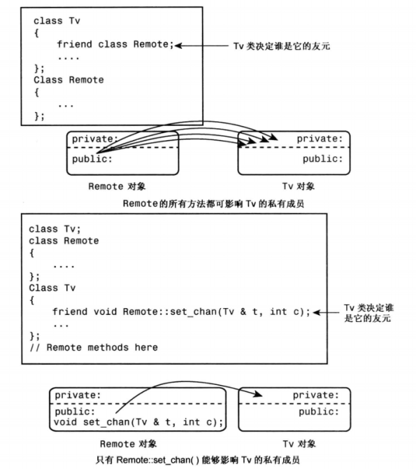

[TOC]

## 友元

在前面的示例中将友元函数用于类的扩展接口中，但类并非只能拥有友元函数，也可以将类作为友元。在这种情况下，友元类的所有方法都可以访问原始类的私有成员和保护成员。另外，可以做更严格的限制，只将特定的成员函数指定位另一个类的友元。哪些函数、成员函数或类作为友元都是由类定义的，而不能从类外部强加友元。因此，尽管友元被授予从外部访问类的私有部分的权限，但它们并不与面向对象的编程思想相悖；相反，它们提高了公有接口的灵活性。

### 友元函数复习

使用 friend 关键字可以将某个非本类成员函数的函数声明为本类的友元函数，那么这个友元函数可以直接访问类的私有或保护成员。例如，

```cpp
class Demo {
public:
    friend void f(Demo & d);
}
void f(Demo & d) {} // 直接访问 d 的私有或保护成员
```

Demo 类将 f() 声明为本类的友元函数，因此，f() 虽然不是 Demo 类的成员函数，但也可以直接访问 Demo 类的私有或保护成员。

### 友元类

#### 概念介绍

有的时候，我们希望类 A 能够在它的成员函数中直接访问类 B 的私有或保护成员，而不是通过类 B 的公有接口间接访问，此时就可以将类 A 声明为类 B 的友元类。
如果类 A 是类 B 的友元类，那么类 A 的所有成员函数都是类 B 的友元函数，都可以直接访问类 B 的私有或保护成员。

```cpp
class A {
private:
    friend class B; // 类B是类A的友元类
};

class B {...};
```

什么情况下才希望类 A 成为类 B的友元呢？首先，类 B 最好从逻辑上和类 A 有比较接近的关系；其次，类 B 需要频繁操作类 A 的私有成员。
> 友元类的访问权限可以位于私有、保护或公有部分，其所在位置无关紧要。


#### 实例演示 —— 电视机与遥控器

> 本例出自《C++ Primer Plus》第15章程序清单15.1

假定需要编写一个模拟电视机和遥控器的程序。我们定义一个 TV 类和一个 Remote 类来分别表示电视机和遥控器。这两个类之间应该存在某种关系，但是什么样的关系呢？首先，遥控器不是电视机，反之亦然，所以公有继承的 is-a 关系并不适用。其次，遥控器也不是电视机的一部分，反之亦然，因此包含或私有/保护继承的 has-a 关系也不适应。事实上，遥控器能够改变电视机的状态，所以 Remote 类可以作为 TV 类的一个友元。
首先定义 TV 类。这里需要用一组状态成员来表示电视机。例如，开/关、频道、音量、TV 调谐、天线调节模式。另外，电视机还有一些不是状态变量的参数。例如，可接收频道数等。接下来还需要给类提供一些修改这些设置的方法。

```cpp
class Tv {
public:
    friend class Remote; // 将 Remote 类声明为 Tv 类的友元类
    enum {ON, OFF}; // 开关
    enum {VOLMINVAL, VOLMAXVAL=100}; // 音量的最小值和最大值
    enum {TV, DVD};
    enum {ANTENNA, CABLE};
private:
    int state; // ON or OFF
    int volume;
    int maxChannel; // 频道的最大数
    int channel; // 当前的频道号
    int mode; // Antenna or Cable
    int input; // TV or DVD
public:
    Tv(int st = OFF, int mc = 125) : state(st), maxChannel(mc), volume(5),
                                     channel(2), mode(CABLE), input(TV) {}
    // 切换开关
    void switchOnOff() { state = (state == OFF) ? ON : OFF; }
    bool isOn() const { return state == ON; } // 是否为ON
    bool volUp(); // 音量增加
    bool volDown(); // 音量减少
    void nextChan(); // 下个频道
    void preChan(); // 上个频道
    void switchMode() { mode = (mode == CABLE) ? ANTENNA: CABLE; } // 切换模式
    void switchInput() { input = (input == TV) ? DVD : TV; } // 切换输入源
    void displaySetting() const; // 展示所有设置
};
```

```cpp
#include "Friend.h"
#include <iostream>
bool Tv::volUp() {
    if (volume >= VOLMAXVAL)
        return false;
    volume++;
    return true;
}

bool Tv::volDown() {
    if (volume <= VOLMINVAL)
        return false;
    volume--;
    return true;
}

void Tv::nextChan() {
    if (channel < maxChannel)
        channel++;
    else
        channel = 1;
}

void Tv::preChan() {
    if (channel > 1)
        channel--;
    else
        channel = maxChannel;
}

void Tv::displaySetting() const {
    using std::cout;
    using std::endl;
    cout << "TV state is " << (state == ON ? "ON" : "OFF") << endl;
    if (state == ON) {
        cout << "Volume setting = " << volume << endl;
        cout << "Channel setting = " << channel << endl;
        cout << "Mode = " << (mode == ANTENNA ? "Antenna" : "Cable") << endl;
        cout << "Input = " << (input == TV ? "TV" : "DVD") << endl;
    }
}
```

遥控器的控制能力应与电视机内置的控制功能相同。另外，遥控器通常都提供随意选择频道的功能，而不是只能逐个切换频道。

```cpp
class Remote {
private:
    int mode; // 切换电视机的模式 TV or DVD
public:
    Remote(int m = Tv::TV) : mode(m) {}
    void switchOnOff(Tv & t) { t.switchOnOff(); }
    bool volUp(Tv & t) { return t.volUp(); }
    bool volDown(Tv & t) { return t.volDown(); }
    void nextChan(Tv & t) { return t.nextChan(); }
    void preChan(Tv & t) { return t.preChan(); }
    void setChan(Tv & t, int c) { t.channel = c; }
    void switchMode(Tv & t) { t.switchMode(); }
    void switchInput(Tv & t) { t.switchInput(); }
};
```

### 友元成员函数

#### 概念介绍

在电视机与遥控器的演示中，大多数 Remote 方法都是通过 Tv 类的公有接口来实现的，这些方法实际上并不需要称为 Tv 类的友元函数。只有 Remote 类的 setChan() 方法需要直接访问 Tv 类的私有成员，因此只有 setChan() 需要设置为 Tv 类的友元函数。**C++也确实可以让一个类指定的成员函数成为另一个类的友元函数，而不必将整个类作为友元**，但这种方法稍微有点麻烦，必须小心排列声明和定义的顺序 —— 需要使用前向声明，正确格式如下：

```cpp
class Tv;
class Remote {
public:
    setChan(Tv & t);
};
class Tv {
public:
    friend Remote::setChan(Tv & t);
};
```

#### 错误顺序及原因

不能这样声明：

```cpp
class Remote {
public:
    setChan(Tv & t);
};
class Tv {
public:
    friend Remote::setChan(Tv & t);
};
```

下面介绍原因。首先，让`Remote::setChan()`称为 Tv 类的友元的方法是在 Tv 类声明中将其声明为友元：

```cpp
class Tv {
    friend Remote::setChan(Tv & t);
};
```

然而，想要编译器能够处理这条语句，它就必须知道 Remote 类的定义。否则，编译器无法知道 Remote 是一个类，并且 setChan 是 Remote 的方法。这意味着必须将 Remote 的定义放在 Tv 的定义之前。但 Remote 的方法中使用了 Tv 对象，这有意味着 Tv 的定义需要在 Remote 定义之前。为了解决这种循环依赖问题，就需要在 Remote 类定义之前使用 Tv 类的前向声明，也就是正确格式中在 Remote 类定义前面使用的`class Tv;`。

那么能不能这样声明：

```cpp
class Remote;
class Tv {
    friend Remote::setChan(Tv & t);
};
class Remote {
    setChan(Tv & t);
};
```

答案是不能。原因在于，编译器在 Tv 类声明中看到 Remote 类的一个方法被声明为 Tv 类的友元之前，需要先看到 Remote 类的声明和 setChan() 方法的声明。

#### 实例演示 —— 电视机与遥控器

```cpp
#ifndef FRIENDMEMBER_H_
#define FRIENDMEMBER_H_

/**
 * 友元成员函数
 **/
class TvM;
class RemoteM {
private:
    int mode;
    enum {OFF, ON};
    enum {VOlMINVAL, VOLMAXVAL = 100};
    enum {TV, DVD};
    enum {ANTENNA, CABLE};
public:
    RemoteM(int m = TV) : mode(m) {}
    void switchOnOff(TvM & t);
    bool volUp(TvM & t);
    bool volDown(TvM & t);
    void nextChan(TvM & t);
    void preChan(TvM & t);
    void setChan(TvM & t, int c);
    void switchMode(TvM & t);
    void switchInput(TvM & t);
};
class TvM {
public:
    friend void RemoteM::setChan(TvM & t, int c);
    enum {OFF, ON};
    enum {VOlMINVAL, VOLMAXVAL = 100};
    enum {TV, DVD};
    enum {ANTENNA, CABLE};
private:
    int state;
    int volume;
    int maxChannel;
    int channel;
    int input;
    int mode;
public:
    TvM(int st = OFF, int mc = 125) : state(st), volume(5), maxChannel(mc),
                                      channel(1), input(TV), mode(CABLE) {}
    // 切换开关
    void switchOnOff() { state = (state == OFF) ? ON : OFF; }
    bool isOn() const { return state == ON; } // 是否为ON
    bool volUp(); // 音量增加
    bool volDown(); // 音量减少
    void nextChan(); // 下个频道
    void preChan(); // 上个频道
    void switchMode() { mode = (mode == CABLE) ? ANTENNA: CABLE; } // 切换模式
    void switchInput() { input = (input == TV) ? DVD : TV; } // 切换输入源
    void displaySetting() const; // 展示所有设置
};

inline void RemoteM::setChan(TvM &t, int c) { t.channel = c; }
inline void RemoteM::nextChan(TvM &t) { t.nextChan(); }
inline void RemoteM::preChan(TvM &t) { t.preChan(); }
inline void RemoteM::switchOnOff(TvM &t) { t.switchOnOff(); }
inline void RemoteM::switchInput(TvM &t) { t.switchInput(); }
inline void RemoteM::switchMode(TvM &t) { t.switchMode(); }
inline bool RemoteM::volDown(TvM &t) { return t.volDown(); }
inline bool RemoteM::volUp(TvM &t) { return t.volUp(); }
#endif // FRIENDMEMBER_H_
```

### 友元类与友元成员函数的区别



### 其他友元关系

#### 互为友元类

```cpp
class Tv {
    friend class Remote; // Remote 是 Tv 的友元类
public:
    void buzz(Remote & r); // 只能写声明，定义要在Remote类声明之后
};

class Remote {
    friend class Tv;
public:
    bool volUp(Tv & t) { t.volUp(); } // 可以直接写定义
};

inline void Tv::buzz(Remote & r) {
    ...
}
```

需要注意先声明的 Tv 类中需要处理其友元类 Remote 的成员函数 buzz 不能直接在类声明模板中定义，必须在 Remote 类声明之后才能实现其函数。如果不希望 buzz() 是 inline 的，则应在一个单独的方法定义文件中定义它。

#### 共同的友元

需要使用友元的另一种情况是，函数需要访问两个类的私有数据。从逻辑上看，应该将这样的函数设置为每个类的函数，但这是不可能的。它可以是一个类的成员，同时是另一个类的友元，但有时将函数作为两个类的友元更合理。例如，假设有一个 Probe 类和一个 Analyzer 类，这两个类都有内部时钟，且希望它们能够同步：

```cpp
class Analyzer;

class Probe {
    friend void sync(Analyzer & a, const Probe & p); // sync p to a
    friend void sync(Probe & p, const Analyzer & a); // sync a to p
};

class Analyzer {
    friend void sync(Analyzer & a, const Probe & p); // sync p to a
    friend void sync(Probe & p, const Analyzer & a); // sync a to p
};

inline void sync(Analyzer & a, const Probe & p) {...};
inline void sync(Probe & p, const Analyzer & a) {...};
```