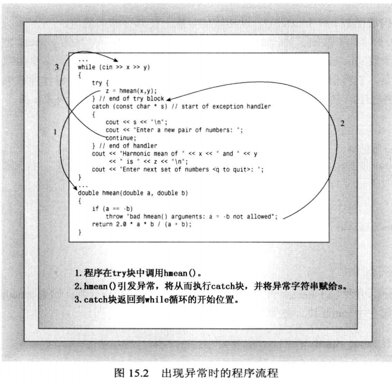
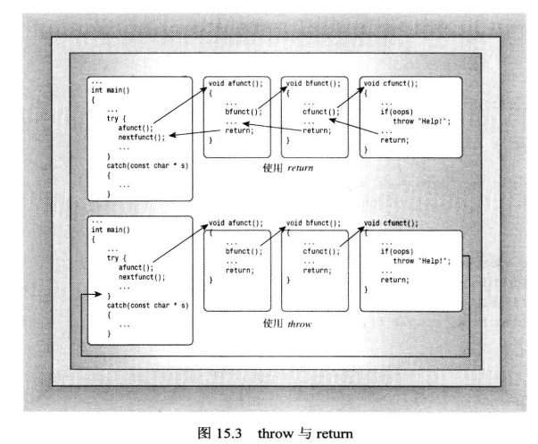
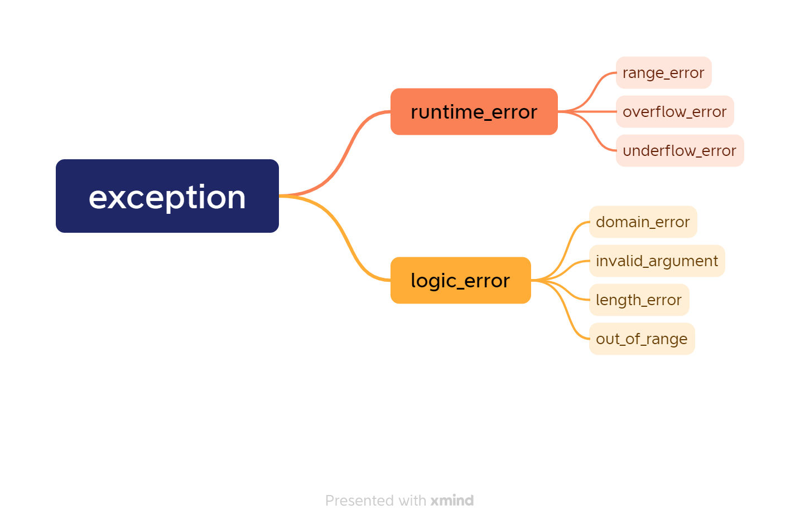

[TOC]

# 异常

## 概念解释

### 程序中错误的分类

程序的错误大致分为3类：语法错误、逻辑错误和运行时错误。
- 语法错误：语法错误在编译和链接阶段就能发现，只有 100% 符合语法规则的代码才能生成可执行程序。语法错误是最容易发现、最容易定位、最容易排除的错误，程序员最不需要担心的就是这种错误。如果使用 IDE 编程，往往都会有语法错误的提示；即使不是用 IDE 编程，在编译代码时也会给出明确的语法错误提示。
- 逻辑错误：逻辑错误是说代码语法没有问题能正常运行，但编写的代码思路有问题，不能够达到预期的功能，这种错误可以通过调试来解决。
- 运行时错误：运行时错误是指程序在运行期间发生的错误，例如除数为 0、内存分配失败、数组越界、文件不存在等。

> C++ 异常（Exception）机制就是为解决运行时错误而引入的。

### 异常

程序有时会遇到运行阶段的错误，如果运行时错误如果放任不管，系统就会执行默认的操作，终止程序运行，也就是我们常说的程序崩溃(Crash)。通常，程序员都会试图预防这种意外情况。C++ 提供了异常（Exception）机制，让我们能够捕获运行时错误，给程序一次“起死回生”的机会，或者至少告诉用户发生了什么再终止程序。

**什么是异常？**
异常：程序在运行过程中发生由于外部问题（如硬件错误、输入错误）等导致的程序出现异常事件。在实际编程中，所有程序正常运行情况之外的都是异常。
例如，在编程中调用了一个函数，希望该函数返回某个类对象，但由于一些问题函数返回了一个 null，而 null 并不是程序正常运行的结果(正常运行应该返回一个类对象)，我们一般会将这种情况设置为异常。

常见的异常有**除零**、**数组下标越界**、**空指针**、**内存不足**、**所读取文件不存在**等。

**为什么会有异常？**
程序是由人设计的，做不到天衣无缝，在运行时总会出现各种意想不到的异常。因此，希望程序不仅能在正确的情况下正常运行，而且在程序有错误的情况下也能作出相应的处理，使得程序能继续执行下去，而不致使程序莫名其妙的终止崩溃，甚至出现死机的现象。比如做除法时分母遇到0，访问到了非法指针。

```cpp
class Demo {
    int val;
public:
    Demo(int v = 0) : val(v) {}
    void show() { std::cout << "Demo val is " << val << std::endl; }
};

Demo * getObject(int v) {
    if (v == 2)
        return nullptr;
    return new Demo();
}

int main() {
    Demo * d1 = getObject(1);
    d1->show();
    Demo * d2 = getObject(2); // 异常的代码
    d2->show();
    return 0;
}
```

```java
Demo val is 0
Demo val is
Process finished with exit code -1073741819 (0xC0000005)
```

由于指针 d2 是 nullptr，此时调用 show() 就会报出空指针异常，并且由于没有异常处理机制，直接导致程序运行崩溃。

**异常处理**
异常处理是C++引入的异常机制，就是当程序出现异常时，可以捕获异常并对异常进行处理，以使得程序能正常运行下去。在C++中异常处理指的就是 try-catch。

## 没有异常机制时如何处理异常？

在学习C++的异常处理之前，先来看看程序员可以使用的基本方法。作为演示，以计算两个数的调和平均数的函数为例。两个数的调和平均数定义为这两个数的倒数的平均数，因此公式为：`2.0 * x * y / (x + y)`

如果 x 和 y 互为相反数，则 x+y 为 0，则上面的公式将导致被零除，这是不被允许的运算。

### 方法一：异常终止 abort()

对于这个问题，处理方法之一是，如果其中一个参数是另一个参数的负值，则调用 abort() 函数。

abort() 函数的原型位于头文件 cstdlib(或 stdlib.h) 中，它的典型实现是向标准错误流(cerr)发送消息 abnormal program termination(程序异常终止)，然后终止程序。它还会返回一个随实现而异的值，告诉操作系统，处理失败。abort() 是否刷新文件缓冲区则取决于实现。如果愿意，也可以使用 exit()，该函数刷新文件缓冲区，但不显示消息。

```cpp
double hmean1(double a, double b) {
    if (a == -b) {
        std::cout << "untenable arguments to hmean()\n";
        std::abort();
    }
    return 2.0 * a * b / (a+b);
}

int main() {
    std::cout << "Abort test.\n";
    double x, y, z;
    std::cout << "Enter two numbers: ";
    while (std::cin >> x >> y) {
        z = hmean1(x, y);
        std::cout << "Harmonic mean of " << x << " and " << y << " is " << z << std::endl;

        std::cout << "Enter next set of numbers <q to quit>.";
    }
    std::cout << "Bye.\n";
    return 0;
}
```

```java
Abort test.
Enter two numbers:3 6
Harmonic mean of 3 and 6 is 4
Enter next set of numbers <q to quit>.-4 4
untenable arguments to hmean() //程序终止
```

注意，在 hmean1() 中调用 abort() 函数将直接终止程序，而不是返回 main()。为了避免异常终止，程序应该在调用 hmean()　函数之前检查 x 和 y 的值。然而，依靠程序员来执行这种检查是不安全的。

**总结**：abort() 虽然在异常发生时会提醒用户有异常发生，但依旧会终止程序，无法保证程序在异常发生时依旧能继续执行。

### 方法二：返回错误码

另一种比异常终止更灵活的方式是，使用函数的返回值来指出问题。例如，ostream 类的`get(void)`成员通常返回下一个输入字符的 ASCII 码，但到达文件尾时，将返回特殊值 EOF。因为 ASCII 码是无符号整数，因此一般将 EOF 设置为 -1。
但是对于 hmean() 来说，调和平均数可能是任何值，因此任何数值都是 hmean() 的有效返回值，因此不存在可用于指出问题的特殊值。在这种情况下，可以通过指针参数或引用参数来将值返回给调用程序，而函数的返回值则专门用于指出成功还是失败。

```cpp
#include "iostream"
#include "cstdlib"
#include "cfloat" // DBL_MAX
bool hmean2(double a, double b, double & res) {
    if (a == -b) {
        res = DBL_MAX; // double 最大值
        return false;
    }
    res = 2.0 * a * b / (a+b);
    return true;
}

int main() {
    std::cout << "ErrorCode test.\n";
    double x, y, z;
    std::cout << "Enter two numbers: ";
    while (std::cin >> x >> y) {
        if (hmean2(x, y, z)) {
            std::cout << "Harmonic mean of " << x << " and " << y << " is " << z << std::endl;
        } else {
            std::cout << "One value shouldn't be the negatice of the other - try again.\n";
        }
        std::cout << "Enter next set of numbers <q to quit>.";
    }
    std::cout << "Bye.\n";
    return 0;
}
```

```java
Enter two numbers:3 6
Harmonic mean of 3 and 6 is 4
Enter next set of numbers <q to quit>.4 -4
One value shouldn't be the negatice of the other - try again.
Enter next set of numbers <q to quit>.3 5
Harmonic mean of 3 and 5 is 3.75
Enter next set of numbers <q to quit>.q
Bye.
```

这里的程序设计避免了错误输入导致的程序终止，让用户在错误输入之后能够继续输入。当然，这里的设计确实依靠程序员检查函数的返回值，而这项工作是程序员所不经常做的。例如，为了使得程序短小精悍，很少检查 cout 是否成功处理了输出。

hmean2() 的第三个参数可以是指针或引用，通常对于内置类型的参数，很多程序员倾向于使用指针，这是因为这样可以明显看出那个参数是用于提供返回值的。(不过这里我用的引用也没有任何问题)。

除了将函数返回值作为错误码之外，还有一种方法就是在某个地方存储返回情况 —— 使用一个全局变量。当可能出现异常的函数可以在异常出现时将该全局变量设置为特定的值，而调用程序可以检查这个变量。例如，传统的 C 语言数学库使用的就是这种方法，它使用的全局变量名为 error。这个方法要求必须确保其他函数没有将该全局变量用于其他目的。

```cpp
#include "iostream"
#include "cstdlib"
#include "cfloat" // DBL_MAX

#define ERR    1
#define NO_ERR 0

int error = NO_ERR;
double hmean3(double a, double b) {
    if (a == -b) {
        error = ERR;
        return DBL_MAX;
    }
    error = NO_ERR;
    return 2.0 * a * b / (a+b);
}
```

**小结：** 
-  方法一：以函数的整型返回值来表示错误；
-  方法二：使用全局变量(例如，error 宏)表示错误，传统 C 语言数学库使用的就是 error 宏。

但这两种方法都有着一些缺陷：
- 方法一的缺陷在于整型返回值不一致，有的函数以返回1表示错误，而有的函数以返回0表示错误，没有统一的规定，并且函数返回值只有一个，这种方式的函数希望返回数据的话需要增加参数数目。
- 方法二则要求确保其他函数没有将该全局变量用于其他目的。

## C++的异常处理机制

### 异常处理流程

下面介绍如何使用C++的异常处理机制来处理错误。C++异常处理机制是对程序运行过程中发生的异常情况(例如被0除)的一种响应。异常处理提供了将控制权从程序的一个部分传递到另一部分的途径。异常处理有3个组成部分：
- 引发异常；
- 捕获异常；
- 处理异常。

C++ 异常处理涉及到三个关键字：throw、try、catch。
- throw: 当问题出现时，程序会抛出一个异常，或者称 throw 引发了一个异常。这是通过使用 throw 关键字来完成的。
- try: try 块中的代码有可能激活特定的异常，也有可能正常运行。但如果 try 块中的代码引发了一个异常，try 就会将其捕获，并交由其后的 catch 来匹配，因此 try 后面通常跟着一个或多个 catch 块。
- catch: 在您想要处理问题的地方，通过 try-catch 捕获异常。catch 关键字用于捕获异常，一旦捕获到对应的异常就会执行 catch 块内的代码来处理异常。

异常处理的流程：
1. 当程序出现问题时抛出一个异常(throw)，并携带对异常的相关描述。
2. 当程序抛出异常时，会将程序的控制权移交到异常处理程序(try...catch)，异常处理程序会捕获异常并进行相应的处理。

### 异常处理语法

```cpp
void func(argType1 arg1, argType2 arg2, ...) {
    throw exceptionClass(); // 引发一个 exceptionClass 的异常
}

void testException() {
    try {
        func(v1, v2);
    } catch(exceptionClass & e) { // 捕获一个 exceptionClass 的异常
        // 处理 exceptionClass 异常的代码
    }
}
```

示例：

```cpp
double hmean3(double a, double b) {
    if (a == -b) {
        throw "Invalid value: One value shouldn't be the negative of the other - try again."; // 发现异常情况，抛出异常
    }
    return 2.0 * a * b / (a+b);
}

void test_Exception() {
    double x, y, z;
    std::cout << "Enter two numbers: ";
    while (std::cin >> x >> y) {
        try {
            z = hmean3(x, y); // 尝试捕获异常
        } catch (const char * ptr) {
            // 异常被捕获，处理异常
            std::cout << ptr << std::endl << "Enter a new pair of numbers: " << std::endl;
            continue;
        }
        std::cout << "Harmonic mean of " << x << " and " << y << " is " << z << std::endl;
        std::cout << "Enter next set of numbers <q to quit>.";
    }
    std::cout << "Bye.\n";
}
```



### 抛出异常

抛出异常使用的关键字是 throw，后面可以跟一个表达式，这个值可以是基本类型、字符串或者类对象，用于指出异常的特征。
throw 实际上是一种跳转语句，即命令程序跳到另一条语句。throw 和 return 有点类似，都会终止函数的运行，但和 return 的区别在于，return 终止函数运行之后会返回调用程序，而 throw 则是沿函数调用序列后退，直到找到包含 try 块的函数。
比较常见的用法是搭配条件语句，表示程序满足某个条件，将其视为异常并终止接下来的操作，将其抛给能处理这个异常的程序去处理，以免造成程序直接终止。

```cpp
if (...) {
    ...
    throw "..."; // 抛出一个字符串
}
```

```cpp
int func(int a, int b) {
    if (b == 0)
        throw "除零异常"; // 抛出一个异常，该异常的描述是"除零异常"
    return a / b;
}
```

虽然可以抛出一个描述异常现象的字符串，但实际开发中基本都是抛出异常类的对象。

```cpp
// 自定义异常类
class ExceptionDemo {
public:
	ExceptionDemo(std::string & s);
};

if (...) {
    ...
    throw new ExceptionDemo("..."); // 抛出一个异常类的对象
}
```

### 捕获并处理异常

如果有一个块抛出一个异常，则需要捕获异常，而捕获异常需要使用 try 和 catch 关键字。try 块中放置可能抛出异常的代码，try 块中的代码被称为保护代码。使用 try/catch 语句的语法如下所示：

```cpp
try {
   // 保护代码，该代码块中可能会出现异常
} catch( ExceptionName1  e1 ) {
   // 出现 e1 异常时的处理代码
} catch( ExceptionName2  e2 ) {
   // 出现 e2 异常时的处理代码
} catch(...) {

} catch( ExceptionName3  eN ) {
   // 出现 e3 异常时的处理代码
}
```

语法规则：
- try 后面至少跟一个 catch 语句；
- try/catch 语句的大括号不能省；
- catch 后跟`...`可以表示捕获所有异常。

> ExceptionNameX 是 try 块可能出现的异常类型，这个类型可以是字符串 or 其他 C++ 类型。

当 throw 引发了一个异常，程序的控制权就会沿函数调用序列往后退，直到找到第一个 try 块。保护代码中往往都包含 throw 语句。
当然，我们也可以将不会引发异常的语句放在 try 块中，但既然不会引发异常，也就没必要放在 try 块中。

当 try 块中的保护代码引发了一个异常，就会被 try 块发觉，并和其后的 catch 块中的异常进行对比，查看是否能被 catch 捕获。然后采取第一个匹配异常的 catch 块中的异常处理。

**try...catch 语句的执行过程**：
1. 如果执行 try 块中的语句**没有抛出异常**，那么执行完 try 块的语句之后会忽略所有的 catch 块，直接执行 try...catch 之后的语句；
2. 如果执行 try 块中的语句**引发了异常**(throw)，那么引发异常之后会按照顺序依次和 catch 中的类型进行匹配.
   1. **如果类型符合，则称该异常被 catch 块捕获**，会先执行对应 catch 块的代码，然后在执行 try...catch 之后的代码。
   2. **如果 catch 块没有匹配的处理程序**，默认情况下，程序会调用到 abort() 函数导致程序终止。
3. 如果某个函数引发了异常(throw)，但没有 try 块捕获则程序
也会默认调用 abort() 函数导致程序终止。

### 小结

- try 块需要包含可能出现异常、需要检查的语句 or 有 throw 关键字抛出异常的程序段；
- try 和 catch 是成对出现的，类似 if...else 的关系，一个 try 可能对应多个 catch；
- 如果 try 后面的 catch 捕获的异常类型不包括被引发的异常，则默认情况下会导致程序终止；
- catch 可以使用`...`表示所有异常类型。
  
**回顾：为什么要用C++的异常处理机制？**
其实在 throw 关键字抛出异常这里就是用的 if...else，而 try...catch 也和 if...else　类似.其实我们用 if...else 也可以，那么为什么我不直接用 if...else，而是使用C++的异常处理机制呢？
当用if(b==0)来判断到分母为0的情况下，直接做一些处理，比如打印出“除零异常”这样的报错信息，程序依然不会崩溃，代码简单，逻辑也清晰。
为什么一定要使用throw抛出一个异常，然后又在其他地方用 try...catch 接收这个异常，再做处理呢？这样写，不是更显得复杂了吗？而且相对if和else，抛出异常的方式的处理速度也相对较慢吧？再者也显得不直观，当检测到异常时，还要跑到别的地方看看是如何处理这个异常的。

**使用C++异常处理机制的原因**：
- **异常处理机制体现了面向对象程序设计的思想**。if...else 这种形式也能保证程序正常运行，但异常处理方式被固定了，调用 func() 函数只会打印固定的错误信息“除零异常”。如果我想写一个计算调和平均数的函数，并且在分母为0时打印“两个数不能互为相反数”的信息，此时就必须重新写一个函数，不能直接使用这个已有的函数。
- **减少代码冗余，使得程序更简洁**。
- **异常处理机制能反馈给程序员更详细的异常信息**。

## 原理：栈解退

首先来看下**-C++通常是如何处理函数调用和返回的**。C++通常将函数的信息放在栈中来处理函数调用。具体地说，当在函数中调用另一个函数时，程序将调用函数的指令地址(返回地址)放在栈中。当被调用的函数执行完毕后，程序将使用该地址来确定回到哪里开始执行。另外，函数调用也会将函数参数添加到栈中。如果被调用的函数调用了另一个函数，则后者的信息会被添加到栈中，依次类推。当函数结束时，程序流程将跳到该函数被调用时存储的地址处，同时栈顶元素出栈。因此，函数通常都返回到调用它的函数，依次类推，同时每个函数在结束时都会释放其自动变量。如果自动变量是类对象，则调用其析构函数。

现在再看**异常是如何处理的**。假设函数由于出现异常而终止，则程序也会释放栈中的内存，但不会在释放栈的第一个返回地址就停止，而是继续释放栈，直到找到一个位于 try 块中的返回地址。随后，控制权将转到 try 块后面的异常处理程序(catch)，而不是函数调用后面的第一条语句。这个过程被称为栈解退。



引发栈解退机制的一个非常重要的特性是，对于栈中的自动类对象会调用其析构函数。这点和函数返回一样，不过，函数返回仅仅处理该函数放在栈中的对象，而栈解退则是处理 try 块和 throw 之间整个函数调用序列放在栈中的对象。如果没有栈解退这种特性，引发异常之后，对于中间函数调用放在栈中的自动类对象不会调用其析构函数。

首先创建一个喋喋不休的类 Demo，以便指出构造函数和析构函数什么时候被调用，这样您就可以知道发生异常时这些对象是如何被处理的了：

```cpp
#ifndef DEMO_H_
#define DEMO_H_

#include <iostream>
/**
 * 为了演示栈解退，因此声明一个在构造和析构时会“喋喋不休”的类
 **/
class Demo {
    std::string word;
public:
    Demo(const std::string & str) {
        word = str;
        std::cout << "Demo " << word << " created.\n";
    };
    ~Demo() { // 鉴于此类不会被继承，因此析构函数可以不被声明为 virtual
        std::cout << "Demo " << word << " destroyed.\n";
    }
    void show() const {
        std::cout << "Demo " << word << " lives!\n";
    }
};
#endif // DEMO_H_
```

演示程序如下：

```cpp
#include "Demo.h"
#include "../Exception/Exception.h"
#include "cmath"
// 全局函数
double hmean(double x, double y) {
    if (x == -y)
        throw HmeanException(x, y);
    return 2.0 * x * y / ( x + y);
}

double gmean(double x, double y) {
    if (x < 0 || y < 0)
        throw GmeanException(x, y);
    return std::sqrt(x * y);
}

double means(double x, double y) {
    double atmp, htmp, gtmp;
    Demo temp("Demo temp in the means()");
    
    atmp = ( x + y ) / 2.0;
    
    try {
        htmp = hmean(x, y);
        gtmp = gmean(x, y);
    } catch (HmeanException & err) {
        std::cout << err.getMessage() << std::endl;
        std::cout << "Caught in means().\n";
        throw;
    }
    temp.show();
    return (atmp + gtmp + htmp)  / 3.0;
}

// main 函数
int main() {
    using std::cin;
    using std::cout;
    using std::endl;

    double x, y, z;
    {
        Demo d("Demo d in main()");
        cout << "Please enter 2 numbers:";
        while (cin >> x >> y) {
            try {
                z = means(x, y);
                cout << "The value of means(" << x << ", " << y << ") is " << z << endl;
                cout << "Please enter next pair:";
            } catch (HmeanException & err) {
                cout << err.getMessage() << endl;
                cout << "Caught in main().\n";
                cout << "Please enter next pair:";
                continue;
            } catch (GmeanException & err) {
                cout << err.getMessage() << endl;
                cout << "Caught in main().\n";
                cout << "Sorry, the process end.\n";
                break;
            }
        }
    }
    return 0;
}
```

```cpp
// 第一组测试
Demo Demo d in main() created.
Please enter 2 numbers:6 8                      
Demo Demo temp in the means() created.
Demo Demo temp in the means() lives!
Demo Demo temp in the means() destroyed.
The value of means(6, 8) is 6.92845
Please enter next pair:q    
Demo Demo d in main() lives!                   
Demo Demo d in main() destroyed.
```

首先，让程序正常运行来看看这个程序的运行过程。这里使用的是 6 8 这组数据。在 main() 中 Demo d 被创建，接下来调用了 means() 函数，它创建了另一个 Demo 对象 temp。means() 继续用 6 和 8 作为参数来调用 hmean() 和 gmean() 函数，这两个函数将计算结果返回 means()，means() 根据这些值计算个结果返回给 main()。在返回前，means() 还调用了 Demo 对象的 show() 函数，即`temp.show();`。means() 函数将计算结果返回之后该函数就执行完毕，因此自动执行 temp 的析构函数。重点关注的输出：

```cpp
Demo Demo temp in the means() lives!     // temp.show()
Demo Demo temp in the means() destroyed. // means() return
```


```cpp
// 第二组测试
Demo Demo d in main() created.
Please enter 2 numbers:8 -8
Demo Demo temp in the means() created.
Hmean(8.000000, -8.000000). Invalid value: a = -b.
Caught in means().
Demo Demo temp in the means() destroyed.
Hmean(8.000000, -8.000000). Invalid value: a = -b.
Caught in main().
Please enter next pair:q
Demo Demo d in main() lives!
Demo Demo d in main() destroyed.
```

第二组测试数据使用 8 -8。在 main() 将 8 和 -8 发送给 means()，然后 means() 创建了一个 Demo 对象 temp，并将参数传递给 hmean()。hmean() 引发 HmeanException 异常，该异常被 means() 中的 try-catch 块捕获，这一点可以被下面的输出证实：

```cpp
Hmean(8.000000, -8.000000). Invalid value: a = -b.
Caught in means().
```

means() try-catch 块捕获 HmeanException 异常之后将该异常再次抛出，这次的抛出异常会导致 means() 函数终止执行，并将异常传递给 main()。语句`temp.show()`没有被执行能够证明 means() 函数被提前终止执行，temp 析构函数被调用了：

```cpp
Demo Demo temp in the means() destroyed. // Created 和 destroyed 之间没有 alived 输出
```

这演示了非常重要的一点：程序进行栈解退以回到能够捕获异常的地方时，会释放栈中的自动变量。如果变量是对象，将为该对象调用析构函数。

同时，被重新引发的异常被传递给 main() 函数，在 main() 中，匹配的 catch 块将其捕获并处理：

```cpp
Hmean(8.000000, -8.000000). Invalid value: a = -b.
Caught in main().
```

```cpp
// 第三组测试
Demo Demo d in main() created.
Please enter 2 numbers:8 -5
Demo Demo temp in the means() created.
Demo Demo temp in the means() destroyed.
Gmean(8.000000, -5.000000) argument should be >=0.
Caught in main().
Sorry, the process end.
Demo Demo d in main() lives!
Demo Demo d in main() destroyed.
```

第三组测试数据使用 8 -5。在 main() 将 8 和 -5 发送给 means()。相同地，means() 中会创建一个新的 Demo 对象 temp，然后将 8 和 -5 传递给 hmean() 和 gmean()。hmean() 对数据的处理没有出现问题，但在 gmean() 处理数据时，gmean() 引发了 GmeanException 异常。但是 means() 不能处理 GmeanException 类型的异常，因此异常被 means() 抛给了调用者 —— main() 函数，同时，means() 终止执行其他代码，并触发栈解退，释放自动变量，因此 temp 的析构函数被调用了：

```cpp
Demo Demo temp in the means() destroyed. // 没有执行 temp.show()，并且没有捕获 GmeanException 异常
```

同时，GmeanException 异常被 main() 捕获，循环直接结束：

```cpp
Gmean(8.000000, -5.000000) argument should be >=0.
Caught in main().
Sorry, the process end.
```

最后程序正常终止，显示一些输出，并自动调用 d 的析构函数。稍微提一下，如果 GmeanException 的 catch 块中使用的是`exit(EXIT_FAILURE)`而不是 break，则程序会立即终止，不会看到以下输出：

```cpp
Demo Demo d in main() lives!
```

但仍能看到 d 的析构函数的输出：

```cpp
Demo Demo d in main() destroyed.
```

## 异常的其他特性

虽然 throw-catch 机制类似于函数参数与函数返回机制，但还是有些不同之处。其中之一是函数中的返回语句是将程序的控制权返回到调用方的函数；但 throw 语句将控制权向上返回到第一个包含能捕获相应异常的 try-catch 组合。另一个不同是，引发异常时编译器总是创建一个临时变量，即使 catch 块中指定的是引用。

```cpp
/**
 * 自定义异常类
 **/
class MyException : public std::exception {
private:
    std::string Msg;
public:
    // 必须显式调用的构造函数
    explicit MyException(const char * p) : Msg(p) { std::cout << "创建一个 MyException 对象: " << Msg << std::endl; }
    // 必须显示调用的构造函数
    explicit MyException(const std::string & str) : Msg(str) { std::cout << "创建一个 MyException 对象: " << Msg << std::endl; }
    // 复制构造函数,以便可以在 catch 块捕获异常时能够打印信息
    MyException(const MyException & ME) : Msg(ME.Msg) { std::cout << "复制构造函数, Msg: " << Msg << std::endl; }
    virtual ~MyException() noexcept { std::cout << "销毁 Msg: " << Msg << " 的 MyException 对象" << std::endl; } // 析构函数被声明为虚函数, 不抛出异常
    // 重写基类的 public 方法
    const char * what() const _GLIBCXX_TXN_SAFE_DYN _GLIBCXX_NOTHROW override {
        return Msg.c_str();
    }
};
/**
 * 一个抛出 MyException 异常的函数
 **/
void func() {
    MyException me("MyException error");
    throw me;
}

/**
 * 测试异常的其他特性：
 *     - 与函数返回机制相似，但有差别
 *     - 引发异常时编译器总是创建一个临时变了，即使 try...catch 的 catch 块中捕获的异常是引用
 **/
void main() {
    try {
        func();
    } catch (MyException & err) {
        std::cout << "Error Msg: " << err.what() << std::endl;
    }
}
```

```cpp
// 终端输出
创建一个 MyException 对象: MyException error
复制构造函数, Msg: MyException error
销毁 Msg: MyException error 的 MyException 对象
Error Msg: MyException error
销毁 Msg: MyException error 的 MyException 对象
```

可以看到，一共销毁了 MyException 对象两次，一次是通过`MyException(const char *)` 构造函数创建的，另一次是通过`MyException(MyException &)`复制构造函数创建的。并且通过复制构造函数打印的位置，可以看出`throw me`的时候其实会调用复制构造函数，这使得 catch 块中的引用 err 指向的是 me 的副本，而不是 me 本身。这是件好事，因为 me 在退出 func() 函数时就会被销毁。

顺便提一句，将抛出异常与创建异常对象组合在一起将更简单：

```cpp
void func() {
    throw MyException("MyException error");
}
```

> C++似乎对这样的写法有优化，测试时发现该程序只会创建和销毁 MyException 对象一次。

看到这里，您可能会有个疑问，**既然 throw 语句将生成副本，为何在代码的 catch 块中仍使用引用呢**？毕竟，将引用作为返回值的通常原因就是为了避免创建副本以提高效率。答案是，这里使用的是引用的另一个重要特征：基类引用可以指向派生类对象。
假设有一个异常类层次结构，并要分别处理不同的异常类型，则使用基类引用将能捕获任何异常对象；而使用派生类引用只能捕获该类以及从这个类派生的类的对象。引发的异常对象将被第一个与之匹配的 catch 块捕获。<font color="red"><b>这意味着 catch 块的排列顺序应该与派生顺序相反</b></font>。

> 提示：如果有一个异常类继承层次结构，应这样排列 catch 块：将捕获位于层次结构最下面的异常类的 catch 块放在最前面，将捕获基类异常的 catch 块放在最后面。

通过正确排列 catch 块的顺序，可以让您能够在如何处理异常方面有选择的余地。然而，有时候可能不知道会发生哪些异常。在这种情况下，仍能够捕获异常，即使不知道异常的类型。方法是使用省略号来表示异常类型，从而捕获任何异常：

```
catch(...) { // statements }
```

可以将其视为 switch 语句的 default，放置在 catch 块的最后面：

```cpp
try {
    // statements
} catch(bad_1 &) {
    // statements   
} catch(bad_2 &) {
    // statements
} catch(...) {
    // statements
}
```

可能您还有一个疑问，**可以创建捕获异常对象而不是引用的处理程序吗**？答案是可以的，但是在 catch 语句中使用基类对象时，将捕获所有的派生类对象，但是派生类的特性将被抹去，此时只能调用基类的方法，即使是被声明为虚函数的函数也都将采用基类的版本。

## 类对象作为异常类型

### 为什么用类对象作为异常类型？

throw 引发的异常和 catch 捕获的异常类型可以是字符串、基本数据类型、类对象。这方便程序员描述异常信息。例如，当发生除零异常时，可以抛出一个字符串 "Invalid value 0." 来描述这里的异常信息。这里携带的信息可以比 abort() 终止程序时打印的“程序异常终止”，以及错误码要更详细，更方便程序出现问题时，程序员进行排查。

但实际编程中，仅仅用字符串可能还不足以详细描述出异常信息。通常都是以类对象作为异常类型，因为类对象可携带的信息比字符串更详细，更便于程序员定位问题。并且类可以有很多种，可以用不同的异常类型来区分不同函数在不同情况下引发的异常。

**简单来说，使用类对象作为异常类型能携带更多的异常信息，便于程序员排查异常问题**。

### 自定义异常类

C++类对象可以作为异常类型，什么样的类能作为异常类型呢？答：**C++可以将任意类型的类对象作为抛出的异常**，但是异常处理的思想在于提供有关异常原因的信息。因此用于异常处理的类的设计上，应该尽可能地将类中的数据、方法设计的更符合程序异常处理的要求。例如，起码应该包含存储异常信息的数据。

```cpp
#ifndef EXCEPTION_H_
#define EXCEPTION_H_

#include <iostream>

/**
 * 用于 hmean() 的自定义异常类
 **/
class HmeanException {
private:
    std::string errMessage; // 错误信息
    double v1; // 用于计算的值1
    double v2; // 用于计算的值2
public:
    HmeanException(double a, double b); // constructor
    std::string & getMessage() { return errMessage; } // 获取异常信息
};

HmeanException::HmeanException(double a, double b) : v1(a), v2(b) {
    errMessage = "Hmean(" + std::to_string(a) + ", " + std::to_string(b) + "). Invalid value: a = -b.";
}

/**
 * 用于 gmean() 的自定义异常
 **/
class GmeanException {
private:
    std::string errMessage;
    double v1;
    double v2;
public:
    GmeanException(double x, double y);
    std::string & getMessage() { return errMessage; }
};

GmeanException::GmeanException(double x, double y) : v1(x), v2(y) {
    errMessage = "Gmean(" + std::to_string(x) + ", " + std::to_string(y) + ") argument should be >=0.";
}
#endif // EXCEPTION_H_
```

自定义了两个异常类 —— HmeanException 和 GmeanException，分别用于 hmean() 和 gmean() 的异常。

```cpp
#include "Exception.h"

// 调和平均数
double hmean(double x, double y);
// 几何平均数
double gmean(double x, double y);

int main() {
   ddouble x, y, z;

    while (std::cin >> x >> y) {
        try {
            z = hmean(x, y);
            std::cout << "Harmonic mean of " << x << " and " << y << " is " << z << std::endl;
            z = gmean(x, y);
            std::cout << "Geometric mean of " << x << " and" << y << " is " << z << std::endl;
        } catch (HmeanException & e) {
            std::cout << e.getMessage() << std::endl;
            continue;
        } catch (GmeanException & e) {
            std::cout << e.getMessage() << std::endl;
            break; // 和 hmean 异常采用不同的语句
        } catch (...) {
            std::cout << "Unknown Exception" << std::endl;
            continue;
        }
        std::cout << "Enter next set of numbers <q to quit>.";
    }
    return 0;
}

double hmean(double x, double y) {
    if (x == -y)
        throw HmeanException(x, y);
    return 2.0 * x * y / ( x + y );
}

double gmean(double x, double y) {
    if (x < 0 || y < 0)
        throw GmeanException(x, y);
    return std::sqrt( x * y );
}
```

`catch(GmeanException &)`的处理中用的是 break 而 HmeanException 中用的是 continue。

## 异常规范和 C++11

### 什么是异常规范

有时候，一种看似有前途的理念，但实际的使用效果可能并不好。一个例子就是异常规范(exception specification)，这时C++98新增的一项功能，但C++11却将其摒弃了。这意味着C++11仍然处于标准之中，但以后可能从标准中剔除，因此不建议使用它。
不过，在忽视异常规范之前，您至少应该直到它是什么样的，如下所示：

```cpp
double func1(double a) throw(bad_thing); // func1 可能抛出 bad_thing 异常类对象
double func2(double b) throw(); // func2 不抛出异常
```

其中 函数原型后面跟着的 throw() 部分就是异常规范。它可能出现在函数原型、函数定义中，可以包含类型列表，也可以不包含。

### 异常规范的作用

- 告诉用户可能需要使用 try 块。然而，这项工作可以被注释轻松完成。
- 让编译器添加执行运行阶段检查的代码，检查代码是否违反异常规范。
  
缺点：异常规范的想法很好，但这很难检查代码是否违反异常规范。例如，func2() 可能不会抛出异常，但它调用的一个函数，而这个函数调用的另一个函数抛出了一个异常。或者，编写函数时不会抛出异常，但库更新后，它却会抛出异常。

总之，编程社区(尤其是尽力编写安全代码的开发人员)打成的一致意见是，最好不要使用这项功能。而C++11也建议您忽略异常规范。

### noexcept 关键字

然而，C++11也确实支持一种特殊的异常规范：您可以使用新关键字 noexcept 指出该函数不会引发异常：

```cpp
double func2(double b) noexcept; // func2不会引发异常
```

有关这种异常规范是否必要和有用存在一些争议，有人认为最好不要使用它(至少在大多数情况下如此)，而有些人认为引入这个新关键字非常必要，理由是知道函数不会引发异常有助于编译器优化代码。通过使用这个关键字，编写函数的程序员相当于做出了承诺。

### noexcept() 运算符

还有运算符 noexcept()，它判断操作数是否引发异常。如果操作数会引发异常，返回 false，否则返回 true。例如：

```cpp
// 函数原型
int hilt(int);
int halt(int) noexcept;
```

```cpp
noexcept(hilt); // 结果为 false
noexcept(halt); // 结果为 true
```

因为 hilt() 的声明并没有保证不会发生异常。

## 标准异常类

> C++引入异常机制的主要目的是为设计容错程序提供语言级支持，即异常使得在程序设计中包含错误处理功能更容易，以免时候采取一些严格的错误处理方式(终止程序)。异常的灵活性和相对方便性激励程序员在条件允许的情况下在程序设计中加入错误处理功能。总之，异常是这样一种特性：类似于类，可以改变编程方式。 —— 《C++ Primer Plus》

为了更好支持异常机制，C++还提供了 exception 头文件(以前是 exception.h 或 except.h)，在该文件中定义了 exception 类，C++可以把它用作其他异常类的基类。exception 类有一个名为 what() 的虚成员函数，它返回一个字符串，该字符会随实现而异。然而，由于这是一个虚方法，因此需要在 exception 的派生类中重新定义它：

```cpp
// exception basic class
class exception {
public:
    exception() noexcept { }
    virtual ~exception() noexcept;

    /** Returns a C-style character string describing the general cause of the current error.  */
    virtual const char* what() const noexcept;
};
```

```cpp
#include <exception>
// 自定义异常类继承 exception 基类
class HmeanException : public exception {
private:
    std::string errMessage; // 错误信息
    double v1; // 用于计算的值1
    double v2; // 用于计算的值2
public:
    HmeanException(double a, double b); // constructor
    virtual const char* what() const noexcept { return "Hmean() arguments are invalid."; }
};

HmeanException::HmeanException(double a, double b) : v1(a), v2(b) {
    errMessage = "Hmean(" + std::to_string(a) + ", " + std::to_string(b) + "). Invalid value: a = -b.";
}
```

除了 exception 基类之外，C++库还定义了很多基于 exception 的异常类。它们位于 stdexceept 头文件中，该头文件先定义了 exception 基类的两个继承类 logic_error 和 runtime_error，



|异常类|头文件|描述|
|:-:|:-:|-
|exception|exception or exception.h|异常基类，推荐程序员自定义的异常都要继承或间接继承该类|
|**logic_error**|stdexcept|逻辑错误。可以在程序中被预先检测的异常，通过合理的编程可以避免，但实际编程中这些错误还是有可能发生。
|domain_error|stdexcept|函数的参数不在定义域内。
|invalid_argument|stdexcept|函数的参数是无效的值。
|length_error|stdexcept|没有足够的空间来执行所需的操作。常见于字符串合并。
|out_of_range|stdexcept|索引超出范围。常见于数组索引越界。
|**runtime_error**|stdexcept|运行时错误。在程序中难以被预先检测的异常，主要是在程序运行期间发生但难以预计和防范的错误。
|range_error|stdexcept|计算结果超出范围。
|overflow_error|stdexcept|**浮点数**计算中，计算结果比浮点类型的最小非零值还小时，将导致下溢错误。
|underflow_error|stdexcept|**整型和浮点数**计算中，计算结果比该类型能表示的最大数量级还大时，将导致上溢错误。
|bad_alloc|new|使用 new 动态分配空间失败时导致该异常。
|bad_cast|typeinfo|当使用 dynamic_cast 运算符转换引用时，如果该转换不安全，则引发该异常。
|bad_typeid|typeinfo|当使用 typeid 运算符(typeid(*p))的参数 p 是空指针时会引发该异常。

### logic_error

stdexcept 中 logic_error 异常类的定义：

```cpp
// 逻辑错误代表程序内部逻辑中的问题；理论上，这些错误是可以预防的，甚至可以在程序运行前检测到。
class logic_error : public exception {
    string _M_msg;
public:
    /** 接收描述错误的字符串. */
    explicit logic_error(const string& __arg);
    explicit logic_error(const char*);
    logic_error(const logic_error&) noexcept;
    logic_error& operator=(const logic_error&) noexcept;
    virtual ~logic_error() noexcept;
    /** 返回一个 C 风格字符串，描述当前错误的一般原因. */
    virtual const char* what() const noexcept;
};
```

#### domain_error

domain 的意思是域，在这里其实指的是数学上的 domain(定义域) 和 range(值域)。因此，如果您编写了一个函数，并在调用它时传递了一个参数，而这个参数不在该函数参数的定义域中，那么可以让该函数抛出一个 domain_error 的异常。

stdexcept 中 domain_error 异常类的定义：

```cpp
// 由库或您抛出，用于报告定义域错误(数学上的定义域).
class domain_error : public logic_error {
public:
    explicit domain_error(const string& __arg);
    explicit domain_error(const char*);
    virtual ~domain_error() noexcept;
};
```

#### invalid_argument

异常 invalid_argument 指出给函数传递了一个意料之外的值。例如，如果函数希望接受的参数要么是字符 a，要么是字符 b，当传递其他字符时，可以让该函数抛出 invalid_argument 异常。

stdexcept 中 invalid_argument 异常类的定义：

```cpp
// 用于报告函数参数无效.
class invalid_argument : public logic_error {
public:
    explicit invalid_argument(const string& __arg);
    explicit invalid_argument(const char*);
    virtual ~invalid_argument() noexcept;
};
```

#### length_error

异常 length_error 用于指出没有足够的空间来执行所需的操作。它常见于字符串的合并操作，例如，string 类的 apped() 方法在合并得到的字符串长度超过最大允许长度时，将抛出 length_erro 异常。

stdexcept 中 length_error 异常类的定义：

```cpp
// 当构造的对象（如 basic_string 实例）超过其最大允许大小时抛出.
class length_error : public logic_error {
public:
    explicit length_error(const string& __arg);
    explicit length_error(const char*);
    virtual ~length_error() noexcept;
};
```

#### out_of_range

异常 out_of_range 通常用于表示索引错误。例如，数组或者自定义类似数组的类(声明了 operator[])，在使用的索引无效时可以抛出 out_of_range 异常。

stdexcept 中 out_of_range 异常类的定义：

```cpp
// 表示参数值不在预期范围内(如 basic_string 中的边界检查).
class out_of_range : public logic_error {
public:
    explicit out_of_range(const string& __arg);
    explicit out_of_range(const char*);
    virtual ~out_of_range() noexcept;
};
```

### runtime_error

runtime_error 顾名思义，运行时错误。在程序中难以被预先检测的异常，主要是在程序运行期间发生但难以预计和防范的错误。

stdexcept 中 runtime_error 异常类的定义：

```cpp
class runtime_error : public exception {
    string _M_msg;

public:
/** Takes a character string describing the error.  */
    explicit runtime_error(const string& __arg);
    explicit runtime_error(const char*);
    runtime_error(runtime_error&&) noexcept;
    runtime_error& operator=(runtime_error&&) noexcept;
    runtime_error(const runtime_error&) noexcept;
    runtime_error& operator=(const runtime_error&) noexcept;
    runtime_error(const runtime_error&) = default;
    runtime_error& operator=(const runtime_error&) = default;
    virtual ~runtime_error() noexcept;
    /** Returns a C-style character string describing the general cause of
     *  the current error (the same string passed to the ctor).  */
    virtual const char* what() const noexcept;
};
```

#### overflow_error

overflow_error 上溢错误，整型和浮点数都可能发生上溢。在整型 or 浮现书计算时，如果计算结果比它们能表达的最大值时，将会导致上溢错误。

stdexcept 中 overflow_error 的定义：

```cpp
class overflow_error : public runtime_error {
public:
    explicit overflow_error(const string& __arg);
    explicit overflow_error(const char*);
    overflow_error(const overflow_error&) = default;
    overflow_error& operator=(const overflow_error&) = default;
    overflow_error(overflow_error&&) = default;
    overflow_error& operator=(overflow_error&&) = default;
    virtual ~overflow_error() noexcept;
};
```

#### underflow_error

underflow_error 下溢错误，它被用于浮点数计算中。在浮点数计算时，如果计算结果比浮点数能表达的最小非零值还小，将会导致下溢错误。

```cpp
class underflow_error : public runtime_error {
public:
    explicit underflow_error(const string& __arg);
    explicit underflow_error(const char*);
    underflow_error(const underflow_error&) = default;
    underflow_error& operator=(const underflow_error&) = default;
    underflow_error(underflow_error&&) = default;
    underflow_error& operator=(underflow_error&&) = default;
    virtual ~underflow_error() noexcept;
};
```

#### range_error

range 在这里指的是数学上的值域。当计算结果不在函数允许范围内，但没有发生上溢 or 下溢错误，在这种情况下可以使用 range_error

```cpp
class range_error : public runtime_error {
public:
    explicit range_error(const string& __arg);
    explicit range_error(const char*);
    range_error(const range_error&) = default;
    range_error& operator=(const range_error&) = default;
    range_error(range_error&&) = default;
    range_error& operator=(range_error&&) = default;
    virtual ~range_error() noexcept;
};
```

### 小结

一般而言，logic_error 系列异常表明可以通过编程修复的问题，而 runtime_error 系列异常表明存在无法通过编程避免的问题。不同的类名能让您分别捕获并处理每一种异常；同时，由于存在继承关系，它又可以让您一起捕获处理它们(只要您愿意)。例如，下面先单独处理 domain_error，然后又一起处理 logic_error 的其他异常，在之后一起处理 runtime_error 的所以异常。

```cpp
try {
    // ...
} catch (domain_error & e) {
    // ...
} catch (logic_error & e) {
    // ...
} catch (runtime_error & e) {
    // ...
} catch (...) {

}
```

如果C++自带的这些标准异常类(stdexcept)不能满足您的需求，您可以自定义异常类。虽然自定义异常类并没有限制必须继承标准异常类，但推荐您应该继承 logic_error 和 runtime_error 中的一个，这样可以确保您的异常类可以归入继承层次结构中。

### bad_alloc 异常

对于使用 new 导致的内存分配问题，C++的最新处理方式是让 new 引发 bad_alloc 异常。头文件 new 包含 bad_alloc 类的生命，它是从 exception 类公有派生而来的：

```cpp
class bad_alloc : public exception {
public:
    bad_alloc() throw() { }
    bad_alloc(const bad_alloc&) = default;
    bad_alloc& operator=(const bad_alloc&) = default;
    virtual ~bad_alloc() throw();
    virtual const char* what() const throw();
};
```

> throw() 不引发异常，C++11 中引入 noexcept 关键字，详情查看下一节。

在之前，当无法分配请求的内存量时，new 返回一个空指针。现在，可以使用 bad_alloc 异常来处理这种情况：

```cpp
#include <iostream>
#include <new>
#include <cstdlib> // for exit(), EXIT_FAILURE

using namespace std;

struct Big {
    double stuff[20000];
};

int main() {
    Big* pb;

    try {
        cout << "尝试申请一大块内存:\n";
        pb = new Big[100000]; // 100000 * 20000 * 8 = 16 000 000 000 Bytes
        cout << "最新申请结果:\n";
    } catch (bad_alloc & ba) {
        cout << "申请失败，捕获异常: " << ba.what() << endl;
        exit(EXIT_FAILURE);
    }
    cout << "内存空间申请成功\n";
    pb[0].stuff[0] = 4;
    cout << pb[0].stuff[0] << endl;
    delete [] pb;
    return 0;
}
```

```java
尝试申请一大块内存:
申请失败，捕获异常: std::bad_alloc
```

> 如果在您的电脑中运行这个程序时没有出现内存分配问题，可以尝试提高请求分配的内存量。

很多代码都是按照在 new 失败时返回空指针的情况编写的。为了处理 new 的变化，有些编辑器提供了一个标记(开关)，让用户选择需要的行为。当前，C++标准提供了一种在失败时返回空指针的 new，用法如下：

```cpp
int * pi = new (std::nothrow) int;
int * pa = new (std::nothrow) int[500];
```

使用这种 new 可以将上面程序的核心代码改为如下所示：

```cpp
pb = new (nothrow) Big[100000];
if (pb == nullptr) {
    cout << "申请失败.\n ";
    exit(EXIT_FAILURE);
}
```

### bad_cast

不在这里详细讲解，会在 RTTI 章节介绍。

```cpp
class bad_cast : public exception {
public:
    bad_cast() noexcept { }
    virtual ~bad_cast() noexcept;
    virtual const char* what() const noexcept;
};
```

### bad_typeid

不在这里详细讲解，会在 RTTI 章节介绍。

```cpp
class bad_typeid : public exception {
public:
    bad_typeid () noexcept { }
    virtual ~bad_typeid() noexcept;
    virtual const char* what() const noexcept;
};
```

## 异常、类和继承

异常、类和继承可以相互关联。首先，可以像标准C++库所做的那样，从一个异常类派生出另一个；其次，可以在类定义中嵌套异常类的声明来组合异常；第三，这种嵌套声明本身可以被继承，还可以用作基类。

## 异常何时会迷失方向

异常被引发时，在两种情况下会导致问题，分别为意外异常和未捕获异常。

首先，如果它是在带异常规范的函数中引发的，则必须与异常规范列表中的某个异常匹配(在继承层次中，异常类的类型与这个类以及其派生类匹配)，否则称为意外异常(unexcepted exception)。在默认情况下，它会导致程序异常终止。
> 注：虽然C++11中摒弃了异常规范，但仍需要了解这点，因为有些现有代码可能仍使用了异常规范。

其次，如果异常不是在函数中引发的(or 函数没有异常规范)，则必须捕获它。如果没有该异常，则该异常被称为未捕获异常(uncaught exception)。在默认情况下，它会导致程序异常终止。

在《C++ Primer Plus》中记录了一个在程序运行中将意外异常和未捕获异常转换为特定异常的方法，但我在平时编程中基本没使用过，因此这里就不详细描述了，有兴趣的可以查看《C++ Primer Plus》的 15.3.9 节。

## 异常的注意事项

首先，应在设计程序时就加入异常处理功能，而不是以后再加入。当然这样也有一些缺点，例如，使用异常会增加程序代码，这样不可避免的会影响程序的运行速度。
其次，异常规范不适用于模板，因为模板函数引发的异常可能随特定的具体化而异(C++11摒弃了异常规范)。
第三，异常和动态内存分配并非总能协同工作。

下面详细讨论下动态内存分配和异常。首先，请看下面的函数：

```cpp
/**
 * 关于动态内存分配和异常能协同工作的演示
 **/
void test_dynamic_1() {
    bool badThingHappened = true;

    std::string str("HelloWorld.");
    if (badThingHappened) {
        throw std::exception();
    }
    return;
}
```

string 类就采用了动态内存分配。通常，当函数结束时，将为 str 调用 string 类的析构函数。虽然 throw 语句提前终止了函数，但得益于栈解退机制，它会删除栈中的变量 str，因此依旧会调用 string 的机构函数。所以这里的内存被正确地管理了。

接下来看下面的函数：

```cpp
/**
 * 关于动态内存分配和异常不能协同工作的演示
 * */
void test_dynamic_2(int n) {
    bool badThingHappened = true;

    int * p = new int[n];
    if (badThingHappened) {
        throw std::exception();
    }

    delete [] p;
    return;
}
```

该程序存在一个问题。在栈解退时，将删除栈中的变量 p。但引发异常导致函数过早终止，因此最后的`delete [] p;`并没有被调用。因此栈解退虽然删除了变量 p，但并没有释放它指向的内存块，并且该内存块之后也无法访问了。总之，这些内存被泄露了。

这种泄露是可以被避免的。例如，可以在引发异常的函数中捕获该异常，在 catch 块中包含一些清理代码，然后重新引发该异常：

```cpp
/**
 * 关于动态内存分配和异常不能协同工作的演示
 * */
void test_dynamic_3(int n) {
    bool badThingHappened = true;

    int * p = new int[n];
    try {
        if (badThingHappened) {
            throw std::exception();
        }
    } catch (std::exception & e) {
        delete [] p;
        throw; // 将捕获的异常重新抛出，在这里相当于 throw std::exception();
    }
    delete [] p;
//    return;
}
```

然而，这将增加疏忽和产生其他错误的机会。另一种解决方法是使用智能指针模板之一来避免该问题。

总结：虽然异常处理对于项目非常重要，但它也会增加编程的工作量，增大程序，降低程序速度；但另一方，不进行错误检查的代价可能非常高。