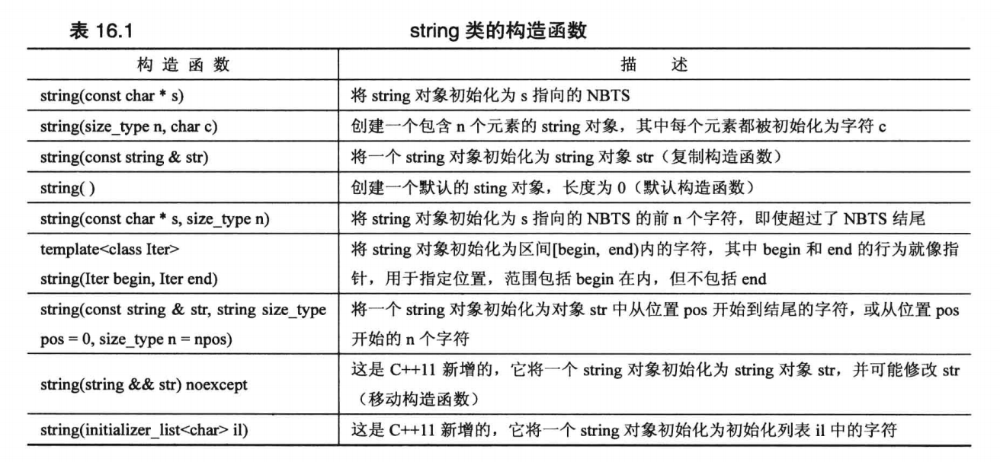

前面已经介绍过C++的大部分知识点了，本章主要介绍C++的标准模版库，这里会用到之前代码重用中讲解到的模版的知识，可以加深对模板的理解。

本章内容：
- 深入讨论 string 类；
- 介绍“智能指针”模板类，它们让管理动态内存更容易；
- 介绍 STL(Standard Template Library，标准模板库)，它是一组用于处理各种容器对象的模板；
- 介绍 STL 中演示的一种编程模式 —— 泛型编程；
- 介绍C++11新增的模板 initializer_lis，它可以让您能够将初始化列表的语法用于 STL 对象。

## string 类

### Overview

很多应用程序都需要处理字符串。C语言在 string.h(C++中是 cstring 库)中提供了一些列的字符串函数，很多早期的C++实现为处理字符串提供了自己的类。

string 类时由头文件 string 支持的。要使用类，关键在于知道它的公有接口，而 string 类包含大量的方法，其中包括了若干构造函数，用于将字符串赋给变量、合并字符串、比较字符串的成员函数，访问各个元素的重载运算符以及用于在字符串中查找字符和子字符串的工具等。

> 注意：头文件 string.h 和 cstring 是支持对 C-风格字符串进行操作的 C 库字符串函数，但不支持 string 类。

### string 的构造函数

首先，我们来看看 string 类的构造函数。毕竟，对于类而言，最重要的内容之一就是看有哪些方法可用于创建其对象。下面的表格简要的描述了 string 类的 7+2(C++11新增了两个)个构造函数。



size_type 是一个依赖于实现的整型，它是在头文件 string 中定义的。string 类将 string:npos 定义为字符串的最大长度，通常为 unsigned int 的最大值。另外表格中使用缩写 NBTS(Null-Terminated String)来表示以空字符结束的字符串 —— 传统的C字符串。

#### string 的 7 个构造函数

下面的程序清单使用了上面表格中的 7 个构造函数。在使用 string 构造函数时都进行了简化，即隐藏了这样一个事实：string 类实际上是模板具体话`basic_string<char>`的一个 typedef，同时省略了与内存管理相关的参数。

```cpp
/**
 * 测试 string 类的构造函数，ctor 是构造函数的缩写
 **/
int main() {
    using namespace std;
    string one("Hello World."); // ctor #1, 将 string 初始化为指针 s 指向的 NBTS
    cout << "1: " << one << endl;

    string two(20, 'A'); // ctor #2, 将 string 初始化为包含 n 个字符 c 的字符串
    cout << "2: " << two << endl;

    string three(one); // ctor #3 复制构造函数，将 string 初始化为另一个 string 对象
    cout << "3: " << three << endl;

    one += " Opos!"; // 重载 += 运算符
    cout << one << endl;
    
    two = "Sorry! That was "; // 重载 = 运算符
    cout << two << endl;

    three[0] = 'P'; // 重载 [] 运算符
    cout << three << endl;

    string four; // ctor #4 默认构造函数
    four = two + three; // 重载 +, = 运算符
    cout << "4: " << four << endl;

    char cString[] = "All's well that ends well";
    string five(cString, 20); // ctor #5
    cout << "5: " << five << endl;

    string six_1(cString + 6, cString + 10); // ctor #6
    cout << "6: " << six_1 << ", ";
    string six_2(&five[6], &five[10]);
    cout << six_2 << ".\n";

    string seven(four, 7, 16); // ctor #7
    cout << "7: " << seven << endl;

    return 0;
}
```

```java
// 输出
1: Hello World.
2: AAAAAAAAAAAAAAAAAAAA
3: Hello World.
Hello World. Opos!
Sorry! That was
Pello World.
4: Sorry! That was Pello World.
5: All's well that ends
6: well, well.
7: That was Pello W
```

**程序说明：**

在程序中首先演示了可以将 string 对象初始化为常规的 C-风格字符串，然后使用重载的 << 运算符来打印它的内容：

```cpp
string one("Hello World."); // ctor #1, 将 string 初始化为指针 s 指向的 NBTS
cout << "1: " << one << endl;
```

接下来的构造函数将 string 对象初始化为由 20 个 A 字符组成的字符串：

```cpp
string two(20, 'A'); // ctor #2, 将 string 初始化为包含 n 个字符 c 的字符串
cout << "2: " << two << endl;
```

复制构造函数将 string 对象 three 初始化为 string 对象 one：

```cpp
string three(one); // ctor #3 复制构造函数，将 string 初始化为另一个 string 对象
cout << "3: " << three << endl;
```

使用重载的 += 运算符将字符串 "Oops!" 附加到 string 对象 one 的后面：

```cpp
one += " Opos!"; // 重载 += 运算符
cout << one << endl;
```

这里是将一个 C-风格的字符串附加到 string 对象的后面。但 += 运算符被多次重载，它还可以被用来附加 string 对象和单个字符：

```cpp
one += " Opos!"; // += 运算符附加一个 C-风格字符串
one += two;      // += 运算符附加一个 string 对象
one += '!';      // += 运算符附加一个字符
```

同样，= 运算符也被重载，可以将 string 对象、C-风格字符串或字符赋给 string 对象：

```cpp
two = "Sorry! That was "; // = 运算符将 C-风格字符串赋给 string 对象
two = one;                // = 运算符将 string 对象赋给 string 对象
two = '!';                // = 运算符将 string 对象赋给 string 对象
```

重载 [] 运算符使得可以使用数组表示法来访问 string 对象中的各个字符：

```cpp
three[0] = 'P'; // 重载 [] 运算符
```

默认构造函数创建了一个以后可对其进行赋值的空字符串：

```cpp
string four; // ctor #4 默认构造函数
four = two + three; // 重载 +, = 运算符
cout << "4: " << four << endl;
```

第二行使用重载的 + 运算符创建了一个临时的 string 对象，然后使用重载的 = 运算符将它赋给 string 对象 four。+ 运算符将两个操作数组合成一个 string 对象。同样，它也被多次重载，以便第二个操作数可以是 string 对象、C-风格字符串或字符。
> 但第一个操作数必须是 string 对象：`obj1.operator+(obj2);`。

第五个构造函数将一个 C-风格字符串和一个整数作为参数，其中的整数参数表示需要复制第一个参数的多少个字符：

```cpp
char cString[] = "All's well that ends well";
string five(cString, 20); // ctor #5
cout << "5: " << five << endl;
```

从输出可以看到，这里只使用了前 20 个字符("All's well that ends")来初始化 five 对象。正如前面构造函数表格所示，如果第二个参数表示的字符数超过了 C-风格字符串的长度，仍将复制请求数目的字符。例如，在上面的例子中，如果用 40 代替 20，将导致 15 个无用字符被复制到 five 的结尾处(即构造函数将内存中位于字符串 "All's well that ends well" 后面的内容作为字符)。

第六个构造函数有一个模板参数：

```cpp
template <class Iter> string(Iter begin, Iter end);
```

begin 和 end 将像指针那样，指向内存中的两个位置(通常，begin 和 end 可以是迭代器——广泛用于 STL 中的广义化指针)。构造函数将使用 begin 和 end 指向的位置之间的值(即`[begin, end)`)对 string 对象进行初始化。
> `[begin, end)` 是数学中的概念，表示包括 begin，但不包括 end 在内的区间。即 end 指向被使用的最后一个值后面的位置。

```cpp
char cString[] = "All's well that ends well";
string six_1(cString + 6, cString + 10); // ctor #6
cout << "6: " << six_1 << ", ";
```

由于数组名相当于指针，所以`cString + 6`和`cString + 10`的类型都是`char *`，因此使用模板时，将使用类型`char *`来替换`Iter`。第一个参数指向 cString 数组中的第一个 well 的 w 字符，第二个参数指向第一个 well 后面的空格。因此，six_1 将被初始化为字符串 "well"。

如果要用这个构造函数初始化另一个 string 对象的一部分内容，则可以想下面的语言一样：

```cpp
string six_2(&five[6], &five[10]);
cout << six_2 << ".\n";
```

> 注意，一定要有取地址符 &，因为对象名不同于数组名，它不会被看作是对象的地址，因此 five 不是指针。

第七个构造函数用一个 string 对象的部分内容来初始化 string 对象:

```cpp
string seven(four, 7, 16); // ctor #7
cout << "7: " << seven << endl;
```

上面的函数从 four 对象的第 8 个字符(Index 7)开始，将 16 个字符来初始化 seven 对象。


#### C++11 新增的构造函数

```cpp
string(string && str) noexcept;
string(initializer_list<char> il);
```

构造函数`string(string && str)`类似于复制构造函数，导致新创建的 string 为 str 的副本。但与复制构造函数不同的是，它不保证将 str 视为 const。这种构造函数被称为移动构造函数(move constructor)。在有些情况下，编译器可以使用它而不是构造函数，以此优化性能。

构造函数`string(initializer_list<char) il`让您能够将列表初始化语法用于 string 类。也就是说，它使得下面的声明时合法的：

```cpp
string str1 = {'L', 'i', 's', 't'};
string str2 {'L', 'i', 's', 't'};
```

对于 string 类而言，这可能用处不大，因为使用 C-风格字符串更容易，但确实实现了让列表初始化语法普遍适用的意图。后面会更深入地讨论模板 initializer_list。

### string 类输入

对于 C-风格字符串有三种输入方式：

```cpp
char info[100];
cin >> info; // 读取一个 word，以空白(空格、制表符、换行符)为字符串的结束位置
cin.getline(info, 100); // 读取一行，丢弃每行最后的换行符 \n
cin.get(info, 100); // 读取一行，保留每行最后的换行符 \n，换行符还在输入序列中，需要借助 cin.get() 读取下一个字符来处理
```

对于 string 对象，有两种方式：

```cpp
string str;
cin >> str; // 读取一个 word
getline(cin, str); // 读取一行，丢弃每行最后的换行符 \n
```

两个版本的 getline() 都有一个可选参数，用于指定使用哪个字服来确定输入的边界：

```cpp
cin.getline(info, 100, ':'); // 读到 :, 丢弃 :
getline(cin, str, ':'); // 读到 :, 丢弃 :
```

在功能上，这两个函数的主要区别在于：string 版本的 getline() 将自动调整目标 string 对象的大小，使之刚好能存储输入的字符。自动调整大小的让 string 的 getline() 不需要指定读取多少字符的整数参数。

在设计方面的一个区别是，读取 C-风格字符串的函数是 istream 类的成员函数，而 string 版本的 getline() 并不是 string 的成员函数，而是一个独立的函数。这也是 C-风格字符串输入使用 cin 作为调用对象，而 string 对象的输入 cin 是函数参数的原因。

下面更深入的探讨一下 string 的输入函数。正如前面指出的，该函数自动调整目标 string 的大小，使之与输入匹配。但也存在一些限制：
- 第一个限制因素是 string 对象的最大允许长度有常量 string::npos 指定。它通常是最大的 unsigned int 值。因此对于普通的交互式输入，不会有什么影响；但如果您尝试将整个文件的内容读取到单个 string 对象中，这可能称为限制因素。
- 第二个限制因素是程序可以使用的内存量。

string 版本的 getline() 函数从输入中读取字符，并将其存储到目标 string 中，直到发生下列三种情况：
- 到达文件尾。在这种情况下，输入流的 eofbit 将被设置，这意味着 fail() 和 eof() 都将返回 true。
- 遇到分界字符(默认是`\n`)。在这种情况下，将把分界字符从输入流中删除，但不存储它。注：分界字符可以通过可选参数指定。
- 读取的字符数到达最大允许值(`string::npos`和可供分配的内存字节数中较小的一个)。在这种情况下，将设置输入流的 failbit，这意味着方法 fail() 将返回 true。

输入流对象有一个统计系统，用于跟踪流的错误状态。在这个系统中，检测到文件尾后将设置 eofbit 寄存器，检测到输入错误时将设置 failbit 寄存器，出现无法识别的故障(如硬盘故障)时将设置 badbit 寄存器，一切顺利时设置 goodbit 寄存器。后面会有专门的一章来深入讨论输入输出流的知识。

string 版本的`>>`运算符的行为与此类似，它不断从输入流中读取字符，直到遇到空白字符/分界字符为止，遇到空白字符时会将其留在输入流中，而遇到分界字符会将其丢弃。
> 空白字符是指空格、换行符和制表符。

接下来编写一个从文件中读取字符串的程序，它假设文件中包含用冒号分分隔的字符串，并使用指定分界符的 getline() 方法。然后显示字符串并给它们编号，每个字符串占一行。

```cpp
/**
 * 测试 string 类的输入函数，从文件中读取字符串。
 * 假设文件中包含用冒号字符分隔的字符串。
 **/
int main() {
    using namespace std;
    ifstream fin;
    fin.open("tobuy.txt"); 
    if (fin.is_open() == false) {
        cerr << "Can't open file. Please check path.\n";
        exit(EXIT_FAILURE);
    }

    string str;
    int count = 0;
    getline(fin, str, ':');
    while (fin) { // input is good
        ++count;
        cout << count << ": " << str << endl;
        getline(fin, str, ':');
    }
    cout << "Read file end.\n";
    fin.close();
    return 0;
}
```

文件 tobuy.txt 的内容：

```java
Hello World!:ice cream:Good lucky:
coffer latte:Coca-Cola:

```

通常，对于程序要查找的文本文件，应将其放在可执行程序或项目文件所在的目录中；否则必须提供绝对路径。在 Windows 系统中，C-风格字符串中的`\\`是转义序列，它表示一个斜杠：

```cpp
fin.open("E:\\Note\\the-cpp\\source\\Unit10\\tobuy.txt"); // file path = E:\Note\the-cpp\source\Unit10\tobuy.txt
```

程序的输出：

```java
1: Hello World!
2: ice cream
3: Good lucky
4:
coffer latte
5: Coca-Cola
6:

Read file end.
```

> 注意：将冒号`:`指定位分界字符后，getline() 会将换行符视为常规字符。因此 tobuy.txt 中第一行末尾的换行符就会被认为是 "coffer latte" 字符串的第一个字符。同样，第二行末尾的换行符就成为了第六个输入字符串的唯一内容。

### 使用字符串

现在，您有能力使用不同方式来创建 string 对象、显示 string 对象的内容、将数据读取/附加到 string 对象中、给 string 对象赋值以及将两个 string 对象连结起来。除此之外，我们其实还能比较字符串，确定字符串长度等。

#### 比较字符串

string 类对全部的六个关系运算符(>, >=, <, <=, =,!=,)都进行了重载。对于每个关系运算符，都以三种方式被重载，以便能够将 string 对象与另一个 string 对象、C-风格字符串进行比较，并能够将一个 C-风格字符串与 string 对象进行比较：
> 如果机器排名序列为 ASCII 码，则数字将小于大写字符，而大写字符小于小写字符。

```cpp
string str1("cola");
string str2("cool");
char str3[10] = "coco";
if (str1 < str2) {...} // operator<(const string &, const string &)
if (str1 == str3) {...} // operator==(const string &, const char *)
if (str3 != str2) {...} // operator!=(const char *, const string &)
```

#### 字符串长度

有两个函数可以确定字符串的长度。string 类的 size() 和 length() 成员函数都可以返回字符串中的字符数。为什么要有两个函数完成相同的任务？length() 成员函数来自较早版本的 string 类，而 size() 则是为提供 STL 兼容性而添加的。

#### 在字符串中查找字符串或字符

string 类可以以多种不同的方式在字符串中搜索给定的子字符串或字符。下表简要地描述了 find() 方法的四个版本。如前所述，`string::npos`是字符串可存储的最大字符数，通常是无符号 int 或无符号 long 的最大取值。

|方法原型|描述|
|-|-|
|size_type find(const string & str, size_type pos = 0) const|从字符串的 pos 位置开始查找子字符串 str。如果找到，则返回该子字符串首次出现时其首字符的索引；否则，返回 string::npos。
|size_type find(const char * s, size_type pos = 0) cosnt|从字符串的 pos 位置开始查找字符串 s。如果找到，则返回该子字符串首次出现时其首字符的索引；否则，返回 string::npos。
|size_type find(const char * s, size_type pos = 0, size_type n)|从字符串的 pos 位置开始，查找 s 的前 n 个字符组成的子字符串。如果找到，返回该子字符串首次出现时其首字符的索引；否则，返回 string::npos。
|size_type find(char ch, size_type pos = 0) const|从字符串的 pos 位置开始，查找字符 ch。如果找到，则返回该字符首次出现的位置；否则，返回 string::npos。

string 库还提供了相关的方法：rfind()、find_first_of()、find_last_of()、find_first_not_of() 和 find_last_not_of()，他们的重载函数特征标都与 find() 方法相同。
- rfind() 方法查找子字符串或字符最后一次出现的位置。
- find_first_of() 方法在字符串中查找参数中任何一个字符首次出现的位置。
- find_last_of() 方法在字符串中查找参数中任何一个字符最后一次出现的位置。
- find_first_not_of() 方法在字符串中查找第一个不包含在参数中的字符出现的位置。
- find_last_not_of() 方法在字符串中查找最后一个不包含在参数中的字符出现的位置。

例1，下面的语句返回 r 在"cobra"中的位置(即 Index 3)，因为这是"hark"中各个字符在"cobra"中首次出现的位置：

```cpp
string str1("cobra");
int where = str1.find_first_of("hark");
```

例2，下面的语句返回 a 在"cobra"中的位置(即 Index 4)，因为这是"hark"中各字符在"cobra"中最后一次出现的位置：

```cpp
int where = str1.find_last_of("hark");
```

例3，下面的语句返回 c 在"cobra"中的位置，因为"hark"中没有 c：

```cpp
int where = str1.find_first_not_of("hark");
```

例4，下面的语句将返回 b 在"cobra"中的位置，因为"hark"中没有 b：

```cpp
int where = str1.find_last_not_of("hark");
```

#### 使用字符串的练习

编写一个非图形版本的 Hangman 拼字游戏。

> Hangman 是一个猜单词的双人游戏。Hangman直译为“上吊的人”，是一个猜单词的双人游戏。由一个玩家想出一个单词或短语，另一个玩家猜该单词或短语中的每一个字母 。
> 第一个人抽走单词或短语，只留下相应数量的空白与下划线。出题玩家一般会画一个绞刑架，当猜词的玩家猜出了短语中存在的一个字母时，出题的玩家就将这个字母存在的所有位置都填上。如果玩家猜的字母不在单词或短语中，那么出题的玩家就给绞刑架上小人添上一笔，直到7笔过后，游戏结束。
> Hangman 的规则简单且有趣，要求在七步之内猜出单词，否则小人将会“上吊”

该游戏将一系列的单词存储在一个 string 对象数组中，然后随机选择一个单词，让人猜测单词的字母。如果猜错七次，玩家就输了。
该程序会使用 find() 函数来检查玩家的猜测，使用 += 运算符创建一个 string 对象来记录玩家的错误猜测。为记录玩家猜对的情况，程序创建了一个单词，其长度与被猜的单词相同，但包含的是连字符。玩家猜对字符时，将用该字符替代相应的连字符。

```cpp
/**
 * 判断 Hangman 游戏玩家猜测的字符是否合法
 *  - 如果猜测的不是小写字母，则输入不合法，需要玩家重新猜字母
 *  - 如果猜测的字母是之前已猜测的，则也不合法，需要玩家重新猜字母
 *  @return true - 猜测的字母既合法也未曾被猜过；false - 猜测的字母不合法或被猜过了
 **/
bool isGuessValid(char ch, std::string& goodStr, std::string& badStr) {
    if (ch >= 'a' && ch <= 'z' && std::string::npos == goodStr.find(ch) && std::string::npos == badStr.find(ch))
        return true;
    return false;
}

/**
 * Hangman 游戏。
 * 由玩家来猜单词，每次猜一个字母。
 *  - 如果猜对，那么将单词对应位置显示在终端中。如果单词被全才出来了，游戏成功
 *  - 如果猜错，那么会被记录下来。猜错七次，游戏失败。
 **/
void main() {
    using namespace std;
    const int WORD_NUM = 20; // 程序准备的用于 Hangman 游戏的单词数目
    const string wordList[WORD_NUM] = {
            "identity", "belong", "department", "medical", "conversation",
            "imagine", "describe", "fold", "aloud", "politician",
            "reason", "height", "grammar", "member", "notice",
            "crystal", "destiny", "teacher", "exactly", "dislike"
    }; // 程序准备的用于 Hangman 游戏的单词

    srand(time(0));
    char guess; // 用于保存玩家本回合猜测的字母

    cout << "Will you play Hangman game?<y/n>: ";
    cin >> guess;
    guess = tolower(guess); // ctype.h 中的函数，用于将大写字母调整为小写字母，对于非大写字母不做调整

    while ('y' == guess) {
        string target = wordList[rand() % WORD_NUM]; // 选中本次游戏需要猜的单词
        int wordLength = target.length(); // 计算选中的单词的长度，以便用于生成记录猜对的字母的字符串
        string goodChars(wordLength, '-'); // 记录已猜对的字母
        string badChars; // 记录猜错的字母
        int lives = 7; // 玩家剩余的试错次数

        cout << "Hangman Game. Guess my screct word. It has " << wordLength << " letters, and you guess one letter at a time. You have " << lives << " wrong chances.\n"; // 提醒玩家待猜测的单词的长度，以及目前玩家剩余的机会
        cout << "Now your guess: " << goodChars << endl; // 将目前玩家已完成的进度打印出来

        while (lives && target != goodChars) { // 判断游戏是否结束
            cout << "Please guess a letter: ";
            cin >> guess; // 玩家输入猜测的字母
            guess = tolower(guess);
            // 判断输入是否合法
            if (!isGuessValid(guess, badChars, goodChars)) { // 输入不合法，或已经输入过该字母
                cout << "You already guess this letter or invalid guess. Try again.\n";
                continue;
            }

            int pos = target.find(guess);
            if (string::npos != pos) { // 猜对了 - 即猜测的字符在 target 中
                cout << "Good guess.\n";
                // 需要将正确的字符放置到 goodChars 对应的位置上
                do {
                    goodChars[pos] = guess;
                    pos = target.find(guess, pos + 1);
                } while (string::npos != pos);
            } else { // 猜错了
                cout << "Oh, bad guess!\n";
                --lives; // 试错机会减一
                badChars += guess; // 将猜错的字母更新到 badChars 中
            }

            cout << "Your guess: " << goodChars << ".";
            if (target != goodChars) { // 还没有完全猜对，打印当前进度信息
                if (badChars.length() > 0) // 有猜错的字母，则把猜错的字母都打印出来
                    cout << " Bad guess: [ " << badChars << " ]." ;
                cout << " Now you have " << lives << " chances to fail.";
            }
            cout << endl;
        }

        // 本轮游戏已结束，需要判断游戏的胜负
        if (lives) { // 剩余次数大于0，游戏胜利
            cout << "Congratulations. Game winner. Correct word: " << target << ".\n";
        } else {
            cout << "Unfortunately. Game failed. Correct word: " << target << ".\n";
        }
        cout << "Will you play another? <y/n> :";
        cin >> guess;
        guess = tolower(guess);
    }
    cout << "Bye.\n";
    return 0;
}
```

```cpp
Will you play Hangman game?<y/n>:y
Hangman Game. Guess my screct word. It has 7 letters, and you guess one letter at a ti
me. You have 7 wrong chances.
Now your guess: -------
Please guess a letter:e
Good guess.
Your guess: ------e. Now you have 7 chances to fail.
Please guess a letter:i
Good guess.
Your guess: -i--i-e. Now you have 7 chances to fail.
Please guess a letter:I
You already guess this letter or invalid guess. Try again.
Please guess a letter:E
You already guess this letter or invalid guess. Try again.
Please guess a letter:c
Oh, bad guess!
Your guess: -i--i-e. Bad guess: [ c ]. Now you have 6 chances to fail.
Please guess a letter:k
Good guess.
Your guess: -i--ike. Bad guess: [ c ]. Now you have 6 chances to fail.
Please guess a letter:m
Oh, bad guess!
Your guess: -i--ike. Bad guess: [ cm ]. Now you have 5 chances to fail.
Please guess a letter:n
Oh, bad guess!
Your guess: -i--ike. Bad guess: [ cmn ]. Now you have 4 chances to fail.
Please guess a letter:N
You already guess this letter or invalid guess. Try again.
Please guess a letter:d
Good guess.
Your guess: di--ike. Bad guess: [ cmn ]. Now you have 4 chances to fail.
Please guess a letter:s
Good guess.
Your guess: dis-ike. Bad guess: [ cmn ]. Now you have 4 chances to fail.
Please guess a letter:l
Good guess.
Your guess: dislike.
Congratulations. Game winner. Correct word: dislike.
Will you play another? <y/n> :n
Bye.
```

**程序说明：**

由于 string 类的关系运算符都被重载了，因此可以想对待数值类型变量那样对待字符串：

```cpp
while (lives && target != goodChars)
```

与 C-风格字符串需要使用 strcmp() 相比，字符串的比较操作更简单些。
该程序使用 find() 来检查玩家之前是否猜过某个字符。如果没有，那么它既不位于 badChars 字符串中，也不位于 goodChars 字符串中：

```cpp
if (ch >= 'a' && ch <= 'z' && std::string::npos == goodStr.find(ch) && std::string::npos == badStr.find(ch)) {...}
```

npos 变量是 string 类的静态成员，它的值是 string 对象能存储的最大字符数。由于 string 的 Index 从 0 开始，所以它比最大的 Index 值大 1。通常使用 npos 变量来判断 find 系列函数是否查找到某个字符或字符串。

该程序的核心是从检查玩家猜测的字符是否位于被猜测的单词中开始的：

```cpp
int pos = target.find(guess);
```

如果 pos 是一个有效的值，则可以将该字母放置在答案字符串的相应位置。但需要注意，由于字母可能在被猜测的单词中出现多次，所以程序必须一直检查，直到将 target 单词查询完。该程序使用了 find() 的第二个可选参数，该参数指定从字符串的什么 Index 位置开始搜索。因为字母是在位置 pos 处被找到的，所以下次搜索位置应从`pos+1`开始。

```cpp
 do {
    goodChars[pos] = guess;
    pos = target.find(guess, pos + 1);
} while (string::npos != pos);
```

#### string 的其他功能

**string 库还提供了很多其他的工具，包括完成下述功能的函数**：

| Function | Header File | Description |
|:-:|:-:|-|
|构造函数|basic_string.h|7+2个构造函数。
|关系运算符|basic_string.h|全部六个关系运算符都被以三种方式被重载，以应对 string 对象与 string 对象、C-风格字符串比较，C-风格字符串与 string 对象对比。
|length()/size()|basic_string.h|返回字符串的长度。
|find()|basic_string.h|find 系列共六类函数，返回字符串中指定字符串 or 字符的位置。如果字符串中不包含指定的内容，返回 std::string::npos。
|erase()|basic_string.h|删除字符串的部分或全部内容。
|replace|basic_string.h|用一个字符串的部分或全部内容替换另一个字符的部分或全部内容。
|compare|basic_string.h|将一个字符串的部分或全部内容与另一个字符串的部分或全部内容进行比较。
|copy|basic_string.h|将一个字符串中的内容复制到另一个字符串中。
|substr|basic_string.h|从字符串中提取子字符串。
|insert|basic_string.h|将数据插入到字符串中。
|swap|basic_string|交换两个字符串的内容。

这些函数大部分都被重载，以便能够同时处理 C-风格字符串和 string 对象。

**C++ string 类还有自动调整大小的功能**。例如，将一个字符串附加到另一个字符串的末尾时，string 类的自动调整大小功能确保能将其全部放下。但在实现这个自动调整大小的功能时也有对效率的考虑在内。例如有这样一个程序，它循环地将一个字母附加到字符串的末尾，自动调整大小的功能会如何实现呢？不能仅仅将已有的字符串加大，因为相邻的内存有可能已经被占用了。因此，有时候可能需要分配一个新的内存块，将原有的内容复制到新的内存单元中。如果执行大量这样的操作，那么效率无疑会非常低，因此很多C++的实现都会分配一个比实际字符串大的内存，为字符串提供了增大空间。然而，如果字符串不断增大，超过了内存块的大小，那么程序将分配一个大小为原来两倍的新内存块，以提供足够的增大空间，以此避免频繁地分配新内存块。

方法 capacity() 返回当前分配给字符串的内存块大小，而方法 reserve() 让您能够请求内存块的最小长度。
>  capacity: 容量；reserve: 保留。

下面的程序演示这些方法的使用：

```cpp
/**
 * 演示 string 类的 capacity() 和 reserve() 方法的使用
 *  - capacity() 返回当前分配给字符串的内存块大小；
 *  - reserve() 让您能够请求内存块的最小长度
 **/
int main() {
    using namespace std;
    string empty; // 空字符串
    string small = "small"; // 短的字符串
    string larger = "This is a larger string. This is a larger string."; // 长字符串

    cout << "Size: \n"; // 输出各个字符串的长度
    cout << " empty:  " << empty.size() << endl;
    cout << " small:  " << small.size() << endl;
    cout << " larger: " << larger.size() << endl;

    cout << "Length: \n";
    cout << " empty:  " << empty.length() << endl;
    cout << " small:  " << small.length() << endl;
    cout << " larger: " << larger.length() << endl;

    cout << "Capacity: \n"; // 输出个字符串被分配的内存大小
    cout << " empty:  " << empty.capacity() << endl;
    cout << " small:  " << small.capacity() << endl;
    cout << " larger: " << larger.capacity() << endl;

    empty.reserve(50); // 修改 empty 分配的内存大小
    cout << "Capacity after empty.reserve(50):  " << empty.capacity() << endl;
    return 0;
}
```

```java
// 输出
Size:
 empty:  0
 small:  5
 larger: 49
Length:
 empty:  0
 small:  5
 larger: 49
Capacity:
 empty:  15
 small:  15
 larger: 49
Capacity after empty.reserve(50):  50
```

从输出中 Capacity 里 empty 占据 15 个字符的内存，由此可见在该C++实现中，使用的最小容量为 15 个字符，其他实现可能有不同的选择。

**string 对象转换为 C-风格字符串**：c_str() 方法返回一个指向 C-风格字符串的指针。例如，您可能想打开一个名称存储在 string 对象中的文件，而 open() 方法接受的是一个 C-风格字符串作为参数。因此，需要用 c_str() 方法将 string 转换为指向 C-风格字符串的指针：

```cpp
string filename = "C++ Primer Plus";
ofstream fout;
fout.open(filename.c_str());
```

#### 字符串种类

string 类是模板 basic_string 的一个显式实例化，而 basic_string 还有另外 3 个实例化，每个实例化都有一个 typedef 名称：
> 复习：模板的具体化分为隐式实例化、显式实例化和显式具体化。

```cpp
template<typename _CharT, typename _Traits = char_traits<_CharT>, typename _Alloc = allocator<_CharT> >
class basic_string;

typedef basic_string<char>    string;
typedef basic_string<wchar_t> wstring;
typedef basic_string<char16_t> u16string; // C++11
typedef basic_string<char32_t> u32string; // C++11
```

> Traits: 特征; Allocator: 分配器。

这让您能够使用类型 char、wchar_t、char16_t 和 char32_t 的字符串。您甚至可以开发某种类似字符的类，并对它使用 basic_string 类模板(只要它满足某些要求)。

_CharT 是 basic_string 的字符类型。

_Traits 称为特征类，是描述关于选定字符类型的特定情况，即提供选定字符类型特性相关的方法。traits 展现的是一种思想，即将相同的实现复用(放在 basic_string 模板中)，而不同的操作进一步抽象成接口复用(放在 _Traits 模板中)。例如，如求字符串长度。对于 char/wchar_t/char16_t/char32_t 类型，有预定义的 char_traits 模板具体化，它们是 _Traints 的默认值。

_Alloc 是一个管理内存分配的类，同样的，对于各种字符类型，都有预定义的 allocator 模板具体化，它们都是默认的。它们进行内存管理使用的是 new 和 delete。

```cpp
template<class _CharT>
struct char_traits;

template<> struct char_traits<char>;     // 显示具体化，记录 char 类型与其他类型不一致的相关特性
template<> struct char_traits<wchar_t>;  // 显示具体化，记录 wchar_t 类型与其他类型不一致的相关特性
template<> struct char_traits<char16_t>; // 显示具体化，记录 char16_t 类型与其他类型不一致的相关特性
template<> struct char_traits<char32_t>; // 显示具体化，记录 char32_t 类型与其他类型不一致的相关特性

template<typename>
class allocator;
```

> 更多 string 信息可以查看 String 类文档： [C++ Reference](https://cplusplus.com/reference/string/string/?kw=string)

