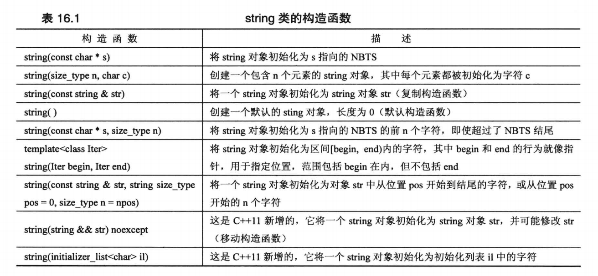

前面已经介绍过C++的大部分知识点了，本章主要介绍C++的标准模版库，这里会用到之前代码重用中讲解到的模版的知识，可以加深对模板的理解。

本章内容：
- 深入讨论 string 类；
- 介绍“智能指针”模板类，它们让管理动态内存更容易；
- 介绍 STL(Standard Template Library，标准模板库)，它是一组用于处理各种容器对象的模板；
- 介绍 STL 中演示的一种编程模式 —— 泛型编程；
- 介绍C++11新增的模板 initializer_lis，它可以让您能够将初始化列表的语法用于 STL 对象。

## string 类

很多应用程序都需要处理字符串。C语言在 string.h(C++中是 cstring 库)中提供了一些列的字符串函数，很多早期的C++实现为处理字符串提供了自己的类。

string 类时由头文件 string 支持的。要使用类，关键在于知道它的公有接口，而 string 类包含大量的方法，其中包括了若干构造函数，用于将字符串赋给变量、合并字符串、比较字符串的成员函数，访问各个元素的重载运算符以及用于在字符串中查找字符和子字符串的工具等。

> 注意：头文件 string.h 和 cstring 是支持对 C-风格字符串进行操作的 C 库字符串函数，但不支持 string 类。

### string 的构造函数

首先，我们来看看 string 类的构造函数。毕竟，对于类而言，最重要的内容之一就是看有哪些方法可用于创建其对象。下面的表格简要的描述了 string 类的 7+2(C++11新增了两个)个构造函数。

size_type 是一个依赖于实现的整型，它是在头文件 string 中定义的。string 类将 string:npos 定义为字符串的最大长度，通常为 unsigned int 的最大值。另外表格中使用缩写 NBTS(Null-Terminated String)来表示以空字符结束的字符串 —— 传统的C字符串。

下面的程序清单使用了上面表格中的 7 个构造函数。在使用 string 构造函数时都进行了简化，即隐藏了这样一个事实：string 类实际上是模板具体话`basic_string<char>`的一个 typedef，同时省略了与内存管理相关的参数。